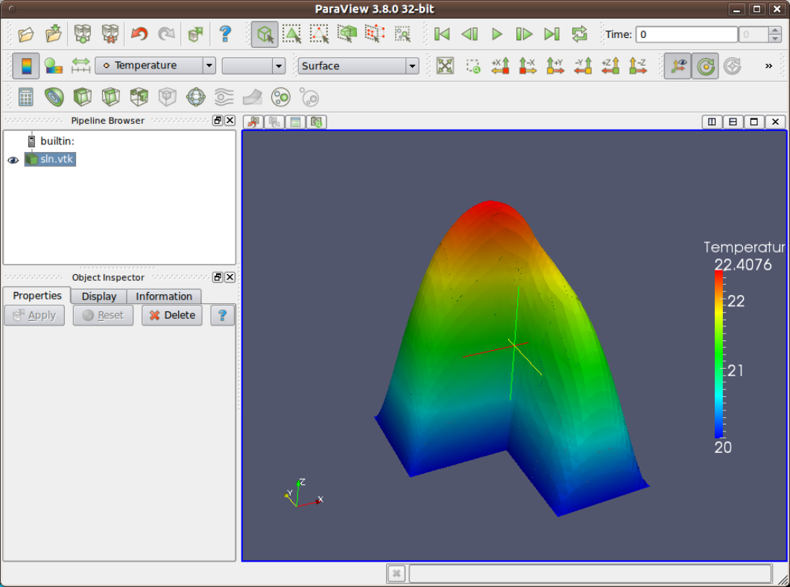
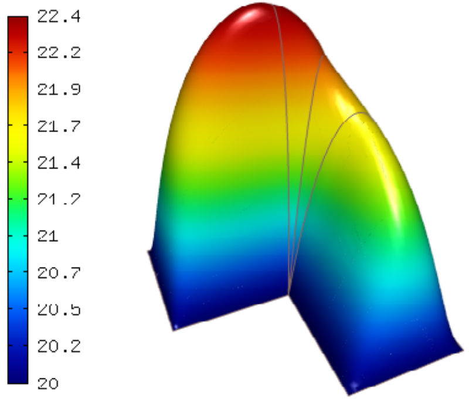

Poisson Equation (03-poisson)
-----------------------------

.. popup:: '#p01-linear-03-poisson-tutorial'
   ../../../_static/clapper.png

**Git reference:** Tutorial example `03-poisson <http://git.hpfem.org/hermes.git/tree/HEAD:/hermes2d/tutorial/P01-linear/03-poisson>`_. 

.. only:: latex

    `Tutorial Video <http://hpfem.org/hermes/doc/src/hermes2d/P01-linear/01-mesh/videos.html#p01-linear-03-poisson-tutorial>`_. 

This example shows how to solve a simple PDE that describes stationary 
heat transfer in an object that is heated by constant volumetric 
heat sources (such as with a DC current). The temperature equals 
to a prescribed constant on the boundary. We will learn how to:

 * Define a weak formulation.
 * Initialize matrix solver.
 * Solve the discrete problem.
 * Output the solution and element orders in VTK format 
   (to be visualized, e.g., using Paraview).
 * Visualize the solution using Hermes' native OpenGL-based functionality.

Model problem
~~~~~~~~~~~~~

Consider the Poisson equation

.. math::
    :label: poisson1

       -\mbox{div}(\lambda \nabla u) = C_{src}

in the L-shaped domain $\Omega$ from the previous examples.
The equation is equipped with constant Dirichlet boundary conditions

.. math::
    :label: poisson2

       u = u_0\ \ \  \mbox{on}\  \partial \Omega.

Here $u$ is an unknown temperature distribution, 
$C_{src}$ a real number representing volumetric heat sources/losses, and $\lambda > 0$ is thermal conductivity
of the material.

The weak formulation is derived as usual, first by multiplying equation :eq:`poisson1` 
with a test function $v$, then integrating over the domain $\Omega$, and then applying 
the Green's theorem (integration by parts) to the second derivatives.
Because of the Dirichlet condition :eq:`poisson2`,
there are no surface integrals. Since the product of the two gradients 
in the volumetric weak form needs to be integrable for all $u$ and $v$ in $V$, 
the proper space for the solution is $V = H^1_0(\Omega)$. The weak formulation 
reads: Find $u \in V$ such that

.. math::
    :label: poissonweak01

         \int_\Omega \lambda \nabla u \cdot \nabla v \;\mbox{d\bfx} = \int_\Omega C_{src} v \;\mbox{d\bfx}\ \ \ \mbox{for all}\ v \in V.

Hermes, however, needs the equation in the form 

.. math::
    :label: poissonweak01b

         \int_\Omega \lambda \nabla u \cdot \nabla v \;\mbox{d\bfx} - \int_\Omega C_{src} v \;\mbox{d\bfx} = 0\ \ \ \mbox{for all}\ v \in V.

Let us explain why.

Jacobian-residual formulation
~~~~~~~~~~~~~~~~~~~~~~~~~~~~~

**Hermes always assumes that the problem is nonlinear**, and by default it uses the 
Newton's method to solve it. Other methods for the solution of nonlinear problems 
are available as well (to be discussed later). 

For linear problems, the Newton's
method converges in one step. Well, at least that's what the theory says. 

In practice the Newton's method 
may take more than one step for a linear problem 
if the matrix solver does not do a good job. This is not 
unusual at all, in particular when an iterative solver is used. By checking the residual of the 
equation, *the Newton's method always makes sure that the problem is solved correctly,
or it fails in a clearly visible way*. This is the reason No. 1 why the Newton's 
method should be used even for problems that are linear. 

Another reason is that a consistent approach to linear and nonlinear problems allows 
Hermes' users to first formulate and solve a simplified linear version of the problem, 
and then extend it to a nonlinear version effortlessly. Let's explain how this works.

Consistent approach to linear and nonlinear problems
~~~~~~~~~~~~~~~~~~~~~~~~~~~~~~~~~~~~~~~~~~~~~~~~~~~~

First assume that $\lambda = \lambda_{al}$ in $\Omega_{al}$ and 
$\lambda = \lambda_{cu}$ in $\Omega_{cu}$ where both $\lambda_{al}$ and $\lambda_{cu}$
are constants. Then the problem is linear and the weak form for the Jacobian is 

.. math ::

    \int_{\Omega_{al}} \lambda_{al} \nabla u \cdot \nabla v \, \mbox{d}x \mbox{d}y
    + \int_{\Omega_{cu}} \lambda_{cu} \nabla u \cdot \nabla v \, \mbox{d}x \mbox{d}y,

where $u$ stands for a basis function and $v$ for a test function.
The reader does not have to worry about the word "Jacobian" since for linear 
problems this is the same as "stiffness matrix". Simply forget from the left-hand side
of the weak formulation :eq:`poissonweak01b` all expressions that do not contain $u$. 
A detailed explanation of the Newton's method for nonlinear problems will be provided 
at the beginning of the tutorial part P02.

The residual weak form is the entire left-hand side of :eq:`poissonweak01b` where 
$u$ is now the approximate solution (not a basis function as above):

.. math ::

    \int_{\Omega_{al}} \lambda_{al} \nabla u \cdot \nabla v \, \mbox{d}x \mbox{d}y
    + \int_{\Omega_{cu}} \lambda_{cu} \nabla u \cdot \nabla v \, \mbox{d}x \mbox{d}y
    - \int_{\Omega} C_{src} v \, \mbox{d}x \mbox{d}y.

This is the constructor of the corresponding weak formulation in Hermes:

.. sourcecode::
    .

    CustomWeakFormPoisson::CustomWeakFormPoisson(std::string marker_al, HermesFunction* lambda_al,
    			                         std::string marker_cu, HermesFunction* lambda_cu,
			                         HermesFunction* src_term) : WeakForm(1)
    {
      // Jacobian forms.
      add_matrix_form(new WeakFormsH1::DefaultJacobianDiffusion(0, 0, marker_al, lambda_al));
      add_matrix_form(new WeakFormsH1::DefaultJacobianDiffusion(0, 0, marker_cu, lambda_cu));

      // Residual forms.
      add_vector_form(new WeakFormsH1::DefaultResidualDiffusion(0, marker_al, lambda_al));
      add_vector_form(new WeakFormsH1::DefaultResidualDiffusion(0, marker_cu, lambda_cu));
      add_vector_form(new WeakFormsH1::DefaultVectorFormVol(0, HERMES_ANY, src_term));
    };

.. latexcode::
    .

    CustomWeakFormPoisson::CustomWeakFormPoisson(std::string marker_al, 
                           HermesFunction* lambda_al, std::string marker_cu, 
                           HermesFunction* lambda_cu, HermesFunction*
                           src_term) : WeakForm(1)
    {
      // Jacobian forms.
      add_matrix_form(new WeakFormsH1::DefaultJacobianDiffusion(0, 0, marker_al, lambda_al));
      add_matrix_form(new WeakFormsH1::DefaultJacobianDiffusion(0, 0, marker_cu, lambda_cu));

      // Residual forms.
      add_vector_form(new WeakFormsH1::DefaultResidualDiffusion(0, marker_al, lambda_al));
      add_vector_form(new WeakFormsH1::DefaultResidualDiffusion(0, marker_cu, lambda_cu));
      add_vector_form(new WeakFormsH1::DefaultVectorFormVol(0, HERMES_ANY, src_term));
    };

Here HERMES_ANY means that the volumetric vector form will be assigned to all material
markers.

For constant LAMBDA_AL and LAMBDA_CU, the form is instantiated as follows:

.. sourcecode::
    .

    CustomWeakFormPoisson wf("Aluminum", new HermesFunction(LAMBDA_AL), "Copper", 
                             new HermesFunction(LAMBDA_CU), new HermesFunction(-VOLUME_HEAT_SRC));

.. latexcode::
    .

    CustomWeakFormPoisson wf("Aluminum", new HermesFunction(LAMBDA_AL), "Copper", 
                             new HermesFunction(LAMBDA_CU), 
                             new HermesFunction(-VOLUME_HEAT_SRC));

To replace the constants with cubic splines, one just needs to do

::

    CubicSpline lambda_al(...);
    CubicSpline lambda_cu(...);
    CustomWeakFormPoisson wf("Aluminum", &lambda_al, "Copper", 
                             &lambda_cu, new HermesFunction(-VOLUME_HEAT_SRC));

If the reader guesses that CubicSpline is a descendant of HermesFunction, then this is a good guess::

    class CubicSpline : public HermesFunction
    ...

The constant VOLUME_HEAT_SRC can be replaced with an arbitrary function of $x$ and $y$ by
subclassing HermesFunction::

    class CustomNonConstSrc : public HermesFunction
    ...

If cubic splines are not enough, then one can subclass HermesFunction to define 
arbitrary nonlinearities::

    class CustomLanbdaAl : public HermesFunction
    ...
    class CustomLanbdaCu : public HermesFunction
    ...

*Note that we are able to extend a linear problem to a nonlinear one
without touching the CustomWeakFormPoisson class.* This is also 
how all default weak forms in Hermes work.

In the rest of part P01 we will focus on linear problems.

Default Jacobian for the diffusion operator
~~~~~~~~~~~~~~~~~~~~~~~~~~~~~~~~~~~~~~~~~~~

Hermes provides default weak forms for many common PDE operators. The above 
default weak forms DefaultJacobianDiffusion, DefaultResidualDiffusion and 
DefaultVectorFormVol can be found in the file `weakforms_h1.h 
<http://git.hpfem.org/hermes.git/blob/HEAD:/hermes2d/src/weakform_library/weakforms_h1.h>`_.
To begin with, the line 

::

    add_matrix_form(new DefaultJacobianDiffusion(0, 0, marker_al, lambda_al));

adds to the Jacobian weak form the integral

.. math ::

    \int_{\Omega_{al}} \lambda_{al} \nabla u \cdot \nabla v \, \mbox{d}x \mbox{d}y

where $u$ is a basis function and $v$ a test function.

It has the following constructor::

    DefaultJacobianDiffusion(int i = 0, int j = 0, std::string area = HERMES_ANY, 
                             HermesFunction* coeff = HERMES_ONE,
                             SymFlag sym = HERMES_NONSYM, GeomType gt = HERMES_PLANAR);

The pair of indices 'i' and 'j' identifies a block in the Jacobian matrix (for systems of 
equations). For a single equation it is i = j = 0. 

The parameter 'area' identifies 
the material marker of elements to which the weak form will be assigned. 
HERMES_ANY means to any material marker.

The parameter 'coeff' can be a constant, cubic spline, or a general nonlinear function 
of the solution $u$. HERMES_ONE means constant 1.0.

SymFlag is the symmetry flag. 
If SymFlag sym == HERMES_NONSYM, then Hermes 
evaluates the form at both symmetric positions r, s and s, r in the stiffness matrix. 
If sym == HERMES_SYM, only the integral at the position r, s is evaluated, and its value 
is copied to the symmetric position s, r. If sym == HERMES_ANTISYM, the value is copied
with a minus sign. 

The GeomType parameter tells Hermes whether the form 
is planar (HERMES_PLANAR), axisymmetrix with respect to the x-axis (HERMES_AXISYM_X), 
or axisymmetrix with respect to the y-axis (HERMES_AXISYM_Y).

The form can be linked to multiple material markers::

    DefaultJacobianDiffusion(int i, int j, Hermes::vector<std::string> areas,
                             HermesFunction* coeff = HERMES_ONE,
                             SymFlag sym = HERMES_NONSYM, GeomType gt = HERMES_PLANAR);

Here, Hermes::vector is just a std::vector equipped with additional constructors for
comfort. Sample usage::

    Hermes::vector<std::string> areas("marker_1", "marker_2", "marker_3");

Default residual for the diffusion operator
~~~~~~~~~~~~~~~~~~~~~~~~~~~~~~~~~~~~~~~~~~~

Similarly, the line

::

    add_vector_form(new DefaultResidualDiffusion(0, marker_al, lambda_al));

adds to the residual weak form the integral

.. math ::

    \int_{\Omega_{al}} \lambda_{al} \nabla u \cdot \nabla v \, \mbox{d}x \mbox{d}y,

where $u$ is the approximate solution and $v$ a test function.

It has the following constructor::

    DefaultResidualDiffusion(int i = 0, std::string area = HERMES_ANY, 
                             HermesFunction* coeff = HERMES_ONE,
                             GeomType gt = HERMES_PLANAR);

The index 'i' identifies a block in the residual vector (for systems of 
equations). For a single equation it is i = 0. Again the form can be assigned 
to multiple material markers::

    DefaultResidualDiffusion(int i, Hermes::vector<std::string> areas,
                             HermesFunction* coeff = HERMES_ONE,
                             GeomType gt = HERMES_PLANAR);

Default volumetric vector form
~~~~~~~~~~~~~~~~~~~~~~~~~~~~~~

The last default weak form used in the CustomWeakFormPoisson class above is

::

    add_vector_form(new DefaultVectorFormVol(0, HERMES_ANY, c));

It adds to the residual weak form the integral

.. math ::

    \int_{\Omega} c v \, \mbox{d}x \mbox{d}y

and thus it completes :eq:`poissonweak01b`. The constructors of this class
are::

    DefaultVectorFormVol(int i = 0, std::string area = HERMES_ANY,
                         HermesFunction* coeff = HERMES_ONE,
                         GeomType gt = HERMES_PLANAR);

and

::

    DefaultVectorFormVol(int i, Hermes::vector<std::string> areas,
                         HermesFunction* coeff = HERMES_ONE,
                         GeomType gt = HERMES_PLANAR);

Loading the mesh
~~~~~~~~~~~~~~~~

The main.cpp file typically begins with loading the mesh::

    // Load the mesh.
    Mesh mesh;
    H2DReader mloader;
    mloader.load("domain.mesh", &mesh);

Performing initial mesh refinements
~~~~~~~~~~~~~~~~~~~~~~~~~~~~~~~~~~~

A number of initial refinement operations can be done as 
explained above. In this case we just perform optional 
uniform mesh refinements::

    // Perform initial mesh refinements (optional).
    for (int i=0; i < INIT_REF_NUM; i++) mesh.refine_all_elements();

Initializing the weak formulation
~~~~~~~~~~~~~~~~~~~~~~~~~~~~~~~~~

Next, an instance of the corresponding weak form class is created:

.. sourcecode::
    .

    // Initialize the weak formulation.
    CustomWeakFormPoisson wf("Aluminum", new HermesFunction(LAMBDA_AL), "Copper", 
                             new HermesFunction(LAMBDA_CU), new HermesFunction(-VOLUME_HEAT_SRC));

.. latexcode::
    .

    // Initialize the weak formulation.
    CustomWeakFormPoisson wf("Aluminum", new HermesFunction(LAMBDA_AL), "Copper", 
                             new HermesFunction(LAMBDA_CU), 
                             new HermesFunction(-VOLUME_HEAT_SRC));

Setting constant Dirichlet boundary conditions
~~~~~~~~~~~~~~~~~~~~~~~~~~~~~~~~~~~~~~~~~~~~~~

Constant Dirichlet boundary conditions are assigned to the boundary markers 
"Bottom", "Inner", "Outer", and "Left" as follows:

.. sourcecode::
    .

    // Initialize essential boundary conditions.
    DefaultEssentialBCConst bc_essential(Hermes::vector<std::string>("Bottom", "Inner", "Outer", "Left"), FIXED_BDY_TEMP);
    EssentialBCs bcs(&bc_essential);

.. latexcode::
    .

    // Initialize essential boundary conditions.
    DefaultEssentialBCConst bc_essential(Hermes::vector<std::string>("Bottom", "Inner",
                                                 "Outer", "Left"), FIXED_BDY_TEMP);
    EssentialBCs bcs(&bc_essential);

Do not worry about the complicated-looking Hermes::vector, this is just std::vector enhanced 
with a few extra constructors. It is used to avoid using variable-length arrays.

The treatment of nonzero Dirichlet and other boundary conditions 
will be explained in more detail, and illustrated on examples, in 
the following examples. For the moment, let's proceed to the finite 
element space. 

Initializing finite element space
~~~~~~~~~~~~~~~~~~~~~~~~~~~~~~~~~

As a next step, we initialize the FE space in the same way as in the previous tutorial 
example 02-space::

    // Create an H1 space with default shapeset.
    H1Space space(&mesh, &bcs, P_INIT);
    int ndof = space.get_num_dofs();
    info("ndof = %d", ndof);

Here P_INIT is a uniform polynomial degree of mesh elements (an integer number 
between 1 and 10).

Initializing discrete problem
~~~~~~~~~~~~~~~~~~~~~~~~~~~~~

The weak formulation and finite element space(s) constitute a finite element 
problem. To define it, one needs to create an instance of the DiscreteProblem 
class::

    // Initialize the FE problem.
    DiscreteProblem dp(&wf, &space);

Initializing matrix solver
~~~~~~~~~~~~~~~~~~~~~~~~~~

Next one needs to choose a matrix solver::

    MatrixSolverType matrix_solver = SOLVER_UMFPACK;  

Besides UMFPACK, one can use SOLVER_AMESOS, SOLVER_MUMPS, SOLVER_PETSC, and
SOLVER_SUPERLU (and matrix-free SOLVER_NOX for nonlinear problems - to be discussed
later). 

After that one needs to create instances of a matrix, vector, and matrix solver 
as follows:: 

    // Set up the solver, matrix, and rhs according to the solver selection.
    SparseMatrix* matrix = create_matrix(matrix_solver);
    Vector* rhs = create_vector(matrix_solver);
    Solver* solver = create_linear_solver(matrix_solver, matrix, rhs);

Solving the discrete problem
~~~~~~~~~~~~~~~~~~~~~~~~~~~~

Before solving the discrete problem, one has to create a coefficient 
vector:: 

    // Initial coefficient vector for the Newton's method.  
    scalar* coeff_vec = new scalar[ndof];
    memset(coeff_vec, 0, ndof*sizeof(scalar));

The discrete problem is solved via the Newton's method:

.. sourcecode::
    .

    // Perform Newton's iteration.
    if (!hermes2d.solve_newton(coeff_vec, &dp, solver, matrix, rhs)) error("Newton's iteration failed.");

.. latexcode::
    .

    // Perform Newton's iteration.
    if (!hermes2d.solve_newton(coeff_vec, &dp, solver, matrix, rhs)) 
        error("Newton's iteration failed.");

This function comes with a number of optional parameters, see the file 
`hermes2d/src/h2d_common.h <https://github.com/hpfem/hermes/blob/master/hermes2d/src/h2d_common.h>`_
for more details.

Translating the coefficient vector into a solution
~~~~~~~~~~~~~~~~~~~~~~~~~~~~~~~~~~~~~~~~~~~~~~~~~~

The coefficient vector can be converted into a piecewise-polynomial 
Solution via the function Solution::vector_to_solution()::

    // Translate the resulting coefficient vector into a Solution.
    Solution sln;
    Solution::vector_to_solution(coeff_vec, &space, &sln);

Saving solution in VTK format
~~~~~~~~~~~~~~~~~~~~~~~~~~~~~

The solution can be saved in the VTK format to be visualized, for example,
using `Paraview <http://www.paraview.org/>`_. To do this, one uses the 
Linearizer class that has the ability to approximate adaptively a higher-order
polynomial solution using linear triangles::

    // Output solution in VTK format.
    Linearizer lin;
    bool mode_3D = true;
    lin.save_solution_vtk(&sln, "sln.vtk", "Temperature", mode_3D);
    info("Solution in VTK format saved to file %s.", "sln.vtk");

The function save_solution_vtk() can be found in hermes2d/src/linearizer/ and its 
complete header is:

.. sourcecode::
    .

    // Saves a MeshFunction (Solution, Filter) in VTK format.
    virtual void save_solution_vtk(MeshFunction* meshfn, const char* file_name, const char* quantity_name,
                                   bool mode_3D = true, int item = H2D_FN_VAL_0, 
                                   double eps = HERMES_EPS_NORMAL, double max_abs = -1.0,
                                   MeshFunction* xdisp = NULL, MeshFunction* ydisp = NULL,
                                   double dmult = 1.0);

.. latexcode::
    .

    // Saves a MeshFunction (Solution, Filter) in VTK format.
    virtual void save_solution_vtk(MeshFunction* meshfn, const char* file_name, const 
                                   char* quantity_name, bool mode_3D = true, int item 
                                   = H2D_FN_VAL_0, double eps = HERMES_EPS_NORMAL, 
                                   double max_abs = -1.0, MeshFunction* xdisp = NULL, 
                                   MeshFunction* ydisp = NULL, double dmult = 1.0);

Only the first three arguments are mandatory, the remaining ones are optional.
Their meaning is as follows:

 * mode_3D ... select either 2D or 3D rendering (default is 3D).
 * item:
   H2D_FN_VAL_0 ... show function values, 
   H2D_FN_DX_0  ... show x-derivative,
   H2D_FN_DY_0  ... show y-derivative,
   H2D_FN_DXX_0 ... show xx-derivative,
   H2D_FN_DXY_0 ... show xy-derivative,
   H2D_FN_DYY_0 ... show yy-derivative,
 * eps:
   HERMES_EPS_LOW      ... low resolution (small output file),
   HERMES_EPS_NORMAL   ... normal resolution (medium output file),
   HERMES_EPS_HIGH     ... high resolution (large output file),
   HERMES_EPS_VERYHIGH ... high resolution (very large output file).
 * max_abs: technical parameter, see file src/linearizer/linear.h.
 * xdisp, ydisp, dmult: Can be used to deform the domain. Typical applications are elasticity, plasticity, etc.
 
The following figure shows the corresponding Paraview visualization:

Visualizing the solution using OpenGL
~~~~~~~~~~~~~~~~~~~~~~~~~~~~~~~~~~~~~

The solution can also be visualized via the ScalarView class::

    // Visualize the solution.
    ScalarView view("Solution", new WinGeom(0, 0, 440, 350));
    view.show(&sln);
    View::wait();

Hermes' built-in OpenGL visualization looks as follows:

Visualization quality
~~~~~~~~~~~~~~~~~~~~~

The method show() has an optional second parameter -- the visualization accuracy. 
It can have the values HERMES_EPS_LOW, HERMES_EPS_NORMAL (default), HERMES_EPS_HIGH
and HERMES_EPS_VERYHIGH. This parameter influences the number of linear triangles that 
Hermes uses to approximate higher-order polynomial solutions with linear triangles for OpenGL. 
In fact, the EPS value is a stopping criterion for automatic adaptivity that Hermes 
uses to keep the number of the linear triangles as low as possible. 

**IMPORTANT**: If you notice in the image white points or even discontinuities 
where the approximation is continuous, try to move from HERMES_EPS_NORMAL to 
HERMES_EPS_HIGH. If the interval of solution values is very small compared to 
the solution magnitude, such as if the solution values lie in the interval 
$(50, 50.5)$, then you may need HERMES_EPS_VERYHIGH.

Before pressing 's' to save the image, make sure to press 'h' to render 
high-quality image.

Visualization of derivatives
~~~~~~~~~~~~~~~~~~~~~~~~~~~~

The method show() also has an optional third parameter to indicate whether 
function values or partial derivatives should be displayed. For example,
HERMES_FN_VAL_0 stands for the function value of solution component 0
(first solution component which in this case is the VonMises stress).
HERMES_FN_VAL_1 would mean the function value of the second solution component
(relevant for vector-valued $Hcurl$ or $Hdiv$ elements only), 
HERMES_FN_DX_0 means the x-derivative of the first solution component, etc.

