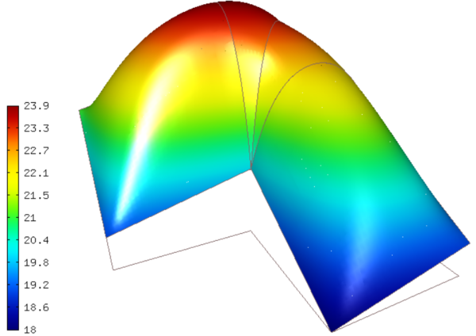

Nonzero Dirichlet BC (04-bc-dirichlet)
--------------------------------------

**Git reference:** Tutorial example `04-bc-dirichlet 
<http://git.hpfem.org/hermes.git/tree/HEAD:/hermes2d/tutorial/P01-linear/04-bc-dirichlet>`_. 

We will keep the equation from  
example `03-poisson <http://hpfem.org/hermes/doc/src/hermes2d/P01-linear/03-poisson.html>`_ 

.. math::
    :label: poisson40

       -\mbox{div}(\lambda \nabla u) - C_{src} = 0,

but the boundary conditions will be modified to

.. math::
         u(x, y) = Ax + By + C

where $A$, $B$ and $C$ are real constants.

Subclassing EssentialBoundaryCondition
~~~~~~~~~~~~~~~~~~~~~~~~~~~~~~~~~~~~~~

This is done by defining a descendant of the EssentialBoundaryCondition class
(see `definitions.h <http://git.hpfem.org/hermes.git/blob/HEAD:/hermes2d/tutorial/P01-linear/04-bc-dirichlet/definitions.h>`_):

.. sourcecode::
    .

    class CustomDirichletCondition : public EssentialBoundaryCondition 
    {
    public:
      CustomDirichletCondition(Hermes::vector<std::string> markers, double A, double B, double C);

      virtual EssentialBoundaryCondition::EssentialBCValueType get_value_type() const; 

      virtual scalar value(double x, double y, double n_x, double n_y, double t_x, double t_y) const; 

      protected:
        double A, B, C;
    };

.. latexcode::
    .

    class CustomDirichletCondition : public EssentialBoundaryCondition 
    {
    public:
      CustomDirichletCondition(Hermes::vector<std::string> markers, double A, double B,
                               double C);

      virtual EssentialBoundaryCondition::EssentialBCValueType get_value_type() const; 

      virtual scalar value(double x, double y, double n_x, double n_y, double t_x, 
                           double t_y) const; 

      protected:
        double A, B, C;
    };

The methods are defined in `definitions.cpp <http://git.hpfem.org/hermes.git/blob/HEAD:/hermes2d/tutorial/P01-linear/04-bc-dirichlet/definitions.cpp>`_ as follows:

.. sourcecode::
    .

    CustomDirichletCondition::CustomDirichletCondition(Hermes::vector<std::string> markers, 
                                                               double A, double B, double C)
      : EssentialBoundaryCondition(markers), A(A), B(B), C(C) 
    { 
    }

    EssentialBoundaryCondition::EssentialBCValueType CustomDirichletCondition::get_value_type() const
    { 
      return EssentialBoundaryCondition::BC_FUNCTION; 
    }

    scalar CustomDirichletCondition::value(double x, double y, double n_x, double n_y, 
                                           double t_x, double t_y) const 
    {
      return A*x + B*y + C;
    }

.. latexcode::
    .

    CustomDirichletCondition::CustomDirichletCondition(Hermes::vector<std::string> 
                                                       markers, double A, double B, 
                                                       double C)
      : EssentialBoundaryCondition(markers), A(A), B(B), C(C) 
    { 
    }

    EssentialBoundaryCondition::EssentialBCValueType 
                                CustomDirichletCondition::get_value_type()
    const
    { 
      return EssentialBoundaryCondition::BC_FUNCTION; 
    }

    scalar CustomDirichletCondition::value(double x, double y, double n_x, double n_y, 
                                           double t_x, double t_y) const 
    {
      return A*x + B*y + C;
    }

The custom boundary condition class is used in `main.cpp <http://git.hpfem.org/hermes.git/blob/HEAD:/hermes2d/tutorial/P01-linear/04-bc-dirichlet/main.cpp>`_ as follows:

.. sourcecode::
    .

    // Initialize boundary conditions.
    CustomDirichletCondition bc_essential(Hermes::vector<std::string>("Bottom", "Inner", "Outer", "Left"),
                                                  BDY_A_PARAM, BDY_B_PARAM, BDY_C_PARAM);
    EssentialBCs bcs(&bc_essential);

.. latexcode::
    .

    // Initialize boundary conditions.
    CustomDirichletCondition bc_essential(Hermes::vector<std::string>("Bottom", "Inner",
                                          "Outer", "Left"), BDY_A_PARAM, BDY_B_PARAM,
                                          BDY_C_PARAM);
    EssentialBCs bcs(&bc_essential);

Sample results
~~~~~~~~~~~~~~

The output for the parameters $C_{src} = 6000$, $\lambda_{Al} = 236$, $\lambda_{Cu} = 386$,
$A = 1$, $B = 1$ and $C = 20$ is shown below:

