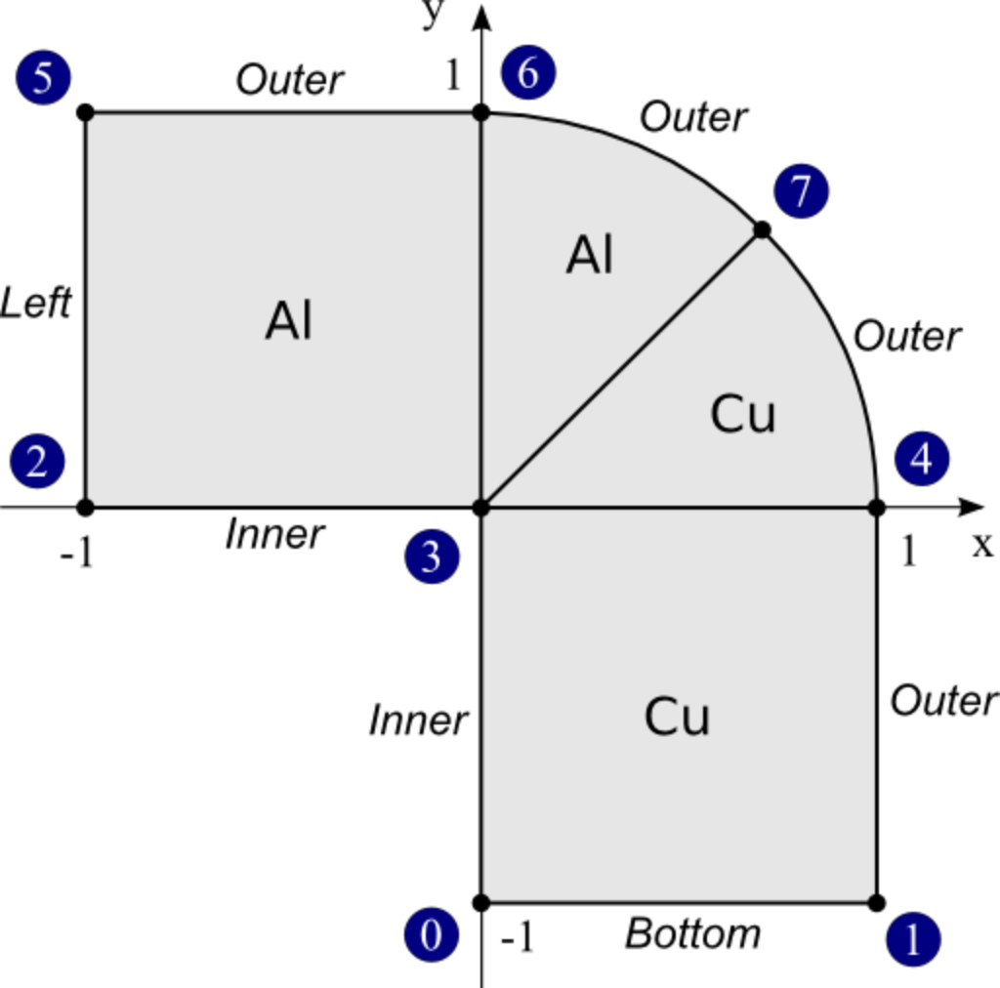
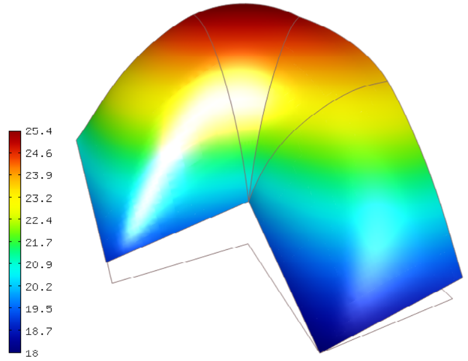

Neumann BC (05-bc-neumann)
--------------------------

**Git reference:** Tutorial example `05-bc-neumann 
<http://git.hpfem.org/hermes.git/tree/HEAD:/hermes2d/tutorial/P01-linear/05-bc-neumann>`_. 

Let us recall the domain and boundary markers from the previous example:

We will solve the same equation 

.. math::
    :label: poisson1b

       -\mbox{div}(\lambda \nabla u) - C_{src} = 0

that is now equipped with a Neumann (heat flux) boundary condition 

.. math::
    :label: poisson1c

       \lambda \frac{\partial u}{\partial n} = C_{flux}

on the "Outer" boundary. Here $C_{flux}$ is a constant prescribed heat flux value.
Recall that $C_{flux} = 0$ means a perfectly insulated (adiabatic) wall.

On the boundary parts "Bottom", "Left" and "Inner" we keep
the nonconstant Dirichlet condition from before:

.. math::
         u(x, y) = Ax + By + C.

Since the solution on the "Outer" boundary is unknown, the test functions are nonzero there, and thus 
the weak formulation is

.. math::
    :label: poissonweak01b

         \int_\Omega \lambda \nabla u \cdot \nabla v \;\mbox{d\bfx} - \int_{\Gamma_{Outer}} \lambda \frac{\partial u}{\partial n}v   \;\mbox{dS}
        - \int_\Omega C_{src} v\;\mbox{d\bfx} = 0.

Using the Neumann condition :eq:`poisson1c`, we obtain

.. math::
    :label: poissonweak01bbc

         \int_\Omega \lambda \nabla u \cdot \nabla v \;\mbox{d\bfx} - \int_{\Gamma_{Outer}} C_{flux} v   \;\mbox{dS}
        - \int_\Omega C_{src} v\;\mbox{d\bfx} = 0.

This weak formulation contains all integrals from the example 04-bc-dirichlet plus one new surface
integral

.. math::

    - \int_{\Gamma_{Outer}} C_{flux} v   \;\mbox{dS}

Default surface vector form
~~~~~~~~~~~~~~~~~~~~~~~~~~~

This integral can be added using the default $H^1$ form DefaultVectorFormSurf that 
has the constructors

::

      DefaultVectorFormSurf(int i = 0, std::string area = HERMES_ANY,
                            HermesFunction* coeff = HERMES_ONE,
                            GeomType gt = HERMES_PLANAR);

      DefaultVectorFormSurf(int i, Hermes::vector<std::string> areas,
                            HermesFunction* coeff = HERMES_ONE,
                            GeomType gt = HERMES_PLANAR);

The header of the custom form CustomWeakFormPoissonNeumann is defined in 
`definitions.h <http://git.hpfem.org/hermes.git/blob/HEAD:/hermes2d/tutorial/P01-linear/05-bc-neumann/definitions.h>`_::

    class CustomWeakFormPoissonNeumann : public WeakForm
    {
    public:
      CustomWeakFormPoissonNeumann(std::string mat_al, HermesFunction* lambda_al,
                                   std::string mat_cu, HermesFunction* lambda_cu,
                                   HermesFunction* vol_src_term, std::string bdy_heat_flux,
                                   HermesFunction* surf_src_term);
    };

and its constructor in `definitions.cpp <http://git.hpfem.org/hermes.git/blob/HEAD:/hermes2d/tutorial/P01-linear/05-bc-neumann/definitions.cpp>`_:

.. sourcecode::
    .

    CustomWeakFormPoissonNeumann::CustomWeakFormPoissonNeumann(std::string mat_al, HermesFunction* lambda_al,
                                                               std::string mat_cu, HermesFunction* lambda_cu,
                                                               HermesFunction* vol_src_term, std::string bdy_heat_flux,
                                                               HermesFunction* surf_src_term) : WeakForm(1)
    {
      // Jacobian forms - volumetric.
      add_matrix_form(new WeakFormsH1::DefaultJacobianDiffusion(0, 0, mat_al, lambda_al));
      add_matrix_form(new WeakFormsH1::DefaultJacobianDiffusion(0, 0, mat_cu, lambda_cu));

      // Residual forms - volumetric.
      add_vector_form(new WeakFormsH1::DefaultResidualDiffusion(0, mat_al, lambda_al));
      add_vector_form(new WeakFormsH1::DefaultResidualDiffusion(0, mat_cu, lambda_cu));
      add_vector_form(new WeakFormsH1::DefaultVectorFormVol(0, HERMES_ANY, vol_src_term));

      // Residual forms - surface.
      add_vector_form_surf(new WeakFormsH1::DefaultVectorFormSurf(0, bdy_heat_flux, surf_src_term));
    };

.. latexcode::
    .

    CustomWeakFormPoissonNeumann::CustomWeakFormPoissonNeumann(std::string mat_al,
                                  HermesFunction* lambda_al, std::string mat_cu,
                                  HermesFunction* lambda_cu, HermesFunction* 
                                  vol_src_term, std::string bdy_heat_flux, 
                                  HermesFunction* surf_src_term)
                                  : WeakForm(1)
    {
      // Jacobian forms - volumetric.
      add_matrix_form(new WeakFormsH1::DefaultJacobianDiffusion(0, 0, mat_al, lambda_al));
      add_matrix_form(new WeakFormsH1::DefaultJacobianDiffusion(0, 0, mat_cu, lambda_cu));

      // Residual forms - volumetric.
      add_vector_form(new WeakFormsH1::DefaultResidualDiffusion(0, mat_al, lambda_al));
      add_vector_form(new WeakFormsH1::DefaultResidualDiffusion(0, mat_cu, lambda_cu));
      add_vector_form(new WeakFormsH1::DefaultVectorFormVol(0, HERMES_ANY, vol_src_term));

      // Residual forms - surface.
      add_vector_form_surf(new WeakFormsH1::DefaultVectorFormSurf(0, bdy_heat_flux,
                                            surf_src_term));
    };

Sample results
~~~~~~~~~~~~~~

The output for the parameters $C_{src} = 3000$, $\lambda_{Al} = 236$, $\lambda_{Cu} = 386$,
$A = 1$, $B = 1$, $C = 20$ and $C_{flux} = 0$ is shown below:

