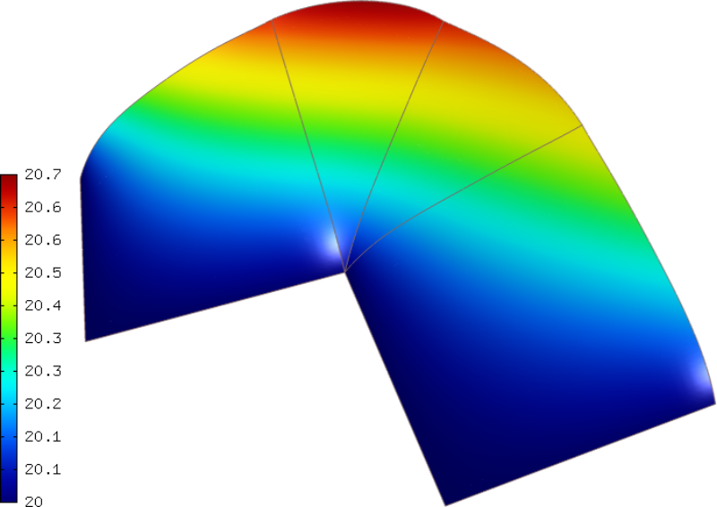

Newton BC (06-bc-newton)
------------------------

**Git reference:** Tutorial example `06-bc-newton 
<http://git.hpfem.org/hermes.git/tree/HEAD:/hermes2d/tutorial/P01-linear/06-bc-newton>`_. 

This example uses the same domain $\Omega$ as the previous one, and the same equation 

.. math::
    :label: poisson60

       -\mbox{div}(\lambda \nabla u) - C_{src} = 0,

but the Neumann condition on the "Outer" boundary is replaced with a Newton condition 
of the form

.. math::
    :label: poisson6

       \lambda \frac{\partial u}{\partial n} = \alpha (T_{ext} - u)

where $\alpha > 0$ is a heat transfer coefficient and $T_{ext}$ exterior
temperature. On the boundary parts "Bottom", "Left" and "Inner" we keep
the nonconstant Dirichlet condition

.. math::
         u(x, y) = Ax + By + C.

The weak formulation is

.. math::
    :label: poissonweak6

         \int_\Omega \lambda \nabla u \cdot \nabla v \;\mbox{d\bfx} - \int_{\Gamma_{Outer}} \lambda \frac{\partial u}{\partial n}v   \;\mbox{dS}
        - \int_\Omega C_{src} v\;\mbox{d\bfx} = 0.

Using the Newton condition :eq:`poisson6`, we obtain

.. math::
    :label: poissonweak01bbc

         \int_\Omega \lambda \nabla u \cdot \nabla v \;\mbox{d\bfx} + \int_{\Gamma_{Outer}} \alpha u v   \;\mbox{dS}
        - \int_{\Gamma_{Outer}} \alpha T_{ext} v   \;\mbox{dS}
        - \int_\Omega C_{src} v\;\mbox{d\bfx} = 0.

Thus in addition to all types of weak forms from the previous example 05-bc-neumann we now also have 
a surface matrix form

.. math::

    - \int_{\Gamma_{Outer}} \alpha u v   \;\mbox{dS}

Default surface matrix form
~~~~~~~~~~~~~~~~~~~~~~~~~~~

This integral can be added using the default $H^1$ form DefaultMatrixFormSurf that 
has the constructors

::

      DefaultMatrixFormSurf(int i, int j, std::string area = HERMES_ANY,
                            HermesFunction* coeff = HERMES_ONE,
                            GeomType gt = HERMES_PLANAR);

      DefaultMatrixFormSurf(int i, int j, Hermes::vector<std::string> areas,
                            HermesFunction* coeff = HERMES_ONE,
                            GeomType gt = HERMES_PLANAR);

The header of the custom form CustomWeakFormPoissonNewton is defined in 
`definitions.h <http://git.hpfem.org/hermes.git/blob/HEAD:/hermes2d/tutorial/P01-linear/06-bc-newton/definitions.h>`_::

    class CustomWeakFormPoissonNewton : public WeakForm
    {
    public:
      CustomWeakFormPoissonNewton(std::string mat_al, HermesFunction* lambda_al,
				  std::string mat_cu, HermesFunction* lambda_cu,
				  HermesFunction* vol_src_term, std::string bdy_heat_flux,
				  double alpha, double t_exterior);
    };

and its constructor in `definitions.cpp <http://git.hpfem.org/hermes.git/blob/HEAD:/hermes2d/tutorial/P01-linear/06-bc-newton/definitions.cpp>`_:

.. sourcecode::
    .

    CustomWeakFormPoissonNewton::CustomWeakFormPoissonNewton(std::string mat_al, HermesFunction* lambda_al,
							     std::string mat_cu, HermesFunction* lambda_cu,
							     HermesFunction* vol_src_term, std::string bdy_heat_flux,
							     double alpha, double t_exterior) : WeakForm(1)
    {
      // Jacobian forms - volumetric.
      add_matrix_form(new WeakFormsH1::DefaultJacobianDiffusion(0, 0, mat_al, lambda_al));
      add_matrix_form(new WeakFormsH1::DefaultJacobianDiffusion(0, 0, mat_cu, lambda_cu));

      // Jacobian forms - surface.
      add_matrix_form_surf(new WeakFormsH1::DefaultMatrixFormSurf(0, 0, bdy_heat_flux, new HermesFunction(alpha)));

      // Residual forms - volumetric.
      add_vector_form(new WeakFormsH1::DefaultResidualDiffusion(0, mat_al, lambda_al));
      add_vector_form(new WeakFormsH1::DefaultResidualDiffusion(0, mat_cu, lambda_cu));
      add_vector_form(new WeakFormsH1::DefaultVectorFormVol(0, HERMES_ANY, vol_src_term));

      // Residual forms - surface.
      add_vector_form_surf(new WeakFormsH1::DefaultResidualSurf(0, bdy_heat_flux, new HermesFunction(alpha)));
      add_vector_form_surf(new WeakFormsH1::DefaultVectorFormSurf(0, bdy_heat_flux, new HermesFunction(-alpha * t_exterior)));
    };

.. latexcode::
    .

    CustomWeakFormPoissonNewton::CustomWeakFormPoissonNewton(std::string mat_al,
                                 HermesFunction* lambda_al, std::string mat_cu,
                                 HermesFunction* lambda_cu, HermesFunction* vol_src_term,
                                 std::string bdy_heat_flux, double alpha, double t_exterior)
                                 : WeakForm(1)
    {
      // Jacobian forms - volumetric.
      add_matrix_form(new WeakFormsH1::DefaultJacobianDiffusion(0, 0, mat_al, lambda_al));
      add_matrix_form(new WeakFormsH1::DefaultJacobianDiffusion(0, 0, mat_cu, lambda_cu));

      // Jacobian forms - surface.
      add_matrix_form_surf(new WeakFormsH1::DefaultMatrixFormSurf(0, 0, bdy_heat_flux,
                                            new HermesFunction(alpha)));

      // Residual forms - volumetric.
      add_vector_form(new WeakFormsH1::DefaultResidualDiffusion(0, mat_al, lambda_al));
      add_vector_form(new WeakFormsH1::DefaultResidualDiffusion(0, mat_cu, lambda_cu));
      add_vector_form(new WeakFormsH1::DefaultVectorFormVol(0, HERMES_ANY, vol_src_term));

      // Residual forms - surface.
      add_vector_form_surf(new WeakFormsH1::DefaultResidualSurf(0, bdy_heat_flux, 
                                            new HermesFunction(alpha)));
      add_vector_form_surf(new WeakFormsH1::DefaultVectorFormSurf(0, bdy_heat_flux, 
                                            new HermesFunction(-alpha * t_exterior)));
    };

Sample results
~~~~~~~~~~~~~~

The output for the parameters $C_{src} = 0$, $\lambda_{Al} = 236$, $\lambda_{Cu} = 386$,
$\alpha = 5$, $T_{ext} = 50$, $A = 0$, $B = 0$ and $C = 20$ is shown below:

