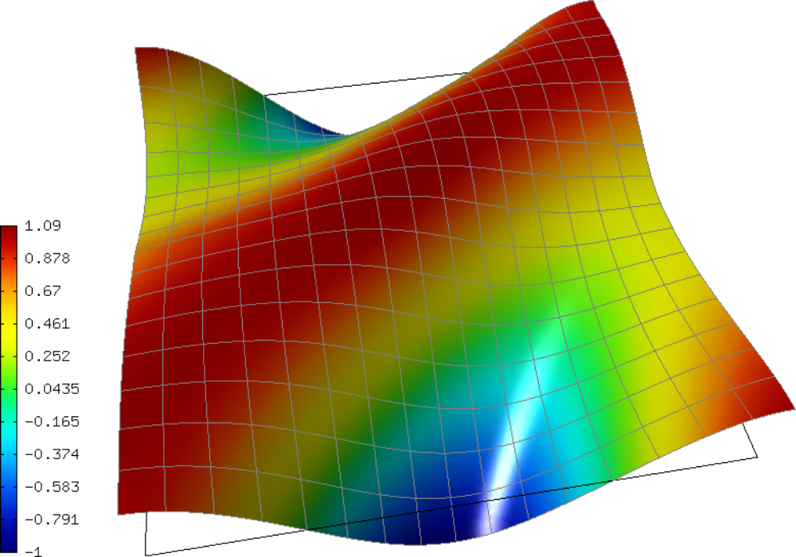

General 2nd-Order Linear Equation (07-general)
----------------------------------------------

**Git reference:** Tutorial example `07-general <http://git.hpfem.org/hermes.git/tree/HEAD:/hermes2d/tutorial/P01-linear/07-general>`_. 

The purpose of this example is threefold:

 * To show how to define non-constant Dirichlet and Neumann boundary conditions. 
 * To illustrate how to handle spatially dependent equation coefficients.
 * To introduce manual and automatic treatment of quadrature orders. 

In particular the last item is worthwhile as numerical quadrature is 
one of the things that are very different in low-order and higher-order 
finite element methods.

Model problem
~~~~~~~~~~~~~

We solve a linear second-order equation of the form 

.. math::

         -\frac{\partial}{\partial x}\left(a_{11}(x,y)\frac{\partial u}{\partial x}\right) - \frac{\partial}{\partial x}\left(a_{12}(x,y)\frac{\partial u}{\partial y}\right) - \frac{\partial}{\partial y}\left(a_{21}(x,y)\frac{\partial u}{\partial x}\right) - \frac{\partial}{\partial y}\left(a_{22}(x,y)\frac{\partial u}{\partial y}\right) + a_1(x,y)\frac{\partial u}{\partial x} \\
         + a_{21}(x,y)\frac{\partial u}{\partial y} + a_0(x,y)u - rhs(x,y) = 0,

in a square domain $\Omega = (-1, 1)^2$. The equation is equipped with Dirichlet 
boundary conditions 

.. math::

    u(x, y) = -\cos(\pi x)

on "Horizontal" boundary and with Neumann boundary conditions

.. math::

      [a_{11}(x, y) \nu_1 + a_{21}(x, y) \nu_2] \frac{\partial u}{\partial x}
       + [a_{12}(x, y) \nu_1 + a_{22}(x, y) \nu_2] \frac{\partial u}{\partial y} = g_N(x, y)

on "Vertical" boundary. 

Defining non-constant Dirichlet boundary conditions
~~~~~~~~~~~~~~~~~~~~~~~~~~~~~~~~~~~~~~~~~~~~~~~~~~~

Nonconstant Dirichlet boundary conditions are created by subclassing 
EssentialBoundaryCondition::

    class CustomEssentialBCNonConst : public EssentialBoundaryCondition {
    public:
      CustomEssentialBCNonConst(std::string marker);

      inline EssentialBCValueType get_value_type() const;

      virtual scalar value(double x, double y, double n_x, double n_y, 
			   double t_x, double t_y) const;
    };

The constructor just passes the boundary marker::

    CustomEssentialBCNonConst::CustomEssentialBCNonConst(std::string marker) 
          : EssentialBoundaryCondition(Hermes::vector<std::string>(marker)) 
    { 
    }

Next we tell that the value returned will be a function (i.e., not a constant):

.. sourcecode::
    .

    inline EssentialBoundaryCondition::EssentialBCValueType CustomEssentialBCNonConst::get_value_type() const 
    { 
      return EssentialBoundaryCondition::BC_FUNCTION; 
    }

.. latexcode::
    .

    inline EssentialBoundaryCondition::EssentialBCValueType CustomEssentialBCNonConst::
                                       get_value_type() const 
    { 
      return EssentialBoundaryCondition::BC_FUNCTION; 
    }

The value is defined using the virtual method value(). It can depend on 
the spatial coordinates as well as on the unit normal or tangential
vectors to the boundary::

    scalar CustomEssentialBCNonConst::value(double x, double y, double n_x, double n_y, 
                                            double t_x, double t_y) const 
    {
      return -cos(M_PI*x);
    }

In both methods, be careful to use the "const" attribute - if you forget it, the compiler
will complain that you have a purely virtual method in your new class.

Defining non-constant equation coefficients
~~~~~~~~~~~~~~~~~~~~~~~~~~~~~~~~~~~~~~~~~~~

The non-constant equation coefficients are defined as global functions
(not necessarily the most elegant way, but it will do)::

    double a_11(double x, double y) { if (y > 0) return 1 + x*x + y*y; else return 1;}
    double a_22(double x, double y) { if (y > 0) return 1; else return 1 + x*x + y*y;}
    double a_12(double x, double y) { return 1; }
    double a_21(double x, double y) { return 1;}
    double a_1(double x, double y) { return 0.0;}
    double a_2(double x, double y) { return 0.0;}
    double a_0(double x, double y) { return 0.0;}

The custom weak formulation contains a volumetric matrix form, volumetric
vector form, and a surface vector form that is due to the Neumann boundary conditions::

    class CustomWeakFormGeneral : public WeakForm
    {
    public:
      CustomWeakFormGeneral(std::string bdy_vertical);

    private:
      class MatrixFormVolGeneral : public WeakForm::MatrixFormVol
      {
      public:
	MatrixFormVolGeneral(int i, int j);

	virtual scalar value(int n, double *wt, Func<scalar> *u_ext[], Func<double> *u, 
			     Func<double> *v, Geom<double> *e, ExtData<scalar> *ext) const;

	virtual Ord ord(int n, double *wt, Func<Ord> *u_ext[], Func<Ord> *u, Func<Ord> *v, 
			Geom<Ord> *e, ExtData<Ord> *ext) const;
      };

      class VectorFormVolGeneral : public WeakForm::VectorFormVol
      {
      public:
	VectorFormVolGeneral(int i);

	virtual scalar value(int n, double *wt, Func<scalar> *u_ext[], Func<double> *v, 
			     Geom<double> *e, ExtData<scalar> *ext) const;

	virtual Ord ord(int n, double *wt, Func<Ord> *u_ext[], Func<Ord> *v, 
			Geom<Ord> *e, ExtData<Ord> *ext) const;

      private:
	double rhs(double x, double y) const;
      };

      class VectorFormSurfGeneral : public WeakForm::VectorFormSurf
      {
      public:
	VectorFormSurfGeneral(int i, std::string area = HERMES_ANY);

	virtual scalar value(int n, double *wt, Func<scalar> *u_ext[], Func<double> *v, 
			     Geom<double> *e, ExtData<scalar> *ext) const;

	virtual Ord ord(int n, double *wt, Func<Ord> *u_ext[], Func<Ord> *v, 
			Geom<Ord> *e, ExtData<Ord> *ext) const;

      private:
	double g_N(double x, double y) const;
      };
    };

Let us look, for example, at the volumetric matrix form. First we define 
its value:

.. sourcecode::
    .

    scalar CustomWeakFormGeneral::MatrixFormVolGeneral::value(int n, double *wt, Func<scalar> *u_ext[], Func<double> *u, 
							      Func<double> *v, Geom<double> *e, ExtData<scalar> *ext) const 
    {
      scalar result = 0;
      for (int i=0; i < n; i++) {
	double x = e->x[i];
	double y = e->y[i];
	result += (a_11(x, y) * u->dx[i] * v->dx[i] +
		   a_12(x, y) * u->dy[i] * v->dx[i] +
		   a_21(x, y) * u->dx[i] * v->dy[i] +
		   a_22(x, y) * u->dy[i] * v->dy[i] +
		   a_1(x, y) * u->dx[i] * v->val[i] +
		   a_2(x, y) * u->dy[i] * v->val[i] +
		   a_0(x, y) * u->val[i] * v->val[i]) * wt[i];
      }
      return result;
    }

.. latexcode::
    .

    scalar CustomWeakFormGeneral::MatrixFormVolGeneral::value(int n, double *wt, 
                                  Func<scalar> *u_ext[], Func<double> *u, 
                                  Func<double> *v, Geom<double> *e,
                                  ExtData<scalar> *ext) const 
    {
      scalar result = 0;
      for (int i=0; i < n; i++) {
	double x = e->x[i];
	double y = e->y[i];
	result += (a_11(x, y) * u->dx[i] * v->dx[i] +
		   a_12(x, y) * u->dy[i] * v->dx[i] +
		   a_21(x, y) * u->dx[i] * v->dy[i] +
		   a_22(x, y) * u->dy[i] * v->dy[i] +
		   a_1(x, y) * u->dx[i] * v->val[i] +
		   a_2(x, y) * u->dy[i] * v->val[i] +
		   a_0(x, y) * u->val[i] * v->val[i]) * wt[i];
      }
      return result;
    }

Here 'n' is the number of integration points that corresponds to the order of the numerical 
quadrature used. In situations like this, when the method value() contains nonconstant 
coefficients defined by the user, **the user has to tell what quadrature order should be used**.

Setting the quadrature order manually
~~~~~~~~~~~~~~~~~~~~~~~~~~~~~~~~~~~~~

To do this, the user needs to redefine the purely virtual method ord():

.. sourcecode::
    .

    Ord CustomWeakFormGeneral::MatrixFormVolGeneral::ord(int n, double *wt, Func<Ord> *u_ext[], Func<Ord> *u, Func<Ord> *v, 
							 Geom<Ord> *e, ExtData<Ord> *ext) const 
    {
      // Returning the sum of the polynomial degrees of the basis and test function plus two.
      return u->val[0] * v->val[0] * e->x[0] * e->x[0]; 
    }

.. latexcode::
    .

    Ord CustomWeakFormGeneral::MatrixFormVolGeneral::ord(int n, double *wt, Func<Ord> 
                               *u_ext[], Func<Ord> *u, Func<Ord> *v, Geom<Ord> *e, 
                               ExtData<Ord> *ext) const 
    {
      // Returning the sum of the polynomial degrees of the basis and test function plus
      // two.
      return u->val[0] * v->val[0] * e->x[0] * e->x[0]; 
    }

This code does exactly what the comments says - the expression is parsed and the result of the 
analysis is a quadrature order Ord which equals to the sum of the polynomial degrees of the 
basis and test functions plus two. Quadrature orders in Hermes can be handled either automatically 
or manually. The above code is an example of the manual treatment that is needed since the coefficients 
$a_{11}$ and $a_{22}$ contain an "if-then" statement whose quadrature order is undefined. 

Letting Hermes do it
~~~~~~~~~~~~~~~~~~~~

Hermes has a powerful expression parser that can determine the quadrature order automatically 
for most expressions that are free of "if-then" statements and things like this. To illustrate this,
assume that the coefficients $a_{11}, \, a_{22}$ etc. only contain algebraic expressions. Then
instead of defining the integral in the method value() we would define another method, say 
matrix_form()
::

    template<typename Real, typename Scalar>
    Scalar matrix_form(int n, double *wt, Func<Scalar> *u_ext[], Func<Real> *u,
                       Func<Real> *v, Geom<Real> *e, ExtData<Scalar> *ext) const;

with the body:

.. sourcecode::
    .

    template<typename Real, typename Scalar>
    Scalar CustomWeakFormGeneral::MatrixFormVolGeneral::matrix_form(int n, double *wt, Func<Scalar> *u_ext[], Func<Real> *u,
                                                                    Func<Real> *v, Geom<Real> *e, ExtData<Scalar> *ext) const
    {
      Scalar result = 0;
      for (int i=0; i < n; i++) {
	Real x = e->x[i];
	Real y = e->y[i];
	result += (a_11(x, y) * u->dx[i] * v->dx[i] +
		   a_12(x, y) * u->dy[i] * v->dx[i] +
		   a_21(x, y) * u->dx[i] * v->dy[i] +
		   a_22(x, y) * u->dy[i] * v->dy[i] +
		   a_1(x, y) * u->dx[i] * v->val[i] +
		   a_2(x, y) * u->dy[i] * v->val[i] +
		   a_0(x, y) * u->val[i] * v->val[i]) * wt[i];
      }
      return result;
    }

.. latexcode::
    .

    template<typename Real, typename Scalar>
    Scalar CustomWeakFormGeneral::MatrixFormVolGeneral::matrix_form(int n, double *wt,
                                  Func<Scalar> *u_ext[], Func<Real> *u, Func<Real> *v,
                                  Geom<Real> *e, ExtData<Scalar> *ext) const
    {
      Scalar result = 0;
      for (int i=0; i < n; i++) {
	Real x = e->x[i];
	Real y = e->y[i];
	result += (a_11(x, y) * u->dx[i] * v->dx[i] +
		   a_12(x, y) * u->dy[i] * v->dx[i] +
		   a_21(x, y) * u->dx[i] * v->dy[i] +
		   a_22(x, y) * u->dy[i] * v->dy[i] +
		   a_1(x, y) * u->dx[i] * v->val[i] +
		   a_2(x, y) * u->dy[i] * v->val[i] +
		   a_0(x, y) * u->val[i] * v->val[i]) * wt[i];
      }
      return result;
    }

The methods value() and ord() would be defined at once:

.. sourcecode::
    .

    scalar CustomWeakFormGeneral::MatrixFormVolGeneral::value(int n, double *wt, Func<scalar> *u_ext[], Func<double> *u, 
							      Func<double> *v, Geom<double> *e, ExtData<scalar> *ext) const 
    {
      return matrix_form<double, scalar>(n, wt, u_ext, u, v, e, ext);
    }

.. latexcode::
    .

    scalar CustomWeakFormGeneral::MatrixFormVolGeneral::value(int n, double *wt,
                                  Func<scalar> *u_ext[], Func<double> *u, 
                                  Func<double> *v, Geom<double> *e,
                                  ExtData<scalar> *ext) const 
    {
      return matrix_form<double, scalar>(n, wt, u_ext, u, v, e, ext);
    }

and 

.. sourcecode::
    .

    Ord CustomWeakFormGeneral::MatrixFormVolGeneral::ord(int n, double *wt, Func<Ord> *u_ext[], Func<Ord> *u, 
							 Func<Ord> *v, Geom<Ord> *e, ExtData<Ord> *ext) const 
    {
      return matrix_form<Ord, Ord>(n, wt, u_ext, u, v, e, ext);
    }

.. latexcode::
    .

    Ord CustomWeakFormGeneral::MatrixFormVolGeneral::ord(int n, double *wt, Func<Ord>
                               *u_ext[], Func<Ord> *u, Func<Ord> *v, Geom<Ord> *e,
                               ExtData<Ord> *ext) const 
    {
      return matrix_form<Ord, Ord>(n, wt, u_ext, u, v, e, ext);
    }

If you are not sure whether your expression can be parsed automatically or not, you can always 
try it and in the worst case you will get a runtime error. 

**IMPORTANT**: If your expression contains any nonpolynomial function such as exp()
or cos() then the parser automatically sets the quadrature order to 20,
which can slow down the computation considerably. In situations like this,
it may be better to handle the quadrature order manually.

Sample result
~~~~~~~~~~~~~

The output of this example is shown below:

