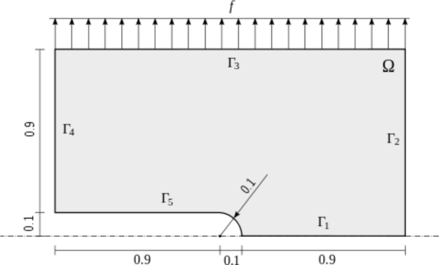
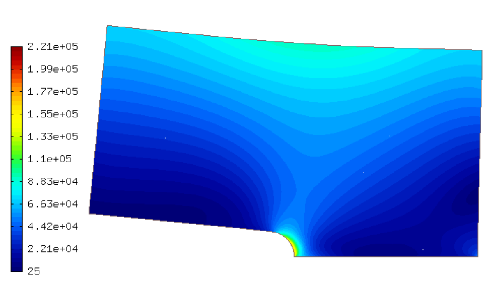

Systems of Equations (08-system)
--------------------------------

**Git reference:** Tutorial example `08-system <http://git.hpfem.org/hermes.git/tree/HEAD:/hermes2d/tutorial/P01-linear/08-system>`_. 

So far we have solved single PDEs with a weak formulation
of the form $a(u,v) - l(v) = 0$, where $u$ was a continuous approximation in the
$H^1$ space. Hermes can also solve equations whose solutions lie in the spaces
$H(curl)$, $H(div)$ or $L^2$, and one can combine these spaces for PDE systems
arbitrarily.

General scheme
~~~~~~~~~~~~~~

First let us understand how Hermes handles systems of linear PDE whose weak formulation 
is written as

.. math::
    :label: weaksystem

      a_{11}(u_1,v_1)\,+ a_{12}(u_2,v_1)\,+ \cdots\,+ a_{1n}(u_n,v_1) - l_1(v_1) = 0,

      a_{21}(u_1,v_2)\,+ a_{22}(u_2,v_2)\,+ \cdots\,+ a_{2n}(u_n,v_2) - l_2(v_2) = 0,

                                                          \vdots

      a_{n1}(u_1,v_n) + a_{n2}(u_2,v_n) + \cdots + a_{nn}(u_n,v_n) - l_n(v_n) = 0.

The solution $u = (u_1, u_2, \dots, u_n)$ and test functions $v =
(v_1, v_2, \dots, v_n)$ belong to the space $W = V_1 \times V_2 \times \dots
\times V_n$, where each $V_i$ is one of the available function spaces $H^1$, 
$H(curl)$, $H(div)$ or $L^2$. The resulting discrete matrix problem will have 
an $n \times n$ block structure.

Model problem of linear elasticity
~~~~~~~~~~~~~~~~~~~~~~~~~~~~~~~~~~

Let us illustrate this by solving a simple problem of linear elasticity. Consider a
two-dimensional elastic body shown in the following figure. The lower edge has
fixed displacements and the body is loaded with both an external force acting 
on the upper edge, and volumetric gravity force. 

In the plane-strain model of linear elasticity the goal is to determine the
deformation of the elastic body. The deformation is sought as a vector 
function $u(x) = (u_1, u_2)^T$, describing the displacement of each point
$x \in \Omega$.

Boundary conditions
~~~~~~~~~~~~~~~~~~~

The boundary conditions are

.. math::
    :nowrap:

    \begin{eqnarray*}
    \frac{\partial u_1}{\partial n} &=& f_1 \ \text{on $\Gamma_3$,} \\
    \frac{\partial u_1}{\partial n} &=& 0 \ \text{on $\Gamma_2$, $\Gamma_4$, $\Gamma_5$,} \\
    \frac{\partial u_2}{\partial n} &=& f_2 \ \text{on $\Gamma_3$,} \\
    \frac{\partial u_2}{\partial n} &=& 0 \ \text{on $\Gamma_2$, $\Gamma_4$, $\Gamma_5$,} \\
    u_1 &=& u_2 = 0 \ \mbox{on} \ \Gamma_1. 
    \end{eqnarray*}

The zero displacements are implemented as follows::

    // Initialize boundary conditions.
    DefaultEssentialBCConst zero_disp("Bottom", 0.0);
    EssentialBCs bcs(&zero_disp);

The surface force is a Neumann boundary conditions that will be incorporated into the 
weak formulation.

Displacement spaces
~~~~~~~~~~~~~~~~~~~

Next we define function spaces for the two solution
components, $u_1$ and $u_2$::

  // Create x- and y- displacement space using the default H1 shapeset.
  H1Space u1_space(&mesh, &bcs, P_INIT);
  H1Space u2_space(&mesh, &bcs, P_INIT);
  int ndof = Space::get_num_dofs(Hermes::vector<Space *>(&u1_space, &u2_space));
  info("ndof = %d", ndof);

Weak formulation
~~~~~~~~~~~~~~~~

Applying the standard procedure to the elastostatic equilibrium equations, we 
arrive at the following weak formulation:

.. math::
    :nowrap:

    \begin{eqnarray*}   \int_\Omega     (2\mu\!+\!\lambda)\dd{u_1}{x_1}\dd{v_1}{x_1} + \mu\dd{u_1}{x_2}\dd{v_1}{x_2} +     \mu\dd{u_2}{x_1}\dd{v_1}{x_2} + \lambda\dd{u_2}{x_2}\dd{v_1}{x_1}     \,\mbox{d}\bfx -     \int_{\Gamma_3} \!\!f_1 v_1 \,\mbox{d}S &=& 0, \\ \smallskip   \int_\Omega     \mu\dd{u_1}{x_2}\dd{v_2}{x_1} + \lambda\dd{u_1}{x_1}\dd{v_2}{x_2} +     (2\mu\!+\!\lambda)\dd{u_2}{x_2}\dd{v_2}{x_2} + \mu\dd{u_2}{x_1}\dd{v_2}{x_1} \,\mbox{d}\bfx -  \int_{\Gamma_3} \!\!f_2 v_2 \,\mbox{d}S + \int_{\Omega} \!\!\rho g v_2 \,\mbox{d}\bfx &=& 0. \end{eqnarray*}

(the gravitational acceleration $g$ is considered negative).
We see that the weak formulation can be written in the form :eq:`weaksystem`:

.. math::
    :nowrap:

    \begin{eqnarray*}
      a_{11}(u_1, v_1) \!&=&\! \int_\Omega (2\mu+\lambda)\dd{u_1}{x_1}\dd{v_1}{x_1} + \mu\dd{u_1}{x_2}\dd{v_1}{x_2} \,\mbox{d}\bfx,  \\
      a_{12}(u_2, v_1) \!&=&\! \int_\Omega \mu\dd{u_2}{x_1}\dd{v_1}{x_2} + \lambda\dd{u_2}{x_2}\dd{v_1}{x_1} \,\mbox{d}\bfx,\\
      a_{21}(u_1, v_2) \!&=&\! \int_\Omega \mu\dd{u_1}{x_2}\dd{v_2}{x_1} + \lambda\dd{u_1}{x_1}\dd{v_2}{x_2} \,\mbox{d}\bfx,\\
      a_{22}(u_2, v_2) \!&=&\! \int_\Omega (2\mu+\lambda)\dd{u_2}{x_2}\dd{v_2}{x_2} + \mu\dd{u_2}{x_1}\dd{v_2}{x_1} \,\mbox{d}\bfx,  \\
      l_{1}(v_1) \!&=&\!
      \int_{\Gamma_3} \!\!f_1 v_1 \,\mbox{d}S, \\
      l_{2}(v_2) \!&=&\!
      \int_{\Gamma_3} \!\!f_2 v_2 \,\mbox{d}S - \int_{\Omega} \!\!\rho g v_2 \,\mbox{d}\bfx.
    \end{eqnarray*}

Here, $\mu$ and $\lambda$ are material constants (Lame coefficients) defined as

.. math::

    \mu = \frac{E}{2(1+\nu)}, \ \ \ \ \  \lambda = \frac{E\nu}{(1+\nu)(1-2\nu)},

where $E$ is the Young modulus and $\nu$ the Poisson ratio of the material. For
steel it is $E = 200$ GPa and $\nu = 0.3$. The load force is $f = (0, 8\cdot 10^4)^T$ N.

Definition of weak forms
~~~~~~~~~~~~~~~~~~~~~~~~

Hermes provides default Jacobian and residual forms for linear elasticity that can be found in the 
file 
`src/weakform_library/weakforms_elasticity.h <http://git.hpfem.org/hermes.git/blob/HEAD:/hermes2d/src/weakform_library/weakforms_elasticity.h>`_.
These are volumetric forms that can be used for problems with Dirichlet and/or zero Neumann boundary conditions. Using those,
the weak formulation for this problem is implemented as follows::

    class CustomWeakFormLinearElasticity : public WeakForm
    {
    public:
      CustomWeakFormLinearElasticity(double E, double nu, double rho_g,
                                     std::string surface_force_bdy, double f0, double f1);
    };

where 

.. sourcecode::
    .

    CustomWeakFormLinearElasticity::CustomWeakFormLinearElasticity(double E, double nu, double rho_g,
								   std::string surface_force_bdy, double f0, 
								   double f1) : WeakForm(2)
    {
      double lambda = (E * nu) / ((1 + nu) * (1 - 2*nu));
      double mu = E / (2*(1 + nu));

      // Jacobian.
      add_matrix_form(new WeakFormsElasticity::DefaultJacobianElasticity_0_0(0, 0, lambda, mu));
      add_matrix_form(new WeakFormsElasticity::DefaultJacobianElasticity_0_1(0, 1, lambda, mu));
      add_matrix_form(new WeakFormsElasticity::DefaultJacobianElasticity_1_1(1, 1, lambda, mu));

      // Residual - first equation.
      add_vector_form(new WeakFormsElasticity::DefaultResidualElasticity_0_0(0, HERMES_ANY, lambda, mu));
      add_vector_form(new WeakFormsElasticity::DefaultResidualElasticity_0_1(0, HERMES_ANY, lambda, mu));
      // Surface force (first component).
      add_vector_form_surf(new WeakFormsH1::DefaultVectorFormSurf(0, surface_force_bdy, new HermesFunction(-f0))); 

      // Residual - second equation.
      add_vector_form(new WeakFormsElasticity::DefaultResidualElasticity_1_0(1, HERMES_ANY, lambda, mu));
      add_vector_form(new WeakFormsElasticity::DefaultResidualElasticity_1_1(1, HERMES_ANY, lambda, mu));
      // Gravity loading in the second vector component.
      add_vector_form(new WeakFormsH1::DefaultVectorFormVol(1, HERMES_ANY, new HermesFunction(-rho_g)));
      // Surface force (second component).
      add_vector_form_surf(new WeakFormsH1::DefaultVectorFormSurf(1, surface_force_bdy, new HermesFunction(-f1))); 
    }

.. latexcode::
    .

    CustomWeakFormLinearElasticity::CustomWeakFormLinearElasticity(double E, double nu,
                                    double rho_g, std::string surface_force_bdy,
                                    double f0, double f1) : WeakForm(2)
    {
      double lambda = (E * nu) / ((1 + nu) * (1 - 2*nu));
      double mu = E / (2*(1 + nu));

      // Jacobian.
      add_matrix_form(new WeakFormsElasticity::DefaultJacobianElasticity_0_0(0, 0, lambda, mu));
      add_matrix_form(new WeakFormsElasticity::DefaultJacobianElasticity_0_1(0, 1, lambda, mu));
      add_matrix_form(new WeakFormsElasticity::DefaultJacobianElasticity_1_1(1, 1, lambda, mu));

      // Residual - first equation.
      add_vector_form(new WeakFormsElasticity::DefaultResidualElasticity_0_0(0, HERMES_ANY,
                                               lambda, mu));
      add_vector_form(new WeakFormsElasticity::DefaultResidualElasticity_0_1(0, HERMES_ANY,
                                               lambda, mu));
      // Surface force (first component).
      add_vector_form_surf(new WeakFormsH1::DefaultVectorFormSurf(0, surface_force_bdy,
                                            new HermesFunction(-f0))); 

      // Residual - second equation.
      add_vector_form(new WeakFormsElasticity::DefaultResidualElasticity_1_0(1, HERMES_ANY,
                                               lambda, mu));
      add_vector_form(new WeakFormsElasticity::DefaultResidualElasticity_1_1(1, HERMES_ANY,
                                               lambda, mu));
      // Gravity loading in the second vector component.
      add_vector_form(new WeakFormsH1::DefaultVectorFormVol(1, HERMES_ANY,
                                       new HermesFunction(-rho_g)));
      // Surface force (second component).
      add_vector_form_surf(new WeakFormsH1::DefaultVectorFormSurf(1, surface_force_bdy,
                                            new HermesFunction(-f1))); 
    }

The block index $i$, $j$ means that the bilinear form takes basis functions from 
space $i$ and test functions from space $j$. I.e., the block index 
0, 1 means that the bilinear form takes basis functions from space 0 (x-displacement space) 
and test functions from space 1 (y-displacement space), etc. In this particular case the 
Jacobian matrix has a $2 \times 2$ block structure.

Flags HERMES_SYM, HERMES_NONSYM, HERMES_ANTISYM
~~~~~~~~~~~~~~~~~~~~~~~~~~~~~~~~~~~~~~~~~~~~~~~

Since the two diagonal forms $a_{11}$ and $a_{22}$ are symmetric, i.e.,
$a_{ii}(u,v) = a_{ii}(v,u)$, Hermes can be told to only evaluate half 
of the integrals to speed up assembly. This is reflected by the parameter
HERMES_SYM in the constructors of these forms::

    DefaultJacobianElasticity_0_0::DefaultJacobianElasticity_0_0
      (unsigned int i, unsigned int j, double lambda, double mu)
      : WeakForm::MatrixFormVol(i, j, HERMES_ANY, HERMES_SYM), lambda(lambda), mu(mu) 
    {
    }

and
::

    DefaultJacobianElasticity_1_1::DefaultJacobianElasticity_1_1
      (unsigned int i, unsigned int j, double lambda, double mu)
      : WeakForm::MatrixFormVol(i, j, HERMES_ANY, HERMES_SYM), lambda(lambda), mu(mu) 
    {
    }

The off-diagonal forms $a_{12}(u_2, v_1)$ and $a_{21}(u_1, v_2)$ are not
(and cannot) be symmetric, since their arguments come from different spaces in general.
However, we can see that $a_{12}(u, v) = a_{21}(v, u)$, i.e., the corresponding blocks
of the local stiffness matrix are transposes of each other. Here, the HERMES_SYM flag
has a different effect: It tells Hermes to take the block of the local stiffness
matrix corresponding to the form $a_{12}$, transpose it and copy it where a block
corresponding to $a_{21}$ belongs, without evaluating $a_{21}$ at all. This again 
speeds up the matrix assembly. In other words, the constructor of the form 
DefaultJacobianElasticity_0_1 is 
::

    DefaultJacobianElasticity_0_1::DefaultJacobianElasticity_0_1
      (unsigned int i, unsigned int j, double lambda, double mu)
      : WeakForm::MatrixFormVol(i, j, HERMES_ANY, HERMES_SYM), lambda(lambda), mu(mu) 
    {
    }

and the form DefaultJacobianElasticity_1_0 is not needed.

Hermes also provides a flag HERMES_ANTISYM which is analogous to HERMES_SYM but the sign of the 
copied block is changed. This flag is useful where $a_{ij}(u, v) = -a_{ji}(v, u)$.

**IMPORTANT**: Even if your weak forms are symmetric, it is recommended to start with the 
default (and safe) flag HERMES_NONSYM. Once the model works, it can be optimized using the
flag HERMES_SYM.

Assembling and solving the discrete problem
~~~~~~~~~~~~~~~~~~~~~~~~~~~~~~~~~~~~~~~~~~~

When the spaces and weak forms are ready, one can initialize the 
discrete problem::

    // Initialize the FE problem.
    DiscreteProblem dp(&wf, Hermes::vector<Space *>(&u1_space, &u2_space));

Next we initialize the matrix solver::

    // Set up the solver, matrix, and rhs according to the solver selection.
    SparseMatrix* matrix = create_matrix(matrix_solver);
    Vector* rhs = create_vector(matrix_solver);
    Solver* solver = create_linear_solver(matrix_solver, matrix, rhs);

The length of the coefficient vector must be the sum of the dimensions 
of both displacement spaces::

    // Initial coefficient vector for the Newton's method.  
    scalar* coeff_vec = new scalar[ndof];
    memset(coeff_vec, 0, ndof*sizeof(scalar));

Next we perform the Newton's iteration::

    // Perform Newton's iteration.
    bool verbose = true;
    bool jacobian_changed = true;
    if (!hermes2d.solve_newton(coeff_vec, &dp, solver, matrix, rhs, jacobian_changed,
        NEWTON_TOL, NEWTON_MAX_ITER, verbose)) error("Newton's iteration failed.");

**Notice that two steps are taken although the problem is linear**::

    I ndof = 3000
    I ---- Newton initial residual norm: 64400
    I ---- Newton iter 1, residual norm: 4.52624e-07
    I ---- Newton iter 2, residual norm: 9.7264e-09
    << close all views to continue >>

This confirms that using Newton for linear problems is not a waste of time. 
Last, the coefficient vector is translated into two displacement solutions::

    // Translate the resulting coefficient vector into the Solution sln.
    Solution u1_sln, u2_sln;
    Solution::vector_to_solutions(coeff_vec, Hermes::vector<Space *>(&u1_space, &u2_space), 
                                  Hermes::vector<Solution *>(&u1_sln, &u2_sln));

Visualizing the Von Mises stress
~~~~~~~~~~~~~~~~~~~~~~~~~~~~~~~~

Hermes implements postprocessing through Filters. Filter is a special class
which takes up to three Solutions, performs some computation and in the end acts
as another Solution (which can be visualized, passed into another Filter,
passed into a weak form, etc.). More advanced usage of Filters will be discussed 
later. 

In elasticity examples we typically use the predefined VonMisesFilter::

    // Visualize the solution.
    ScalarView view("Von Mises stress [Pa]", new WinGeom(590, 0, 700, 400));
    double lambda = (E * nu) / ((1 + nu) * (1 - 2*nu));  // First Lame constant.
    double mu = E / (2*(1 + nu));                        // Second Lame constant.
    VonMisesFilter stress(Hermes::vector<MeshFunction *>(&u1_sln, &u2_sln), lambda, mu);
    view.show_mesh(false);
    view.show(&stress, HERMES_EPS_HIGH, H2D_FN_VAL_0, &u1_sln, &u2_sln, 1.5e5);

Here the fourth and fifth parameters are the displacement components used to 
distort the domain geometry, and the sixth parameter is a scaling factor to multiply the 
displacements. 

