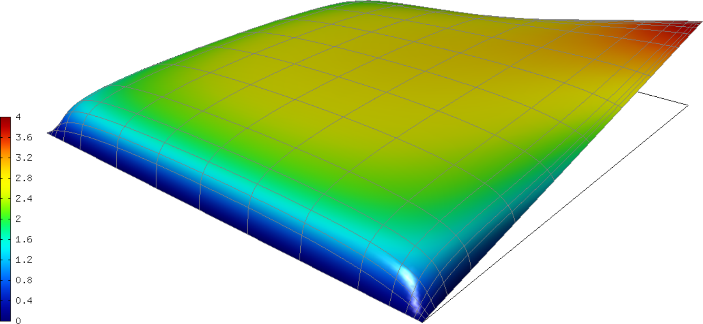

Picard's Method (01-picard)
---------------------------

**Git reference:** Tutorial example `01-picard 
<http://git.hpfem.org/hermes.git/tree/HEAD:/hermes2d/tutorial/P02-nonlinear/01-picard>`_.

Picard's Method
~~~~~~~~~~~~~~~

The Picard's method is a simple approach to the solution of nonlinear problems
where nonlinear products are linearized by moving part of the nonlinearity 
to the previous iteration level. For example, a nonlinear product of the form 
$g(u)u$ would be linearized as $g(u^n) u^{n+1}$. Let us illustrate this on a 
simple model problem.

Model problem
~~~~~~~~~~~~~

We solve a nonlinear equation

.. math::

    -\nabla \cdot (\lambda(u)\nabla u) = f(x,y), \ \ \ u = u_D \ \mbox{on}\ \partial \Omega

where 

.. math::

    u_D(x, y) = (x+10)(y+10)/100 \ \ \ \mbox{on } \partial \Omega.

One possible interpretation of this equation is stationary heat transfer where the thermal
conductivity $\lambda$ depends on the temperature $u$, and $f(x,y)$ are heat sources/losses.
Our domain is a square $\Omega = (-10,10)^2$, $f(x,y) = 1$, and the nonlinearity $\lambda$ has the form 

.. math::

    \lambda(u) = 1 + u^\alpha

where $\alpha$ is an even nonnegative integer. We will use $\alpha = 4$. 
Recall that $\lambda$ must be entirely positive or entirely negative for the problem to be solvable
according to the theory. The linearized equation has the form 

.. math::

    -\nabla \cdot (\lambda(u^n)\nabla u^{n+1}) = f(x,y), \ \ \ u = u_D \ \mbox{on}\ \partial \Omega.

The Picard's iteration begins from some initial guess $u^0$, in our case a constant 
function, and runs until a convergence criterion is satisfied. Most widely used 
convergence criteria are the relative error between two consecutive iterations, or 
residual of the equation. In this example we will use the former.

Recall that Hermes uses the Newton's method to solve linear problems. Therefore, the 
linearized equation is written as

.. math::

    -\nabla \cdot (\lambda(u^n)\nabla u^{n+1}) - f(x,y) = 0.

The residual weak form reads

.. math::

    \int_{\Omega} \lambda(u^n) \nabla u^{n+1} \cdot \nabla v \, \mbox{d}\bfx 
    - \int_{\Omega}  f(x,y) v \, \mbox{d}\bfx = 0

where $u^n$ is a given function, $u^{n+1}$ the approximate solution, and $v$
a test function. The weak form of the Jacobian is then

.. math::

    \int_{\Omega} \lambda(u^n) \nabla u \cdot \nabla v \, \mbox{d}\bfx

where $u^n$ is a given function, $u$ a basis function, and $v$ a test function. 

Defining custom nonlinearity
~~~~~~~~~~~~~~~~~~~~~~~~~~~~

The nonlinearity is defined by subclassing the HermesFunction class::

    class CustomNonlinearity : public HermesFunction
    {
    public:
      CustomNonlinearity(double alpha): HermesFunction()
      {
	this->is_const = false;
	this->alpha = alpha;
      }

      virtual scalar value(double u) const
      {
	return 1 + pow(u, alpha);
      }

      virtual Ord value(Ord u) const
      {
	// If alpha is not an integer, then the function
	// is non-polynomial. 
	// NOTE: Setting Ord to 10 is safe but costly,
	// one could save here by looking at special cases 
	// of alpha. 
	return Ord(10);
      }

      protected:
	double alpha;
    };

Defining initial condition
~~~~~~~~~~~~~~~~~~~~~~~~~~

This example uses a constant initial guess::

    // Initialize previous iteration solution for the Picard's method.
    Solution sln_prev_iter(&mesh, INIT_COND_CONST);

Defining weak forms
~~~~~~~~~~~~~~~~~~~

The weak forms are custom because of the external function 
(previous iteration level solution) that needs to be used:

.. sourcecode::
    .

    // NOTE: The linear problem in each step of the Picard's 
    //       method is solved using the Newton's method.

    class CustomWeakFormPicard : public WeakForm
    {
    public:
      CustomWeakFormPicard(Solution* prev_iter_sln, HermesFunction* lambda, HermesFunction* f) 
	: WeakForm(1)
      {
	// Jacobian (custom because of the external function).
	CustomJacobian* matrix_form = new CustomJacobian(0, 0, lambda);
	matrix_form->ext.push_back(prev_iter_sln);
	add_matrix_form(matrix_form);

	// Residual (custom because of the external function).
	CustomResidual* vector_form = new CustomResidual(0, lambda, f);
	vector_form->ext.push_back(prev_iter_sln);
	add_vector_form(vector_form);
      };

    private:
      class CustomJacobian : public WeakForm::MatrixFormVol
      {
      public:
	CustomJacobian(int i, int j, HermesFunction* lambda) : WeakForm::MatrixFormVol(i, j), lambda(lambda)
	{ 
	}

	virtual scalar value(int n, double *wt, Func<scalar> *u_ext[], Func<double> *u,
			     Func<double> *v, Geom<double> *e, ExtData<scalar> *ext) const 
	{
	  scalar result = 0;
	  for (int i = 0; i < n; i++) 
	  {
	    result += wt[i] * lambda->value(ext->fn[0]->val[i]) 
			    * (u->dx[i] * v->dx[i] + u->dy[i] * v->dy[i]);
	  }
	  return result;
	}

	virtual Ord ord(int n, double *wt, Func<Ord> *u_ext[], Func<Ord> *u, Func<Ord> *v,
			Geom<Ord> *e, ExtData<Ord> *ext) const 
	{
	  Ord result = 0;
	  for (int i = 0; i < n; i++) 
	  {
	    result += wt[i] * lambda->value(ext->fn[0]->val[i]) 
			    * (u->dx[i] * v->dx[i] + u->dy[i] * v->dy[i]);
	  }
	  return result;
	}

	protected:
	  HermesFunction* lambda;
      };

      class CustomResidual : public WeakForm::VectorFormVol
      {
      public:
	CustomResidual(int i, HermesFunction* lambda, HermesFunction* f) 
	  : WeakForm::VectorFormVol(i), lambda(lambda), f(f) 
	{ 
	}

	virtual scalar value(int n, double *wt, Func<scalar> *u_ext[],
			     Func<double> *v, Geom<double> *e, ExtData<scalar> *ext) const 
	{
	  scalar result = 0;
	  for (int i = 0; i < n; i++) 
	  {
	    result += wt[i] * lambda->value(ext->fn[0]->val[i]) 
			    * (u_ext[0]->dx[i] * v->dx[i] + u_ext[0]->dy[i] * v->dy[i]);
	    result += wt[i] * f->value(e->x[i], e->y[i]) * v->val[i];
	  }
	  return result;
	}

	virtual Ord ord(int n, double *wt, Func<Ord> *u_ext[], Func<Ord> *v, 
			Geom<Ord> *e, ExtData<Ord> *ext) const 
	{
	  Ord result = 0;
	  for (int i = 0; i < n; i++) 
	  {
	    result += wt[i] * lambda->value(ext->fn[0]->val[i]) * (u_ext[0]->dx[i] 
			    * v->dx[i] + u_ext[0]->dy[i] * v->dy[i]);
	    result += wt[i] * f->value(e->x[i], e->y[i]) * v->val[i];
	  }
	  return result;
	}

	private:
	  HermesFunction* lambda;
	  HermesFunction* f;
      };
    };

.. latexcode::
    .

    // NOTE: The linear problem in each step of the Picard's 
    //       method is solved using the Newton's method.

    class CustomWeakFormPicard : public WeakForm
    {
    public:
      CustomWeakFormPicard(Solution* prev_iter_sln, HermesFunction* lambda, 
                           HermesFunction* f): WeakForm(1)
      {
	// Jacobian (custom because of the external function).
	CustomJacobian* matrix_form = new CustomJacobian(0, 0, lambda);
	matrix_form->ext.push_back(prev_iter_sln);
	add_matrix_form(matrix_form);

	// Residual (custom because of the external function).
	CustomResidual* vector_form = new CustomResidual(0, lambda, f);
	vector_form->ext.push_back(prev_iter_sln);
	add_vector_form(vector_form);
      };

    private:
      class CustomJacobian : public WeakForm::MatrixFormVol
      {
      public:
	CustomJacobian(int i, int j, HermesFunction* lambda) : WeakForm::
                       MatrixFormVol(i, j), lambda(lambda)
	{ 
	}

	virtual scalar value(int n, double *wt, Func<scalar> *u_ext[], 
                             Func<double> *u, Func<double> *v,
                             Geom<double> *e, ExtData<scalar> *ext) const 
	{
	  scalar result = 0;
	  for (int i = 0; i < n; i++) 
	  {
	    result += wt[i] * lambda->value(ext->fn[0]->val[i]) 
			    * (u->dx[i] * v->dx[i] + u->dy[i] * v->dy[i]);
	  }
	  return result;
	}

	virtual Ord ord(int n, double *wt, Func<Ord> *u_ext[], Func<Ord> *u, 
                        Func<Ord> *v, Geom<Ord> *e, ExtData<Ord> *ext) const 
	{
	  Ord result = 0;
	  for (int i = 0; i < n; i++) 
	  {
	    result += wt[i] * lambda->value(ext->fn[0]->val[i]) 
	              * (u->dx[i] * v->dx[i] + u->dy[i] * v->dy[i]);
	  }
	  return result;
	}

	protected:
	  HermesFunction* lambda;
      };

      class CustomResidual : public WeakForm::VectorFormVol
      {
      public:
	CustomResidual(int i, HermesFunction* lambda, HermesFunction* f) 
	  : WeakForm::VectorFormVol(i), lambda(lambda), f(f) 
	{ 
	}

	virtual scalar value(int n, double *wt, Func<scalar> *u_ext[],
			     Func<double> *v, Geom<double> *e, ExtData<scalar> *ext) 
                             const 
	{
	  scalar result = 0;
	  for (int i = 0; i < n; i++) 
	  {
	    result += wt[i] * lambda->value(ext->fn[0]->val[i]) 
			    * (u_ext[0]->dx[i] * v->dx[i] + u_ext[0]->dy[i] 
                            * v->dy[i]);
	    result += wt[i] * f->value(e->x[i], e->y[i]) * v->val[i];
	  }
	  return result;
	}

	virtual Ord ord(int n, double *wt, Func<Ord> *u_ext[], Func<Ord> *v, 
			Geom<Ord> *e, ExtData<Ord> *ext) const 
	{
	  Ord result = 0;
	  for (int i = 0; i < n; i++) 
	  {
	    result += wt[i] * lambda->value(ext->fn[0]->val[i]) * (u_ext[0]->dx[i] 
			    * v->dx[i] + u_ext[0]->dy[i] * v->dy[i]);
	    result += wt[i] * f->value(e->x[i], e->y[i]) * v->val[i];
	  }
	  return result;
	}

	private:
	  HermesFunction* lambda;
	  HermesFunction* f;
      };
    };

Note that the previous iteration level solution is accessed through ext->fn[0];

Initializing the weak formulation
~~~~~~~~~~~~~~~~~~~~~~~~~~~~~~~~~

The weak formulation is then initialized in the main.cpp file::

    // Initialize the weak formulation.
    CustomNonlinearity lambda(alpha);
    HermesFunction src(-heat_src);
    CustomWeakFormPicard wf(&sln_prev_iter, &lambda, &src);

Picard's iteration loop
~~~~~~~~~~~~~~~~~~~~~~~

The Picard's iteration is performed simply by::

    bool verbose = true;
    hermes2d.solve_picard(&wf, &space, &sln_prev_iter, matrix_solver, PICARD_TOL, 
  	                  PICARD_MAX_ITER, verbose);

Slow convergence
~~~~~~~~~~~~~~~~

The convergence of the Picard's method is not fast. Do not be 
surprized by seeing the following::

     I ---- Picard iter 1, ndof 1225, rel. error 137.848%
     I ---- Picard iter 2, ndof 1225, rel. error 88.1122%
     I ---- Picard iter 3, ndof 1225, rel. error 174.415%
     I ---- Picard iter 4, ndof 1225, rel. error 42.0404%
     I ---- Picard iter 5, ndof 1225, rel. error 44.039%
     I ---- Picard iter 6, ndof 1225, rel. error 36.5116%
     I ---- Picard iter 7, ndof 1225, rel. error 26.3286%
     I ---- Picard iter 8, ndof 1225, rel. error 24.7094%
     I ---- Picard iter 9, ndof 1225, rel. error 14.9086%
     I ---- Picard iter 10, ndof 1225, rel. error 18.0279%
     I ---- Picard iter 11, ndof 1225, rel. error 12.6622%
     I ---- Picard iter 12, ndof 1225, rel. error 10.3982%
     I ---- Picard iter 13, ndof 1225, rel. error 12.4907%
     I ---- Picard iter 14, ndof 1225, rel. error 7.75317%
     I ---- Picard iter 15, ndof 1225, rel. error 9.9772%
     I ---- Picard iter 16, ndof 1225, rel. error 7.95967%
     I ---- Picard iter 17, ndof 1225, rel. error 6.9973%
     I ---- Picard iter 18, ndof 1225, rel. error 7.71092%
     I ---- Picard iter 19, ndof 1225, rel. error 4.80482%
     I ---- Picard iter 20, ndof 1225, rel. error 6.2189%
     I ---- Picard iter 21, ndof 1225, rel. error 4.77588%
     I ---- Picard iter 22, ndof 1225, rel. error 4.00051%
     I ---- Picard iter 23, ndof 1225, rel. error 4.77253%
     I ---- Picard iter 24, ndof 1225, rel. error 2.97439%
     I ---- Picard iter 25, ndof 1225, rel. error 3.83843%
     I ---- Picard iter 26, ndof 1225, rel. error 3.1083%
     I ---- Picard iter 27, ndof 1225, rel. error 2.62248%
     I ---- Picard iter 28, ndof 1225, rel. error 3.05568%
     I ---- Picard iter 29, ndof 1225, rel. error 1.91112%
     I ---- Picard iter 30, ndof 1225, rel. error 2.44558%
     I ---- Picard iter 31, ndof 1225, rel. error 1.97035%
     I ---- Picard iter 32, ndof 1225, rel. error 1.60091%
     I ---- Picard iter 33, ndof 1225, rel. error 1.93986%
     I ---- Picard iter 34, ndof 1225, rel. error 1.21191%
     I ---- Picard iter 35, ndof 1225, rel. error 1.53671%
     I ---- Picard iter 36, ndof 1225, rel. error 1.27897%
     I ---- Picard iter 37, ndof 1225, rel. error 1.02903%
     I ---- Picard iter 38, ndof 1225, rel. error 1.24486%
     I ---- Picard iter 39, ndof 1225, rel. error 0.782587%
     I ---- Picard iter 40, ndof 1225, rel. error 0.9788%
     I ---- Picard iter 41, ndof 1225, rel. error 0.821805%
     I ---- Picard iter 42, ndof 1225, rel. error 0.642124%
     I ---- Picard iter 43, ndof 1225, rel. error 0.794778%
     I ---- Picard iter 44, ndof 1225, rel. error 0.500587%
     I ---- Picard iter 45, ndof 1225, rel. error 0.618031%
     I ---- Picard iter 46, ndof 1225, rel. error 0.531635%
     I ---- Picard iter 47, ndof 1225, rel. error 0.408809%
     I ---- Picard iter 48, ndof 1225, rel. error 0.509184%
     I ---- Picard iter 49, ndof 1225, rel. error 0.323117%
     I ---- Picard iter 50, ndof 1225, rel. error 0.392662%
     I ---- Picard iter 51, ndof 1225, rel. error 0.342659%
     I ---- Picard iter 52, ndof 1225, rel. error 0.257263%
     I ---- Picard iter 53, ndof 1225, rel. error 0.32539%
     I ---- Picard iter 54, ndof 1225, rel. error 0.207573%
     I ---- Picard iter 55, ndof 1225, rel. error 0.248288%
     I ---- Picard iter 56, ndof 1225, rel. error 0.221242%
     I ---- Picard iter 57, ndof 1225, rel. error 0.163194%
     I ---- Picard iter 58, ndof 1225, rel. error 0.208141%
     I ---- Picard iter 59, ndof 1225, rel. error 0.133959%
     I ---- Picard iter 60, ndof 1225, rel. error 0.15744%
     I ---- Picard iter 61, ndof 1225, rel. error 0.14266%
     I ---- Picard iter 62, ndof 1225, rel. error 0.103097%
     I ---- Picard iter 63, ndof 1225, rel. error 0.132974%
     I ---- Picard iter 64, ndof 1225, rel. error 0.0862807%
     I ---- Picard iter 65, ndof 1225, rel. error 0.0995827%
     I ---- Picard iter 66, ndof 1225, rel. error 0.0920082%
     I ---- Picard iter 67, ndof 1225, rel. error 0.0653512%
     I ---- Picard iter 68, ndof 1225, rel. error 0.0849574%
     I ---- Picard iter 69, ndof 1225, rel. error 0.0556992%
     I ---- Picard iter 70, ndof 1225, rel. error 0.0630613%
     I ---- Picard iter 71, ndof 1225, rel. error 0.059305%
     I ---- Picard iter 72, ndof 1225, rel. error 0.0413799%
     I ---- Picard iter 73, ndof 1225, rel. error 0.0542397%
     I ---- Picard iter 74, ndof 1225, rel. error 0.035933%
     I ---- Picard iter 75, ndof 1225, rel. error 0.0398802%
     I ---- Picard iter 76, ndof 1225, rel. error 0.0382162%
     I ---- Picard iter 77, ndof 1225, rel. error 0.0262455%
     I ---- Picard iter 78, ndof 1225, rel. error 0.0346186%
     I ---- Picard iter 79, ndof 1225, rel. error 0.0232082%
     I ---- Picard iter 80, ndof 1225, rel. error 0.0252305%
     I ---- Picard iter 81, ndof 1225, rel. error 0.0246164%
     I ---- Picard iter 82, ndof 1225, rel. error 0.0166487%
     I ---- Picard iter 83, ndof 1225, rel. error 0.0220836%
     I ---- Picard iter 84, ndof 1225, rel. error 0.0149876%
     I ---- Picard iter 85, ndof 1225, rel. error 0.0159502%
     I ---- Picard iter 86, ndof 1225, rel. error 0.0158503%
     I ---- Picard iter 87, ndof 1225, rel. error 0.0105729%
     I ---- Picard iter 88, ndof 1225, rel. error 0.0140817%
     I ---- Picard iter 89, ndof 1225, rel. error 0.00968457%
     I ---- Picard iter 90, ndof 1225, rel. error 0.0100839%
     I ---- Picard iter 91, ndof 1225, rel. error 0.0102019%
     I ---- Picard iter 92, ndof 1225, rel. error 0.00671876%
     I ---- Picard iter 93, ndof 1225, rel. error 0.0089751%
     I ---- Picard iter 94, ndof 1225, rel. error 0.00625812%
     I ---- Picard iter 95, ndof 1225, rel. error 0.00637235%
     I ---- Picard iter 96, ndof 1225, rel. error 0.00656369%
     I ---- Picard iter 97, ndof 1225, rel. error 0.00427379%
     I ---- Picard iter 98, ndof 1225, rel. error 0.00571786%
     I ---- Picard iter 99, ndof 1225, rel. error 0.00404515%
     I ---- Picard iter 100, ndof 1225, rel. error 0.00402661%
     I ---- Picard iter 101, ndof 1225, rel. error 0.00422125%
     I ---- Picard iter 102, ndof 1225, rel. error 0.0027209%
     I ---- Picard iter 103, ndof 1225, rel. error 0.00364112%
     I ---- Picard iter 104, ndof 1225, rel. error 0.00261483%
     I ---- Picard iter 105, ndof 1225, rel. error 0.00254366%
     I ---- Picard iter 106, ndof 1225, rel. error 0.00271362%
     I ---- Picard iter 107, ndof 1225, rel. error 0.00173396%
     I ---- Picard iter 108, ndof 1225, rel. error 0.00231763%
     I ---- Picard iter 109, ndof 1225, rel. error 0.00169045%
     I ---- Picard iter 110, ndof 1225, rel. error 0.00160672%
     I ---- Picard iter 111, ndof 1225, rel. error 0.00174373%
     I ---- Picard iter 112, ndof 1225, rel. error 0.00110607%
     I ---- Picard iter 113, ndof 1225, rel. error 0.00147457%
     I ---- Picard iter 114, ndof 1225, rel. error 0.00109284%
     I ---- Picard iter 115, ndof 1225, rel. error 0.00101474%
     I ---- Picard iter 116, ndof 1225, rel. error 0.00112001%
     I ---- Picard iter 117, ndof 1225, rel. error 0.000706256%
     I ---- Picard iter 118, ndof 1225, rel. error 0.000937769%
     I ---- Picard iter 119, ndof 1225, rel. error 0.000706496%
     I ---- Picard iter 120, ndof 1225, rel. error 0.000640834%
     I ---- Picard iter 121, ndof 1225, rel. error 0.000719082%
     I ---- Picard iter 122, ndof 1225, rel. error 0.000451413%
     I ---- Picard iter 123, ndof 1225, rel. error 0.00059613%
     I ---- Picard iter 124, ndof 1225, rel. error 0.000456697%
     I ---- Picard iter 125, ndof 1225, rel. error 0.000404681%
     I ---- Picard iter 126, ndof 1225, rel. error 0.000461473%
     I ---- Picard iter 127, ndof 1225, rel. error 0.000288814%
     I ---- Picard iter 128, ndof 1225, rel. error 0.000378791%
     I ---- Picard iter 129, ndof 1225, rel. error 0.000295192%
     I ---- Picard iter 130, ndof 1225, rel. error 0.000255556%
     I ---- Picard iter 131, ndof 1225, rel. error 0.000296023%
     I ---- Picard iter 132, ndof 1225, rel. error 0.000184965%
     I ---- Picard iter 133, ndof 1225, rel. error 0.000240589%
     I ---- Picard iter 134, ndof 1225, rel. error 0.000190774%
     I ---- Picard iter 135, ndof 1225, rel. error 0.000161391%
     I ---- Picard iter 136, ndof 1225, rel. error 0.000189808%
     I ---- Picard iter 137, ndof 1225, rel. error 0.000118571%
     I ---- Picard iter 138, ndof 1225, rel. error 0.000152746%
     I ---- Picard iter 139, ndof 1225, rel. error 0.00012327%
     I ---- Picard iter 140, ndof 1225, rel. error 0.000101934%
     I ---- Picard iter 141, ndof 1225, rel. error 0.00012165%
     I ---- Picard iter 142, ndof 1225, rel. error 7.60805e-05%
     I ---- Picard iter 143, ndof 1225, rel. error 9.69365e-05%
     I ---- Picard iter 144, ndof 1225, rel. error 7.96362e-05%
     I ---- Picard iter 145, ndof 1225, rel. error 6.4391e-05%
     I ---- Picard iter 146, ndof 1225, rel. error 7.79317e-05%
     I ---- Picard iter 147, ndof 1225, rel. error 4.88603e-05%
     I ---- Picard iter 148, ndof 1225, rel. error 6.14934e-05%
     I ---- Picard iter 149, ndof 1225, rel. error 5.14356e-05%
     I ---- Picard iter 150, ndof 1225, rel. error 4.06839e-05%
     I ---- Picard iter 151, ndof 1225, rel. error 4.99028e-05%
     I ---- Picard iter 152, ndof 1225, rel. error 3.14058e-05%
     I ---- Picard iter 153, ndof 1225, rel. error 3.89939e-05%
     I ---- Picard iter 154, ndof 1225, rel. error 3.32128e-05%
     I ---- Picard iter 155, ndof 1225, rel. error 2.5712e-05%
     I ---- Picard iter 156, ndof 1225, rel. error 3.19405e-05%
     I ---- Picard iter 157, ndof 1225, rel. error 2.02028e-05%
     I ---- Picard iter 158, ndof 1225, rel. error 2.47171e-05%
     I ---- Picard iter 159, ndof 1225, rel. error 2.14402e-05%
     I ---- Picard iter 160, ndof 1225, rel. error 1.62552e-05%
     I ---- Picard iter 161, ndof 1225, rel. error 2.04345e-05%
     I ---- Picard iter 162, ndof 1225, rel. error 1.30058e-05%
     I ---- Picard iter 163, ndof 1225, rel. error 1.56615e-05%
     I ---- Picard iter 164, ndof 1225, rel. error 1.38364e-05%
     I ---- Picard iter 165, ndof 1225, rel. error 1.02806e-05%
     I ---- Picard iter 166, ndof 1225, rel. error 1.30675e-05%
     I ---- Picard iter 167, ndof 1225, rel. error 8.37845e-06%
     I ---- Picard iter 168, ndof 1225, rel. error 9.91998e-06%
     I ---- Picard iter 169, ndof 1225, rel. error 8.92652e-06%
     I ---- Picard iter 170, ndof 1225, rel. error 6.50489e-06%
     I ---- Picard iter 171, ndof 1225, rel. error 8.35266e-06%
     I ---- Picard iter 172, ndof 1225, rel. error 5.40085e-06%
     I ---- Picard iter 173, ndof 1225, rel. error 6.28107e-06%
     I ---- Picard iter 174, ndof 1225, rel. error 5.75701e-06%
     I ---- Picard iter 175, ndof 1225, rel. error 4.11802e-06%
     I ---- Picard iter 176, ndof 1225, rel. error 5.33658e-06%
     I ---- Picard iter 177, ndof 1225, rel. error 3.48342e-06%
     I ---- Picard iter 178, ndof 1225, rel. error 3.97565e-06%
     I ---- Picard iter 179, ndof 1225, rel. error 3.71161e-06%
     I ---- Picard iter 180, ndof 1225, rel. error 2.60849e-06%
     I ---- Picard iter 181, ndof 1225, rel. error 3.40805e-06%
     I ---- Picard iter 182, ndof 1225, rel. error 2.24784e-06%
     I ---- Picard iter 183, ndof 1225, rel. error 2.51559e-06%
     I ---- Picard iter 184, ndof 1225, rel. error 2.39205e-06%
     I ---- Picard iter 185, ndof 1225, rel. error 1.65336e-06%
     I ---- Picard iter 186, ndof 1225, rel. error 2.17548e-06%
     I ---- Picard iter 187, ndof 1225, rel. error 1.45117e-06%
     I ---- Picard iter 188, ndof 1225, rel. error 1.59125e-06%
     I ---- Picard iter 189, ndof 1225, rel. error 1.54106e-06%
     I ---- Picard iter 190, ndof 1225, rel. error 1.04871e-06%
     I ---- Picard iter 191, ndof 1225, rel. error 1.38806e-06%
     I ---- Picard iter 192, ndof 1225, rel. error 9.37195e-07%
       << close all views to continue >>

Sample results
~~~~~~~~~~~~~~

Approximate solution $u$ for $\alpha = 4$: 

