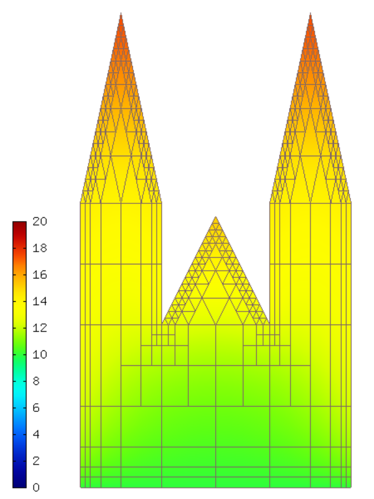

Using Implicit Euler Method (01-implicit-euler)
-----------------------------------------------

**Git reference:** Tutorial example `01-implicit-euler <http://git.hpfem.org/hermes.git/tree/HEAD:/hermes2d/tutorial/P03-timedep/01-implicit-euler>`_. 

Model problem
~~~~~~~~~~~~~

This section describes the implementation of the implicit Euler method. As the underlying model 
we use a naive approximation of how the St. Vitus cathedral in Prague responds to changes in 
the surrounding air temperature during one 24-hour cycle. The geometry is shown below:

.. figure:: 01-implicit-euler/mesh.png
   :align: center
   :scale: 30% 
   :figclass: align-center
   :alt: Model geometry.

We assume the standard heat transfer equation

.. math::
    :label: eqvit1

       c \varrho\frac{\partial T}{\partial t} - \lambda \Delta T = 0

equipped with a Dirichlet condition

.. math::

     T = T_{init}

on the bottom edge $\Gamma_{ground}$ and a Newton condition

.. math::

     \frac{\partial T}{\partial \nu} = \alpha(T_{ext}(t) - T)

on the rest of the boundary $\Gamma_{air}$. Here, $c$ is the heat capacity of the material,
$\varrho$ the material density, $\lambda$ the thermal conductivity,
$T_{init}$ the fixed temperature on the
ground (same as the initial temperature of the building), and $\alpha$
the heat transfer coefficient 
between the building and the surrounding air. The surrounding air temperature
$T_{ext}$ is time-dependent of the form

.. math::

     T_{ext}(t) = T_{init} + 10\sin(2\pi t/T_{final}),

where $T_{final}$ is 24 hours (translated into seconds).

Equation :eq:`eqvit1` is equipped with an initial condition of the
form

.. math::

     T(x,y,0) = T_{init}(x,y) \ \ \ \mbox{in} \ \Omega.

Replacing in :eq:`eqvit1` the temporal derivative with the backward time difference, 
we obtain

.. math::

     c \varrho\frac{T^{n+1} - T^n}{\tau} - \lambda \Delta T^{n+1} = 0.

Weak formulation
~~~~~~~~~~~~~~~~

The corresponding weak formulation reads

.. math::

     \int_{\Omega} c \varrho\frac{T^{n+1} - T^n}{\tau}v + \int_{\Omega} \lambda \nabla T^{n+1}\cdot \nabla v + \int_{\Gamma_{air}} \alpha \lambda T^{n+1}v - \int_{\Gamma_{air}} \alpha \lambda T_{ext}(t^{n+1})v = 0.

Defining weak forms
~~~~~~~~~~~~~~~~~~~

The weak formulation is a combination of default and custom weak forms:

.. sourcecode::
    .

    class CustomWeakFormHeatRK1 : public WeakForm
    {
    public:
      CustomWeakFormHeatRK1(std::string bdy_air, double alpha, double lambda, double heatcap, double rho,
			    double time_step, double* current_time_ptr, double temp_init, double t_final,
			    Solution* prev_time_sln) : WeakForm(1)
      {
	/* Jacobian */
	// Contribution of the time derivative term.
	add_matrix_form(new WeakFormsH1::DefaultMatrixFormVol(0, 0, HERMES_ANY, new HermesFunction(1.0 / time_step)));
	// Contribution of the diffusion term.
	add_matrix_form(new WeakFormsH1::DefaultJacobianDiffusion(0, 0, HERMES_ANY, new HermesFunction(lambda / (rho * heatcap))));
	// Contribution of the Newton boundary condition.
	add_matrix_form_surf(new WeakFormsH1::DefaultMatrixFormSurf(0, 0, bdy_air, new HermesFunction(alpha / (rho * heatcap))));

	/* Residual */
	// Contribution of the time derivative term.
	add_vector_form(new WeakFormsH1::DefaultResidualVol(0, HERMES_ANY, new HermesFunction(1.0 / time_step)));
	// Contribution of the diffusion term.
	add_vector_form(new WeakFormsH1::DefaultResidualDiffusion(0, HERMES_ANY, new HermesFunction(lambda / (rho * heatcap))));
	CustomVectorFormVol* vec_form_vol = new CustomVectorFormVol(0, time_step);
	vec_form_vol->ext.push_back(prev_time_sln);
	add_vector_form(vec_form_vol);
	// Contribution of the Newton boundary condition.
	add_vector_form_surf(new WeakFormsH1::DefaultResidualSurf(0, bdy_air, new HermesFunction(alpha / (rho * heatcap))));
	// Contribution of the Newton boundary condition.
	add_vector_form_surf(new CustomVectorFormSurf(0, bdy_air, alpha, rho, heatcap,
			     current_time_ptr, temp_init, t_final));
      };

    private:
      // This form is custom since it contains previous time-level solution.
      class CustomVectorFormVol : public WeakForm::VectorFormVol
      {
      public:
	CustomVectorFormVol(int i, double time_step)
	  : WeakForm::VectorFormVol(i), time_step(time_step) 
	{ 
	}

	virtual scalar value(int n, double *wt, Func<scalar> *u_ext[], Func<double> *v, Geom<double> *e, ExtData<scalar> *ext) const 
	{
	  Func<double>* temp_prev_time = ext->fn[0];
	  return -int_u_v<double, scalar>(n, wt, temp_prev_time, v) / time_step;
	}

	virtual Ord ord(int n, double *wt, Func<Ord> *u_ext[], Func<Ord> *v, Geom<Ord> *e, ExtData<Ord> *ext) const 
	{
	  Func<Ord>* temp_prev_time = ext->fn[0];
	  return -int_u_v<Ord, Ord>(n, wt, temp_prev_time, v) / time_step;

	}

	double time_step;
      };

      // This form is custom since it contains time-dependent exterior temperature.
      class CustomVectorFormSurf : public WeakForm::VectorFormSurf
      {
      public:
	CustomVectorFormSurf(int i, std::string area, double alpha, double rho, double heatcap,
				    double* current_time_ptr, double temp_init, double t_final)
	  : WeakForm::VectorFormSurf(i, area), alpha(alpha), rho(rho), heatcap(heatcap), current_time_ptr(current_time_ptr),
				     temp_init(temp_init), t_final(t_final) 
	{ 
	}

	virtual scalar value(int n, double *wt, Func<scalar> *u_ext[], Func<double> *v, Geom<double> *e, ExtData<scalar> *ext) const 
	{
	    return -alpha / (rho * heatcap) * temp_ext(*current_time_ptr + time_step) * int_v<double>(n, wt, v);
	}

	virtual Ord ord(int n, double *wt, Func<Ord> *u_ext[], Func<Ord> *v, Geom<Ord> *e, ExtData<Ord> *ext) const 
	{
	    return -alpha / (rho * heatcap) * temp_ext(*current_time_ptr + time_step) * int_v<Ord>(n, wt, v);
	}

	// Time-dependent exterior temperature.
	template<typename Real>
	Real temp_ext(Real t) const 
	{
	  return temp_init + 10. * sin(2*M_PI*t/t_final);
	}

	double alpha, rho, heatcap, *current_time_ptr, temp_init, t_final;
      };
    };

.. latexcode::
    .

    class CustomWeakFormHeatRK1 : public WeakForm
    {
    public:
      CustomWeakFormHeatRK1(std::string bdy_air, double alpha, double lambda,
                            double heatcap, double rho, double time_step, double*
                            current_time_ptr, double temp_init, double t_final,
			    Solution* prev_time_sln) : WeakForm(1)
      {
	/* Jacobian */
	// Contribution of the time derivative term.
	add_matrix_form(new WeakFormsH1::DefaultMatrixFormVol(0, 0, HERMES_ANY,
                        new HermesFunction(1.0 / time_step)));
	// Contribution of the diffusion term.
	add_matrix_form(new WeakFormsH1::DefaultJacobianDiffusion(0, 0, HERMES_ANY,
                        new HermesFunction(lambda / (rho * heatcap))));
	// Contribution of the Newton boundary condition.
	add_matrix_form_surf(new WeakFormsH1::DefaultMatrixFormSurf(0, 0, bdy_air,
                             new HermesFunction(alpha / (rho * heatcap))));

	/* Residual */
	// Contribution of the time derivative term.
	add_vector_form(new WeakFormsH1::DefaultResidualVol(0, HERMES_ANY,
                                         new HermesFunction(1.0 / time_step)));
	// Contribution of the diffusion term.
	add_vector_form(new WeakFormsH1::DefaultResidualDiffusion(0, HERMES_ANY,
                                   new HermesFunction(lambda / (rho * heatcap))));
	CustomVectorFormVol* vec_form_vol = new CustomVectorFormVol(0, time_step);
	vec_form_vol->ext.push_back(prev_time_sln);
	add_vector_form(vec_form_vol);
	// Contribution of the Newton boundary condition.
	add_vector_form_surf(new WeakFormsH1::DefaultResidualSurf(0, bdy_air,
                                     new HermesFunction(alpha / (rho * heatcap))));
	// Contribution of the Newton boundary condition.
	add_vector_form_surf(new CustomVectorFormSurf(0, bdy_air, alpha, rho, heatcap,
			     current_time_ptr, temp_init, t_final));
      };

    private:
      // This form is custom since it contains previous time-level solution.
      class CustomVectorFormVol : public WeakForm::VectorFormVol
      {
      public:
	CustomVectorFormVol(int i, double time_step)
	  : WeakForm::VectorFormVol(i), time_step(time_step) 
	{ 
	}

	virtual scalar value(int n, double *wt, Func<scalar> *u_ext[], 
                             Func<double> *v, Geom<double> *e, ExtData<scalar> *ext) 
                             const 
	{
	  Func<double>* temp_prev_time = ext->fn[0];
	  return -int_u_v<double, scalar>(n, wt, temp_prev_time, v) / time_step;
	}

	virtual Ord ord(int n, double *wt, Func<Ord> *u_ext[], Func<Ord> *v, 
                        Geom<Ord> *e, ExtData<Ord> *ext) const 
	{
	  Func<Ord>* temp_prev_time = ext->fn[0];
	  return -int_u_v<Ord, Ord>(n, wt, temp_prev_time, v) / time_step;

	}

	double time_step;
      };

      // This form is custom since it contains time-dependent exterior temperature.
      class CustomVectorFormSurf : public WeakForm::VectorFormSurf
      {
      public:
	CustomVectorFormSurf(int i, std::string area, double alpha, double rho, double
                                    heatcap, double* current_time_ptr, double temp_init,
                                    double t_final)
	  : WeakForm::VectorFormSurf(i, area), alpha(alpha), rho(rho), heatcap(heatcap),
                                     current_time_ptr(current_time_ptr),
				     temp_init(temp_init), t_final(t_final) 
	{ 
	}

	virtual scalar value(int n, double *wt, Func<scalar> *u_ext[], 
                             Func<double> *v, Geom<double> *e, ExtData<scalar> *ext)
                             const 
	{
	    return -alpha / (rho * heatcap) * temp_ext(*current_time_ptr + time_step)
                   * int_v<double>(n, wt, v);
	}

	virtual Ord ord(int n, double *wt, Func<Ord> *u_ext[], Func<Ord> *v, 
                        Geom<Ord> *e, ExtData<Ord> *ext) const 
	{
	    return -alpha / (rho * heatcap) * temp_ext(*current_time_ptr + time_step)
                   * int_v<Ord>(n, wt, v);
	}

	// Time-dependent exterior temperature.
	template<typename Real>
	Real temp_ext(Real t) const 
	{
	  return temp_init + 10. * sin(2*M_PI*t/t_final);
	}

	double alpha, rho, heatcap, *current_time_ptr, temp_init, t_final;
      };
    };

Passing and accessing previous time level solution
~~~~~~~~~~~~~~~~~~~~~~~~~~~~~~~~~~~~~~~~~~~~~~~~~~

Notice how previous time level solution is passed into the volumetric vector form::

    vec_form_vol->ext.push_back(prev_time_sln);

and how it is accessed from inside the weak form::

    Func<double> *temp_prev = ext->fn[0];

Reusing LU factorization
~~~~~~~~~~~~~~~~~~~~~~~~

As this problem is linear, the Jacobian matrix just needs to be constructed once
at the beginning, and it will not change during the computation. If a sparse
direct solver is used, also the LU factorization can be reused. This can be 
set using the method Solver::set_factorization_scheme() as shown below::

    // Set up the solver, matrix, and rhs according to the solver selection.
    SparseMatrix* matrix = create_matrix(matrix_solver);
    Vector* rhs = create_vector(matrix_solver);
    Solver* solver = create_linear_solver(matrix_solver, matrix, rhs);
    solver->set_factorization_scheme(HERMES_REUSE_FACTORIZATION_COMPLETELY);

Flag jacobian_changed
~~~~~~~~~~~~~~~~~~~~~

The function solve_newton() contains a parameter jacobian_changed that 
says whether the Jacobian matrix should be kept from the previous 
iteration or recalculated. In this case, the Jacobian matrix only 
needs to be calculated once at the beginning::

    // Time stepping:
    int ts = 1;
    bool jacobian_changed = true;
    do 
    {
      info("---- Time step %d, time %3.5f s", ts, current_time);

      // Perform Newton's iteration.
      if (!hermes2d.solve_newton(coeff_vec, &dp, solver, matrix, rhs, 
	  jacobian_changed)) error("Newton's iteration failed.");
      jacobian_changed = false;
      ...

Sample results
~~~~~~~~~~~~~~

Sample temperature distribution is shown below: 

