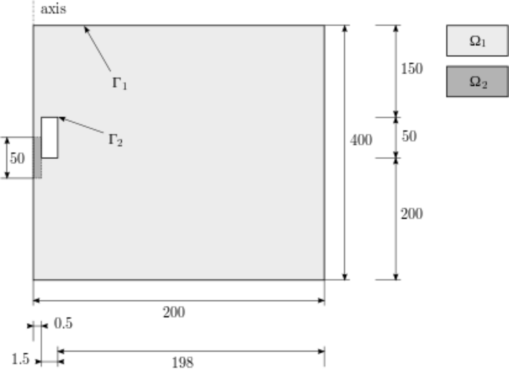
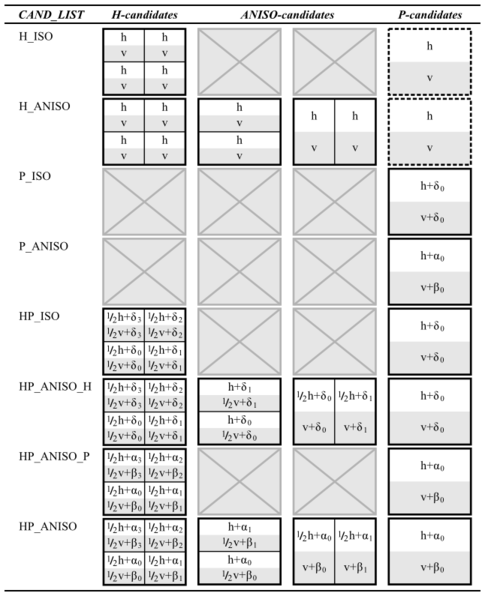
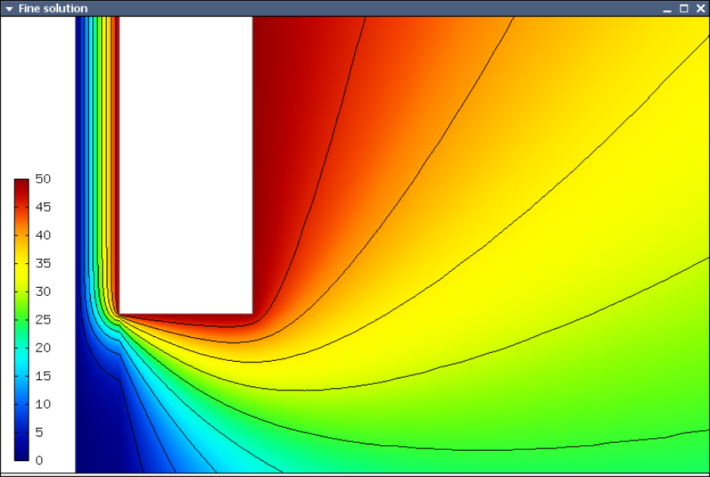
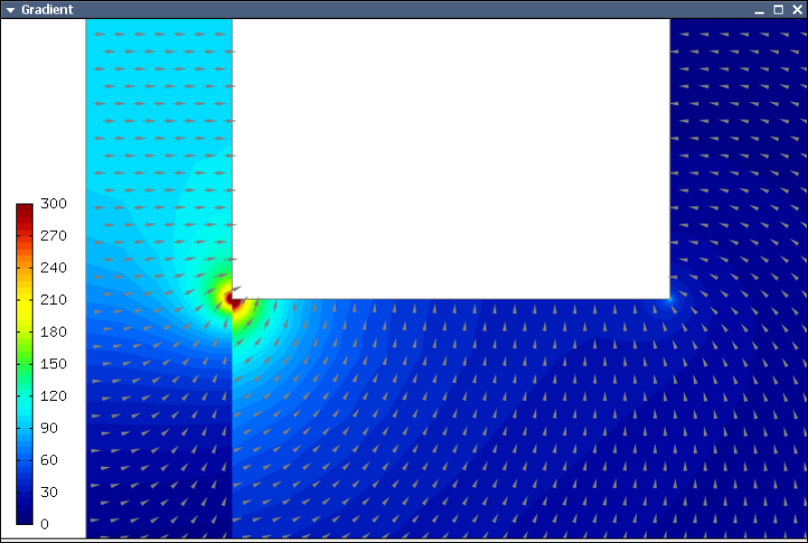
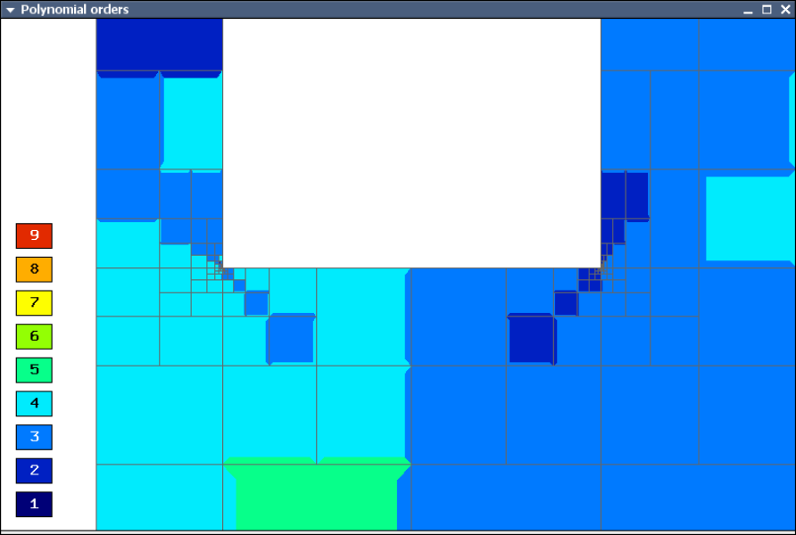
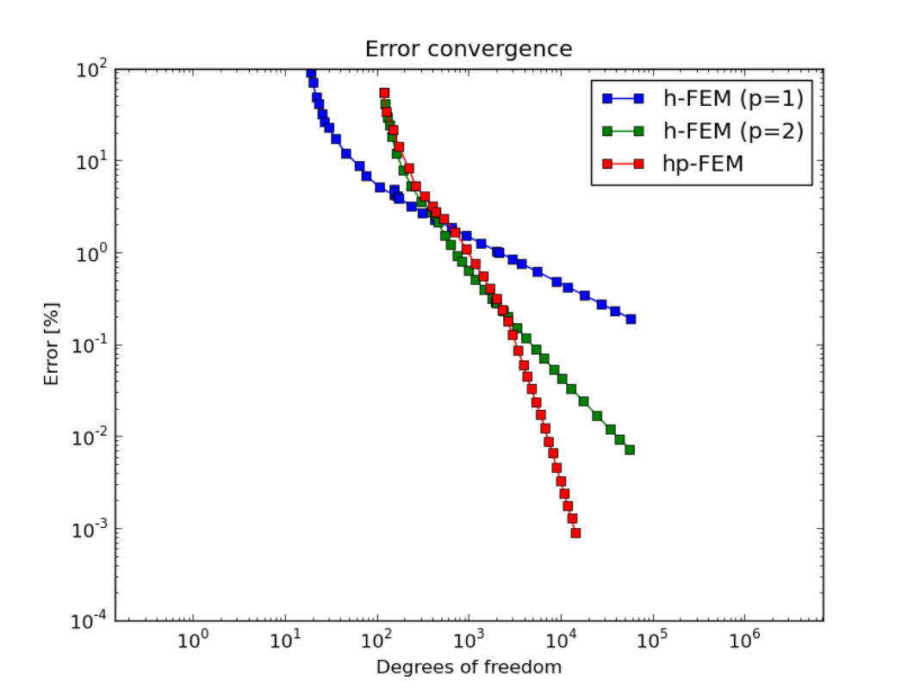
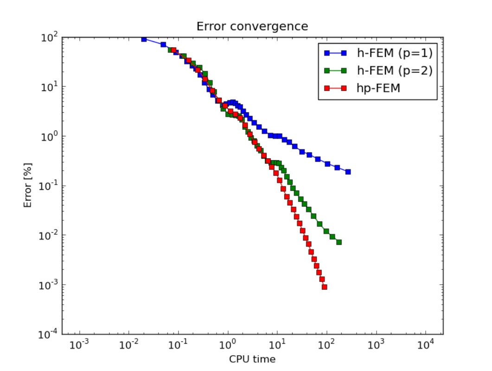

An Introductory Example (01-intro)
----------------------------------

**Git reference:** Tutorial example `01-intro <http://git.hpfem.org/hermes.git/tree/HEAD:/hermes2d/tutorial/P04-adaptivity/01-intro>`_. 

Model problem
~~~~~~~~~~~~~

Let us demonstrate the use of adaptive h-FEM and hp-FEM on a linear elliptic problem
describing an electrostatic micromotor. This is a MEMS device free of any coils, and 
thus (as opposed to classical electromotors) resistive to strong electromagnetic waves.

The following figure shows a symmetric half of the domain $\Omega$
(dimensions need to be scaled with $10^{-5}$ and they are in meters):

The subdomain $\Omega_2$ represents the moving part of the domain and the area bounded by $\Gamma_2$
represents the electrodes that are fixed. The distribution of the electrostatic potential $\varphi$ is governed by the equation

.. math::

    -\nabla\cdot\left(\epsilon_r\nabla\varphi\right) = 0,

equipped with the Dirichlet boundary conditions

.. math::

    \varphi = 0 V \ \ \ \ \ \mbox{on}\ \Gamma_1,

.. math::

    \varphi = 50 V \ \ \ \ \mbox{on}\ \Gamma_2.

The relative permittivity $\epsilon_r$ is piecewise-constant, $\epsilon_r = 1$ in $\Omega_1$ and
$\epsilon_r = 10$ in $\Omega_2$. 

Weak formulation
~~~~~~~~~~~~~~~~

The weak forms are custom because of two materials are involved:

.. sourcecode::
    .

    class CustomWeakFormPoisson : public WeakForm
    {
    public:
      CustomWeakFormPoisson(std::string mat_motor, double eps_motor, 
			    std::string mat_air, double eps_air) : WeakForm(1)
      {
	// Jacobian.
	add_matrix_form(new WeakFormsH1::DefaultJacobianDiffusion(0, 0, mat_motor, new HermesFunction(eps_motor)));
	add_matrix_form(new WeakFormsH1::DefaultJacobianDiffusion(0, 0, mat_air, new HermesFunction(eps_air)));

	// Residual.
	add_vector_form(new WeakFormsH1::DefaultResidualDiffusion(0, mat_motor, new HermesFunction(eps_motor)));
	add_vector_form(new WeakFormsH1::DefaultResidualDiffusion(0, mat_air, new HermesFunction(eps_air)));
      };
    };

.. latexcode::
    .

    class CustomWeakFormPoisson : public WeakForm
    {
    public:
      CustomWeakFormPoisson(std::string mat_motor, double eps_motor, 
			    std::string mat_air, double eps_air) : WeakForm(1)
      {
	// Jacobian.
	add_matrix_form(new WeakFormsH1::DefaultJacobianDiffusion(0, 0, mat_motor,
                        new HermesFunction(eps_motor)));
	add_matrix_form(new WeakFormsH1::DefaultJacobianDiffusion(0, 0, mat_air, new 
                        HermesFunction(eps_air)));

	// Residual.
	add_vector_form(new WeakFormsH1::DefaultResidualDiffusion(0, mat_motor, 
                        new HermesFunction(eps_motor)));
	add_vector_form(new WeakFormsH1::DefaultResidualDiffusion(0, mat_air, new
                        HermesFunction(eps_air)));
      };
    };

Refinement selector
~~~~~~~~~~~~~~~~~~~

Before the adaptivity loop starts, a refinement selector is initialized::

    H1ProjBasedSelector selector(CAND_LIST, CONV_EXP, H2DRS_DEFAULT_ORDER);

The selector is used by the class Adapt to determine how an element should be refined. 
For that purpose, the selector does the following:

#. It generates candidates (proposed element refinements).
#. It estimates their local errors by projecting the reference solution onto their FE spaces.
#. It calculates the number of degree of freedom (DOF) contributed by each candidate.
#. It calculates a score for each candidate, and sorts them according to their scores.
#. It selects a candidate with the highest score. If the next candidate has almost the same score and symmetric mesh is 
   preferred, it skips both of them. More detailed explanation of this will follow.

Score of refinement candidates
~~~~~~~~~~~~~~~~~~~~~~~~~~~~~~

By default, the score is

.. math::

    s = \frac{\log_{10} e_0 - \log_{10} e}{(d_0 - d)^\xi},

where $e$ and $d$ are an estimated error and an estimated number of DOF of a candidate respectively, $e_0$ and $d_0$ are an estimated error and an estimated number of DOF of the examined element respectively, and $\xi$ is a convergence exponent.

The first parameter ``CAND_LIST`` specifies which candidates are generated. In a case of quadrilaterals, all possible values and considered candidates are summarized in the following table:

The second parameter ``CONV_EXP`` is a convergence exponent used to calculate the score.

The third parameter specifies the the maximum considered order used in the resulting refinement. In this case, a constant ``H2DRS_DEFAULT_ORDER`` is used. The constant is defined by Hermes2D library and it corresponds to the maximum order supported by the selector. In this case it is 9.

Weighting refinement candidates
~~~~~~~~~~~~~~~~~~~~~~~~~~~~~~~

Furthermore, the selector allows you to weight errors though a method set_error_weights(). Error weights are applied before the error of a candidate is passed to the calculation of the score. Through this method it is possible to set a preference for a given type of a candidate, i.e., H-candidate, P-candidate, and ANISO-candidate. The error weights can be set anytime and setting error weights to appropriate values can lead to a lower number of DOF. However, the best values of weights depend on a solved problem.

In this particular case, a default error weights are used. The default weights prefer the P-candidate and they are defined as:

- H-candidate weight: $2.0$ (see a constant ``H2DRS_DEFAULT_ERR_WEIGHT_H``)
- P-candidate weight: $1.0$ (see a constant ``H2DRS_DEFAULT_ERR_WEIGHT_P``)
- ANISO-candidate weight: $\sqrt{2.0}$ (see a constant ``H2DRS_DEFAULT_ERR_WEIGHT_ANISO``)

Since these weights are default, it is not necessary to express them explicitly. 
Nevertheless, if expressed, a particular line of the code would be::

    selector.set_error_weights(2.0, 1.0, sqrt(2.0));

Modifying default behavior
~~~~~~~~~~~~~~~~~~~~~~~~~~

Besides the error weights, the selector allows you to modify a default behaviour through the method set_option(). The behavior can be modified anytime. Currently, the method accepts following options:

- ``H2D_PREFER_SYMMETRIC_MESH``: Prefer symmetric mesh when selection of the best candidate is done. If set and if two or more candidates has the same score, they are skipped. This option is set by default.
- ``H2D_APPLY_CONV_EXP_DOF``: Use $d^c - d_0^c$, where $c$ is the convergence exponent, instead of $(d - d_0)^c$ to evaluate the score. This options is *not* set by default.

In this case, default settings are used. If expressed explicitly, the code would be:
::

    selector.set_option(H2D_PREFER_SYMMETRIC_MESH, true);
    selector.set_option(H2D_APPLY_CONV_EXP_DOF, false);

Plotting convergence graphs
~~~~~~~~~~~~~~~~~~~~~~~~~~~

In order to plot convergence graphs, one can use the SimpleGraph class::

    // DOF and CPU convergence graphs.
    SimpleGraph graph_dof_est, graph_cpu_est;

This class will save convergence data as two numbers per line: either 
the number of DOF and error, or CPU time and error. A more advanced 
GnuplotGraph class is also available, see the file `graph.h 
<http://git.hpfem.org/hermes.git/blob/HEAD:/hermes2d/src/graph.h>`_ for more details. 

Adaptivity loop
~~~~~~~~~~~~~~~

The adaptivity algorithm in Hermes calculates an approximation on fine mesh and uses
orthogonal projection to a coarse submesh to extract low-order part of the solution.
This gives two approximations with different orders of accuracy whose difference 
is used as an a-posteriori error estimate (error function). The error function  
is used to decide which elements need to be refined as well as to select optimal 
hp-refinement for each element. Hence the adaptivity loop begins with refining 
the mesh globally::

    // Construct globally refined reference mesh and setup reference space.
    Space* ref_space = Space::construct_refined_space(&space);

Next we initialize a matrix solver

::

    // Initialize matrix solver.
    SparseMatrix* matrix = create_matrix(matrix_solver);
    Vector* rhs = create_vector(matrix_solver);
    Solver* solver = create_linear_solver(matrix_solver, matrix, rhs);

and the discrete problem on the refined mesh

::    

    DiscreteProblem dp(&wf, ref_space);

The Newton's method is used to solve the fine mesh problem:

.. sourcecode::
    .

    // Perform Newton's iteration.
    if (!hermes2d.solve_newton(coeff_vec, &dp, solver, matrix, rhs)) error("Newton's iteration failed.");

.. latexcode::
    .

    // Perform Newton's iteration.
    if (!hermes2d.solve_newton(coeff_vec, &dp, solver, matrix, rhs))
        error("Newton's iteration failed.");

The coefficient vector is translated into a Solution::

    // Translate the resulting coefficient vector into the Solution sln.
    Solution::vector_to_solution(coeff_vec, ref_space, &ref_sln);

The Solution is projected on the coarse submesh to extract low-order 
part for error calculation::

    // Project the fine mesh solution onto the coarse mesh.
    info("Projecting reference solution on coarse mesh.");
    OGProjection::project_global(&space, &ref_sln, &sln, matrix_solver);

The function project_global() is very general, and it can accept multiple 
spaces, multiple functions, and various projection norms as parameters. For more details,
see the file `ogprojection.h <http://git.hpfem.org/hermes.git/blob/HEAD:/hermes2d/src/ogprojection.h>`_.

Calculating error estimate
~~~~~~~~~~~~~~~~~~~~~~~~~~

The coarse and reference mesh approximations are inserted into the class Adapt
and a global error estimate as well as element error estimates are calculated:

.. sourcecode::
    .

    // Calculate element errors and total error estimate.
    info("Calculating error estimate.");
    Adapt* adaptivity = new Adapt(&space);
    bool solutions_for_adapt = true;
    // In the following function, the Boolean parameter "solutions_for_adapt" determines whether
    // the calculated errors are intended for use with adaptivity (this may not be the case, for example,
    // when error wrt. an exact solution is calculated). The default value is solutions_for_adapt = true,
    // The last parameter "error_flags" determine whether the total and element errors are treated as
    // absolute or relative. Its default value is error_flags = HERMES_TOTAL_ERROR_REL | HERMES_ELEMENT_ERROR_REL.
    // In subsequent examples and benchmarks, these two parameters will be often used with
    // their default values, and thus they will not be present in the code explicitly.
    double err_est_rel = adaptivity->calc_err_est(&sln, &ref_sln, solutions_for_adapt,
                         HERMES_TOTAL_ERROR_REL | HERMES_ELEMENT_ERROR_REL) * 100;

.. latexcode::
    .

    // Calculate element errors and total error estimate.
    info("Calculating error estimate.");
    Adapt* adaptivity = new Adapt(&space);
    bool solutions_for_adapt = true;
    // In the following function, the Boolean parameter "solutions_for_adapt" determines
    // whether the calculated errors are intended for use with adaptivity (this may not
    // be the case, for example, when error wrt. an exact solution is calculated). The
    // default value is solutions_for_adapt = true, The last parameter "error_flags"
    // determine whether the total and element errors are treated as absolute or relative.
    // Its default value is error_flags = HERMES_TOTAL_ERROR_REL | HERMES_ELEMENT_ERROR_REL.
    // In subsequent examples and benchmarks, these two parameters will be often used with
    // their default values, and thus they will not be present in the code explicitly.
    double err_est_rel = adaptivity->calc_err_est(&sln, &ref_sln, solutions_for_adapt,
                         HERMES_TOTAL_ERROR_REL | HERMES_ELEMENT_ERROR_REL) * 100;

Here, solutions_for_adapt=true means that this solution pair will be used to calculate 
element errors to guide adaptivity. With solutions_for_adapt=false, just the total error 
would be calculated (not the element errors). 

When working with another space than $H^1$, the HERMES_H1_NORM can be replaced with 
HERMES_HCURL_NORM, HERMES_HDIV_NORM, or HERMES_L2_NORM. For equation systems, 
a Hermes::vector<int> with multiple norms can be used.  

The error estimate is calculated as

.. math::

    e = \frac{|| u - u_{ref} ||_{H^1}}{|| u_{ref} ||_{H^1}}.

Adapting the mesh
~~~~~~~~~~~~~~~~~

Finally, if ``err_est_rel`` is still above the threshold ``ERR_STOP``, we perform
mesh adaptation::

    // If err_est too large, adapt the mesh.
    if (err_est_rel < ERR_STOP) done = true;
    else
    {
      info("Adapting coarse mesh.");
      done = adaptivity->adapt(&selector, THRESHOLD, STRATEGY, MESH_REGULARITY);

      // Increase the counter of performed adaptivity steps.
      if (done == false)  as++;
    }
    if (Space::get_num_dofs(&space) >= NDOF_STOP) done = true;

The constants ``THRESHOLD``, ``STRATEGY`` and ``MESH_REGULARITY`` have the following meaning:

Adaptive strategies
~~~~~~~~~~~~~~~~~~~

The constant ``STRATEGY`` indicates which adaptive strategy is used. In all cases, the strategy is applied to elements in an order defined through the error. If the user request to process an element outside this order, the element is processed regardless the strategy. Currently, Hermes2D supportes following strategies:

* ``STRATEGY == 0``: Refine elements until sqrt(``THRESHOLD``) times total error is processed. If more elements have similar error refine all to keep the mesh symmetric.
* ``STRATEGY == 1``: Refine all elements whose error is bigger than ``THRESHOLD`` times the error of the first processed element, i.e., the maximum error of an element.
* ``STRATEGY == 2``: Refine all elements whose error is bigger than ``THRESHOLD``.

Mesh regularity
~~~~~~~~~~~~~~~

The constant ``MESH_REGULARITY``
specifies maximum allowed level of hanging nodes: -1 means arbitrary-level
hanging nodes (default), and 1, 2, 3, ... means 1-irregular mesh,
2-irregular mesh, etc. Hermes does not support adaptivity on regular meshes
because of its extremely poor performance.

It is a good idea to spend some time playing with these parameters to
get a feeling for adaptive *hp*-FEM. Also look at other adaptivity examples in
the examples/ directory: layer, lshape deal with elliptic problems and have
known exact solutions. So do examples screen, bessel for time-harmonic
Maxwell's equations. These examples allow you to compare the error estimates
computed by Hermes with the true error. Examples crack, singpert show
how to handle cracks and singularly perturbed problems, respectively. There
are also more advanced examples illustrating automatic adaptivity for nonlinear
problems solved via the Newton's method, adaptive multimesh *hp*-FEM,
adaptivity for time-dependent problems on dynamical meshes, etc.

Sample results
~~~~~~~~~~~~~~

The computation
starts with a very coarse mesh consisting of a few quadrilaterals, some
of which are moreover very ill-shaped. Thanks to the anisotropic refinement
capabilities of the selector, the mesh quickly adapts to the solution
and elements of reasonable shape are created near singularities, which occur
at the corners of the electrode. Initially, all elements of the mesh
are of a low degree, but as the *hp*-adaptive process progresses, the elements
receive different polynomial degrees, depending on the local smoothness of the
solution.

The gradient was visualized using the class VectorView. We have
seen this in the previous section. We plug in the same solution for both vector
components, but specify that its derivatives should be used::

    gview.show(&sln, &sln, H2D_EPS_NORMAL, H2D_FN_DX_0, H2D_FN_DY_0);

.. raw:: html

   

Convergence graphs of adaptive h-FEM with linear elements, h-FEM with quadratic elements
and hp-FEM are shown below.

The following graph shows convergence in terms of CPU time. 

