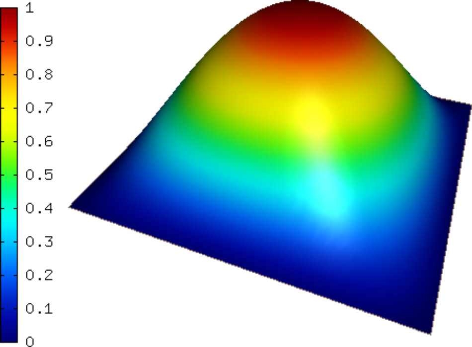
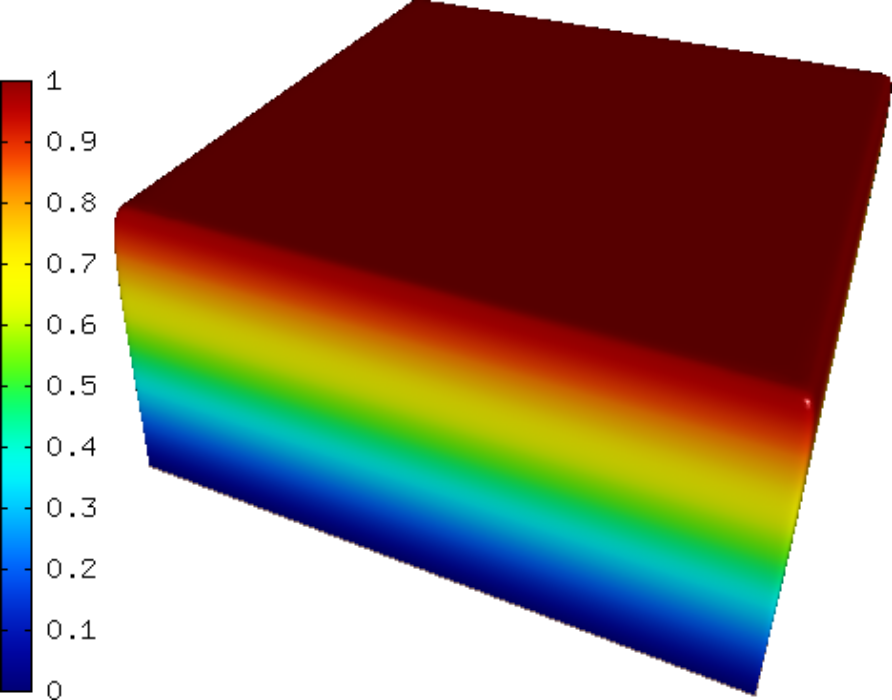
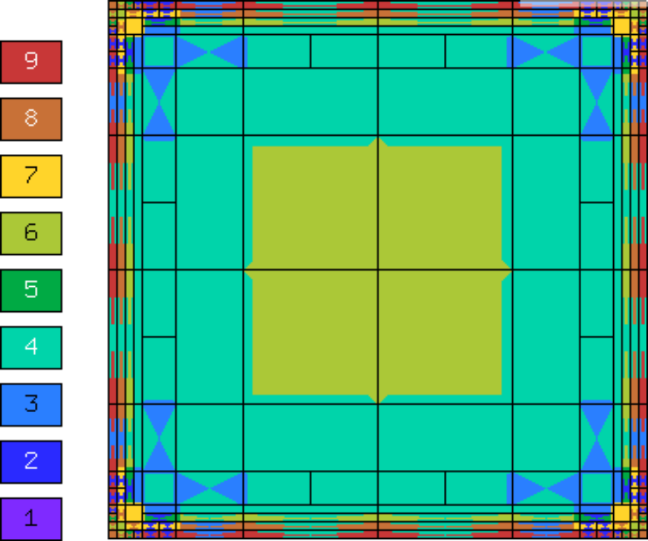
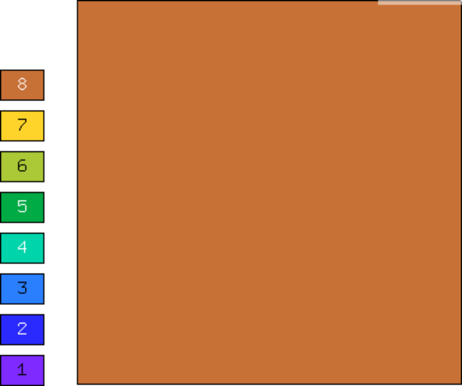
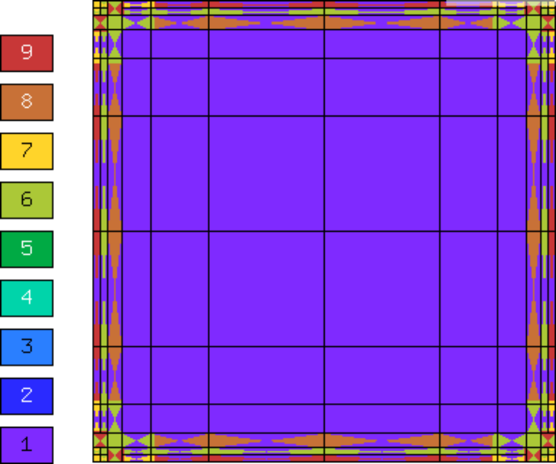
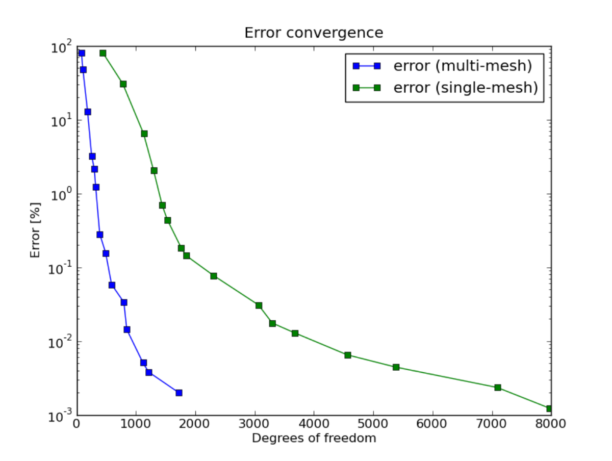
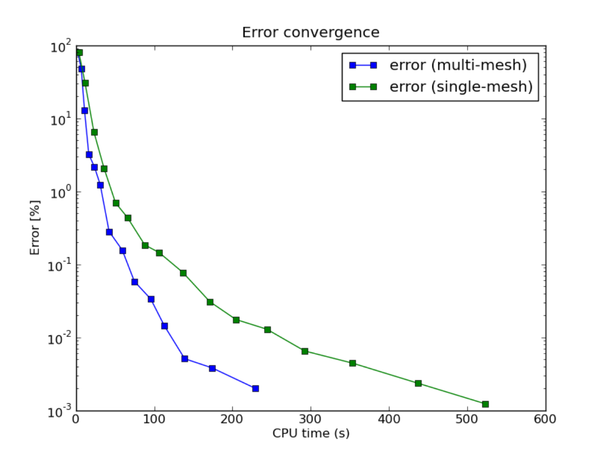

Adaptive Multimesh hp-FEM Example (02-system)
---------------------------------------------

**Git reference:** Tutorial example `02-system <http://git.hpfem.org/hermes.git/tree/HEAD:/hermes2d/tutorial/P04-adaptivity/02-system>`_. 

Model problem
~~~~~~~~~~~~~

We consider a simplified version of the Fitzhugh-Nagumo equation.
This equation is a prominent example of activator-inhibitor systems in two-component reaction-diffusion 
equations, It describes a prototype of an excitable system (e.g., a neuron) and its stationary form 
is

.. math::

    -d^2_u \Delta u - f(u) + \sigma v - g_1 = 0,\\
    -d^2_v \Delta v - u + v - g_2 = 0.

Here the unknowns $u, v$ are the voltage and $v$-gate, respectively.
The nonlinear function 

.. math::

    f(u) = \lambda u - u^3 - \kappa
 
describes how an action potential travels through a nerve. Obviously this system is nonlinear.

Exact solution
~~~~~~~~~~~~~~

In order to make it simpler for this tutorial, we replace the function $f(u)$ with just $u$:

.. math::

    f(u) = u.

Our computational domain is the square $(-1,1)^2$ and we consider zero Dirichlet conditions 
for both $u$ and $v$. In order to enable fair convergence comparisons, we will use the following 
functions as the exact solution:

.. math::

    u(x,y) = \cos\left(\frac{\pi}{2}x\right) \cos\left(\frac{\pi}{2}y\right),\\
    v(x,y) = \hat u(x) \hat u(y)

where

.. math::

    \hat u(x) = 1 - \frac{e^{kx} + e^{-kx}}{e^k + e^{-k}}

is the exact solution of the one-dimensional singularly perturbed 
problem 

.. math::

    -u'' + k^2 u - k^2 = 0

in $(-1,1)$, equipped with zero Dirichlet boundary conditions. 

The following two figures show the solutions $u$ and $v$. Notice their 
large qualitative differences: While $u$ is smooth in the entire domain, 
$v$ has a thin boundary layer along the boundary:

Manufactured right-hand side
~~~~~~~~~~~~~~~~~~~~~~~~~~~~

The source functions $g_1$ and $g_2$ are obtained by inserting $u$ and $v$ 
into the PDE system. These functions are not extremely pretty, but they 
are not too bad either::

    class CustomExactFunction1
    {
    public:
      CustomExactFunction1() 
      { 
      };

      double val(double x) 
      {
	return cos(M_PI*x/2);
      }
      
      double dx(double x) 
      {
	return -sin(M_PI*x/2)*(M_PI/2.);
      }
      
      double ddxx(double x) 
      {
	return -cos(M_PI*x/2)*(M_PI/2.)*(M_PI/2.);
      }
    };

    class CustomExactFunction2
    {
    public:
      CustomExactFunction2(double K) : K(K) 
      {
      };

      double val(double x) 
      {
	return 1. - (exp(K*x) + exp(-K*x))/(exp(K) + exp(-K));
      }
      
      double dx(double x) 
      {
	return -K*(exp(K*x) - exp(-K*x))/(exp(K) + exp(-K));
      }
      
      double ddxx(double x) 
      {
	return -K*K*(exp(K*x) + exp(-K*x))/(exp(K) + exp(-K));
      }

      double K;
    };

The weak forms can be found in the 
file `definitions.cpp <http://git.hpfem.org/hermes.git/blob/HEAD:/hermes2d/tutorial/P04-adaptivity/02-system/definitions.cpp>`_ and they are registered as follows::

Weak forms
~~~~~~~~~~

Weak formulation comprises default and custom forms:

.. sourcecode::
    .

    class CustomWeakForm : public WeakForm
    {
    public:
      CustomWeakForm(CustomRightHandSide1* g1, CustomRightHandSide2* g2) : WeakForm(2) 
      {
	// Jacobian.
	add_matrix_form(new WeakFormsH1::DefaultJacobianDiffusion(0, 0, HERMES_ANY, new HermesFunction(D_u * D_u)));
	add_matrix_form(new WeakFormsH1::DefaultMatrixFormVol(0, 0, HERMES_ANY, new HermesFunction(-1.0)));
	add_matrix_form(new WeakFormsH1::DefaultMatrixFormVol(0, 1, HERMES_ANY, new HermesFunction(g1->sigma), HERMES_NONSYM));
	add_matrix_form(new WeakFormsH1::DefaultMatrixFormVol(1, 0, HERMES_ANY, new HermesFunction(-1.0), HERMES_NONSYM));
	add_matrix_form(new WeakFormsH1::DefaultJacobianDiffusion(1, 1, HERMES_ANY, new HermesFunction(D_v * D_v)));
	add_matrix_form(new WeakFormsH1::DefaultMatrixFormVol(1, 1, HERMES_ANY, new HermesFunction(1.0)));

	// Residual.
	add_vector_form(new CustomResidual1(D_u, g1->sigma, g1));
	add_vector_form(new CustomResidual2(D_v, g2));
      }
    };

.. latexcode::
    .

    class CustomWeakForm : public WeakForm
    {
    public:
      CustomWeakForm(CustomRightHandSide1* g1, CustomRightHandSide2* g2)
                     : WeakForm(2) 
      {
	// Jacobian.
	add_matrix_form(new WeakFormsH1::DefaultJacobianDiffusion(0, 0, HERMES_ANY,
                        new HermesFunction(D_u * D_u)));
	add_matrix_form(new WeakFormsH1::DefaultMatrixFormVol(0, 0, HERMES_ANY, new 
                        HermesFunction(-1.0)));
	add_matrix_form(new WeakFormsH1::DefaultMatrixFormVol(0, 1, HERMES_ANY, new
                        HermesFunction(g1->sigma), HERMES_NONSYM));
	add_matrix_form(new WeakFormsH1::DefaultMatrixFormVol(1, 0, HERMES_ANY, new
                        HermesFunction(-1.0), HERMES_NONSYM));
	add_matrix_form(new WeakFormsH1::DefaultJacobianDiffusion(1, 1, HERMES_ANY,
                        new HermesFunction(D_v * D_v)));
	add_matrix_form(new WeakFormsH1::DefaultMatrixFormVol(1, 1, HERMES_ANY, new
                        HermesFunction(1.0)));

	// Residual.
	add_vector_form(new CustomResidual1(D_u, g1->sigma, g1));
	add_vector_form(new CustomResidual2(D_v, g2));
      }
    };

Beware that although each of the forms is actually symmetric, one cannot use the 
HERMES_SYM flag as in the elasticity equations, since it has a slightly different 
meaning (see example `P01-linear/08-system <http://hpfem.org/hermes/doc/src/hermes2d/P01-linear/08-system.html>`_).

Adaptivity loop
~~~~~~~~~~~~~~~

The adaptivity workflow is standard, first we construct the reference spaces::

    // Construct globally refined reference mesh and setup reference space.
    Hermes::vector<Space *>* ref_spaces = 
      Space::construct_refined_spaces(Hermes::vector<Space *>(&u_space, &v_space));

Then we initialize matrix solver::

    // Initialize matrix solver.
    SparseMatrix* matrix = create_matrix(matrix_solver);
    Vector* rhs = create_vector(matrix_solver);
    Solver* solver = create_linear_solver(matrix_solver, matrix, rhs);

Solve the discrete problem using the Newton's method::

    // Perform Newton's iteration.
    bool jacobian_changed = true;
    bool verbose = true;
    if (!hermes2d.solve_newton(coeff_vec, &dp, solver, matrix, rhs, jacobian_changed, 
                               1e-8, 100, verbose)) error("Newton's iteration failed.");

Translate the coefficient vector into the two Solutions:

.. sourcecode::
    .

    // Translate the resulting coefficient vector into Solutions.
    Solution::vector_to_solutions(coeff_vec, *ref_spaces, Hermes::vector<Solution *>(&u_ref_sln, &v_ref_sln));

.. latexcode::
    .

    // Translate the resulting coefficient vector into Solutions.
    Solution::vector_to_solutions(coeff_vec, *ref_spaces, Hermes::vector<Solution *>
                                  (&u_ref_sln, &v_ref_sln));

Project reference solutions to the coarse meshes::

    // Project the fine mesh solution onto the coarse mesh.
    info("Projecting reference solution on coarse mesh.");
    OGProjection::project_global(Hermes::vector<Space *>(&u_space, &v_space), 
                                 Hermes::vector<Solution *>(&u_ref_sln, &v_ref_sln), 
                                 Hermes::vector<Solution *>(&u_sln, &v_sln), 
                                                            matrix_solver); 

Calculate error estimates:

.. sourcecode::
    .

    // Calculate error estimate for each solution component and the total error estimate.
    Hermes::vector<double> err_est_rel;
    double err_est_rel_total = adaptivity->calc_err_est(Hermes::vector<Solution *>(&u_sln, &v_sln), 
                               Hermes::vector<Solution *>(&u_ref_sln, &v_ref_sln), 
                               &err_est_rel) * 100;

.. latexcode::
    .

    // Calculate error estimate for each solution component and the total error estimate.
    Hermes::vector<double> err_est_rel;
    double err_est_rel_total = adaptivity->calc_err_est(Hermes::vector<Solution *>
                               (&u_sln, &v_sln), Hermes::vector<Solution *>
                               (&u_ref_sln, &v_ref_sln), &err_est_rel) * 100;

Calculate exact errors (optional):

.. sourcecode::
    .

    // Calculate exact error for each solution component and the total exact error.
    Hermes::vector<double> err_exact_rel;
    bool solutions_for_adapt = false;
    double err_exact_rel_total = adaptivity->calc_err_exact(Hermes::vector<Solution *>(&u_sln, &v_sln), 
                                                            Hermes::vector<Solution *>(&exact_u, &exact_v), 
                                                            &err_exact_rel, solutions_for_adapt) * 100;

.. latexcode::
    .

    // Calculate exact error for each solution component and the total exact error.
    Hermes::vector<double> err_exact_rel;
    bool solutions_for_adapt = false;
    double err_exact_rel_total = adaptivity->calc_err_exact(Hermes::vector<Solution *>
                                 (&u_sln, &v_sln), Hermes::vector<Solution *>
                                 (&exact_u, &exact_v), &err_exact_rel,
                                  solutions_for_adapt) * 100;

Adapt the coarse meshes:

.. sourcecode::
    .

    // If err_est too large, adapt the mesh.
    if (err_est_rel_total < ERR_STOP) 
      done = true;
    else 
    {
      info("Adapting coarse mesh.");
      done = adaptivity->adapt(Hermes::vector<RefinementSelectors::Selector *>(&selector, &selector), 
                               THRESHOLD, STRATEGY, MESH_REGULARITY);
    }
    if (Space::get_num_dofs(Hermes::vector<Space *>(&u_space, &v_space)) >= NDOF_STOP) done = true;

.. latexcode::
    .

    // If err_est too large, adapt the mesh.
    if (err_est_rel_total < ERR_STOP) 
      done = true;
    else 
    {
      info("Adapting coarse mesh.");
      done = adaptivity->adapt(Hermes::vector<RefinementSelectors::Selector *>
                               (&selector, &selector), THRESHOLD, STRATEGY,
                               MESH_REGULARITY);
    }
    if (Space::get_num_dofs(Hermes::vector<Space *>(&u_space, &v_space)) >= NDOF_STOP)
        done = true;

Clean up::

    // Clean up.
    delete solver;
    delete matrix;
    delete rhs;
    delete adaptivity;
    for(int i = 0; i < ref_spaces->size(); i++)
      delete (*ref_spaces)[i]->get_mesh();
    delete ref_spaces;
    delete dp;
    
    // Increase counter.
    as++;

Sample results
~~~~~~~~~~~~~~

Now we can show some numerical results. 
First let us show the resulting meshes for $u$ and $v$ obtained using 
conventional (single-mesh) hp-FEM: **9,330 DOF** (4665 for each solution component). 

.. raw:: html

   

Next we show the resulting meshes for $u$ and $v$ obtained using 
the multimesh hp-FEM: **1,723 DOF** (49 DOF for $u$ and $1,673$ for $v$). 

.. raw:: html

   

Finally let us compare the DOF and CPU convergence graphs 
for both cases:

DOF convergence graphs:

CPU time convergence graphs:

