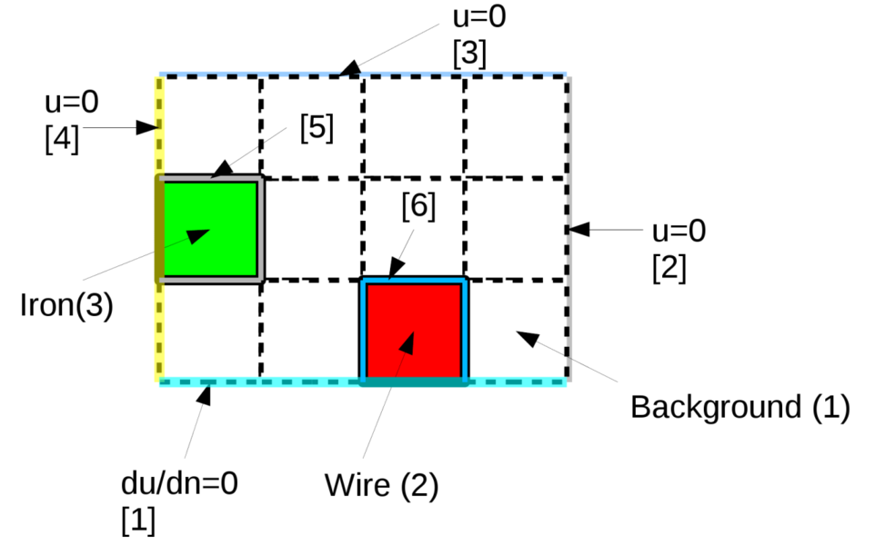
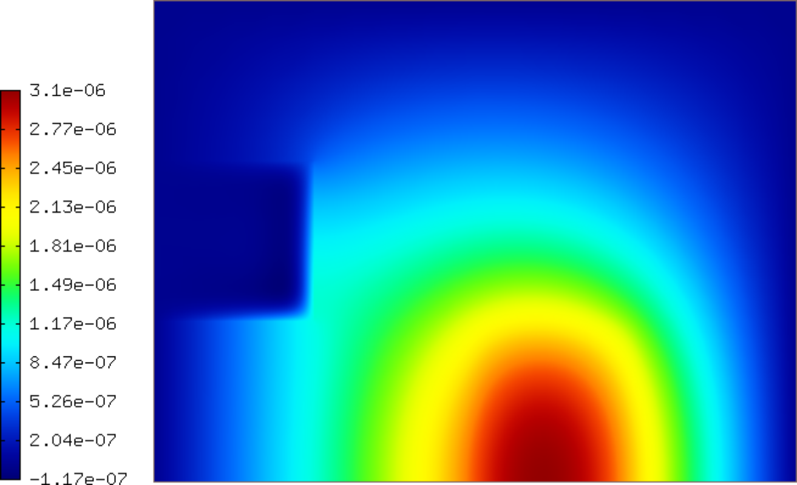
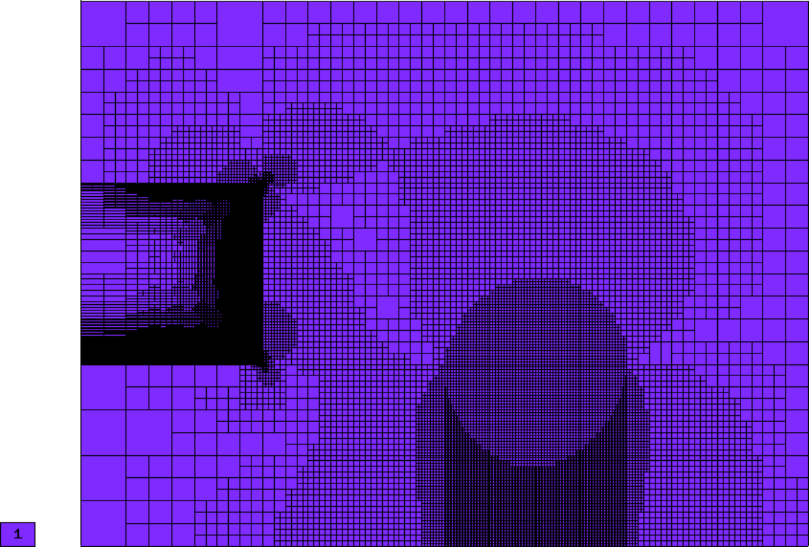
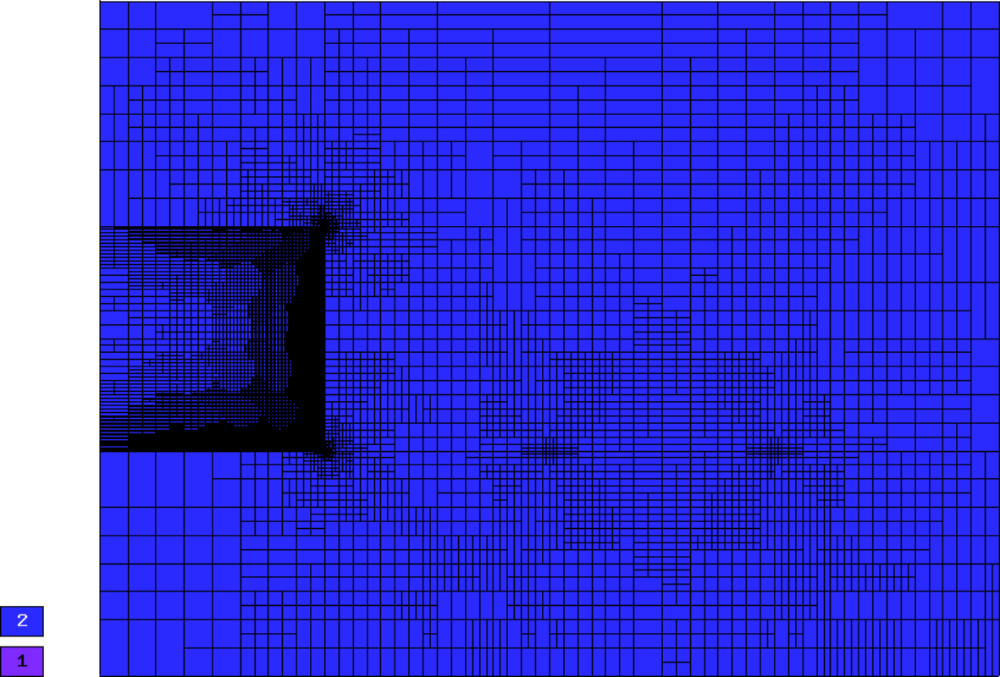
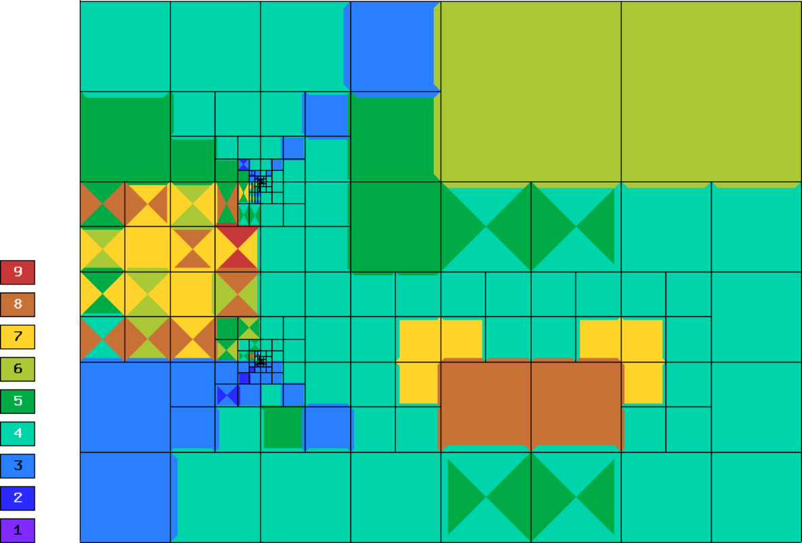
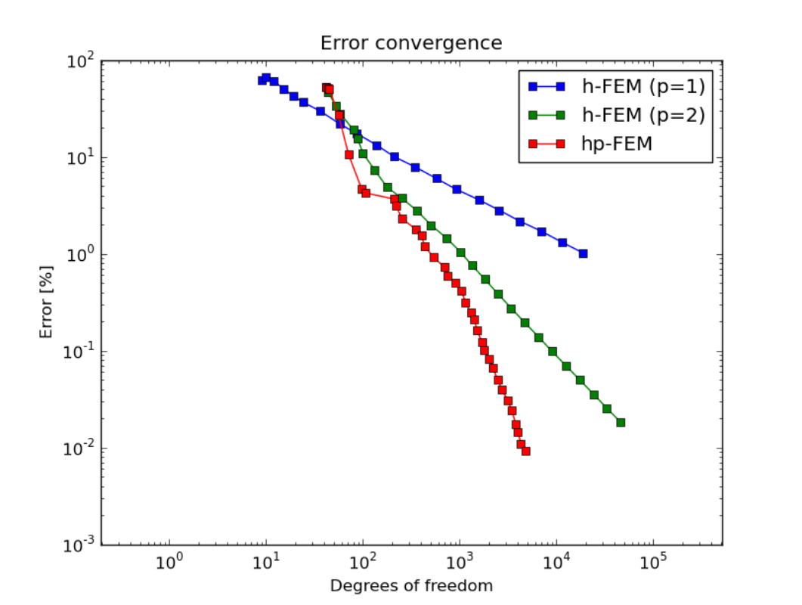

Complex-Valued Problem (03-complex)
-----------------------------------

**Git reference:** Tutorial example `03-complex <http://git.hpfem.org/hermes.git/tree/HEAD:/hermes2d/tutorial/P04-adaptivity/03-complex>`_. 

For this example we use the matrix solver AztecOO from the Trilinos package (other
solvers including UMFPACK are usable as well). If you want to use AztecOO, 
you need to have `Trilinos installed <http://hpfem.org/hermes/doc/src/installation/matrix_solvers.html>`_ on your system
and enabled in your CMake.vars file::

    set(WITH_TRILINOS YES)
    set(TRILINOS_ROOT /opt/packages/trilinos)

Model problem
~~~~~~~~~~~~~

This example solves a complex-valued vector potential problem

.. math::

    -\Delta A + j \omega \gamma \mu A - \mu J_{ext} = 0

in a two-dimensional cross-section containing a conductor and an iron object.
Note: in 2D this is a scalar problem. A sketch of the computational domain 
is shown in the following picture:

The computational domain is a rectangle of height 0.003 and width 0.004. 
Different material markers are used for the wire, air, and iron 
(see mesh file `domain.mesh 
<http://git.hpfem.org/hermes.git/blob/HEAD:/hermes2d/tutorial/P04-adaptivity/03-complex/domain.mesh>`_).

Boundary conditions are zero Dirichlet on the top and right edges, and zero Neumann
elsewhere.

Complex-valued weak forms
~~~~~~~~~~~~~~~~~~~~~~~~~

The weak formulation consists entirely of default forms:

.. sourcecode::
    .

    class CustomWeakForm : public WeakForm
    { 
    public:
      CustomWeakForm(std::string mat_air,  double mu_air,
		     std::string mat_iron, double mu_iron, double gamma_iron,
		     std::string mat_wire, double mu_wire, scalar j_ext, double omega)
      : WeakForm(1) 
      {
	scalar ii =  cplx(0.0, 1.0);

	// Jacobian.
	add_matrix_form(new WeakFormsH1::DefaultJacobianDiffusion(0, 0, mat_air,  new HermesFunction(1.0/mu_air)));
	add_matrix_form(new WeakFormsH1::DefaultJacobianDiffusion(0, 0, mat_iron, new HermesFunction(1.0/mu_iron)));
	add_matrix_form(new WeakFormsH1::DefaultJacobianDiffusion(0, 0, mat_wire, new HermesFunction(1.0/mu_wire)));
	add_matrix_form(new WeakFormsH1::DefaultMatrixFormVol(0, 0, mat_iron, new HermesFunction(ii * omega * gamma_iron)));

	// Residual.
	add_vector_form(new WeakFormsH1::DefaultResidualDiffusion(0, mat_air, new HermesFunction(1.0/mu_air)));
	add_vector_form(new WeakFormsH1::DefaultResidualDiffusion(0, mat_iron, new HermesFunction(1.0/mu_iron)));
	add_vector_form(new WeakFormsH1::DefaultResidualDiffusion(0, mat_wire, new HermesFunction(1.0/mu_wire)));
	add_vector_form(new WeakFormsH1::DefaultVectorFormVol(0, mat_wire, new HermesFunction(-j_ext)));
	add_vector_form(new WeakFormsH1::DefaultResidualVol(0, mat_iron, new HermesFunction(ii * omega * gamma_iron)));
      };
    };

.. latexcode::
    .

    class CustomWeakForm : public WeakForm
    { 
    public:
      CustomWeakForm(std::string mat_air,  double mu_air,
		     std::string mat_iron, double mu_iron, double gamma_iron,
		     std::string mat_wire, double mu_wire, scalar j_ext, double omega)
      : WeakForm(1) 
      {
	scalar ii =  cplx(0.0, 1.0);

	// Jacobian.
	add_matrix_form(new WeakFormsH1::DefaultJacobianDiffusion(0, 0, mat_air,  new 
                        HermesFunction(1.0/mu_air)));
	add_matrix_form(new WeakFormsH1::DefaultJacobianDiffusion(0, 0, mat_iron, new
                        HermesFunction(1.0/mu_iron)));
	add_matrix_form(new WeakFormsH1::DefaultJacobianDiffusion(0, 0, mat_wire, new
                        HermesFunction(1.0/mu_wire)));
	add_matrix_form(new WeakFormsH1::DefaultMatrixFormVol(0, 0, mat_iron, new
                        HermesFunction(ii * omega * gamma_iron)));

	// Residual.
	add_vector_form(new WeakFormsH1::DefaultResidualDiffusion(0, mat_air, new
                        HermesFunction(1.0/mu_air)));
	add_vector_form(new WeakFormsH1::DefaultResidualDiffusion(0, mat_iron, new
                        HermesFunction(1.0/mu_iron)));
	add_vector_form(new WeakFormsH1::DefaultResidualDiffusion(0, mat_wire, new
                        HermesFunction(1.0/mu_wire)));
	add_vector_form(new WeakFormsH1::DefaultVectorFormVol(0, mat_wire, new
                        HermesFunction(-j_ext)));
	add_vector_form(new WeakFormsH1::DefaultResidualVol(0, mat_iron, new
                        HermesFunction(ii * omega * gamma_iron)));
      };
    };

Initializing the AztecOO matrix solver
~~~~~~~~~~~~~~~~~~~~~~~~~~~~~~~~~~~~~~

The matrix solver is initialized as usual::

    // Initialize matrix solver.
    initialize_solution_environment(matrix_solver, argc, argv);
    SparseMatrix* matrix = create_matrix(matrix_solver);
    Vector* rhs = create_vector(matrix_solver);
    Solver* solver = create_linear_solver(matrix_solver, matrix, rhs);

When using AztecOO, we need to select an iterative method and preconditioner::

    if (matrix_solver == SOLVER_AZTECOO) {
      ((AztecOOSolver*) solver)->set_solver(iterative_method);
      ((AztecOOSolver*) solver)->set_precond(preconditioner);
      // Using default iteration parameters (see solver/aztecoo.h).
    }

Here, "iterative_method" and "preconditioner" have been defined at the 
beginning of the file main.cpp as

.. sourcecode::
    .

    const char* iterative_method = "gmres";           // Name of the iterative method employed by AztecOO (ignored
                                                      // by the other solvers). 
                                                      // Possibilities: gmres, cg, cgs, tfqmr, bicgstab.
    const char* preconditioner = "least-squares";     // Name of the preconditioner employed by AztecOO (ignored by
                                                      // the other solvers).
                                                      // Possibilities: none, jacobi, neumann, least-squares, or a
                                                      // preconditioner from IFPACK (see solver/aztecoo.h)

.. latexcode::
    .

    const char* iterative_method = "gmres";           // Name of the iterative method
                                                      // employed by AztecOO (ignored
                                                      // by the other solvers). 
                                                      // Possibilities: gmres, cg, cgs,
                                                      // tfqmr, bicgstab.
    
    const char* preconditioner = "least-squares";     // Name of the preconditioner
                                                      // employed by AztecOO (ignored by
                                                      // the other solvers).
                                                      // Possibilities: none, jacobi,
                                                      // neumann, least-squares, or a
                                                      // preconditioner from IFPACK 
                                                      // (see solver/aztecoo.h)

Otherwise everything works in the same way as in example 
`01-intro <http://hpfem.org/hermes/doc/src/hermes2d/adaptivity/intro.html>'_.

Sample results
~~~~~~~~~~~~~~

Solution:

Let us compare adaptive $h$-FEM with linear and quadratic elements and the $hp$-FEM.

Final mesh for $h$-FEM with linear elements: 18694 DOF, error = 1.02 \%

Final mesh for $h$-FEM with quadratic elements: 46038 DOF, error = 0.018 \%

Final mesh for $hp$-FEM: 4787 DOF, error = 0.00918 \%

Convergence graphs of adaptive h-FEM with linear elements, h-FEM with quadratic elements
and hp-FEM are shown below.

