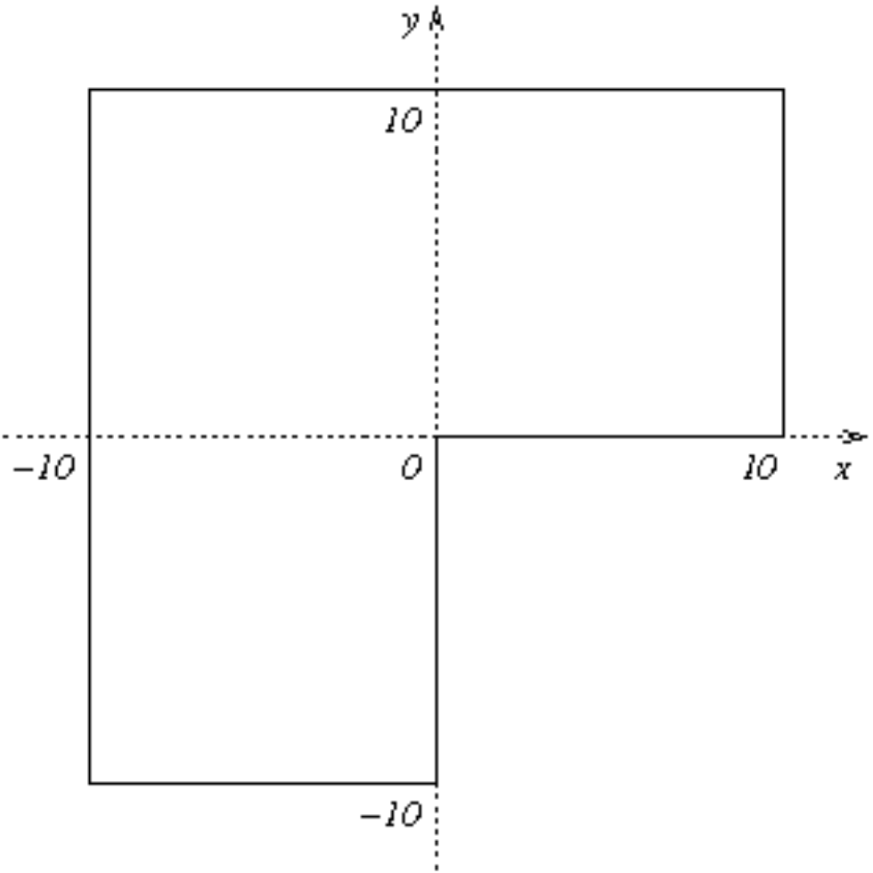
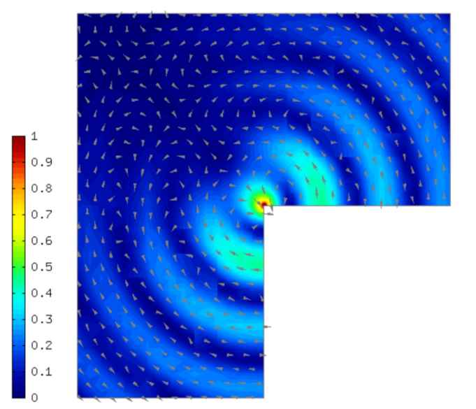
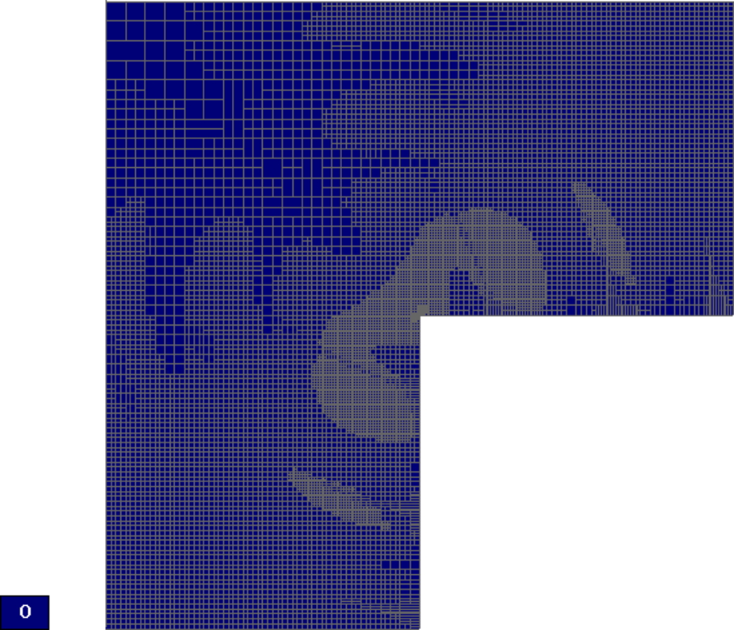
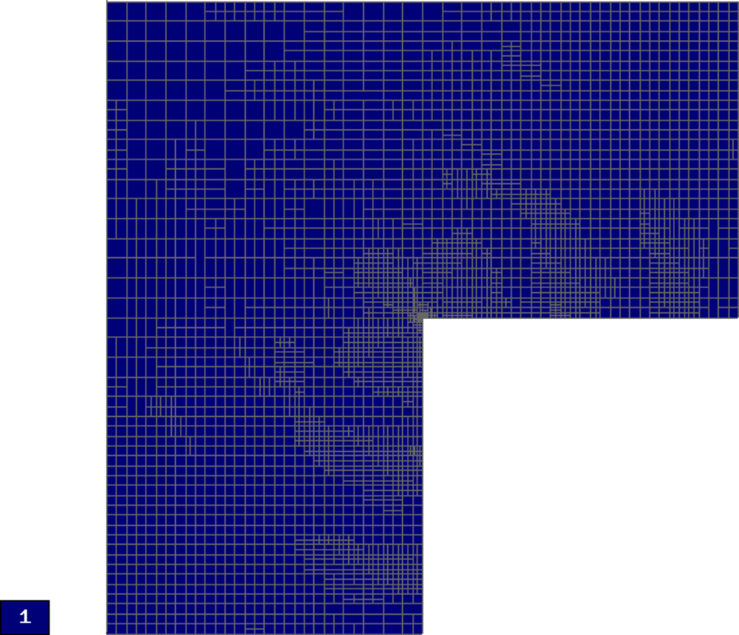
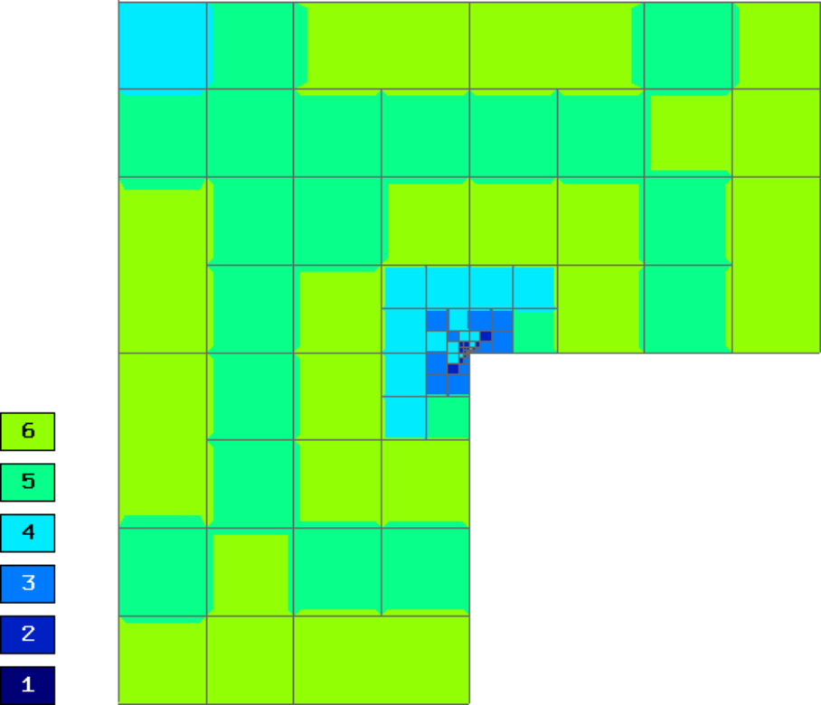
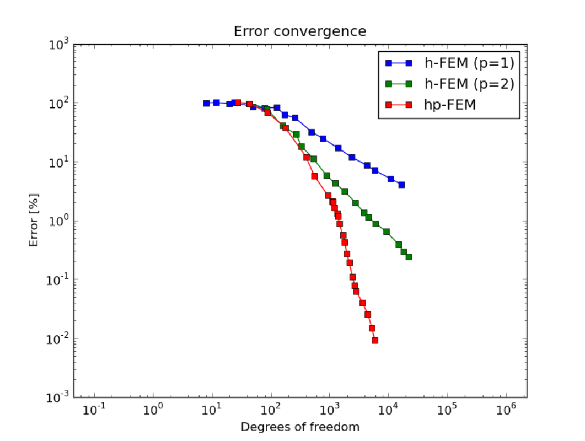
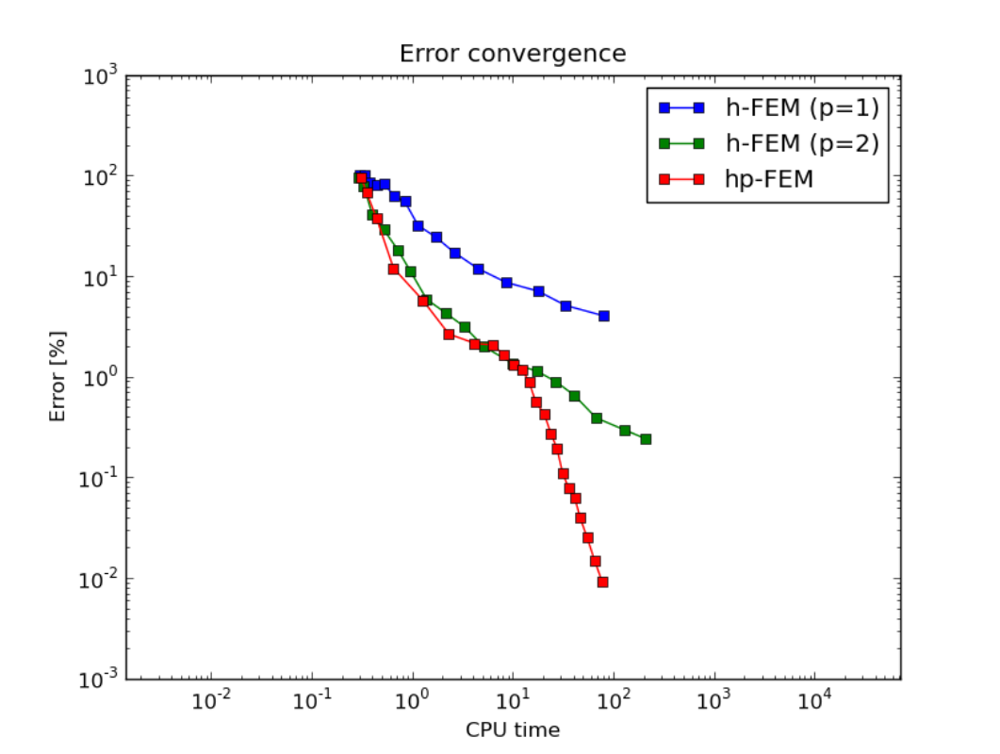

Time-Harmonic Maxwell's Equations (04-hcurl)
--------------------------------------------

**Git reference:** Tutorial example `04-hcurl <http://git.hpfem.org/hermes.git/tree/HEAD:/hermes2d/tutorial/P04-adaptivity/04-hcurl>`_. 

Model problem
~~~~~~~~~~~~~

This example solves the time-harmonic Maxwell's equations in an L-shaped domain and it 
describes the diffraction of an electromagnetic wave from a re-entrant corner. It comes with an 
exact solution that contains a strong singularity.

Equation solved: Time-harmonic Maxwell's equations

.. math::
    :label: example-05-hcurl-adapt

    \frac{1}{\mu_r} \nabla \times \nabla \times E - \kappa^2 \epsilon_r E = \Phi.

Domain of interest is the square $(-10, 10)^2$ missing the quarter lying in the 
fourth quadrant. It is filled with air:

Boundary conditions: Combined essential and natural, see the 
`main.cpp <http://git.hpfem.org/hermes.git/blob/HEAD:/hermes2d/tutorial/P04-adaptivity/04-hcurl/main.cpp>`_ file.

Exact solution
~~~~~~~~~~~~~~

.. math::
    :label: example-05-hcurl-adapt-exact

    E(x, y) = \nabla \times J_{\alpha} (r) \cos(\alpha \theta)

where $J_{\alpha}$ is the Bessel function of the first kind, 
$(r, \theta)$ the polar coordinates and $\alpha = 2/3$. In 
computer code, this reads:

::

    void exact_sol(double x, double y, scalar& e0, scalar& e1)
    {
      double t1 = x*x;
      double t2 = y*y;
      double t4 = sqrt(t1+t2);
      double t5 = jv(-1.0/3.0,t4);
      double t6 = 1/t4;
      double t7 = jv(2.0/3.0,t4);
      double t11 = (t5-2.0/3.0*t6*t7)*t6;
      double t12 = atan2(y,x);
      if (t12 < 0) t12 += 2.0*M_PI;
      double t13 = 2.0/3.0*t12;
      double t14 = cos(t13);
      double t17 = sin(t13);
      double t18 = t7*t17;
      double t20 = 1/t1;
      double t23 = 1/(1.0+t2*t20);
      e0 = t11*y*t14-2.0/3.0*t18/x*t23;
      e1 = -t11*x*t14-2.0/3.0*t18*y*t20*t23;
    }  

Here jv() is the Bessel function $\bfJ_{\alpha}$. For its source code see the 
`definitions.cpp <http://git.hpfem.org/hermes.git/blob/HEAD:/hermes2d/tutorial/P04-adaptivity/05-hcurl/definitions.cpp>`_ file.

Weak forms
~~~~~~~~~~

The weak formulation is put together as a combination of default jacobian and 
residual forms in the Hcurl space, and one custom form that defines the 
integral of the tangential component of the exact solution along the boundary:

.. sourcecode::
    .

    class CustomWeakForm : public WeakForm
    {
    public:
      CustomWeakForm(double mu_r, double kappa) : WeakForm(1)
      {
	cplx ii = cplx(0.0, 1.0);

	// Jacobian.
	add_matrix_form(new WeakFormsHcurl::DefaultJacobianCurlCurl(0, 0, HERMES_ANY, new HermesFunction(1.0/mu_r)));
	add_matrix_form(new WeakFormsHcurl::DefaultMatrixFormVol(0, 0, HERMES_ANY, new HermesFunction(-sqr(kappa))));
	add_matrix_form_surf(new WeakFormsHcurl::DefaultMatrixFormSurf(0, 0, HERMES_ANY, new HermesFunction(-kappa*ii)));

	// Residual.
	add_vector_form(new WeakFormsHcurl::DefaultResidualCurlCurl(0, HERMES_ANY, new HermesFunction(1.0/mu_r)));
	add_vector_form(new WeakFormsHcurl::DefaultResidualVol(0, HERMES_ANY, new HermesFunction(-sqr(kappa))));
	add_vector_form_surf(new WeakFormsHcurl::DefaultResidualSurf(0, HERMES_ANY, new HermesFunction(-kappa*ii)));
	add_vector_form_surf(new CustomVectorFormSurf());
      };

      class CustomVectorFormSurf : public WeakForm::VectorFormSurf
      {
      public:
	CustomVectorFormSurf()
		  : WeakForm::VectorFormSurf(0) 
	{
	}

	virtual scalar value(int n, double *wt, Func<scalar> *u_ext[], 
			     Func<double> *v, Geom<double> *e, ExtData<scalar> *ext) 
                             const 
	{
	  scalar result = 0;
	  for (int i = 0; i < n; i++) {
	    double r = sqrt(e->x[i] * e->x[i] + e->y[i] * e->y[i]);
	    double theta = atan2(e->y[i], e->x[i]);
	    if (theta < 0) theta += 2.0*M_PI;
	    double j13    = jv(-1.0/3.0, r),    j23    = jv(+2.0/3.0, r);
	    double cost   = cos(theta),         sint   = sin(theta);
	    double cos23t = cos(2.0/3.0*theta), sin23t = sin(2.0/3.0*theta);

	    double Etau = e->tx[i] * (cos23t * sint * j13 - 2.0/(3.0 * r) * j23 *
                         (cos23t * sint + sin23t * cost)) + e->ty[i] * 
                         (-cos23t * cost * j13 + 2.0/(3.0*r) * j23 *
                         (cos23t * cost - sin23t * sint));

	    result += wt[i] * cplx(cos23t*j23, -Etau) * ((v->val0[i] * e->tx[i] + v->val1[i] * e->ty[i]));
	  }
	  return -result;
	}

	virtual Ord ord(int n, double *wt, Func<Ord> *u_ext[], Func<Ord> *v,
			Geom<Ord> *e, ExtData<Ord> *ext) const 
	{
	  return Ord(10);
	}
      };
    };

.. latexcode::
    .

    class CustomWeakForm : public WeakForm
    {
    public:
      CustomWeakForm(double mu_r, double kappa) : WeakForm(1)
      {
	cplx ii = cplx(0.0, 1.0);

	// Jacobian.
	add_matrix_form(new WeakFormsHcurl::DefaultJacobianCurlCurl(0, 0, HERMES_ANY, new
                        HermesFunction(1.0/mu_r)));
	add_matrix_form(new WeakFormsHcurl::DefaultMatrixFormVol(0, 0, HERMES_ANY, new
                        HermesFunction(-sqr(kappa))));
	add_matrix_form_surf(new WeakFormsHcurl::DefaultMatrixFormSurf(0, 0, HERMES_ANY, new
                             HermesFunction(-kappa*ii)));

	// Residual.
	add_vector_form(new WeakFormsHcurl::DefaultResidualCurlCurl(0, HERMES_ANY, new
                        HermesFunction(1.0/mu_r)));
	add_vector_form(new WeakFormsHcurl::DefaultResidualVol(0, HERMES_ANY, new
                        HermesFunction(-sqr(kappa))));
	add_vector_form_surf(new WeakFormsHcurl::DefaultResidualSurf(0, HERMES_ANY, new
                             HermesFunction(-kappa*ii)));
	add_vector_form_surf(new CustomVectorFormSurf());
      };

      class CustomVectorFormSurf : public WeakForm::VectorFormSurf
      {
      public:
	CustomVectorFormSurf()
		  : WeakForm::VectorFormSurf(0) 
	{
	}

	virtual scalar value(int n, double *wt, Func<scalar> *u_ext[], 
			     Func<double> *v, Geom<double> *e, ExtData<scalar> *ext)
                             const 
	{
	  scalar result = 0;
	  for (int i = 0; i < n; i++) {
	    double r = sqrt(e->x[i] * e->x[i] + e->y[i] * e->y[i]);
	    double theta = atan2(e->y[i], e->x[i]);
	    if (theta < 0) theta += 2.0*M_PI;
	    double j13    = jv(-1.0/3.0, r),    j23    = jv(+2.0/3.0, r);
	    double cost   = cos(theta),         sint   = sin(theta);
	    double cos23t = cos(2.0/3.0*theta), sin23t = sin(2.0/3.0*theta);

	    double Etau = e->tx[i] * (cos23t * sint * j13 - 2.0/(3.0 * r) * 
                         j23 * (cos23t * sint + sin23t * cost)) + e->ty[i] * 
                         (-cos23t * cost * j13 + 2.0/(3.0*r) * j23 *
                         (cos23t * cost - sin23t * sint));

	    result += wt[i] * cplx(cos23t*j23, -Etau) * ((v->val0[i] * e->tx[i]
                      + v->val1[i] * e->ty[i]));
	  }
	  return -result;
	}

	virtual Ord ord(int n, double *wt, Func<Ord> *u_ext[], Func<Ord> *v,
			Geom<Ord> *e, ExtData<Ord> *ext) const 
	{
	  return Ord(10);
	}
      };
    };

Creating an Hcurl space
~~~~~~~~~~~~~~~~~~~~~~~

In this example we use the Hcurl space::

    // Create an Hcurl space with default shapeset.
    HcurlSpace space(&mesh, &bcs, P_INIT);

Choosing refinement selector for the Hcurl space
~~~~~~~~~~~~~~~~~~~~~~~~~~~~~~~~~~~~~~~~~~~~~~~~

Therefore we also need to use a refinement selector for the Hcurl space::

    // Initialize refinement selector.
    HcurlProjBasedSelector selector(CAND_LIST, CONV_EXP, H2DRS_DEFAULT_ORDER);

This is the last explicit occurence of the Hcurl space. The rest of the example 
is the same as if the adaptivity was done in the H1 space.

Choice of projection norm
~~~~~~~~~~~~~~~~~~~~~~~~~

The H2D_HCURL_NORM is used automatically for the projection, since 
the projection takes place in an Hcurl space. The user does not have to 
worry about this. If needed, the default norm can be overridden in 
the function OGProjection::project_global().

Calculating element errors for adaptivity
~~~~~~~~~~~~~~~~~~~~~~~~~~~~~~~~~~~~~~~~~

Element errors and the total relative error in percent are calculated using 

::

    double err_est_rel = adaptivity->calc_err_est(&sln, &ref_sln) * 100;

Again, the Hcurl norm is used by default. 

Exact error calculation and the 'solutions_for_adapt' flag
~~~~~~~~~~~~~~~~~~~~~~~~~~~~~~~~~~~~~~~~~~~~~~~~~~~~~~~~~~

For the exact error calculation, we say that we do not want the exact error
to guide automatic adaptivity:

.. sourcecode::
    .

    // Calculate exact error.
    bool solutions_for_adapt = false;
    double err_exact_rel = adaptivity->calc_err_exact(&sln, &sln_exact, solutions_for_adapt) * 100;

.. latexcode::
    .

    // Calculate exact error.
    bool solutions_for_adapt = false;
    double err_exact_rel = adaptivity->calc_err_exact(&sln, &sln_exact, solutions_for_adapt)
                           * 100;

Sample results
~~~~~~~~~~~~~~

Solution:

Final mesh (h-FEM with linear elements):

Note that the polynomial order indicated corresponds to the tangential components 
of approximation on element interfaces, not to polynomial degrees inside the elements
(those are one higher).

Final mesh (h-FEM with quadratic elements):

Final mesh (hp-FEM):

DOF convergence graphs:

CPU time convergence graphs:

