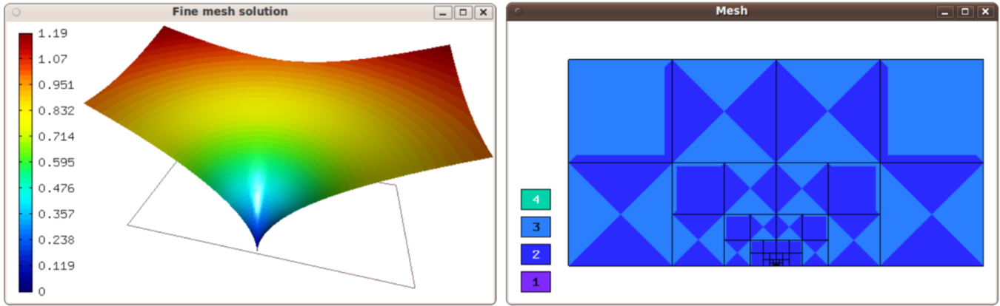

Adapting Mesh to an Exact Function (05-exact)
---------------------------------------------

**Git reference:** Tutorial example `05-exact <http://git.hpfem.org/hermes.git/tree/HEAD:/hermes2d/tutorial/P04-adaptivity/05-exact>`_. 

This technique can be useful in a number of situations, 
for example when a time-dependent proces
starts from a complicated initial condition that would not be represented
with sufficient accuracy on a coarse initial mesh. 

Assigning an exact function to the fine mesh
~~~~~~~~~~~~~~~~~~~~~~~~~~~~~~~~~~~~~~~~~~~~

At the beginning of each adaptivity step, instead of calculating a solution on 
the fine mesh, we assign the exact function to it::

    // Adaptivity loop:
    int as = 1; bool done = false;
    do
    {
      info("---- Adaptivity step %d:", as);

      // Construct globally refined reference mesh and setup reference space.
      Space* ref_space = Space::construct_refined_space(&space);

      // Assign the function f() to the fine mesh.
      info("Assigning f() to the reference mesh.");
      if(ref_sln != NULL) delete ref_sln;
      ref_sln = new ExactSolutionCustom(ref_space->get_mesh());
      ...

The rest of the adaptivity loop is as usual.

Sample results
~~~~~~~~~~~~~~

Sample solution and mesh are shown below:

