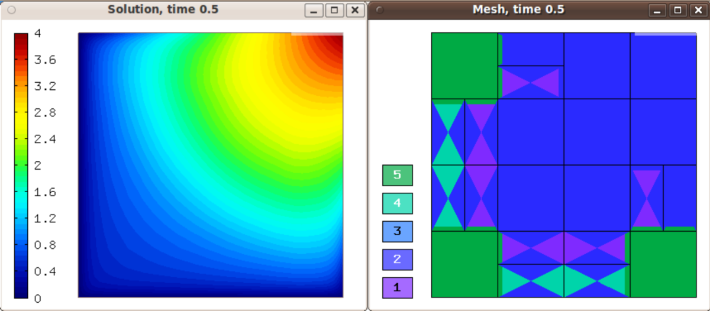
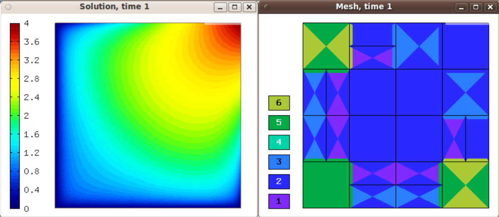
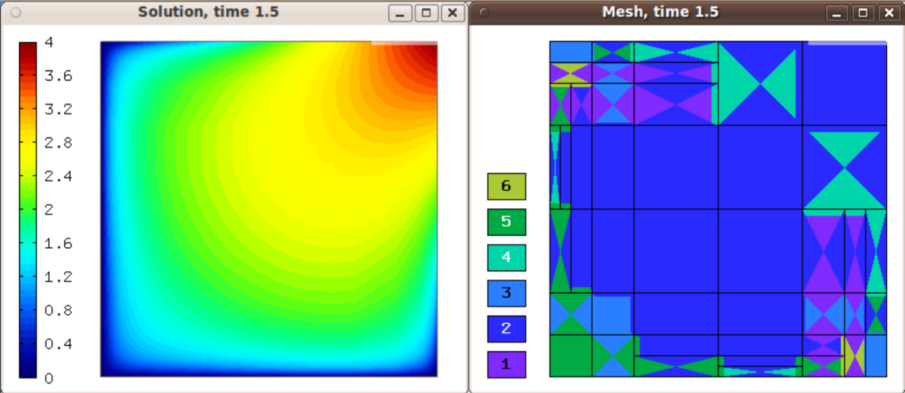
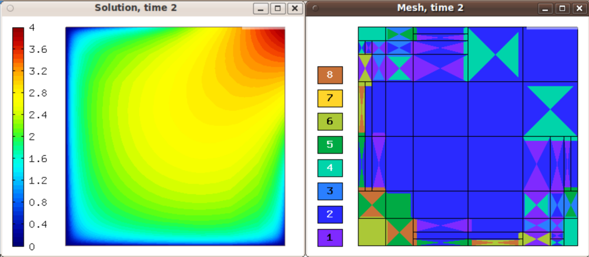

Transient Problems I - Adaptivity in Space (07-transient-space-only)
--------------------------------------------------------------------

**Git reference:** Tutorial example `07-transient-space-only 
<http://git.hpfem.org/hermes.git/tree/HEAD:/hermes2d/tutorial/P04-adaptivity/07-transient-space-only>`_.

Model problem
~~~~~~~~~~~~~

This example is derived from example `P03-timedep/03-nonlinear <http://hpfem.org/hermes/doc/src/hermes2d/P03-transient/03-nonlinear.html>`_
and it shows how automatic adaptivity in space can be combined with 
arbitrary Runge-Kutta methods in time. The example uses fixed time 
step size. 

We consider a nonlinear time-dependent equation of the form 

.. math::
    \frac{\partial u}{\partial t} - \mbox{div}(\lambda(u)\nabla u) - f = 0

equipped with Dirichlet boundary conditions and solved in a square domain 
$\Omega = (-10, 10)^2$. The nonlinearity $\lambda(u)$ has the form 

.. math::
    \lambda(u) = 1 + u^4. 

Recall that for the Runge-Kutta methods, we need the time derivative on the 
left and everything else on the right,

.. math::
    \frac{\partial u}{\partial t} = \mbox{div}(\lambda(u)\nabla u) + f.

Weak forms are created for the right-hand side only and we have seen them before.

Time stepping and periodic mesh derefinement
~~~~~~~~~~~~~~~~~~~~~~~~~~~~~~~~~~~~~~~~~~~~

Mesh derefinement is necessary in adaptive FEM for time-dependent 
problems, and it is much more complicated than mesh refinement.
This is because one cannot spoil much by doing a wrong mesh 
refinement, but a wrong mesh derefinement can cause lots of 
damage.

There are three ways to perform global mesh derefinement in Hermes:

  (1) Reset the mesh to basemesh and reset polynomial orders to P_INIT,
  (2) remove last layer of refinement from all elements, and reset 
      polynomial orders to P_INIT,
  (3) remove last layer of refinement from all elements, and decrease
      polynomial orders by one.

The derefinement frequency is set by the user via the 
parameter UNREF_FREQ::

    // Periodic global derefinement.
    if (ts > 1 && ts % UNREF_FREQ == 0) 
    {
      info("Global mesh derefinement.");
      switch (UNREF_METHOD) {
        case 1: mesh.copy(&basemesh);
                space.set_uniform_order(P_INIT);
                break;
        case 2: mesh.unrefine_all_elements();
                space.set_uniform_order(P_INIT);
                break;
        case 3: mesh.unrefine_all_elements();
                space.adjust_element_order(-1, -1, P_INIT, P_INIT);
                break;
        default: error("Wrong global derefinement method.");
      }

      ndof_coarse = Space::get_num_dofs(&space);
    }

Option #1 is cleanest from the mathematics point of view since the
mesh on the new time level will not be influenced by the mesh from 
the last step, but in practice we prefer the last option because 
it takes less CPU time. 

The adaptivity loop in space is standard. The rk_time_step()
method is called in each adaptivity step::

      // Perform one Runge-Kutta time step according to the selected Butcher's table.
      info("Runge-Kutta time step (t = %g s, tau = %g s, stages: %d).",
           current_time, time_step, bt.get_size());
      bool verbose = true;
      if (!runge_kutta.rk_time_step(current_time, time_step, &sln_time_prev, &sln_time_new, 
                                    true, verbose, NEWTON_TOL, NEWTON_MAX_ITER)) 
      {
        error("Runge-Kutta time step failed, try to decrease time step size.");
      }

The value of current_time and the previous time level solution 
sln_time_prev do not change during spatial adaptivity.

Sample results
~~~~~~~~~~~~~~

Initial condition and initial mesh:

.. figure:: 07-transient-space-only/1.png
   :align: center
   :scale: 75% 
   :figclass: align-center
   :alt: Sample screenshot

Solution and mesh at t = 0.5:

Solution and mesh at t = 1.0:

Solution and mesh at t = 1.5:

Solution and mesh at t = 2.0:

