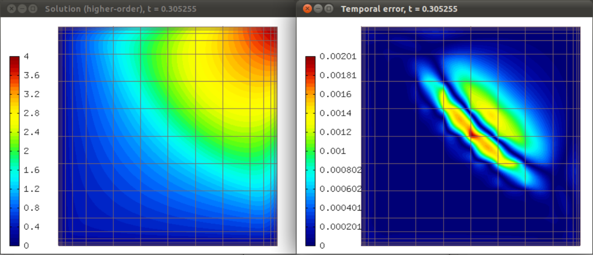
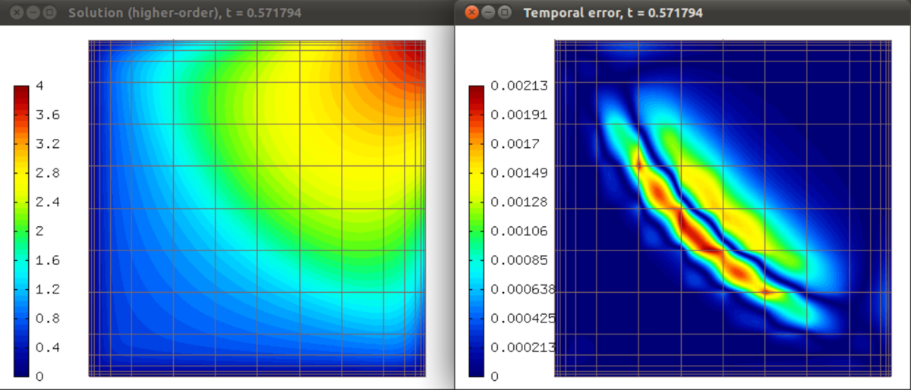
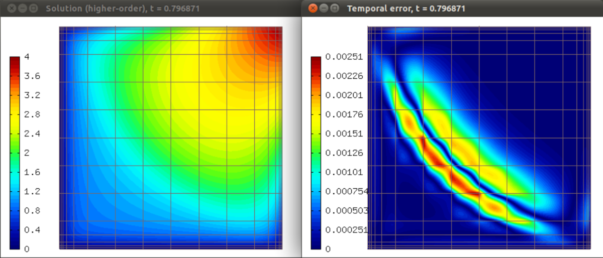
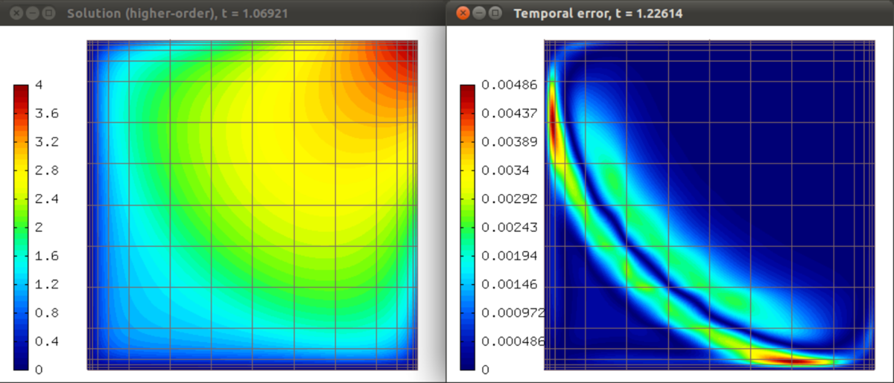

Transient Problems II - Adaptivity in Time (08-transient-time-only)
-------------------------------------------------------------------

**Git reference:** Tutorial example `08-transient-time-only 
<http://git.hpfem.org/hermes.git/tree/HEAD:/hermes2d/tutorial/P04-adaptivity/08-transient-time-only>`_.

Model problem
~~~~~~~~~~~~~

This example is analogous to example `P04-adaptivity/07-transient-space-only <http://hpfem.org/hermes/doc/src/hermes2d/P04-adaptivity/07-transient-space-only.html>`_ except that 
a fixed mesh is used and only the time stepping is adaptive. An arbitrary 
embedded Runge-Kutta method can be used. By embedded we mean that the 
Butcher's table contains two B rows. The two B rows are used to calculate 
two different approximations Y_{n+1} on the next time level, with different 
orders of accuracy. The difference between these two solutions is used 
to adapt the time step.

Selecting an embedded Runge-Kutta method
~~~~~~~~~~~~~~~~~~~~~~~~~~~~~~~~~~~~~~~~

Hermes provides by default the following embedded explicit methods:

  * Explicit_HEUN_EULER_2_12_embedded, 
  * Explicit_BOGACKI_SHAMPINE_4_23_embedded, 
  * Explicit_FEHLBERG_6_45_embedded,
  * Explicit_CASH_KARP_6_45_embedded,
  * Explicit_DORMAND_PRINCE_7_45_embedded,

and the following embedded implicit methods:

  * Implicit_SDIRK_CASH_3_23_embedded, 
  * Implicit_ESDIRK_TRBDF2_3_23_embedded, 
  * Implicit_ESDIRK_TRX2_3_23_embedded, 
  * Implicit_SDIRK_BILLINGTON_3_23_embedded, 
  * Implicit_SDIRK_CASH_5_24_embedded, 
  * Implicit_SDIRK_CASH_5_34_embedded, 
  * Implicit_DIRK_ISMAIL_7_45_embedded. 

We usually use the SDIRK methods by Cash as they work really well.

Obtaining temporal error estimate
~~~~~~~~~~~~~~~~~~~~~~~~~~~~~~~~~

When the Butcher's table is an embedded one, the method rk_time_step()
provides an error estimate on the next time level (difference of the 
two approximations with different orders of accuracy)::

    // Perform one Runge-Kutta time step according to the selected Butcher's table.
    info("Runge-Kutta time step (t = %g, tau = %g, stages: %d).", 
         current_time, time_step, bt.get_size());
    bool verbose = true;
    bool jacobian_changed = true;
    if (!runge_kutta.rk_time_step(current_time, time_step, &sln_time_prev, 
                                  &sln_time_new, &time_error_fn, jacobian_changed, verbose, 
                                  NEWTON_TOL, NEWTON_MAX_ITER)) {
      error("Runge-Kutta time step failed, try to decrease time step size.");
    }

The solution sln_time_new contains the more accurate of the two solutions.

Calculating relative temporal error
~~~~~~~~~~~~~~~~~~~~~~~~~~~~~~~~~~~

This is done by calculating the norm of the error function and
dividing it by the norm of the solution::

    double rel_err_time = hermes2d.calc_norm(&time_error_fn, HERMES_H1_NORM) / 
                          hermes2d.calc_norm(&sln_time_new, HERMES_H1_NORM) * 100;

Adapting the time step
~~~~~~~~~~~~~~~~~~~~~~

There are many ways to do this, let us show a very simple one here. We
define two tolerances for the relative temporal error: TIME_TOL_UPPER
and TIME_TOL_LOWER. If the time step exceeds the former, then the time 
step is decreased and vice versa. The code is very simple:

.. sourcecode::
    .

    if (rel_err_time > TIME_TOL_UPPER) {
      info("rel_err_time above upper limit %g%% -> decreasing time step from %g to %g and repeating time step.", 
           TIME_TOL_UPPER, time_step, time_step * TIME_STEP_DEC_RATIO);
      time_step *= TIME_STEP_DEC_RATIO;
      continue;
    }
    if (rel_err_time < TIME_TOL_LOWER) {
      info("rel_err_time = below lower limit %g%% -> increasing time step from %g to %g", 
           TIME_TOL_UPPER, time_step, time_step * TIME_STEP_INC_RATIO);
      time_step *= TIME_STEP_INC_RATIO;
    }

.. latexcode::
    .

    if (rel_err_time > TIME_TOL_UPPER) {
      info("rel_err_time above upper limit %g%% -> decreasing time step from %g to %g and
           repeating time step.", TIME_TOL_UPPER, time_step, time_step * TIME_STEP_DEC_RATIO);
      time_step *= TIME_STEP_DEC_RATIO;
      continue;
    }
    if (rel_err_time < TIME_TOL_LOWER) {
      info("rel_err_time = below lower limit %g%% -> increasing time step from %g to %g", 
           TIME_TOL_UPPER, time_step, time_step * TIME_STEP_INC_RATIO);
      time_step *= TIME_STEP_INC_RATIO;
    }

Plotting the temporal error estimate
~~~~~~~~~~~~~~~~~~~~~~~~~~~~~~~~~~~~

The temporal error is a function that is usually positive in some parts 
of the computational domain and negative elsewhere. As the magnitude
is what matters, it may be a good idea to use an AbsFilter::

    // Plot error function.
    char title[100];
    sprintf(title, "Temporal error, t = %g", current_time);
    eview.set_title(title);
    AbsFilter abs_tef(&time_error_fn);
    eview.show(&abs_tef, HERMES_EPS_VERYHIGH);

Here, the option HERMES_EPS_VERYHIGH is used to render accurately a function
that has very small values.

Sample results
~~~~~~~~~~~~~~

Solution and temporal error at t = 0.105 s:

.. figure:: 08-transient-time-only/Screenshot-1.png
   :align: center
   :scale: 70% 
   :figclass: align-center
   :alt: Sample screenshot

Solution and temporal error at t = 0.305 s:

Solution and temporal error at t = 0.572 s:

Solution and temporal error at t = 0.797 s:

Solution and temporal error at t = 1.226 s:

