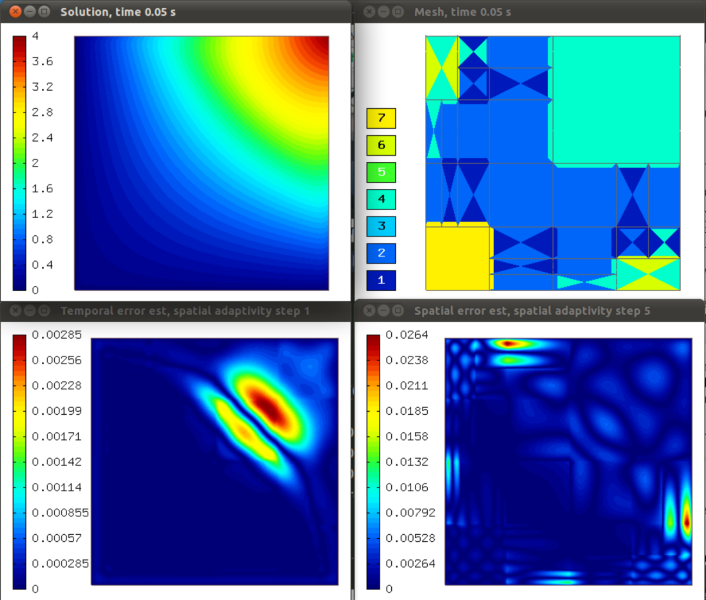
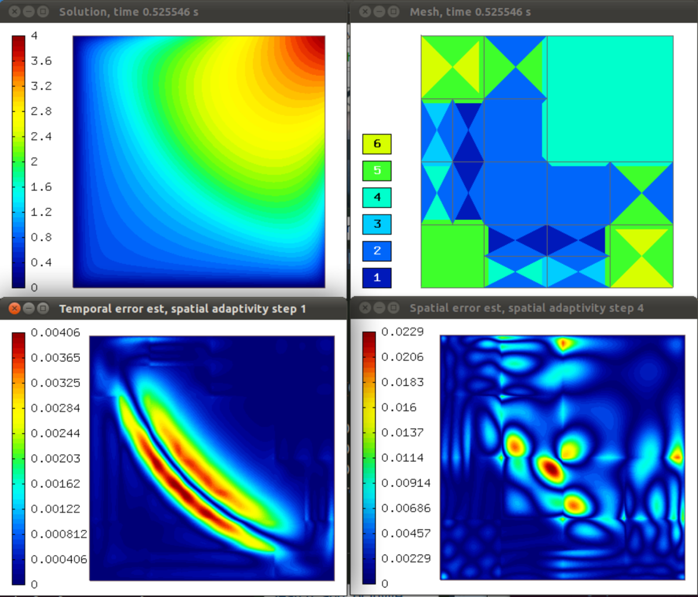
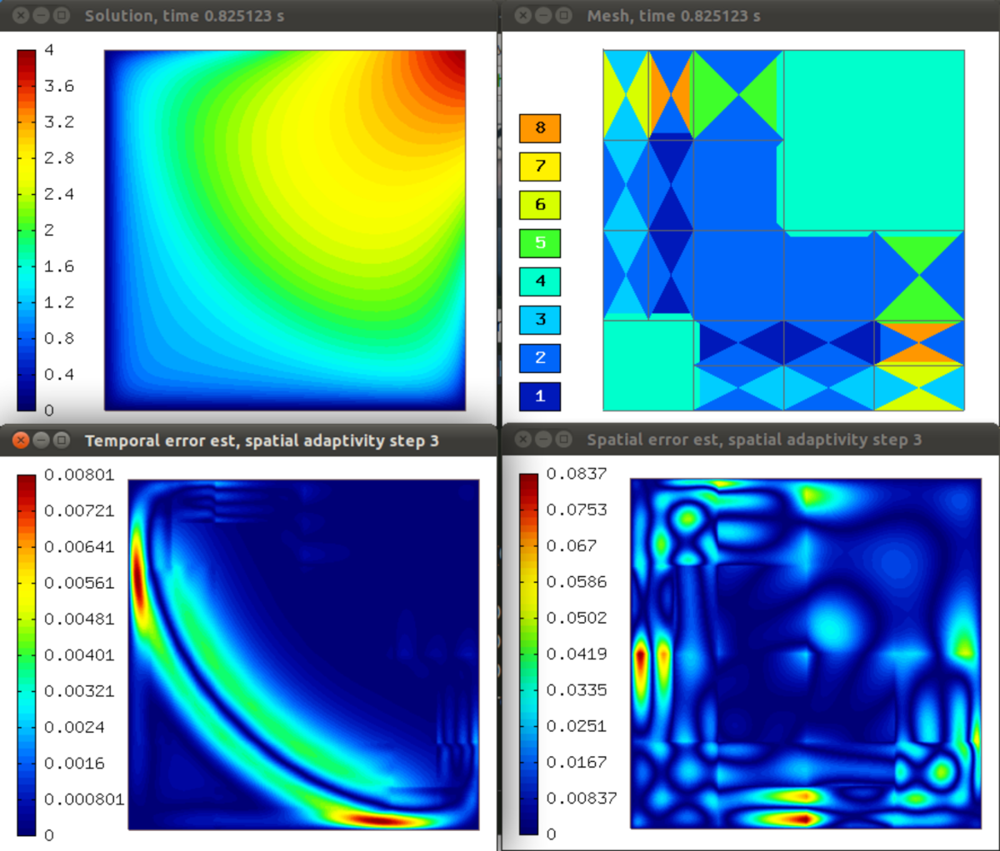

Transient Problems III - Adaptivity in Space and Time (09-transient-space-and-time)
-----------------------------------------------------------------------------------

**Git reference:** Tutorial example `09-transient-space-and-time 
<http://git.hpfem.org/hermes.git/tree/HEAD:/hermes2d/tutorial/P04-adaptivity/09-transient-space-and-time>`_.

Model problem
~~~~~~~~~~~~~

In this example, the previous two examples are combined together -- we use the same model
problem and perform adaptivity in space in combination with adaptive time stepping.
The adaptive time stepping can be turned off either by setting ADAPTIVE_TIME_STEP_ON = false
or by selecting a non-embedded Runge-Kutta method.

Adaptive algorithm
~~~~~~~~~~~~~~~~~~

The algorithm is just a merge of the adaptivity 
algorithms from the previous two examples. 
Each time step begins with a uniform mesh 
derefinement that can be done in three possible 
ways. Inside the time stepping loop, a standard 
spatial adaptivity loop takes place. 

Sample results
~~~~~~~~~~~~~~

Solution, mesh, temporal error, and spatial error at t = 0.05 s:

Solution, mesh, temporal error, and spatial error at t = 0.53 s:

Solution, mesh, temporal error, and spatial error at t = 0.83 s:

