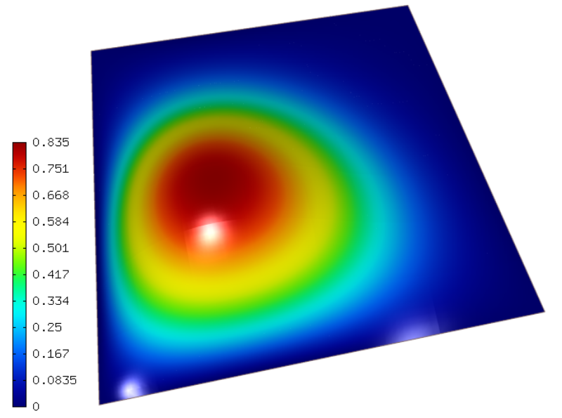
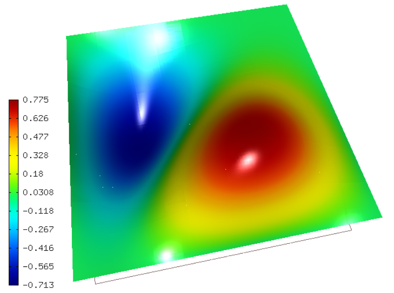
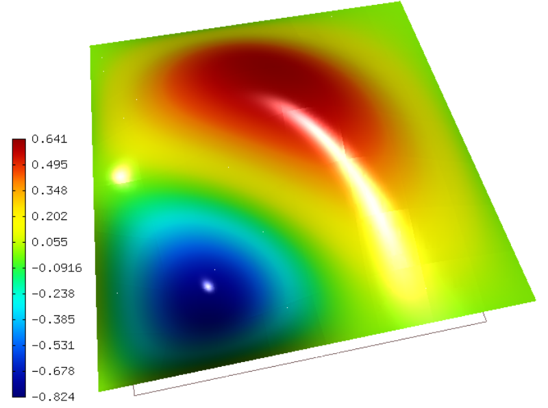
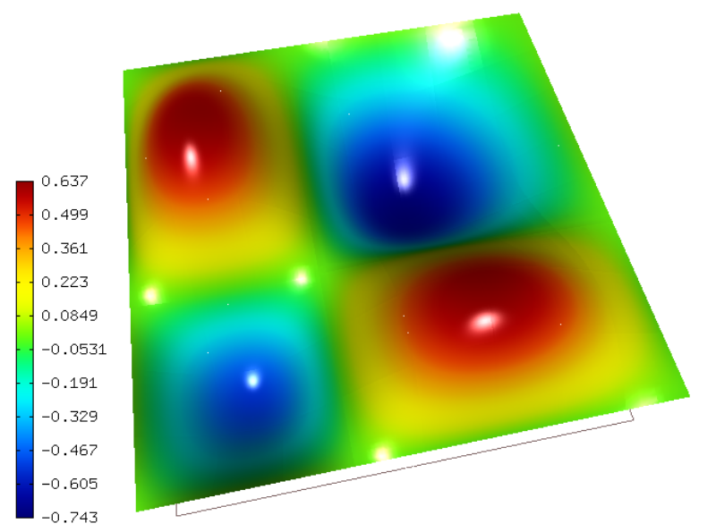
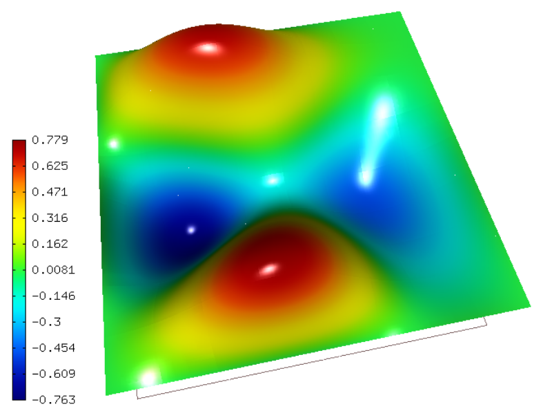
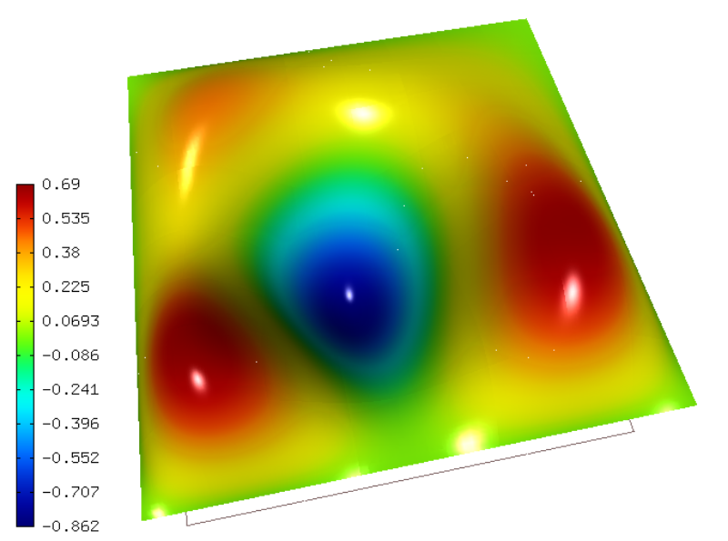

Using Pysparse (01-eigenvalue)
--------------------------------

**Git reference:** Tutorial example `01-eigenvalue <http://git.hpfem.org/hermes.git/tree/HEAD:/hermes2d/tutorial/P05-eigenproblems/01-eigenvalue>`_. 

This tutorial example shows how to solve generalized eigenproblems using the EigenSolver
class which is based on the Pysparse library. 

Model problem
~~~~~~~~~~~~~

We will solve an elliptic eigenproblem of the form 

.. math::
    -\Delta u + V(x, y) u = \lambda u

with the potential 

.. math::
    V(x, y) = x^2 + y^2.

The problem is considered in a square domain 
$\Omega = (0, \pi)^2$, and equipped with zero 
Dirichlet boundary conditions.

Input parameters
~~~~~~~~~~~~~~~~

Most input parameters are self-explanatory, such as:

.. sourcecode::
    .

    const int NUMBER_OF_EIGENVALUES = 50;             // Desired number of eigenvalues.
    const int P_INIT = 4;                             // Uniform polynomial degree of mesh elements.
    const int INIT_REF_NUM = 3;                       // Number of initial mesh refinements.

.. latexcode::
    .

    const int NUMBER_OF_EIGENVALUES = 50;             // Desired number of eigenvalues.
    const int P_INIT = 4;                             // Uniform polynomial degree of mesh
                                                      // elements.
    const int INIT_REF_NUM = 3;                       // Number of initial mesh refinements.

The parameter TARGET_VALUE is specific to the PySparse library:

.. sourcecode::
    .

    const double TARGET_VALUE = 2.0;                  // PySparse parameter: Eigenvalues in the vicinity of this number will be computed. 

.. latexcode::
    .

    const double TARGET_VALUE = 2.0;               // PySparse parameter: Eigenvalues in
                                                   // the vicinity of this number will be
                                                   // computed. 

Weak forms
~~~~~~~~~~

The matrix weak forms on the right- and left-hand side are standard:

.. sourcecode::
    .

    WeakFormEigenLeft::WeakFormEigenLeft() : WeakForm(1) 
    {
      add_matrix_form(new WeakFormsH1::DefaultJacobianDiffusion(0, 0));
      add_matrix_form(new MatrixFormPotential(0, 0));
    }

    template<typename Real, typename Scalar>
    Scalar WeakFormEigenLeft::MatrixFormPotential::matrix_form(int n, double *wt, Func<Scalar> *u_ext[], Func<Real> *u, 
				                   Func<Real> *v, Geom<Real> *e, ExtData<Scalar> *ext) const 
    {
      Scalar result = 0;
      for (int i = 0; i < n; i++) 
      {
	Real x = e->x[i];
	Real y = e->y[i];
	result += wt[i] * (x*x + y*y) * u->val[i] * v->val[i];
      }
      return result;
    }

    scalar WeakFormEigenLeft::MatrixFormPotential::value(int n, double *wt, Func<scalar> *u_ext[], Func<double> *u, 
		                                   Func<double> *v, Geom<double> *e, ExtData<scalar> *ext) const 
    {
      return matrix_form<double, scalar>(n, wt, u_ext, u, v, e, ext);
    }

    Ord WeakFormEigenLeft::MatrixFormPotential::ord(int n, double *wt, Func<Ord> *u_ext[], Func<Ord> *u, 
			                        Func<Ord> *v, Geom<Ord> *e, ExtData<Ord> *ext) const 
    {
      return matrix_form<Ord, Ord>(n, wt, u_ext, u, v, e, ext);
    }

    WeakFormEigenRight::WeakFormEigenRight() : WeakForm(1) 
    {
      add_matrix_form(new WeakFormsH1::DefaultMatrixFormVol(0, 0));
    }

.. latexcode::
    .

    WeakFormEigenLeft::WeakFormEigenLeft() : WeakForm(1) 
    {
      add_matrix_form(new WeakFormsH1::DefaultJacobianDiffusion(0, 0));
      add_matrix_form(new MatrixFormPotential(0, 0));
    }

    template<typename Real, typename Scalar>
    Scalar WeakFormEigenLeft::MatrixFormPotential::matrix_form(int n, double *wt,
                              Func<Scalar> *u_ext[], Func<Real> *u, Func<Real> *v, 
                              Geom<Real> *e, ExtData<Scalar> *ext) const 
    {
      Scalar result = 0;
      for (int i = 0; i < n; i++) 
      {
	Real x = e->x[i];
	Real y = e->y[i];
	result += wt[i] * (x*x + y*y) * u->val[i] * v->val[i];
      }
      return result;
    }

    scalar WeakFormEigenLeft::MatrixFormPotential::value(int n, double *wt, Func<scalar>
                              *u_ext[], Func<double> *u, Func<double> *v, 
                              Geom<double> *e, ExtData<scalar> *ext) const 
    {
      return matrix_form<double, scalar>(n, wt, u_ext, u, v, e, ext);
    }

    Ord WeakFormEigenLeft::MatrixFormPotential::ord(int n, double *wt, 
                           Func<Ord> *u_ext[], Func<Ord> *u, Func<Ord> *v, 
                           Geom<Ord> *e, ExtData<Ord> *ext) const 
    {
      return matrix_form<Ord, Ord>(n, wt, u_ext, u, v, e, ext);
    }

    WeakFormEigenRight::WeakFormEigenRight() : WeakForm(1) 
    {
      add_matrix_form(new WeakFormsH1::DefaultMatrixFormVol(0, 0));
    }

Initialization and assembling of matrices
~~~~~~~~~~~~~~~~~~~~~~~~~~~~~~~~~~~~~~~~~

The matrices are initialized using Reference Counted Pointers (RCP) provided
by the Trilinos/Teuchos library::

  // Initialize matrices.
  RCP<SparseMatrix> matrix_left = rcp(new CSCMatrix());
  RCP<SparseMatrix> matrix_right = rcp(new CSCMatrix());

They are assembled as follows, each one having its own DiscreteProblem
instance::

  // Assemble the matrices.
  DiscreteProblem dp_left(&wf_left, &space);
  dp_left.assemble(matrix_left.get());
  DiscreteProblem dp_right(&wf_right, &space);
  dp_right.assemble(matrix_right.get());

Calling Pysparse
~~~~~~~~~~~~~~~~

::

  EigenSolver es(matrix_left, matrix_right);
  info("Calling Pysparse...");
  es.solve(NUMBER_OF_EIGENVALUES, TARGET_VALUE, TOL, MAX_ITER);
  info("Pysparse finished.");
  es.print_eigenvalues();

Visualizing the eigenfunctions
~~~~~~~~~~~~~~~~~~~~~~~~~~~~~~

::

    // Initializing solution vector, solution and ScalarView.
    double* coeff_vec;
    Solution sln;
    ScalarView view("Solution", new WinGeom(0, 0, 440, 350));

    // Reading solution vectors and visualizing.
    double* eigenval = new double[NUMBER_OF_EIGENVALUES];
    int neig = es.get_n_eigs();
    if (neig != NUMBER_OF_EIGENVALUES) 
      error("Mismatched number of eigenvectors in the eigensolver output file.");  
    for (int ieig = 0; ieig < neig; ieig++) {
      eigenval[ieig] = es.get_eigenvalue(ieig);
      int n;
      es.get_eigenvector(ieig, &coeff_vec, &n);
      // Convert coefficient vector into a Solution.
      Solution::vector_to_solution(coeff_vec, &space, &sln);

      // Visualize the solution.
      char title[100];
      sprintf(title, "Solution %d, val = %g", ieig, eigenval[ieig]);
      view.set_title(title);
      view.show(&sln);

      // Wait for keypress.
      View::wait(HERMES_WAIT_KEYPRESS);
    }

Sample results
~~~~~~~~~~~~~~

Below we show first six eigenvectors along with the corresponding 
eigenvalues:

$\lambda_1 = 6.011956$

$\lambda_2 = 10.206996$

$\lambda_3 = 10.206996$

$\lambda_4 = 14.402036$

$\lambda_5 = 15.401239$

$\lambda_6 = 15.401239$

