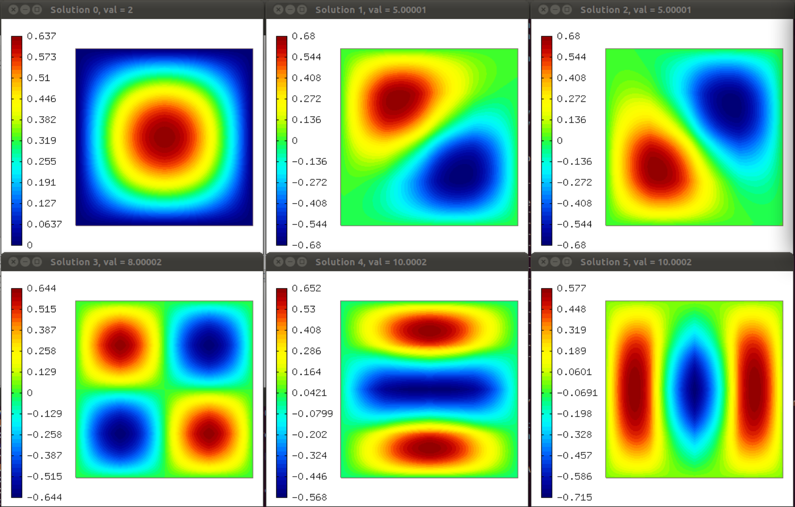
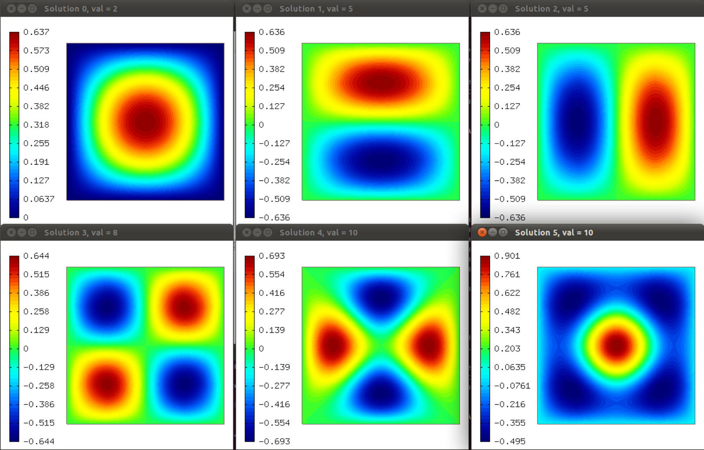

Adaptivity Problems (02-eigenvalue-adapt)
-----------------------------------------

**Git reference:** Tutorial example `02-eigenvalue-adapt <http://git.hpfem.org/hermes.git/tree/HEAD:/hermes2d/tutorial/P05-eigenproblems/02-eigenvalue-adapt>`_. 

This is an inofficial example. Its purpose is solely to illustrate problems 
associated with repeated calls to an eigensolver in each mesh refinement step.
Observe how eigenfunctions associated with eigenvalues of multiplicity greater than 
one change from one step to another. The underlying operator is the Laplacian,
in a square with zero boundary conditions. 

Sample results
~~~~~~~~~~~~~~

Below we show the first six eigenfunctions during automatic adaptivity.
The second and third correspond to the same eigenvalue $\lambda_2 = \lambda_3 = 5$
and the fifth and sixth correspond to the same eigenvalue $\lambda_5 = \lambda_6 = 10$.
These are the ones that cause problems since the eigensolver is free to return 
any pair of linearly independent vectors from the two-dimensional subspace.

Solution on coarse mesh:

Solution after first adaptivity step:

.. figure:: 02-eigenvalue-adapt/2.png
   :align: center
   :scale: 50% 
   :figclass: align-center
   :alt: Sample result

Solution after second adaptivity step:

