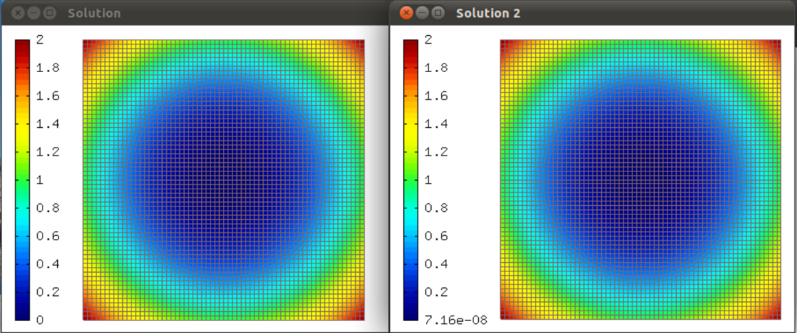

Trilinos - Linear (01-trilinos-linear)
--------------------------------------

**Git reference:** Example `01-trilinos-linear 
<http://git.hpfem.org/hermes.git/tree/HEAD:/hermes2d/tutorial/P07-trilinos/01-trilinos-linear>`_.

The purpose of this example is to show how to use Trilinos for linear PDE problems where
NOX only does one nonlinear iteration. Thus this is a good example to test various preconditioners
for the linear problem. First we use the Newton's method in Hermes (assembling via the DiscreteProblem 
class and matrix problem solution via UMFpack). Second, assembling is done using the DiscreteProblem 
class in Hermes and the discrete problem is solved using the Trilinos NOX solver (using Newton's 
method or JFNK, with or without preconditioning).

Model problem
~~~~~~~~~~~~~

The PDE solved is 

.. math::
    -\Delta u - f = 0

with an exact solution 

.. math::
    u(x,y) = x^2 + y^2.

The first part (UMFpack) needs not be discussed, let's proceed directly to NOX: 

Calculating initial condition for NOX
~~~~~~~~~~~~~~~~~~~~~~~~~~~~~~~~~~~~~

As NOX is iterative, the initial condition matters::

    // Set initial vector for NOX.
    // NOTE: Using zero vector was causing convergence problems.
    info("Projecting to obtain initial vector for the Newton's method.");
    Solution init_sln(&mesh, 0.0);
    OGProjection::project_global(&space, &init_sln, coeff_vec);

Initializing NOX
~~~~~~~~~~~~~~~~

::

    // Initialize the NOX solver with the vector "coeff_vec".
    info("Initializing NOX.");
    // "" stands for preconditioning that is set later.
    NoxSolver nox_solver(&dp2, message_type, iterative_method, "Newton", ls_tolerance, "", 
                         flag_absresid, abs_resid, flag_relresid, rel_resid, max_iters);
    nox_solver.set_init_sln(coeff_vec);

Setting a preconditioner
~~~~~~~~~~~~~~~~~~~~~~~~

::

    // Choose preconditioning.
    RCP<Precond> pc = rcp(new MlPrecond("sa"));
    if (PRECOND)
    {
      if (TRILINOS_JFNK) nox_solver.set_precond(pc);
      else nox_solver.set_precond(preconditioner);
    }

See NOX documentation for more preconditioning choices.

Reference Counted Pointers (RCP)
~~~~~~~~~~~~~~~~~~~~~~~~~~~~~~~~

Note: RCP stands for Reference Counted Pointer (a sophisticated smart pointer
management system). This is a very powerful tool provided by the Teuchos library, 
whose usage greatly reduces memory corruption related segfaults. For more reading 
we refer `here <http://trilinos.sandia.gov/packages/docs/r5.0/packages/teuchos/doc/html/group__RefCountPtr__stuff.html>`_.

Calling NOX
~~~~~~~~~~~

Now we are ready to call the NOX solver to assemble the discrete problem and solve it:

.. sourcecode::
    .

    // Assemble and solve using NOX.
    Solution sln2;
    if (nox_solver.solve())
    {
      Solution::vector_to_solution(nox_solver.get_solution(), &space, &sln2);

      info("Number of nonlin iterations: %d (norm of residual: %g)", 
        nox_solver.get_num_iters(), nox_solver.get_residual());
      info("Total number of iterations in linsolver: %d (achieved tolerance in the last step: %g)", 
        nox_solver.get_num_lin_iters(), nox_solver.get_achieved_tol());
    }
    else error("NOX failed");

.. latexcode::
    .

    // Assemble and solve using NOX.
    Solution sln2;
    if (nox_solver.solve())
    {
      Solution::vector_to_solution(nox_solver.get_solution(), &space, &sln2);

      info("Number of nonlin iterations: %d (norm of residual: %g)", 
        nox_solver.get_num_iters(), nox_solver.get_residual());
      info("Total number of iterations in linsolver: %d (achieved tolerance in the last 
           step: %g)", 
        nox_solver.get_num_lin_iters(), nox_solver.get_achieved_tol());
    }
    else error("NOX failed");

Sample results
~~~~~~~~~~~~~~

You should see the following result:

