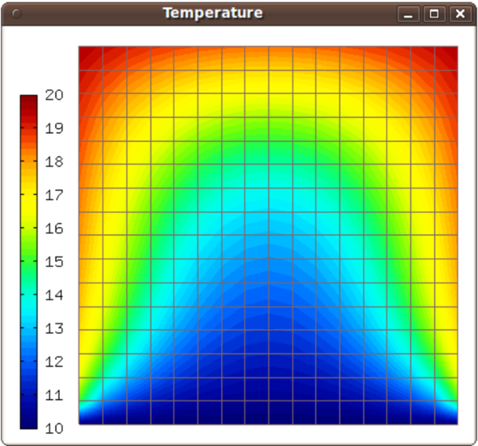

Trilinos - Timedep (03-trilinos-timedep)
----------------------------------------

**Git reference:** Example `03-trilinos-timedep 
<http://git.hpfem.org/hermes.git/tree/HEAD:/hermes2d/tutorial/P07-trilinos/03-trilinos-timedep>`_.

This  example shows how to use Trilinos for time-dependent PDE problems.
The NOX solver is employed, either using Newton's method or JFNK, and with 
or without preconditioning,

Model problem
~~~~~~~~~~~~~

We solve a linear heat transfer equation 

.. math::
    c \varrho \frac{\partial u}{\partial t} - \nabla \cdot(\lambda \nabla u) = 0

in a square domain where a Dirichlet boundary condition is prescribed on the bottom 
edge and the rest of the boundary has a Newton boundary condition

.. math::
    \frac{\partial u}{\partial n} = \alpha(T_{ext} - u).

Here $c$ is heat capacity, $\varrho$ material density, $\lambda$ thermal conductivity of the 
material, $T_{ext}$ exterior temperature, and $\alpha$ heat transfer coefficient. 

Time stepping
~~~~~~~~~~~~~

The initial coefficient vector has to be provided to NOX 
in each time step. The time stepping loop is as follows:

.. sourcecode::
    .

    // Time stepping loop:
    double total_time = 0.0;
    for (int ts = 1; total_time <= 2000.0; ts++)
    {
      info("---- Time step %d, t = %g s", ts, total_time += TAU);

      info("Assembling by DiscreteProblem, solving by NOX.");
      solver.set_init_sln(coeff_vec);
      if (solver.solve())
	Solution::vector_to_solution(solver.get_solution(), &space, &t_prev_time);
      else
	error("NOX failed.");

      // Show the new solution.
      Tview.show(&t_prev_time);

      info("Number of nonlin iterations: %d (norm of residual: %g)", 
	solver.get_num_iters(), solver.get_residual());
      info("Total number of iterations in linsolver: %d (achieved tolerance in the last step: %g)", 
	solver.get_num_lin_iters(), solver.get_achieved_tol());
    }

.. latexcode::
    .

    // Time stepping loop:
    double total_time = 0.0;
    for (int ts = 1; total_time <= 2000.0; ts++)
    {
      info("---- Time step %d, t = %g s", ts, total_time += TAU);

      info("Assembling by DiscreteProblem, solving by NOX.");
      solver.set_init_sln(coeff_vec);
      if (solver.solve())
	Solution::vector_to_solution(solver.get_solution(), &space, &t_prev_time);
      else
	error("NOX failed.");

      // Show the new solution.
      Tview.show(&t_prev_time);

      info("Number of nonlin iterations: %d (norm of residual: %g)", 
	solver.get_num_iters(), solver.get_residual());
      info("Total number of iterations in linsolver: %d (achieved tolerance in the last
           step: %g)", 
	solver.get_num_lin_iters(), solver.get_achieved_tol());
    }

Sample results
~~~~~~~~~~~~~~

You should see the following result:

