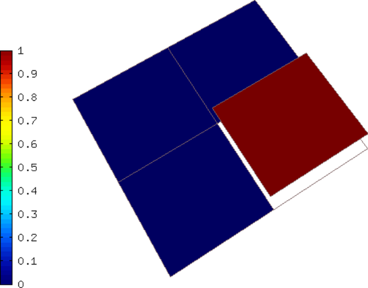
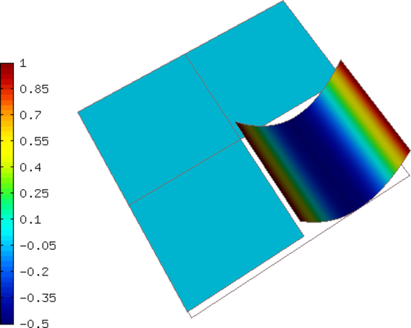
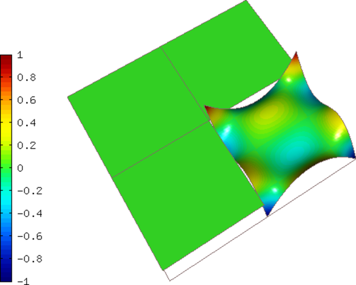

Space L2 (15-space-l2)
----------------------

**Git reference:** Tutorial example `15-space-l2 <http://git.hpfem.org/hermes.git/tree/HEAD:/hermes2d/tutorial/P08-miscellaneous/15-space-l2>`_. 

The $L^2$ space is frequently used in `Navier-Stokes equations 
<http://hpfem.org/hermes/doc/src/hermes2d/examples/navier-stokes.html>`_ where 
it keeps the velocity discreetely divergence-free. This example shows how to 
create an $L^2$ space, visualize finite element basis functions, and perform 
an orthogonal $L^2$-projection of a continuous function onto the FE space.

First, an $L^2$ space is created as the reader expects::

    // Create an L2 space with default shapeset.
    L2Space space(&mesh, P_INIT);

The function to be projected is::

    scalar CustomExactSolution::value (double x, double y) const 
    {
      return - pow(x, 4) * pow(y, 5); 
    }

And the projection is done as follows::

    OGProjection::project_global(&space, &sln_exact, &sln, matrix_solver);

Sample basis functions:

.. figure:: 15-space-l2/fn1.png
   :align: center
   :scale: 45% 
   :figclass: align-center
   :alt: Sample basis function

The projection (note that this is a discontinuous function):

.. figure:: 15-space-l2/sol.png
   :align: center
   :scale: 45% 
   :figclass: align-center
   :alt: Projection
