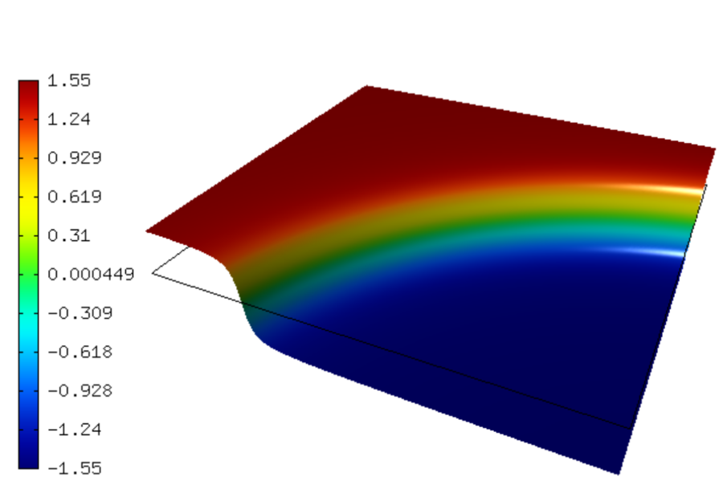
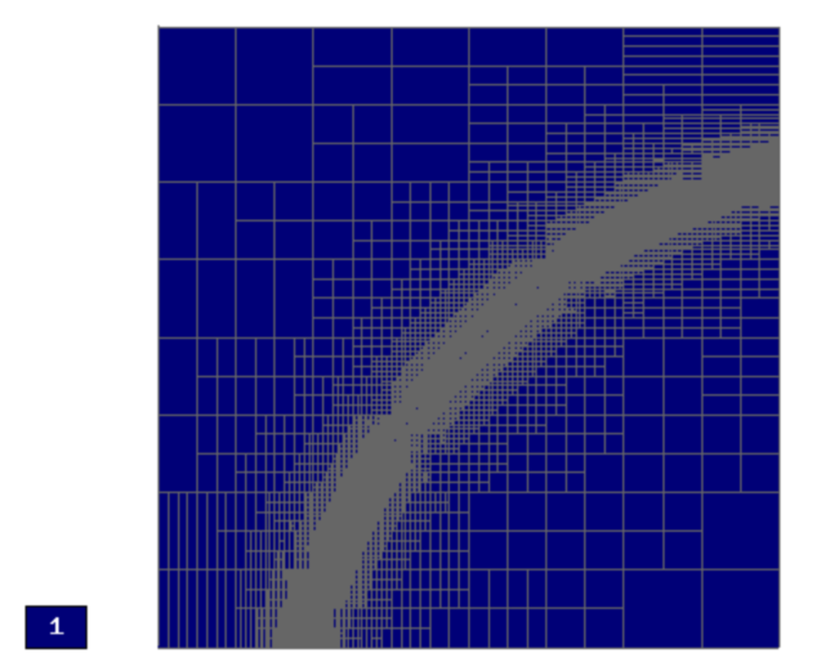
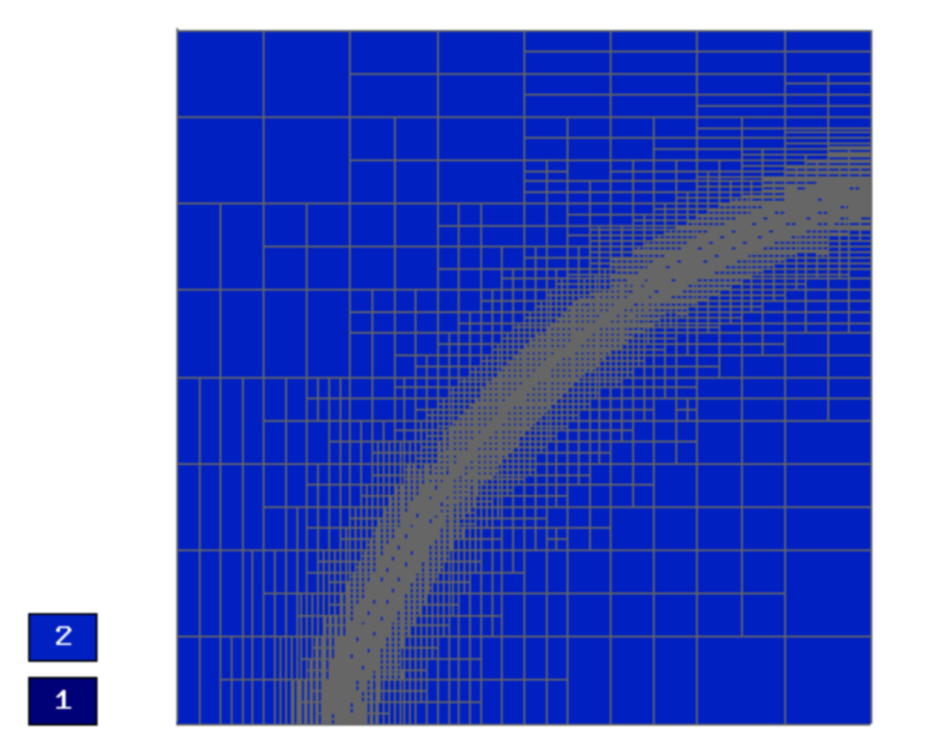
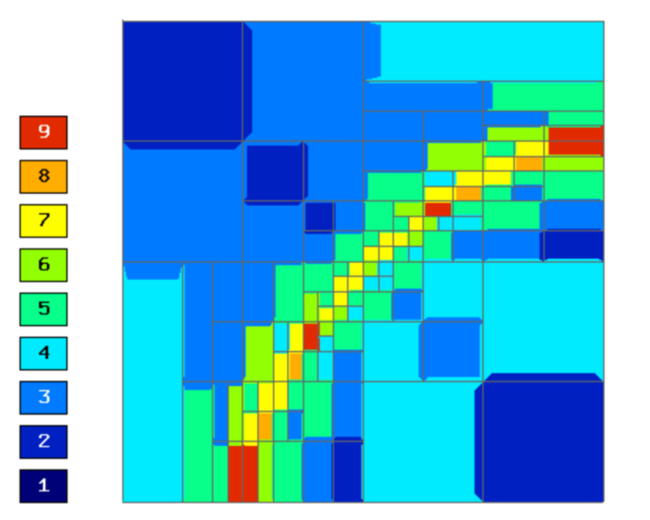
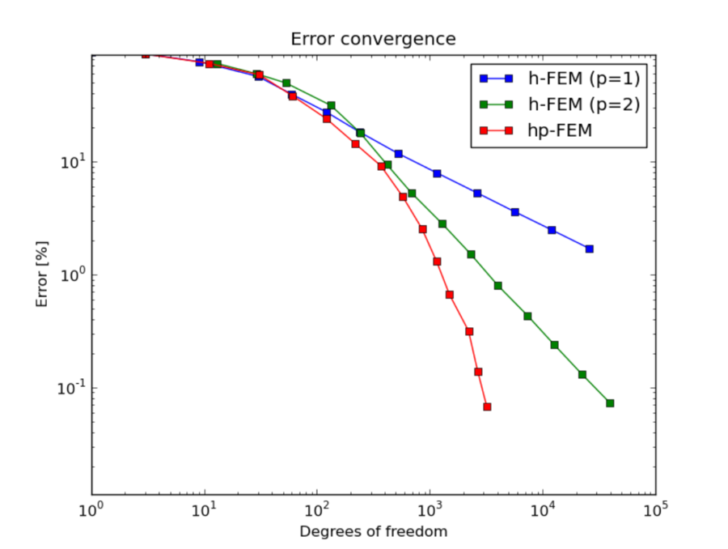
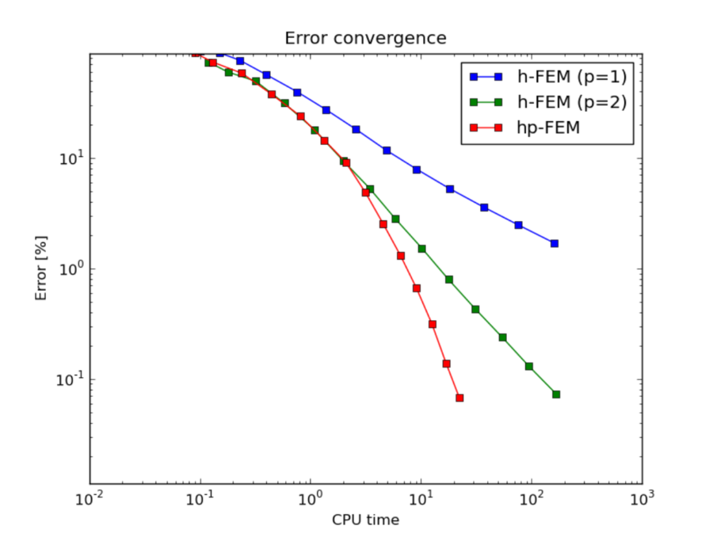

Interior Layer (Elliptic)
-------------------------

**Git reference:** Benchmark `layer-interior <http://git.hpfem.org/hermes.git/tree/HEAD:/hermes2d/benchmarks-general/layer-interior>`_.

This example has a smooth solution that exhibits a steep interior layer.

Model problem
~~~~~~~~~~~~~

Equation solved: Poisson equation 

.. math::
    :label: layer-interior

       -\Delta u - f = 0.

Domain of interest: Unit square $(0, 1)^2$.

Exact solution
~~~~~~~~~~~~~~

.. math::
    :label: layer-interior-exact

    u(x, y) = \mbox{atan}\left(S \sqrt{(x-1.25)^2 + (y+0.25)^2} - \pi/3\right).

where $S$ is a parameter (slope of the layer). With larger $S$, this problem 
becomes difficult for adaptive algorithms, and at the same time the advantage of 
adaptive $hp$-FEM over adaptive low-order FEM becomes more significant. We will 
use $S = 60$ in the following.

Right-hand side
~~~~~~~~~~~~~~~

Obtained by inserting the exact solution into the equation:

.. math::
    :label: layer-interior-rhs
 
    f(x, y) = 
    \frac{27}{2} (2y + 0.5)^2 (\pi - 3t) \frac{S^3}{u^2 t_2} +
    \frac{27}{2} (2x - 2.5)^2 (\pi - 3t) \frac{S^3}{u^2 t_2}
    - \frac{9}{4} (2y + 0.5)^2 \frac{S}{u t^3} -
    \frac{9}{4} (2x - 2.5)^2 \frac{S}{u t^3} +
    18 \frac{S}{ut}.

Boundary conditions
~~~~~~~~~~~~~~~~~~~

Nonconstant Dirichlet, matching the exact solution.

Sample solution
~~~~~~~~~~~~~~~

Convergence comparison
~~~~~~~~~~~~~~~~~~~~~~

Final mesh (h-FEM with linear elements):

Final mesh (h-FEM with quadratic elements):

Final mesh (hp-FEM):

DOF convergence graphs:

CPU time convergence graphs:

