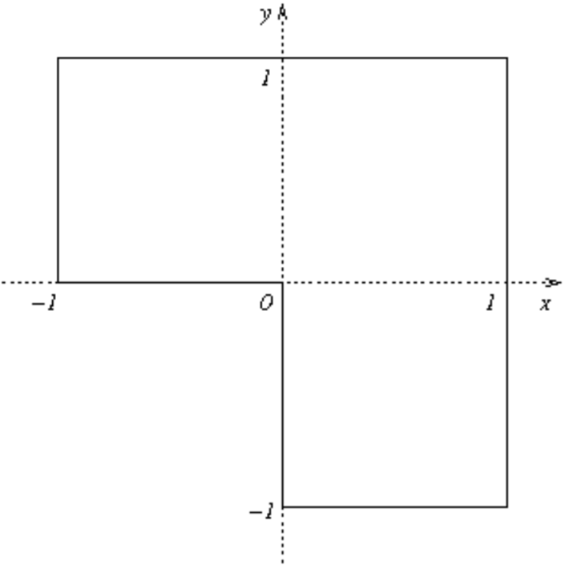
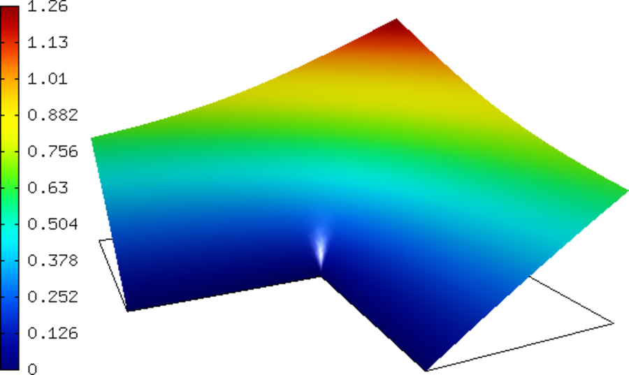
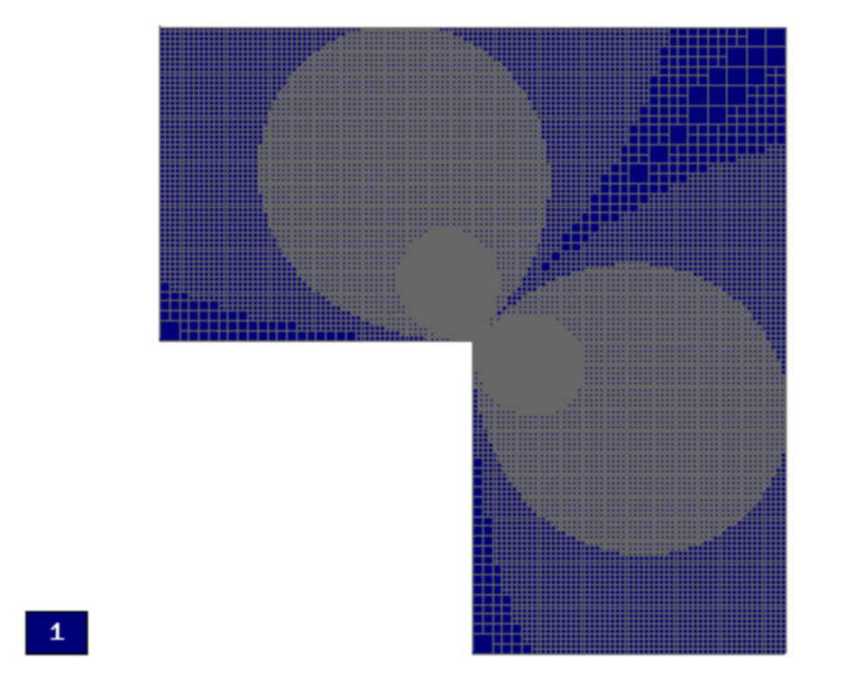
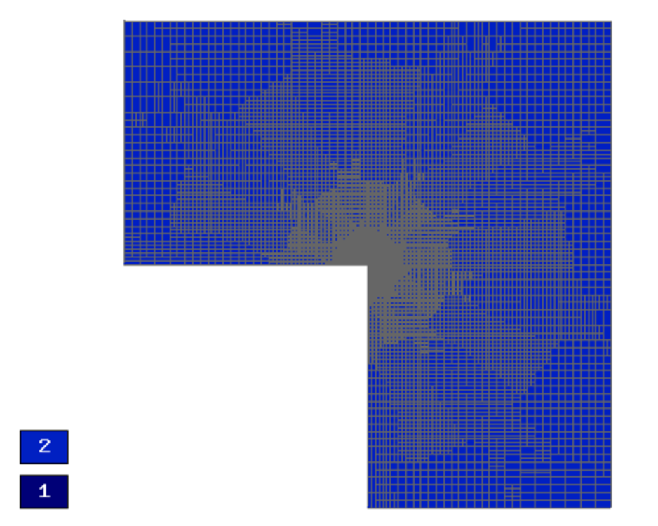
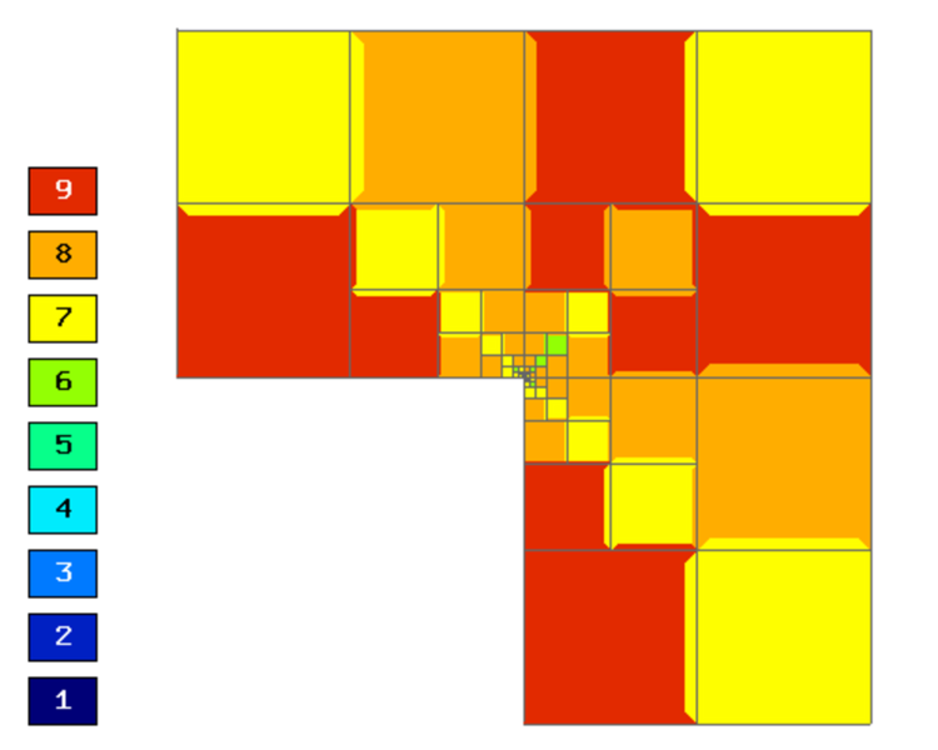
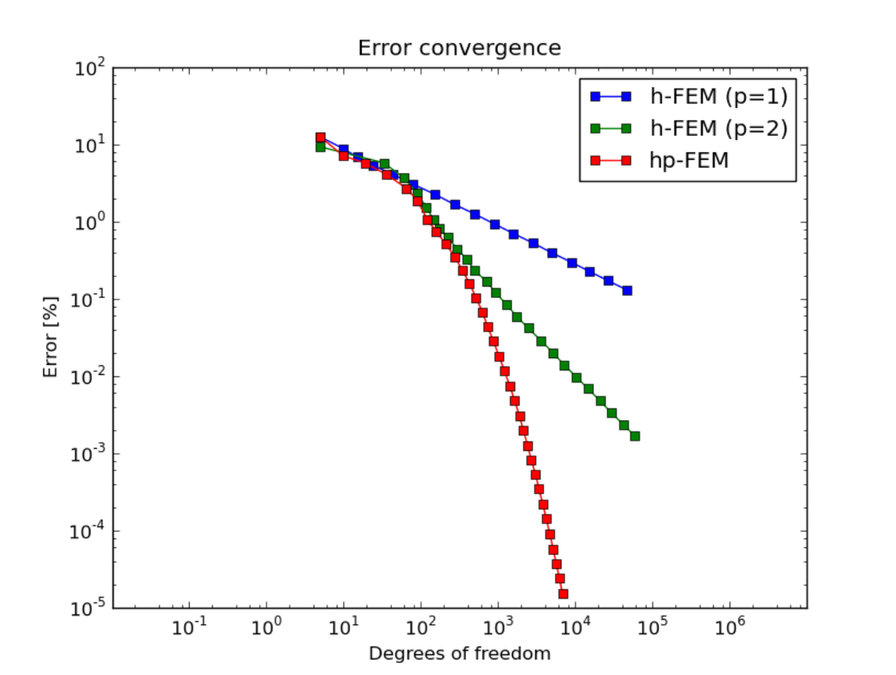
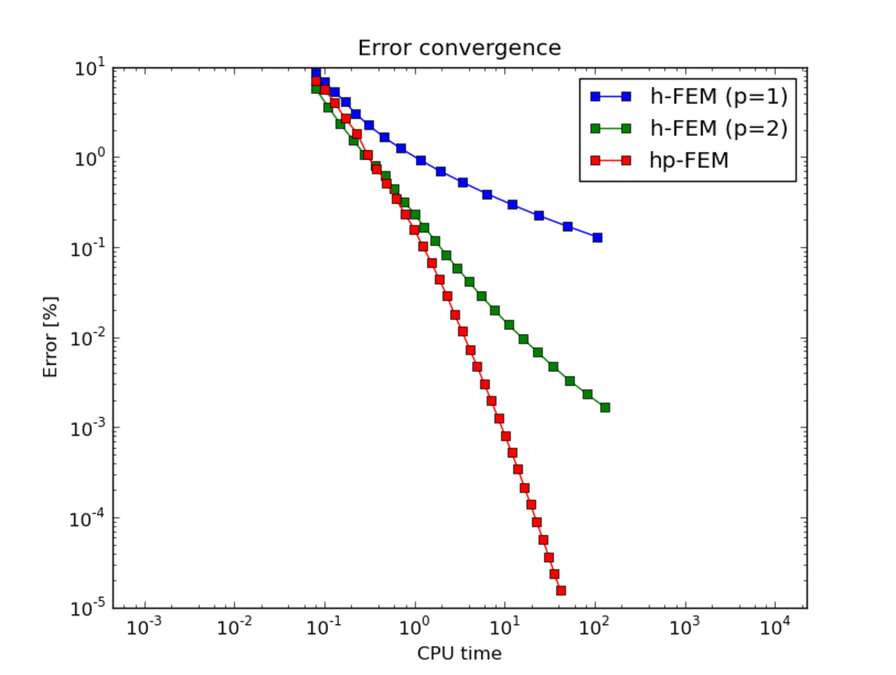

L-Shape (Elliptic)
------------------

**Git reference:** Benchmark `lshape <http://git.hpfem.org/hermes.git/tree/HEAD:/hermes2d/benchmarks-general/lshape>`_.

This is a standard adaptivity benchmark whose exact solution is smooth but
contains singular gradient in a re-entrant corner. 

Model problem
~~~~~~~~~~~~~

Equation solved: Laplace equation 

.. math::
    :label: lshape

       -\Delta u = 0.

Domain of interest:

Exact solution
~~~~~~~~~~~~~~

.. math::
    :label: lshape-exact

    u(x, y) = r^{2/3}\sin(2a/3 + \pi/3)

where $r(x,y) = \sqrt{x^2 + y^2}$ and $a(x,y) = \mbox{atan}(x/y)$. 

Boundary conditions
~~~~~~~~~~~~~~~~~~~

Nonconstant Dirichlet, matching the exact solution.

Sample solution
~~~~~~~~~~~~~~~

Convergence comparisons
~~~~~~~~~~~~~~~~~~~~~~~

Final mesh (h-FEM with linear elements):

Final mesh (h-FEM with quadratic elements):

Final mesh (hp-FEM):

DOF convergence graphs:

CPU time convergence graphs:

