Two-Group Neutronics (Neutronics)
---------------------------------

**Git reference:** Benchmark `neutronics-2-group-adapt <http://git.hpfem.org/hermes.git/tree/HEAD:/hermes2d/benchmarks-general/neutronics-2-group-adapt>`_.

This benchmark uses automatic adaptivity to solve a system of weakly coupled elliptic PDEs describing diffusion of neutrons through given medium.
It employs the simple (yet often used in practice) two-group approximation by which all neutrons are divided into two distinct groups according to their energy (speed). This leads to the system of two equations shown below.

Model problem
~~~~~~~~~~~~~

Equations solved:

.. math::
    :label: neutronics-2g

    - \nabla \cdot D_1 \nabla \phi_1 + \Sigma_{r1}\phi_1 - \nu\Sigma_{f1} \phi_1 - \nu\Sigma_{f2} \phi_2 - Q_1 = 0,\\
    - \nabla \cdot D_2 \nabla \phi_2 + \Sigma_{r2}\phi_2 - \Sigma_{s,2\leftarrow 1} \phi_1 - Q_2 = 0.    

For the physical meaning of the various material parameters, see the example 4-Group Neutronics.
Their numerical values for this benchmark are given below.

Domain of interest: 

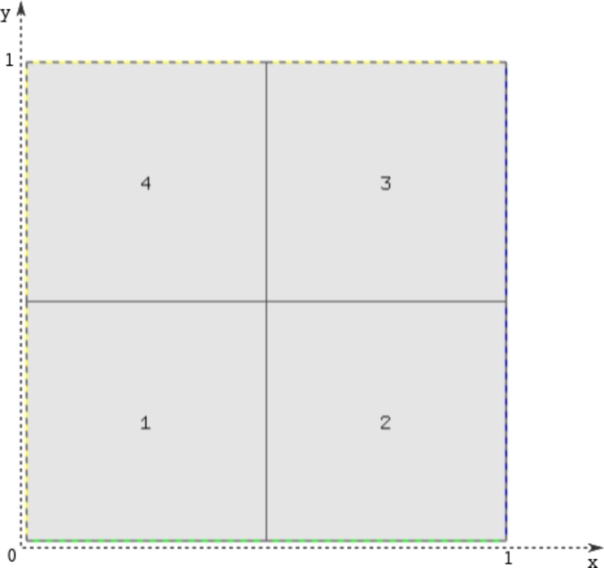

Material properties
~~~~~~~~~~~~~~~~~~~

Piecewise constant material properties for the four regions of the domain (reactor core) and each energy 
group are specified by the following code::

  const double D[4][2]  = { {1.12, 0.6},
                            {1.2, 0.5},
                            {1.35, 0.8},
                            {1.3, 0.9}	};
  const double Sr[4][2] = { {0.011, 0.13},
                            {0.09, 0.15},
                            {0.035, 0.25},
                            {0.04, 0.35}	};
  const double nSf[4][2]= { {0.0025, 0.15},
                            {0.0, 0.0},
                            {0.0011, 0.1},
                            {0.004, 0.25}	};
  const double chi[4][2]= { {1, 0},
                            {1, 0},
                            {1, 0},
                            {1, 0} };
  const double Ss[4][2][2] = { 
                               { { 0.0, 0.0 },
                                 { 0.05, 0.0 }  },
                               { { 0.0, 0.0 },
                                 { 0.08, 0.0 }  },
                               { { 0.0, 0.0 },
                                 { 0.025, 0.0 } },
                               { { 0.0, 0.0 },
                                 { 0.014, 0.0 } } 
                             };
                             
Boundary conditions
~~~~~~~~~~~~~~~~~~~

Typical conditions for nuclear reactor core calculations are used:

* zero Neumann on left and top edge (axes of symmetry),
* zero Dirichlet on bottom edge (neutron-inert medium around the reactor core),
* Newton condition on right edge (neutron-reflecting medium around the core):

.. math:: 

    -\frac{\partial D_1\phi_1}{\partial n} = \gamma_1 \phi_1, \quad\quad -\frac{\partial D_2\phi_2}{\partial n} = \gamma_2 \phi_2,
  
where the *reflector albedo* :math:`\gamma` is given by the exact solution and is equal for both groups to 8.

Exact solution 
~~~~~~~~~~~~~~

Quite complicated, see the source code.

Right-hand side
~~~~~~~~~~~~~~~

Obtained by inserting the exact solution into the equation.
The function *get_material* is used to obtain the material marker given the physical coordinates (see 
`main.cpp <http://git.hpfem.org/hermes.git/blob/HEAD:/hermes2d/benchmarks-general/neutronics-2-group-adapt/main.cpp>`_). 

The following picture shows the two right-hand side functions (distribution of neutron sources/sinks) - :math:`Q_1` 
is plotted on the left, :math:`Q_2` on the right.

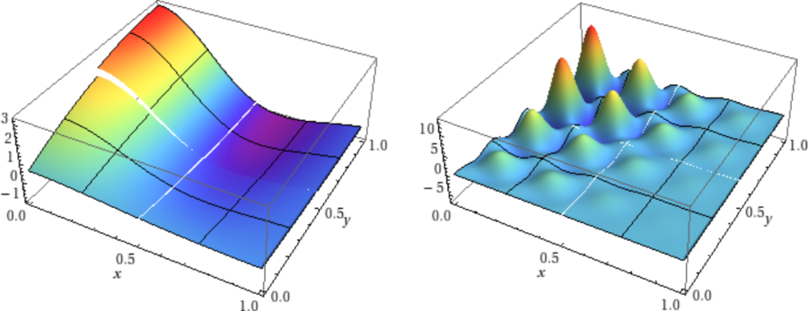
   
Weak formulation
~~~~~~~~~~~~~~~~

Weak formulation of the present two-group neutron diffusion problem with fixed source terms may be derived from the general multigroup formulation shown in the `4-Group Neutronics <http://hpfem.org/hermes/doc/src/hermes2d/examples.html#group-neutronics>`_ example. Concerning its implementation (see the file `forms.cpp <http://git.hpfem.org/hermes.git/blob/HEAD:/hermes2d/benchmarks-general/neutronics-2-group-adapt/forms.cpp>`_), it is worth noticing that we manually define a higher integration order for the volumetric linear forms to correctly integrate the non-polynomial source terms, although we may set it lower for the group-1 equations than for the group-2 equations as :math:`Q_1` is much smoother than :math:`Q_2`:

Sample results
~~~~~~~~~~~~~~

The following figures show the computed distributions of neutron flux for both neutron groups.

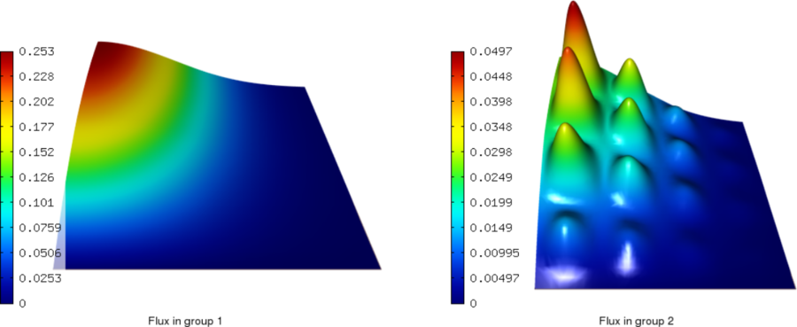

Notice the largely different behavior of the two solution components, where the first one is quite smooth while the other one more oscillating. It reflects the typical behavior observed in real cases, which arises from the different rate of interactions of fast (`1`\ :sup:`st` group) and slow (`2`\ :sup:`nd` group) neutrons with surrounding nuclei. This makes `multimesh <http://hpfem.org/hermes/doc/src/hermes2d/tutorial-2.html#multimesh-hp-fem>`_ a preferred choice for automatic adaptivity, as can be clearly seen from the first of the series of convergence comparisons presented below. 

In each convergence comparison, the reported error is the true approximation error calculated wrt. the exact solution given above and measured in a `H`\ :sup:`1` norm. The calculation was ended when the energy error estimate (often used to guide adaptivity in real multiphysics problems where exact solution is not known) became lower than 0.1%.

Comparison of single/multi-mesh hp-FEM 
~~~~~~~~~~~~~~~~~~~~~~~~~~~~~~~~~~~~~~

Final mesh (hp-FEM, single-mesh): 2590 DOF, error = 3.46787%

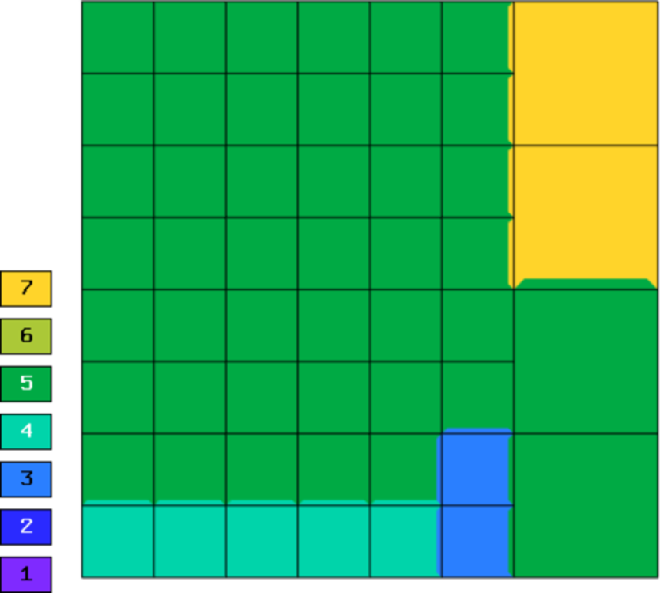

Final mesh (hp-FEM, multi-mesh): 1724 DOF, error = 3.46713%

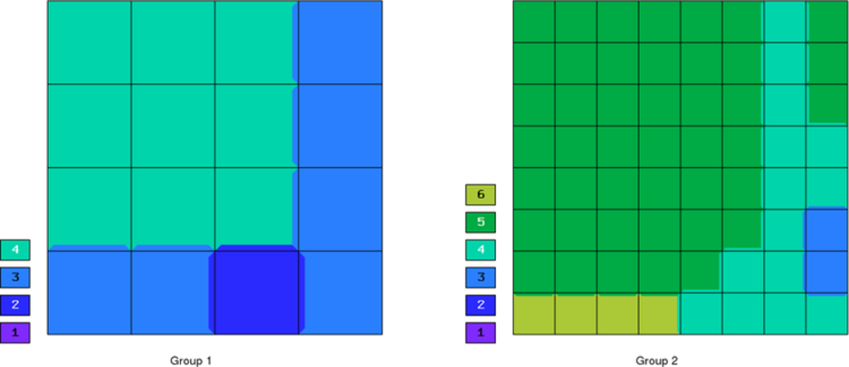

DOF convergence graphs:

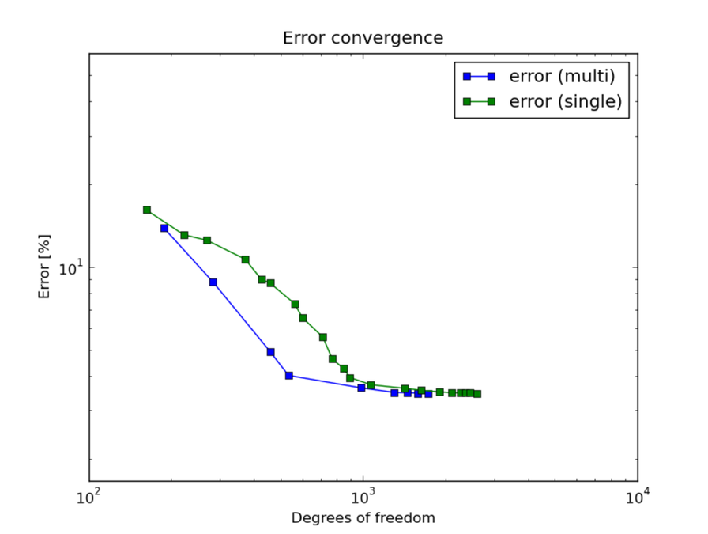

CPU convergence graphs:

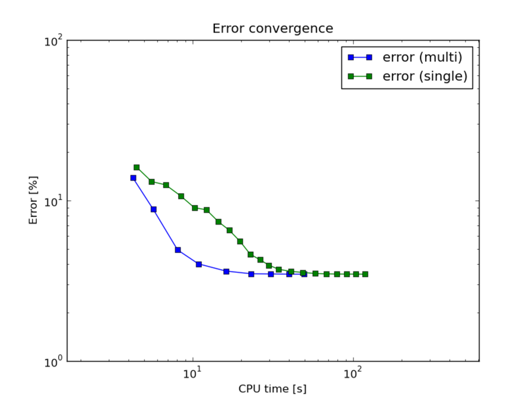
   
   
Comparison of h-FEM (p=1), h-FEM (p=2) and hp-FEM with h-anisotropic refinements
~~~~~~~~~~~~~~~~~~~~~~~~~~~~~~~~~~~~~~~~~~~~~~~~~~~~~~~~~~~~~~~~~~~~~~~~~~~~~~~~

Now, with multimesh enabled, we proceed to compare h-adaptivity with fixed order of approximation with hp-adaptivity. Note that in the first case of linear elements, the calculation had to be ended prematurely because of insufficient memory for reference calculation (the energy error estimate was 1.24495%).

Final mesh (h-FEM, p=1): 31441 DOF, error = 3.69096%

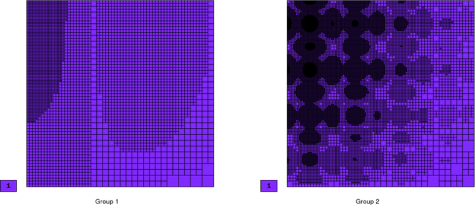
   
Final mesh (h-FEM, p=2): 27824 DOF, error = 3.46712%

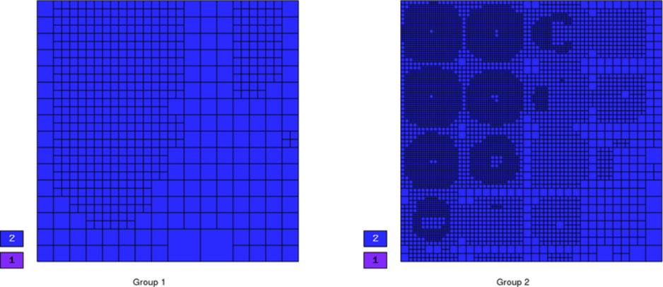

Final mesh (hp-FEM): 1724 DOF, error = 3.46713%

DOF convergence graphs:

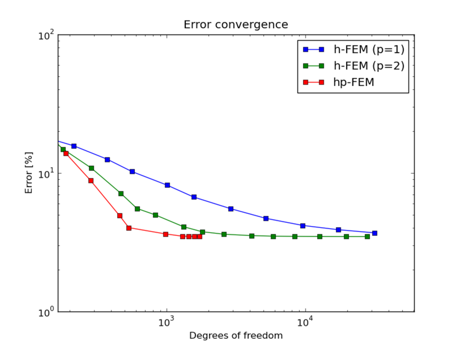

CPU convergence graphs:

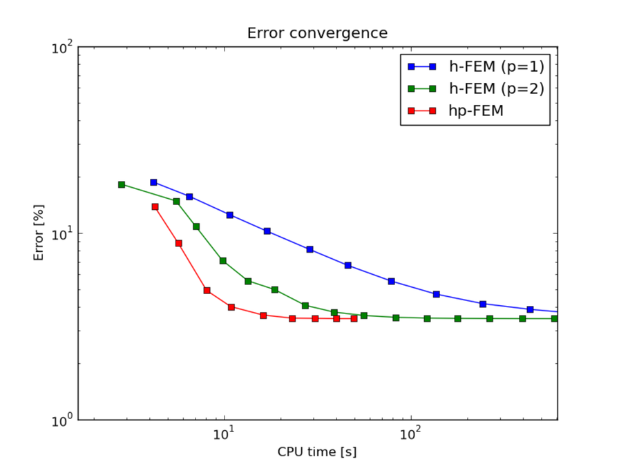
    
Comparison of hp-FEM with iso, p-aniso, h-aniso and hp-aniso refinements
~~~~~~~~~~~~~~~~~~~~~~~~~~~~~~~~~~~~~~~~~~~~~~~~~~~~~~~~~~~~~~~~~~~~~~~~

The solution is almost isotropic in this case and using the generally more expensive anisotropic refinements may not neccessarily result in better meshes (and errors). The possible strategies for capturing anisotropy are compared below. Note that only the p-anisotropic refinements produced better mesh (with a lower number of DOF) than the simple isotropic refinements, but took more time than would be justified for the increase in accuracy. 

Final mesh (hp-FEM, isotropic refinements): 1724 DOF, error = 3.46713%

Final mesh (hp-FEM, h-anisotropic refinements): 1768 DOF, error = 3.46731%

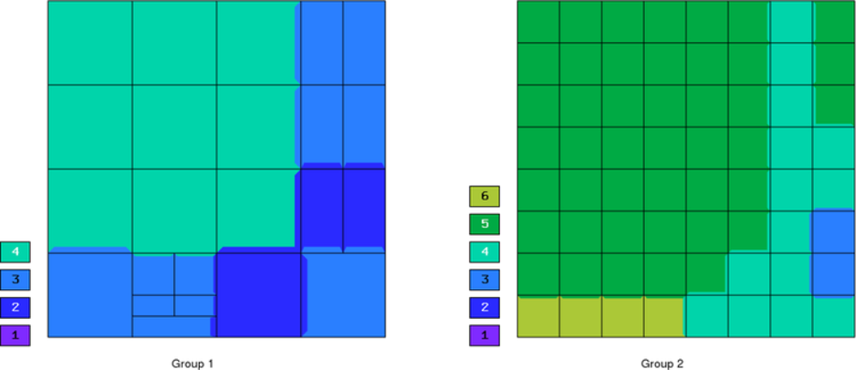
   
Final mesh (hp-FEM, p-anisotropic refinements): 1584 DOF, error = 3.46668%

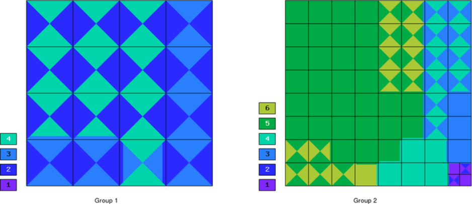

Final mesh (hp-FEM, hp-anisotropic refinements): 1926 DOF, error = 3.46626%

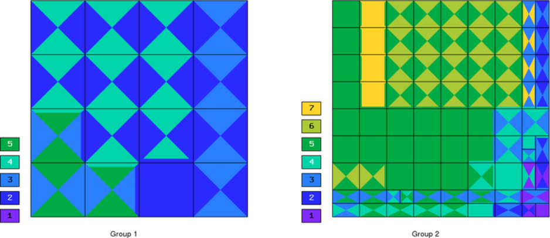

DOF convergence graphs:

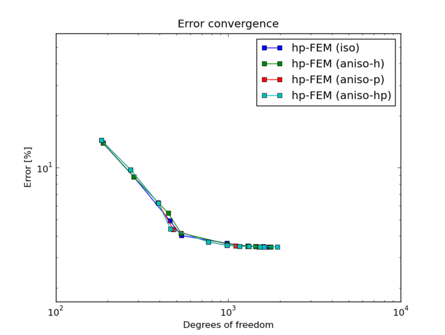

CPU convergence graphs:

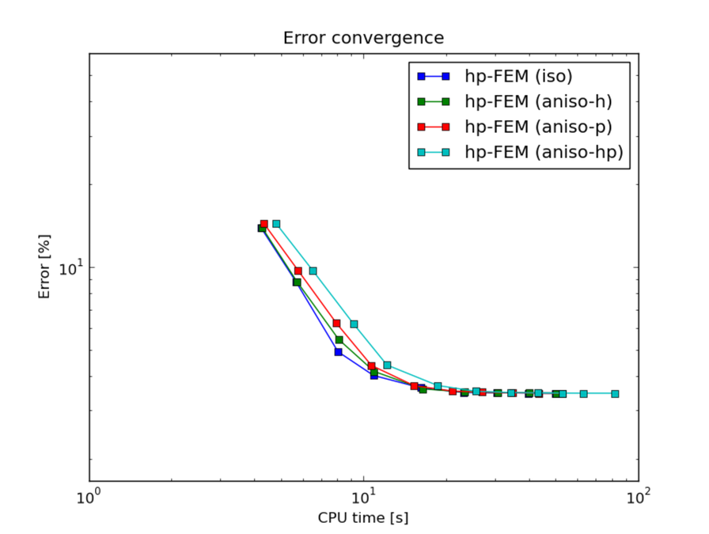
