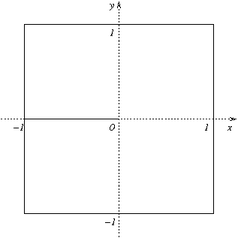
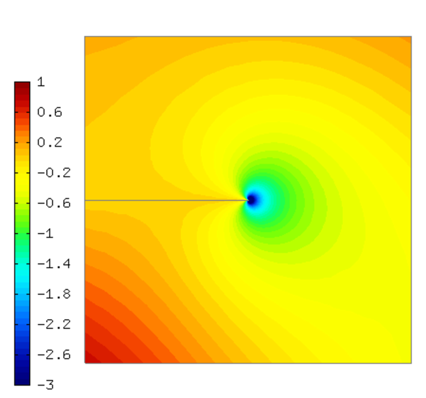
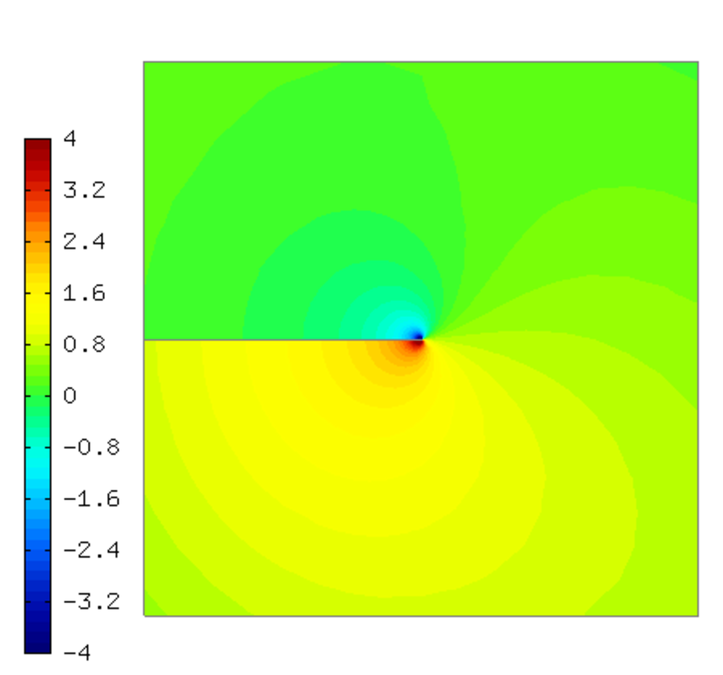
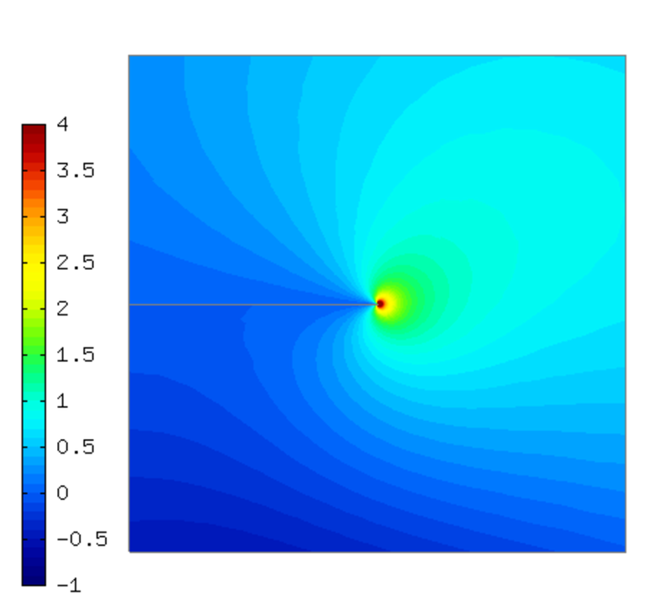
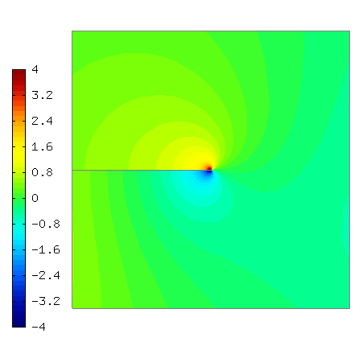
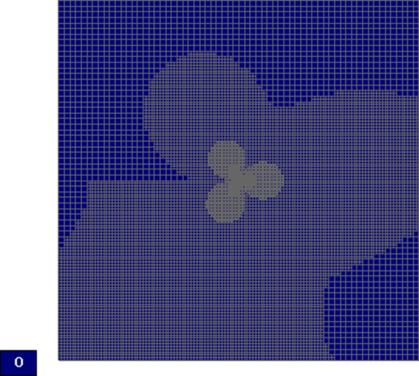
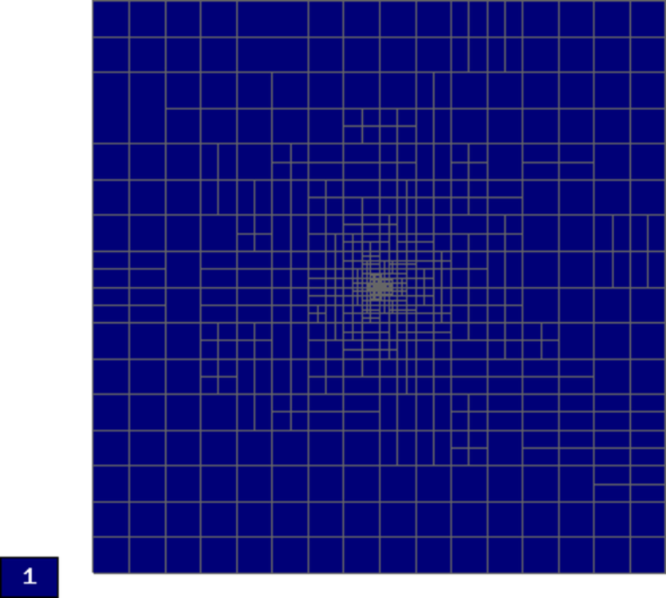
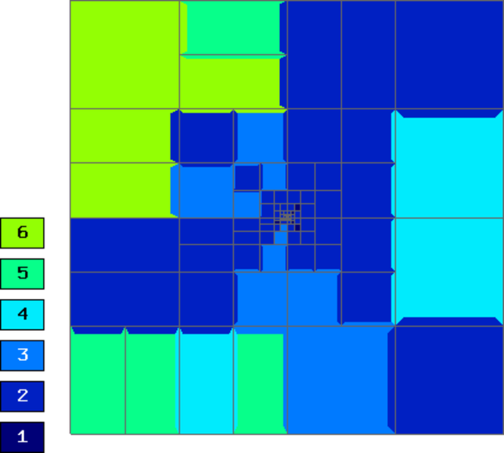
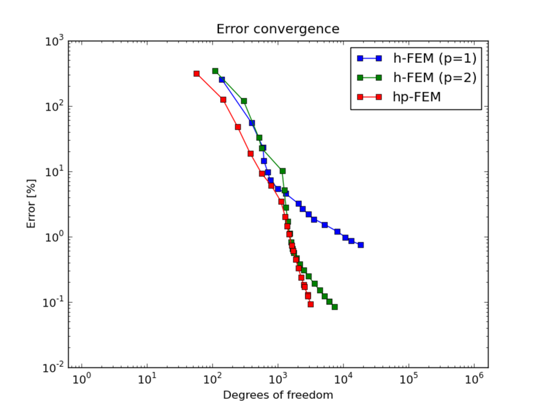
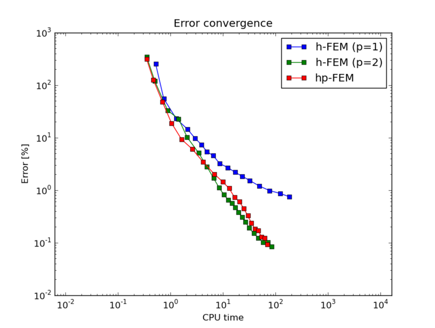

Screen (Maxwell's Equations)
----------------------------

**Git reference:** Benchmark `screen <http://git.hpfem.org/hermes.git/tree/HEAD:/hermes2d/benchmarks-general/screen>`_.

This example solves time-harmonic Maxwell's equations. It describes an electromagnetic wave that 
hits a thin screen under the angle of 45 degrees, causing a singularity at the tip of the screen.
The strength of the singularity makes this example rather difficult. 

Model problem
~~~~~~~~~~~~~

Equation solved: Time-harmonic Maxwell's equations

.. math::
    :label: screen

    \frac{1}{\mu_r} \nabla \times \nabla \times E - \kappa^2 \epsilon_r E = \Phi.

Domain of interest is the square $(-1,1)^2$ missing the edge that connects the center with 
the midpoint of the left side. It is filled with air:

Boundary conditions
~~~~~~~~~~~~~~~~~~~

Tangential component of solution taken from known exact solution (essential BC). 

Exact solution 
~~~~~~~~~~~~~~

This is rather complicated in this case - see the file 
`definitions.cpp <http://git.hpfem.org/hermes.git/blob/HEAD:/hermes2d/benchmarks-general/screen/definitions.cpp>`_.

Sample solution
~~~~~~~~~~~~~~~

Real part of $E_1$:

Real part of $E_2$:

Imaginary part of $E_1$:

Imaginary part of $E_2$:

Convergence comparisons
~~~~~~~~~~~~~~~~~~~~~~~

Final mesh (h-FEM with linear elements):

Note that the polynomial order indicated corresponds to the tangential components 
of approximation on element interfaces, not to polynomial degrees inside the elements
(those are one higher).

Final mesh (h-FEM with quadratic elements):

Final mesh (hp-FEM):

DOF convergence graphs:

CPU time convergence graphs:

   
   
