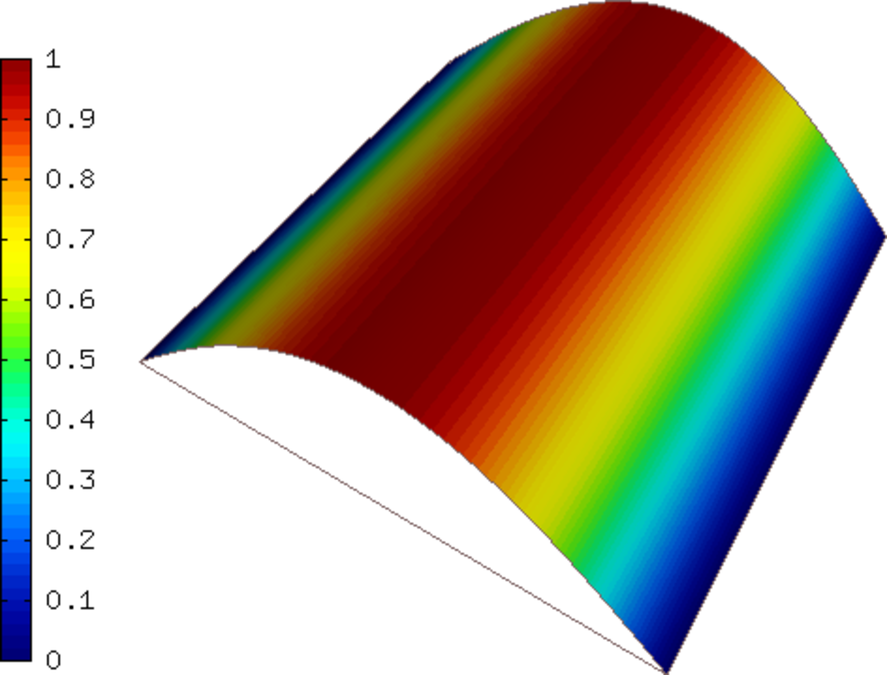
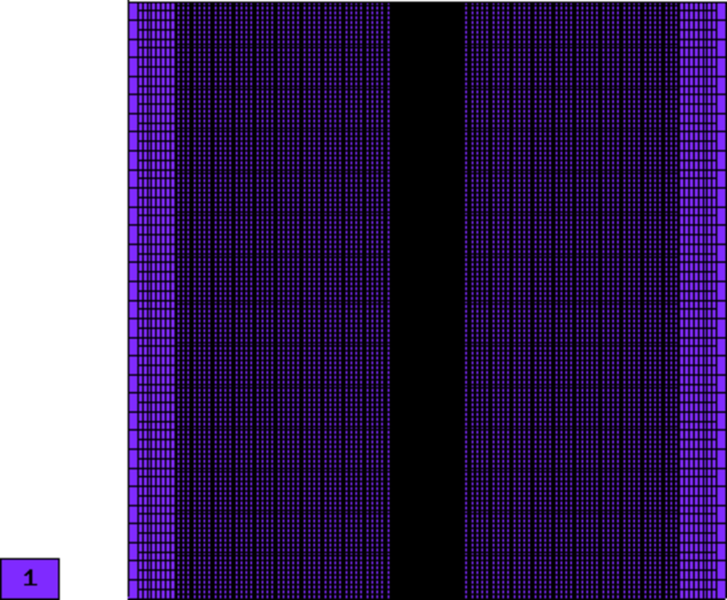
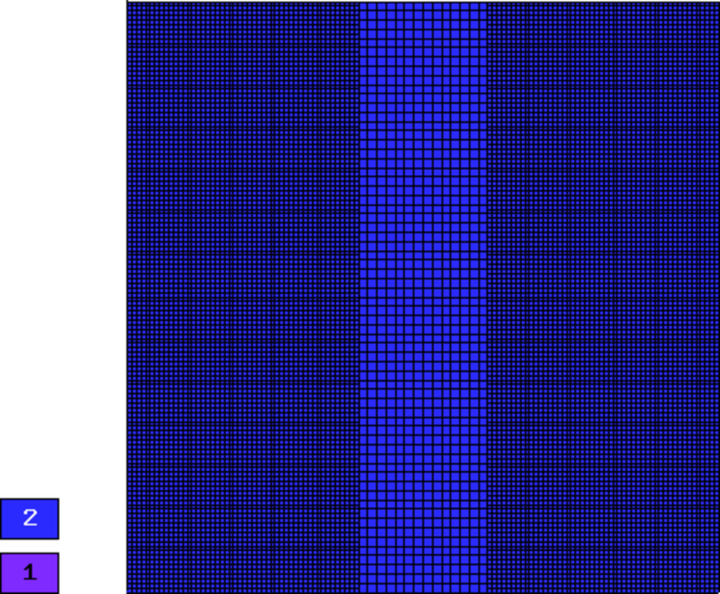
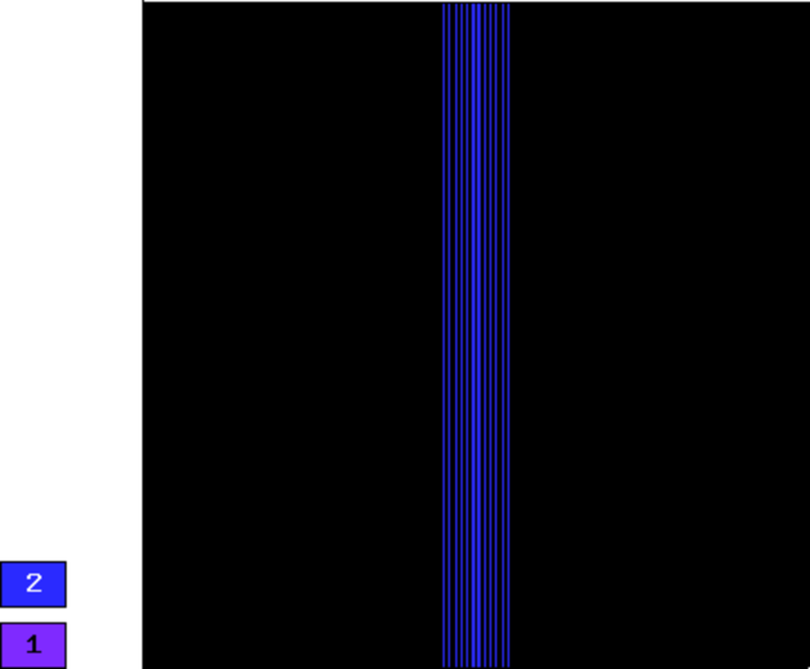
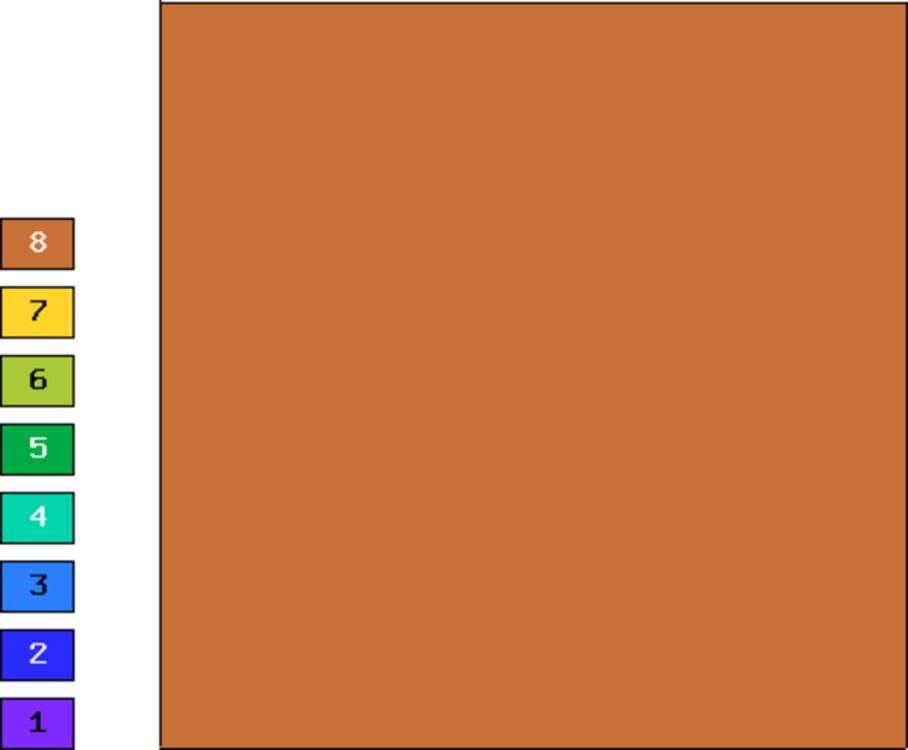
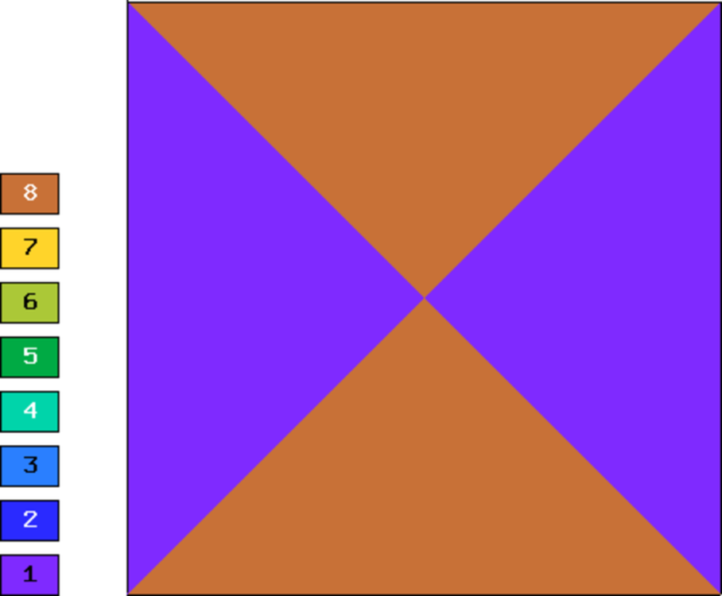
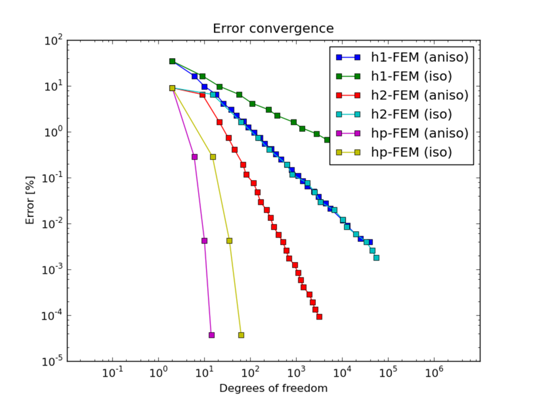
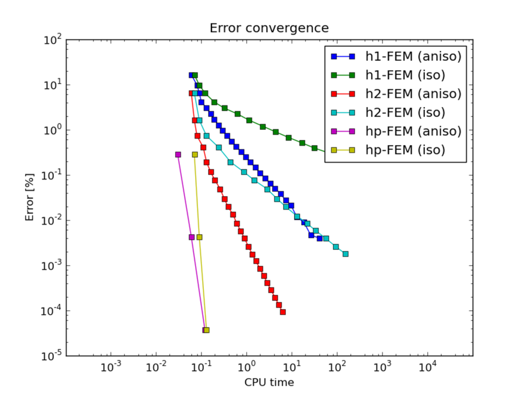

Smooth-aniso-x (Elliptic)
-------------------------

**Git reference:** Benchmark `smooth-aniso-x <http://git.hpfem.org/hermes.git/tree/HEAD:/hermes2d/benchmarks-general/smooth-aniso-x>`_.

We show that one should use (spatially as well as polynomially) anisotropic refinements for solutions 
containing anisotropy. 

Model problem
~~~~~~~~~~~~~

Equation solved: Poisson equation 

.. math::
    :label: sin

       -\Delta u - f = 0.

Domain of interest: Square $(0, \pi)^2$.

Right-hand side:

.. math::
    :label: sin-rhs
 
    f(x, y) = \sin(x).

Boundary conditions: Zero Dirichlet on the left edge, zero Neumann on the top and bottom edges.
Nonzero Neumann $\partial u / \partial n = -1$ on the right edge.
The nonzero Neumann yields a surface linear form.

Exact solution
~~~~~~~~~~~~~~

.. math::
    :label: sin-exact

    u(x, y) = \sin(x).

As an image:

Convergence comparisons
~~~~~~~~~~~~~~~~~~~~~~~

Below we show meshes obtained using various types of adaptivity. 
Note the tremendous differences in their performance. The meshes do not correspond to 
the same level of accuracy since the low-order methods could not achieve the same error 
as hp-FEM. Therefore, compare not only the number of DOF but also the error level. 
Convergence graphs for all cases are shown at the end of this section.

Final mesh (h-FEM, p=1, isotropic refinements): 41033 DOF, error 0.22875054074711 %

Final mesh (h-FEM, p=1, anisotropic refinements): 39594 DOF, error 0.0039444224349215 %

Final mesh (h-FEM, p=2, isotropic refinements): 54627 DOF, error 0.0017755772528929 %

Final mesh (h-FEM, p=2, anisotropic refinements): 3141 DOF, error 9.3084842840514e-05 %

Final mesh (hp-FEM, isotropic refinements): 63 DOF, error = 3.6797337289125e-05 %

Final mesh (hp-FEM, anisotropic refinements): 14 DOF, error 3.6797337292196e-05 %, The 
color pattern means that the polynomial degrees are one and eight in the vertical and 
horizontal directions, respectively.

DOF convergence graphs:

CPU time convergence graphs:

