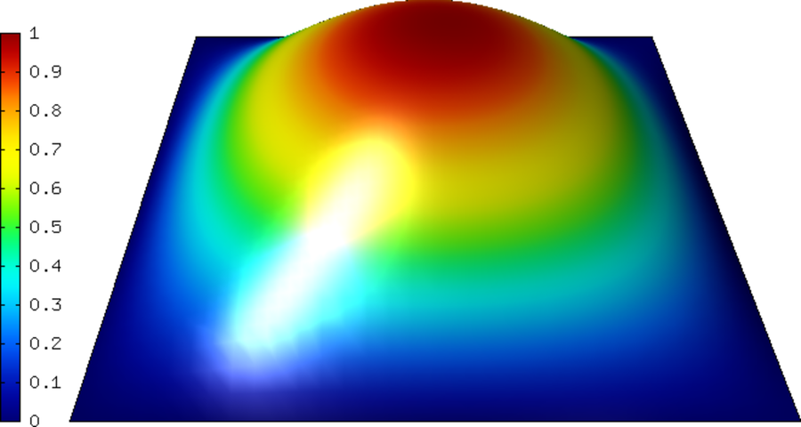
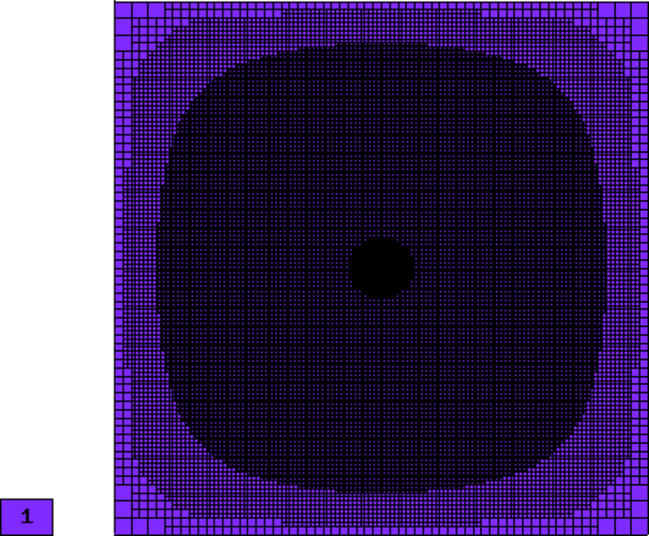
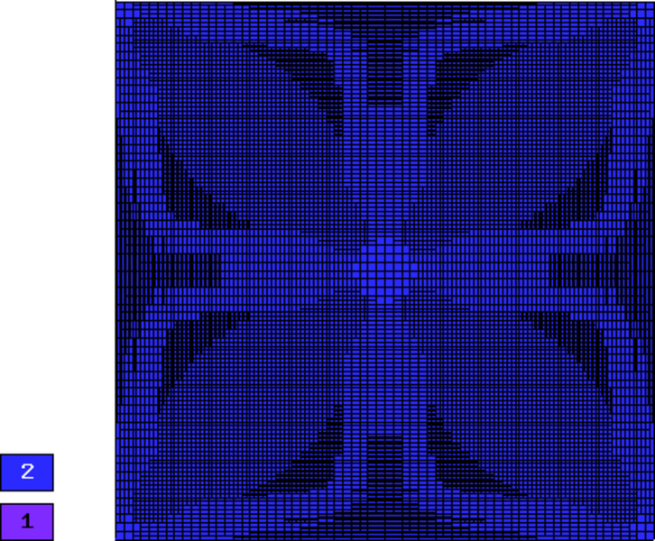
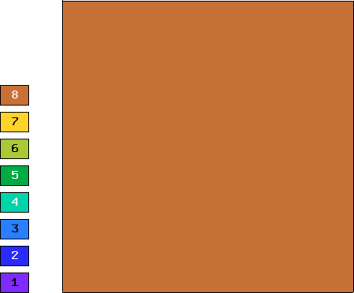
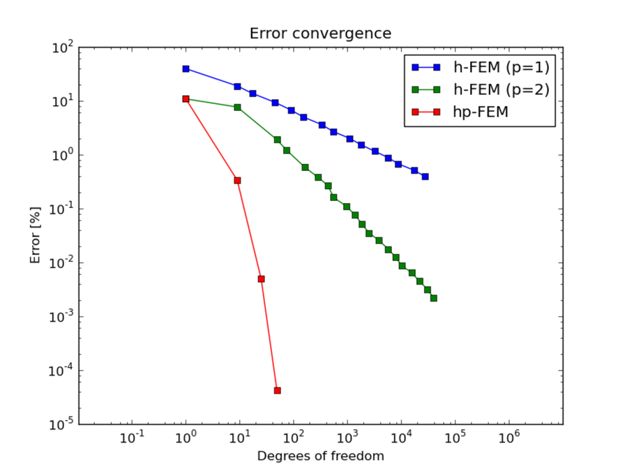
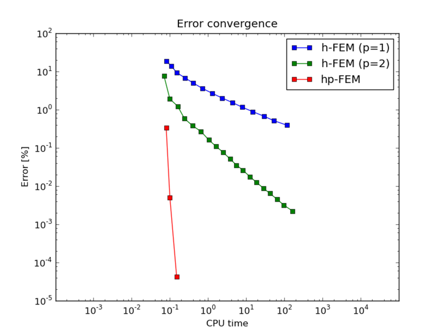

Smooth-iso (Elliptic)
---------------------

**Git reference:** Benchmark `smooth-iso <http://git.hpfem.org/hermes.git/tree/HEAD:/hermes2d/benchmarks-general/smooth-iso>`_.

We show that it is a very bad idea to approximate smooth solutions using low-order 
elements.

Model problem
~~~~~~~~~~~~~

Equation solved: Poisson equation 

.. math::
    :label: smooth-iso

       -\Delta u - f = 0.

Domain of interest: Square $(0, \pi)^2$.

Right-hand side:

.. math::
    :label: smooth-iso-rhs
 
    f(x, y) = 2\sin(x)\sin(y).

Boundary conditions: Zero Dirichlet. 

Exact solution
~~~~~~~~~~~~~~

.. math::
    :label: smooth-iso-exact

    u(x, y) = \sin(x)\sin(y).

Sample solution
~~~~~~~~~~~~~~~

Convergence comparisons
~~~~~~~~~~~~~~~~~~~~~~~

Below we show meshes obtained using various types of adaptivity. 
Note the tremendous differences in their performance. The meshes do not correspond to 
the same level of accuracy since the low-order methods could not achieve the same error 
as hp-FEM. Therefore, compare not only the number of DOF but also the error level. 
Convergence graphs for all cases are shown at the end of this section.

Final mesh (h-FEM, p=1): 27469 DOF, error 0.39173795799476 %

Final mesh (h-FEM, p=2): 39185 DOF, error 0.0022127484879974 %

Final mesh (hp-FEM): 49 DOF, error 4.2775412425017e-05 %

DOF convergence graphs:

CPU time convergence graphs:

