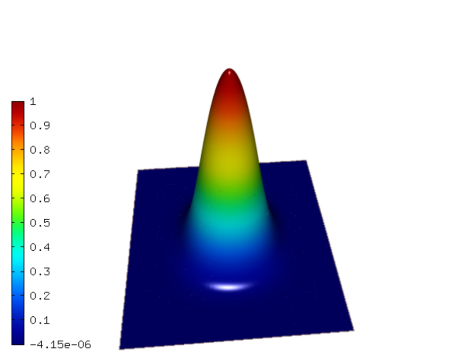
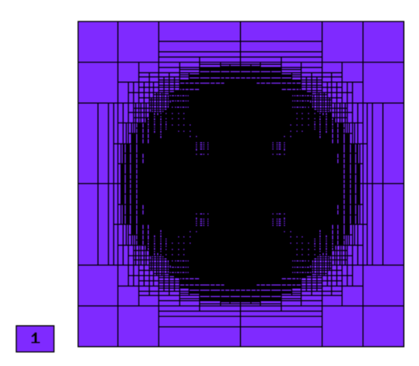
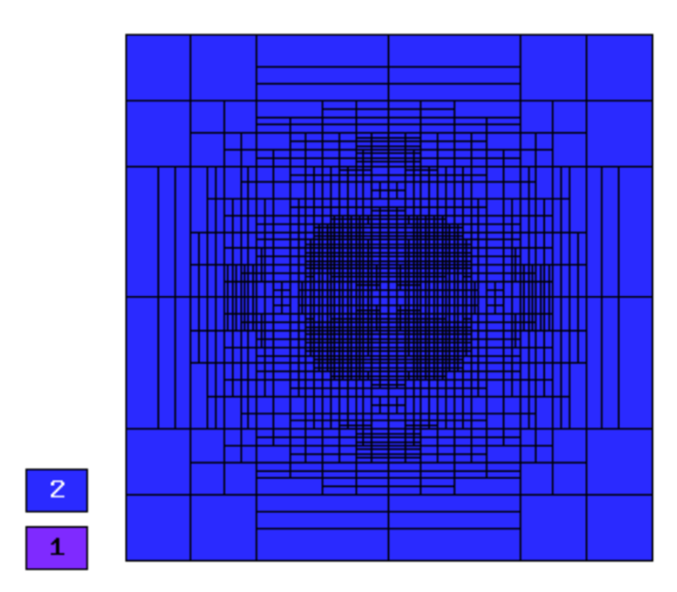
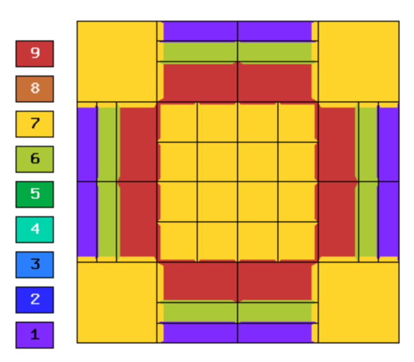
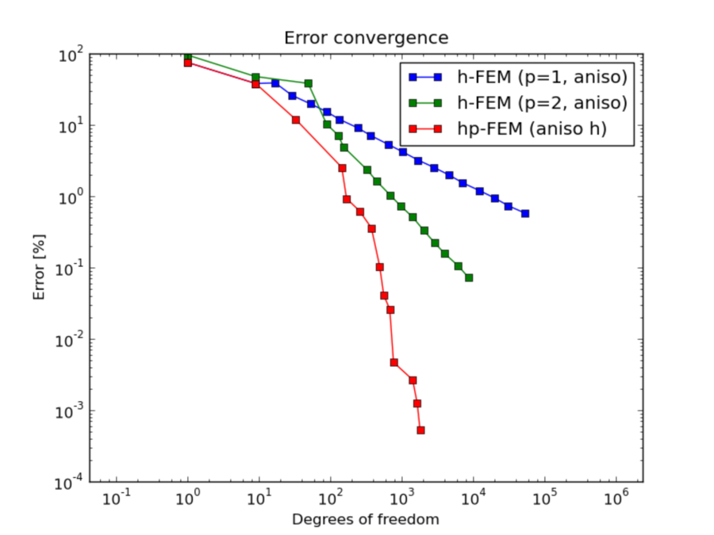
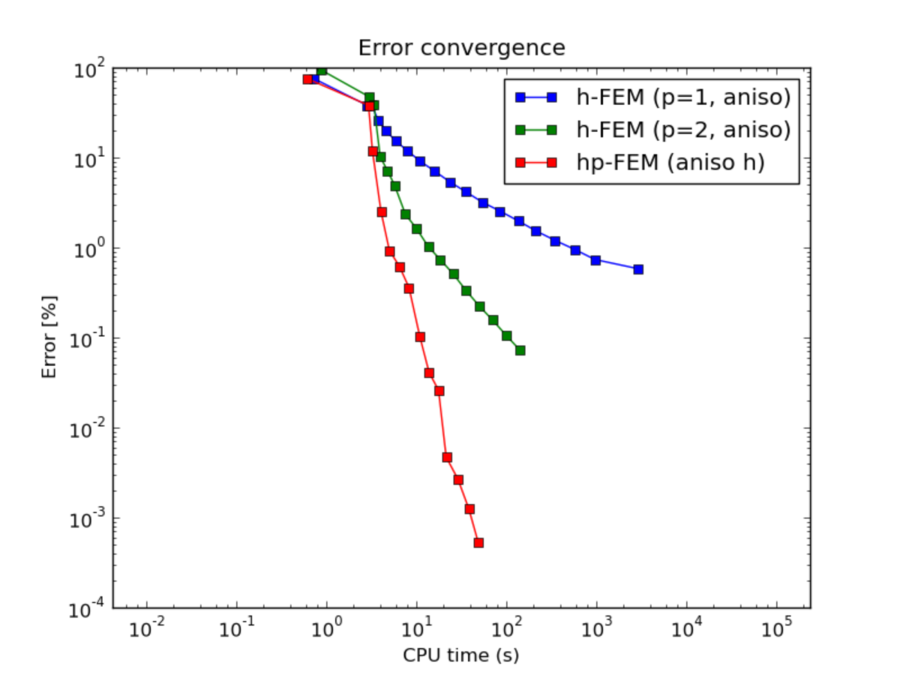
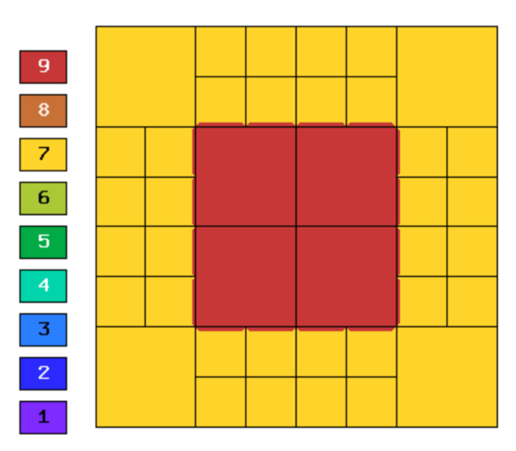
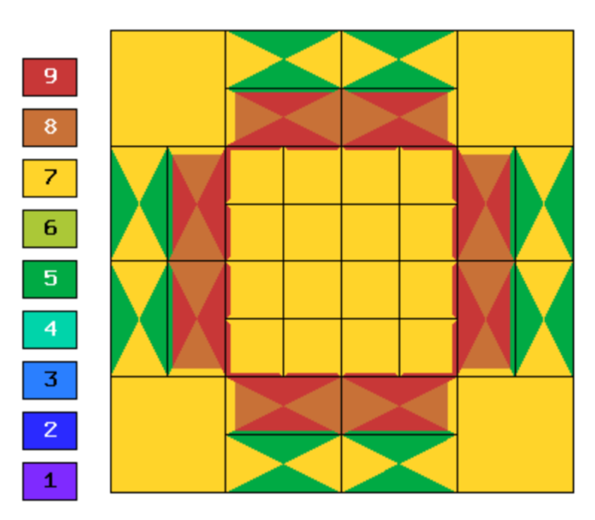
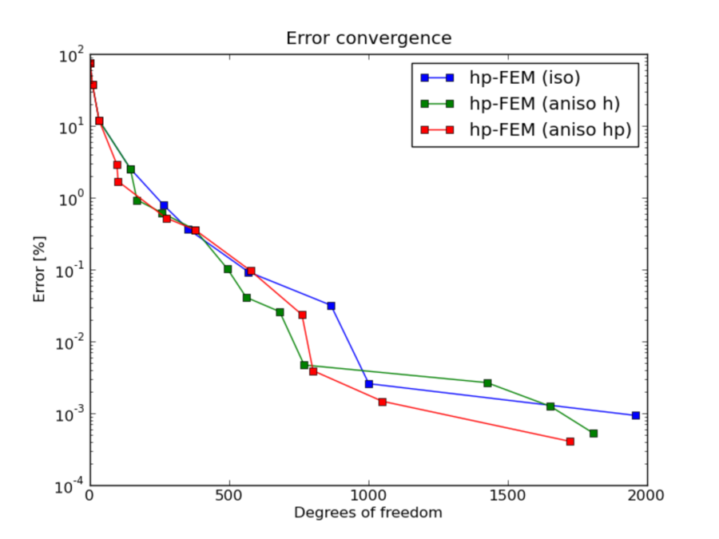
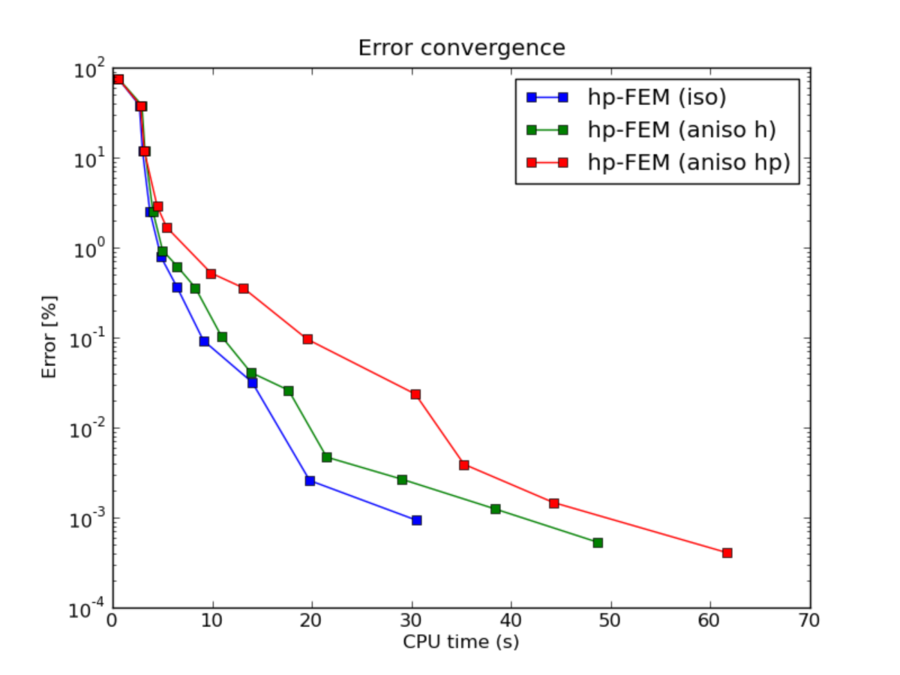

NIST-01 (Analytic Solution)
---------------------------

**Git reference:** Benchmark `01-analytic-solution <http://git.hpfem.org/hermes.git/tree/HEAD:/hermes2d/benchmarks-nist/01-analytic-solution>`_.

The purpose of this benchmark is to observe how an adaptive algorithm behaves in a context where 
adaptivity isn’t really needed (smooth solution). 

Model problem
~~~~~~~~~~~~~

Equation solved: Poisson equation 

.. math::
    :label: NIST-1

       -\Delta u - f = 0.

Domain of interest: Unit Square $(0, 1)^2$.

Boundary conditions: Dirichlet, given by exact solution.

Exact solution
~~~~~~~~~~~~~~

.. math::

    u(x,y) = 2^{4p}x^{p}(1-x)^{p}y^{p}(1-y)^p

where parameter $p$ determines the degree of the polynomial solution. 

Right-hand side 
~~~~~~~~~~~~~~~

Obtained by inserting the exact solution into the equation.

Sample solution
~~~~~~~~~~~~~~~

Solution for $p = 10$:

Comparison of h-FEM (p=1), h-FEM (p=2) and hp-FEM with anisotropic refinements
~~~~~~~~~~~~~~~~~~~~~~~~~~~~~~~~~~~~~~~~~~~~~~~~~~~~~~~~~~~~~~~~~~~~~~~~~~~~~~

Final mesh (h-FEM, p=1, anisotropic refinements):

Final mesh (h-FEM, p=2, anisotropic refinements):

Final mesh (hp-FEM, h-anisotropic refinements):

DOF convergence graphs:

CPU convergence graphs:

hp-FEM with iso, h-aniso and hp-aniso refinements
~~~~~~~~~~~~~~~~~~~~~~~~~~~~~~~~~~~~~~~~~~~~~~~~~

Final mesh (hp-FEM, isotropic refinements):

Final mesh (hp-FEM, h-anisotropic refinements):

Final mesh (hp-FEM, hp-anisotropic refinements):

DOF convergence graphs:

CPU convergence graphs:

