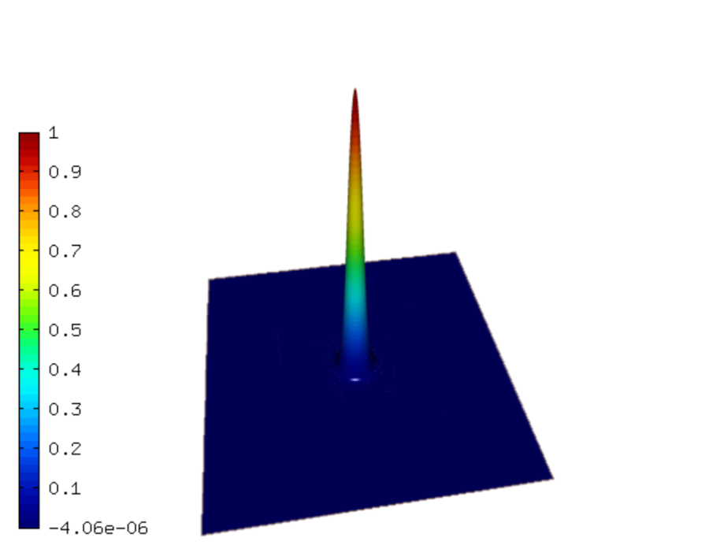
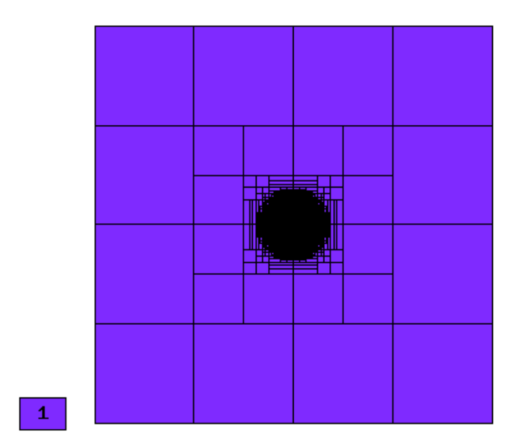
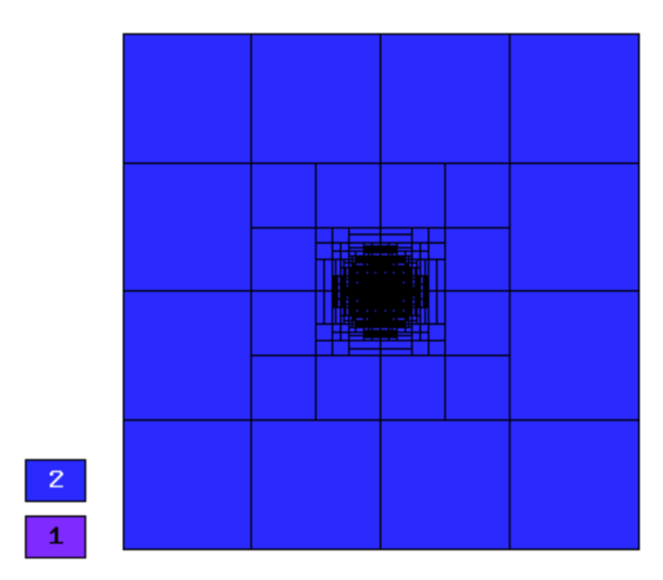
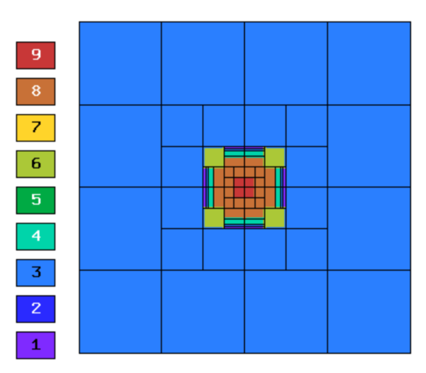
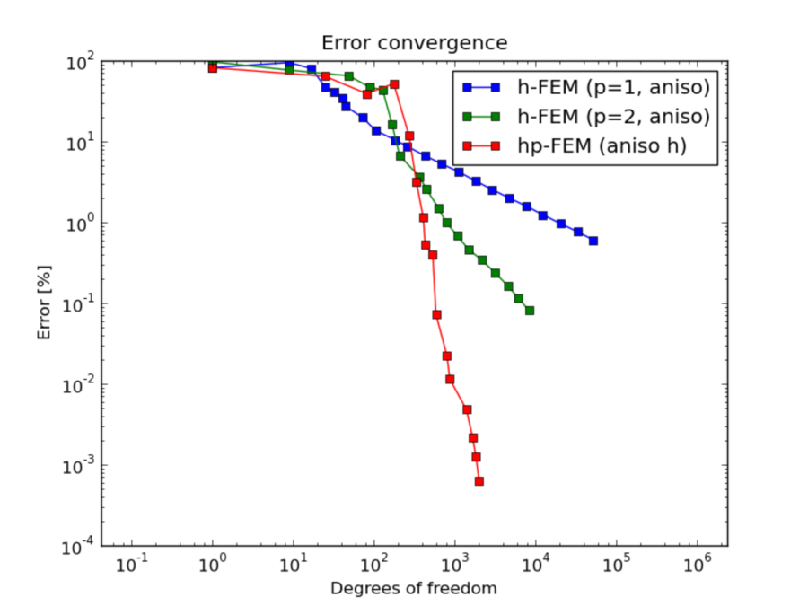
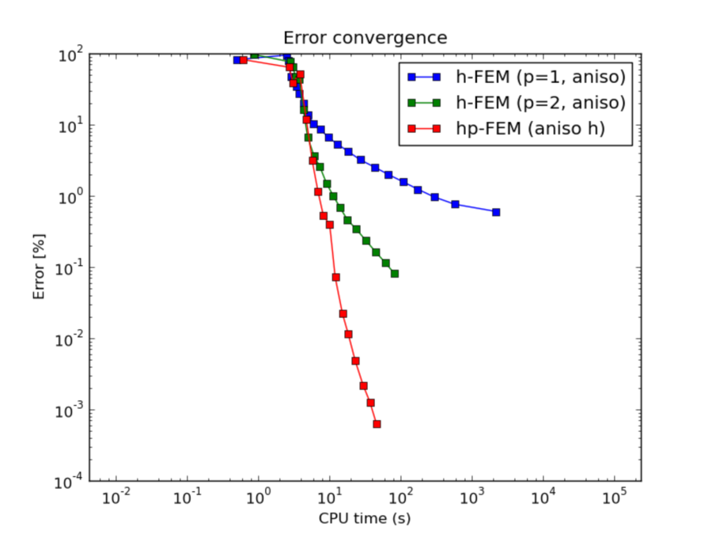
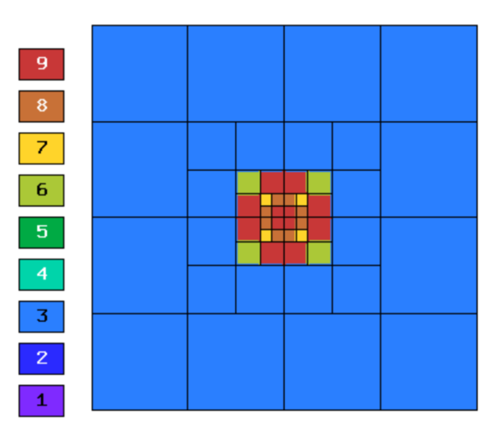
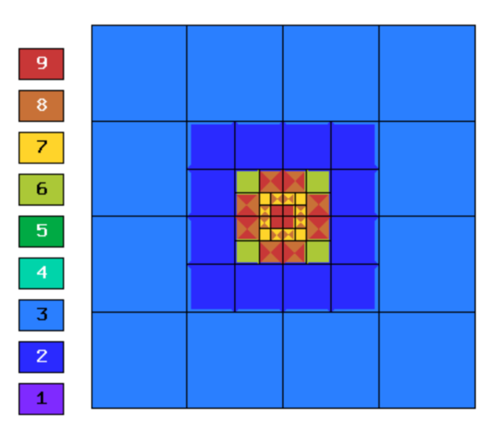
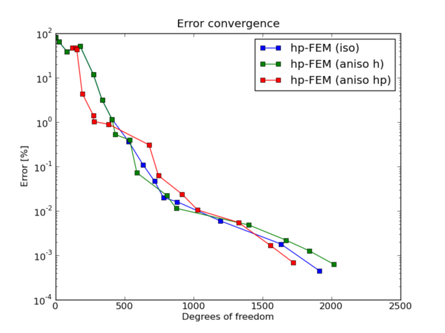
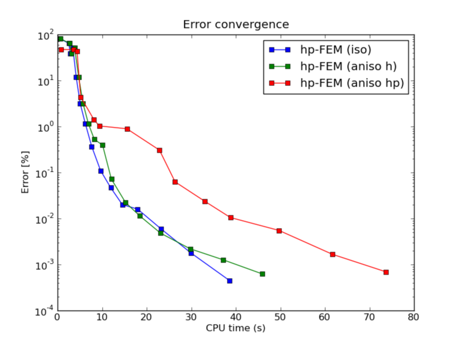

NIST-04 (Peak)
------------------

**Git reference:** Benchmark `04-exponential-peak <http://git.hpfem.org/hermes.git/tree/HEAD:/hermes2d/benchmarks-nist/04-exponential-peak>`_.

This problem has an exponential peak in the interior of the domain. 

Model problem
~~~~~~~~~~~~~

Equation solved: Poisson equation 

.. math::
    :label: Poisson

       -\Delta u - f = 0.

Domain of interest: Unit Square $(0, 1)^2$.

Boundary conditions: Dirichlet, given by exact solution.

Exact solution
~~~~~~~~~~~~~~

.. math::

    u(x,y) = e^{-\alpha ((x - x_{loc})^{2} + (y - y_{loc})^{2})}

where $(x_{loc}, y_{loc})$ is the location of the peak, and 
$\alpha$ determines the strength of the peak. 

Right-hand side 
~~~~~~~~~~~~~~~

Obtained by inserting the exact solution into the equation.

Sample solution
~~~~~~~~~~~~~~~

Solution for $\alpha = 1000$, $(x_{loc}, y_{loc}) = (0.5, 0.5)$:

Comparison of h-FEM (p=1), h-FEM (p=2) and hp-FEM with anisotropic refinements
~~~~~~~~~~~~~~~~~~~~~~~~~~~~~~~~~~~~~~~~~~~~~~~~~~~~~~~~~~~~~~~~~~~~~~~~~~~~~~

Final mesh (h-FEM, p=1, anisotropic refinements):

Final mesh (h-FEM, p=2, anisotropic refinements):

Final mesh (hp-FEM, h-anisotropic refinements):

DOF convergence graphs:

CPU convergence graphs:

hp-FEM with iso, h-aniso and hp-aniso refinements
~~~~~~~~~~~~~~~~~~~~~~~~~~~~~~~~~~~~~~~~~~~~~~~~~

Final mesh (hp-FEM, isotropic refinements):

Final mesh (hp-FEM, h-anisotropic refinements):

Final mesh (hp-FEM, hp-anisotropic refinements):

DOF convergence graphs:

CPU convergence graphs:

