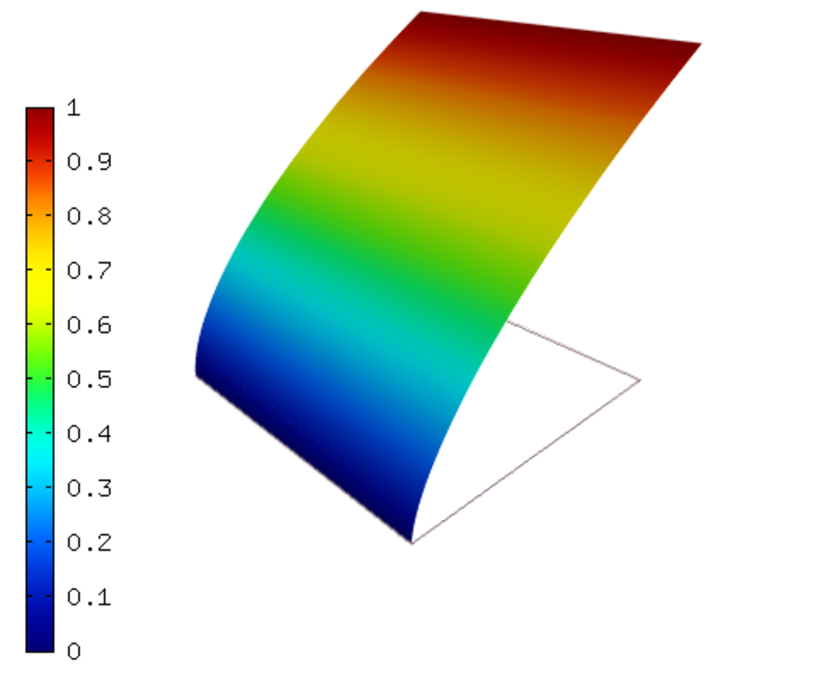
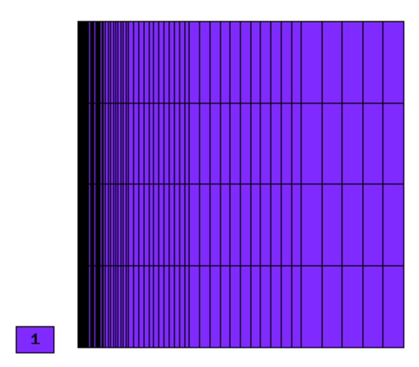
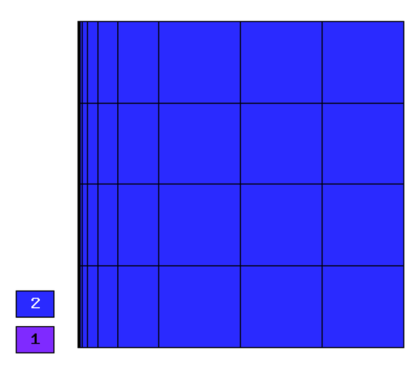
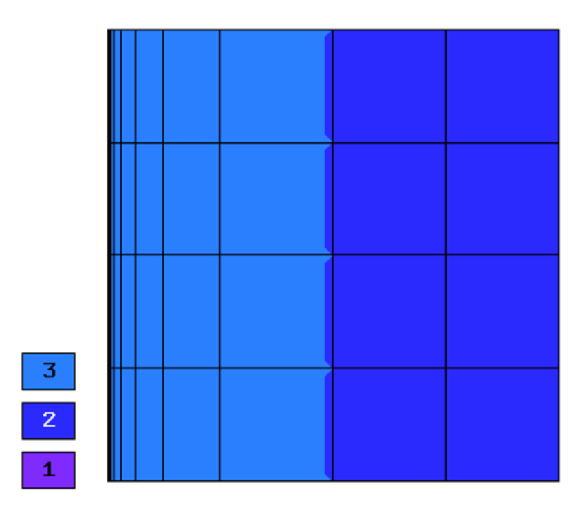
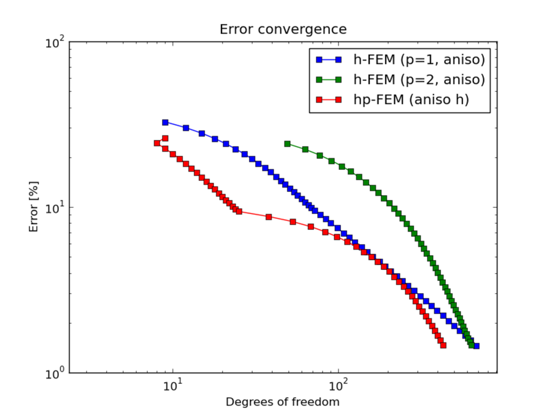
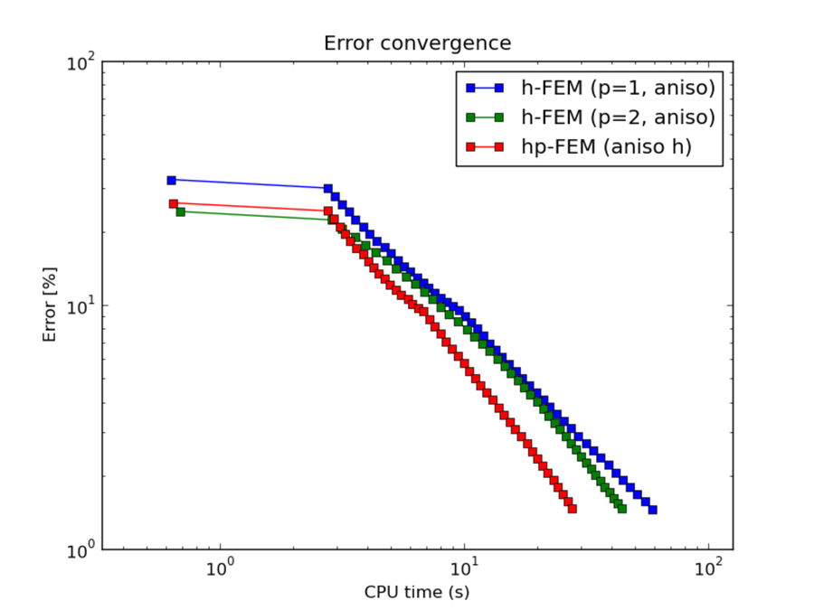
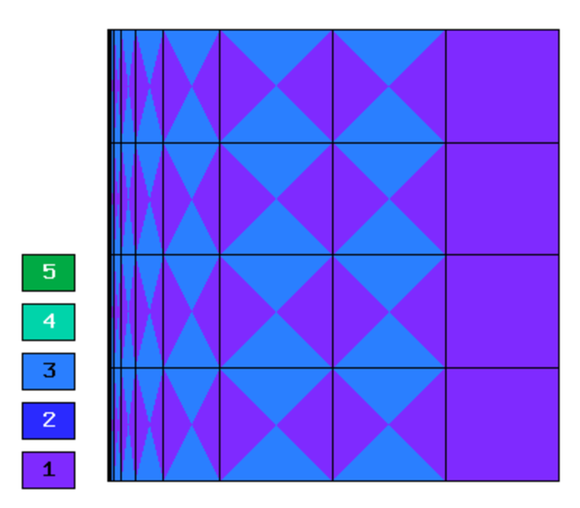
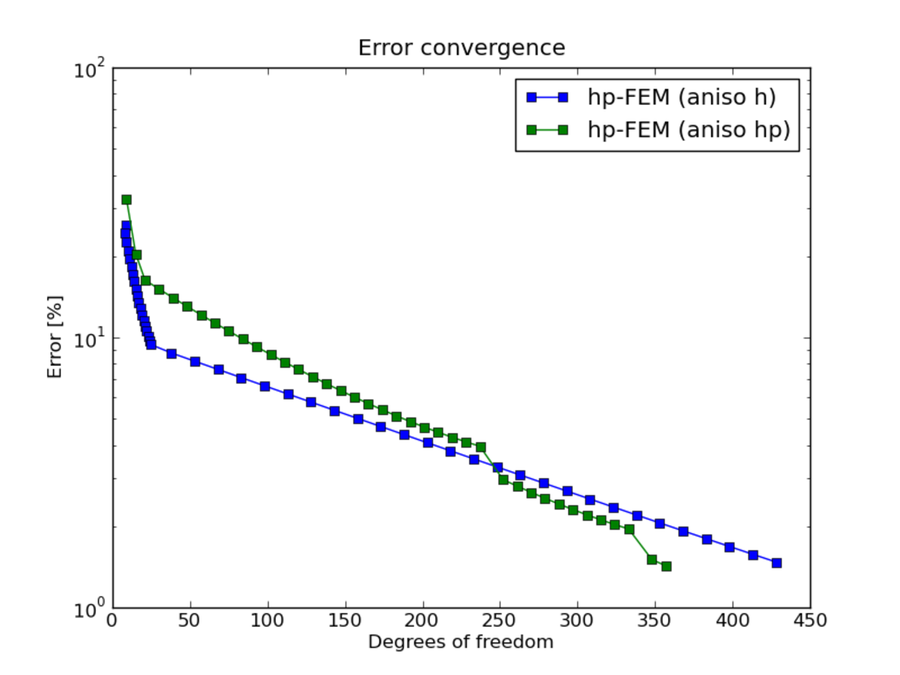
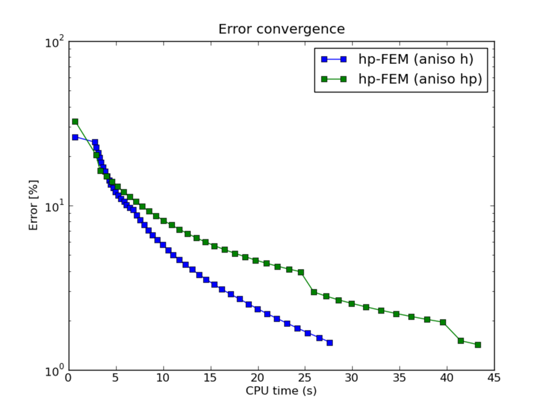

NIST-07 (Boundary Line Singularity)
-----------------------------------

**Git reference:** Benchmark `07-boundary-line-singularity <http://git.hpfem.org/hermes.git/tree/HEAD:/hermes2d/benchmarks-nist/07-boundary-line-singularity>`_.

Many papers on testing adaptive algorithms use a 1D example with a singularity of the form $x^{\alpha}$
at the left endpoint of the domain. This can be extended to 2D by simply making the solution be
constant in $y$.

Model problem
~~~~~~~~~~~~~

Equation solved: Poisson equation 

.. math::
    :label: line-sing

       -\Delta u - f = 0.

Domain of interest: Unit Square $(0, 1)^2$

Boundary conditions: Dirichlet, given by exact solution.

Exact solution
~~~~~~~~~~~~~~

.. math::

    u(x,y) = x^{\alpha} 

where $\alpha \geq 0.5$ determines the strength of the singularity.

Right-hand side 
~~~~~~~~~~~~~~~

Obtained by inserting the exact solution into the equation.

Sample solution
~~~~~~~~~~~~~~~

Solution for $\alpha = 0.6$:

Comparison of h-FEM (p=1), h-FEM (p=2) and hp-FEM with anisotropic refinements
~~~~~~~~~~~~~~~~~~~~~~~~~~~~~~~~~~~~~~~~~~~~~~~~~~~~~~~~~~~~~~~~~~~~~~~~~~~~~~

Final mesh (h-FEM, p=1, anisotropic refinements):

Final mesh (h-FEM, p=2, anisotropic refinements):

Final mesh (hp-FEM, h-anisotropic refinements):

DOF convergence graphs:

CPU convergence graphs:

hp-FEM with h-aniso and hp-aniso refinements
~~~~~~~~~~~~~~~~~~~~~~~~~~~~~~~~~~~~~~~~~~~~~~~~~

Final mesh (hp-FEM, h-anisotropic refinements):

Final mesh (hp-FEM, hp-anisotropic refinements):

DOF convergence graphs:

CPU convergence graphs:

