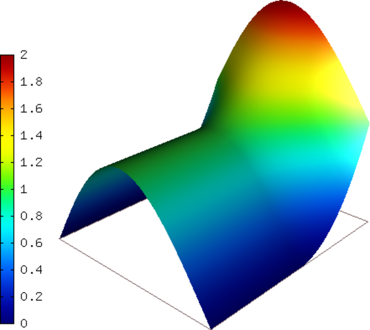
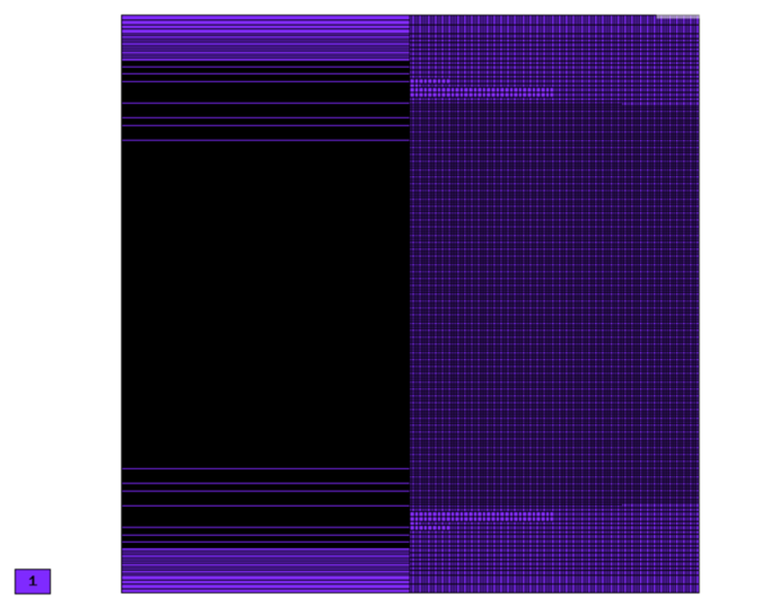
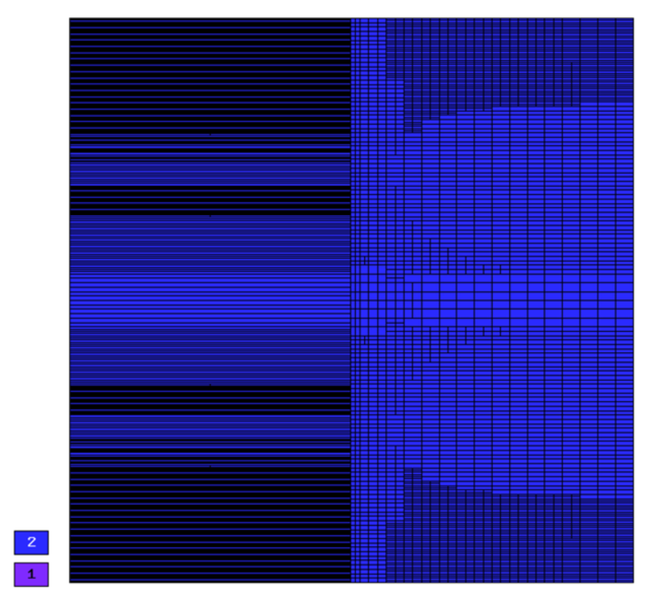
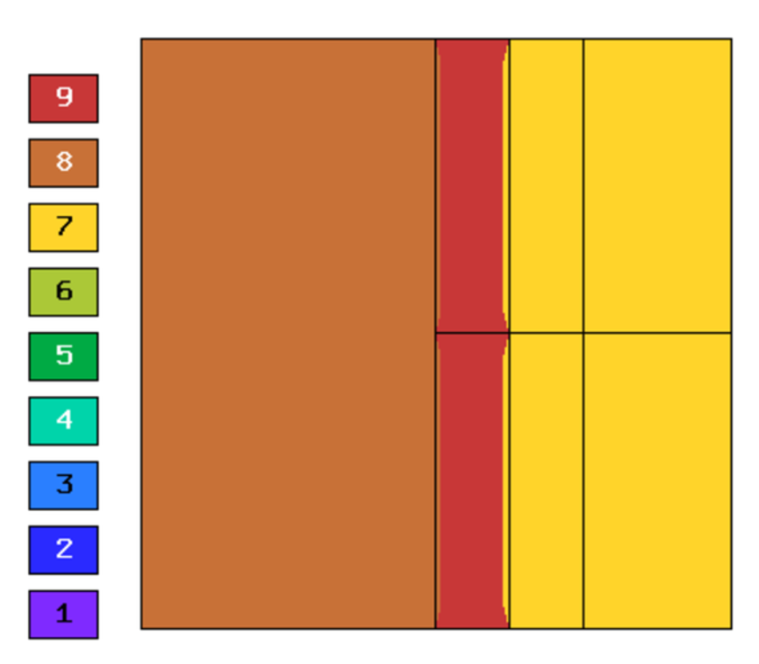
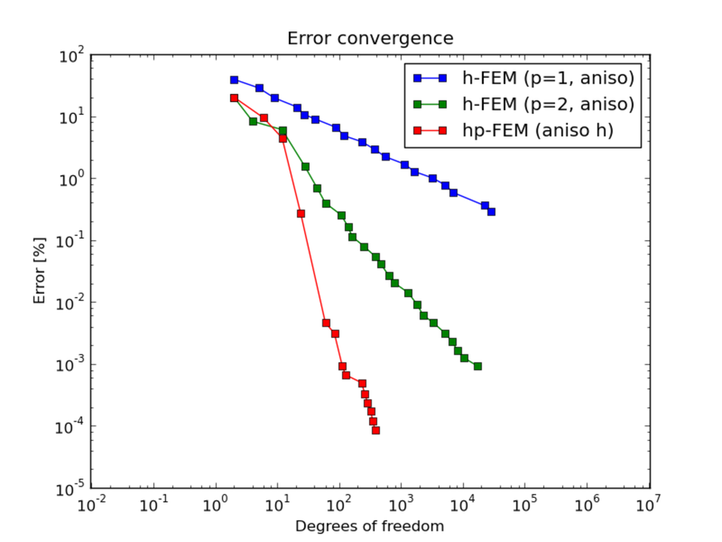
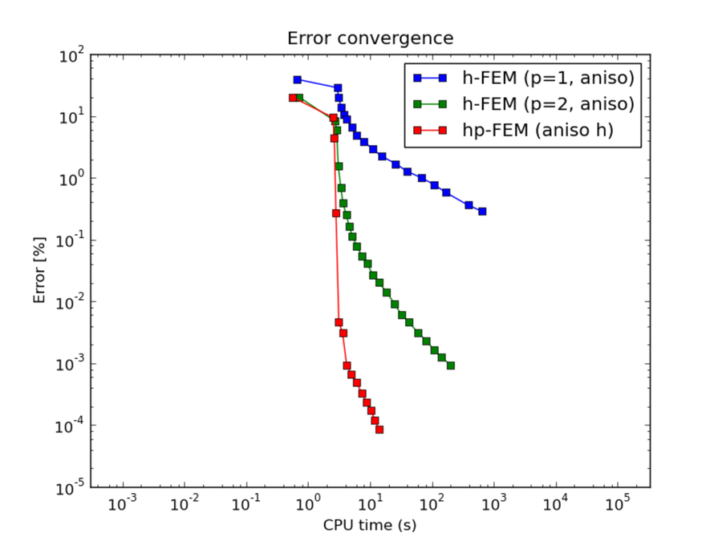
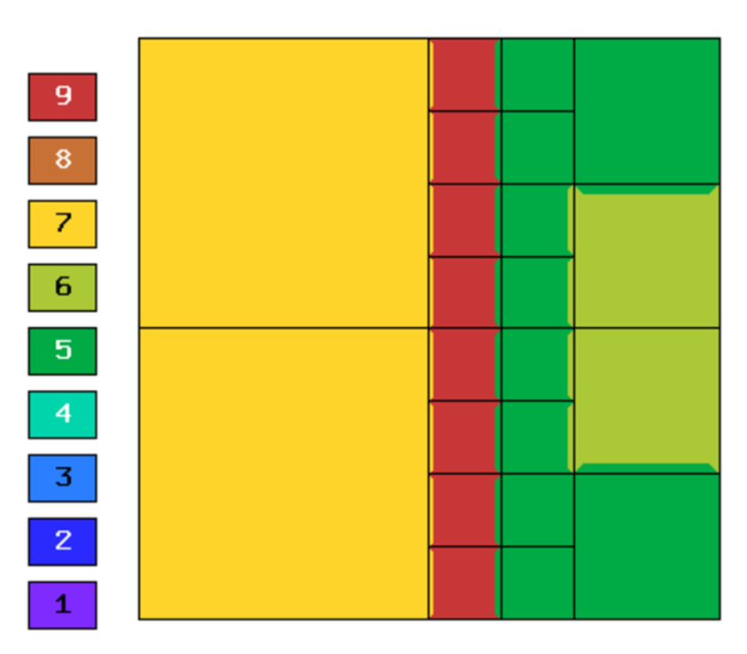
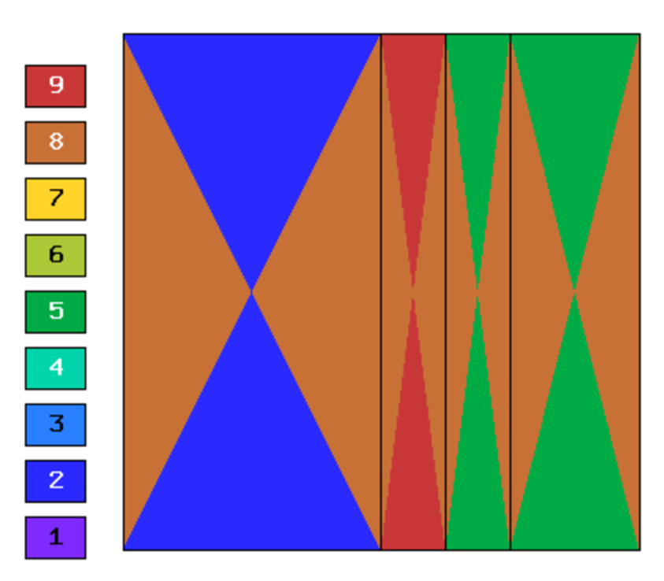
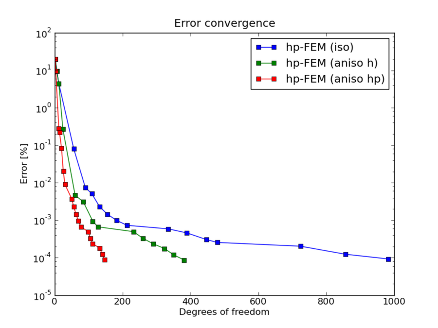
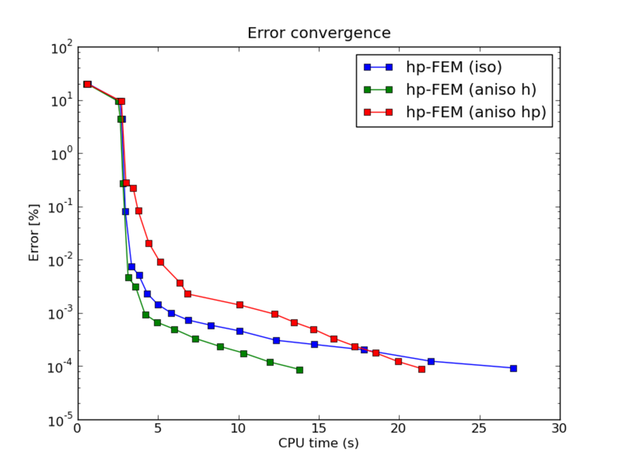

NIST-10 (Interior Line Singularity)
-----------------------------------

**Git reference:** Benchmark `10-interior-line-singularity <http://git.hpfem.org/hermes.git/tree/HEAD:/hermes2d/benchmarks-nist/10-interior-line-singularity>`_.

This example is an extension of Boundary Line Singularity (NIST-07) with an anisotropic solution to allow 
for a sloped line so that the singularity does not necessarily coincide with element edges. 

Model problem
~~~~~~~~~~~~~

Equation solved: Poisson equation 

.. math::
    :label: line-sing

       -\Delta u - f = 0.

Domain of interest: $(-1, 1)^2$.

Boundary conditions: Dirichlet, given by exact solution. 

Exact solution
~~~~~~~~~~~~~~

.. math::

    u(x,y) = \cos(Ky)\ \ \ \mbox{for}\ x \le 0,\\
    u(x,y) = \cos(Ky) + x^{\alpha}\ \ \ \mbox{for}\ x > 0,

where $K$ and $\alpha$ are real constants. 

Right-hand side 
~~~~~~~~~~~~~~~

Obtained by inserting the exact solution into the equation.

Sample solution
~~~~~~~~~~~~~~~

Solution for $K = \pi/2$ and $\alpha = 2.01$:

Comparison of h-FEM (p=1), h-FEM (p=2) and hp-FEM with anisotropic refinements
~~~~~~~~~~~~~~~~~~~~~~~~~~~~~~~~~~~~~~~~~~~~~~~~~~~~~~~~~~~~~~~~~~~~~~~~~~~~~~

Final mesh (h-FEM, p=1, anisotropic refinements):

Final mesh (h-FEM, p=2, anisotropic refinements):

Final mesh (hp-FEM, h-anisotropic refinements):

DOF convergence graphs:

CPU convergence graphs:

hp-FEM with iso, h-aniso and hp-aniso refinements
~~~~~~~~~~~~~~~~~~~~~~~~~~~~~~~~~~~~~~~~~~~~~~~~~

Final mesh (hp-FEM, isotropic refinements):

Final mesh (hp-FEM, h-anisotropic refinements):

Final mesh (hp-FEM, hp-anisotropic refinements):

DOF convergence graphs:

CPU convergence graphs:

