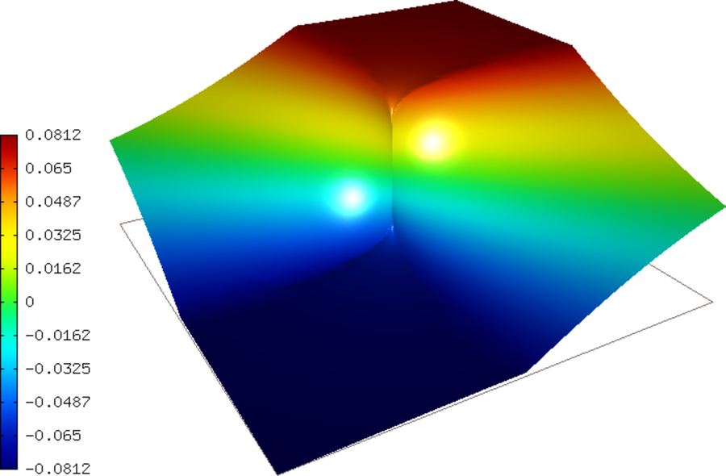
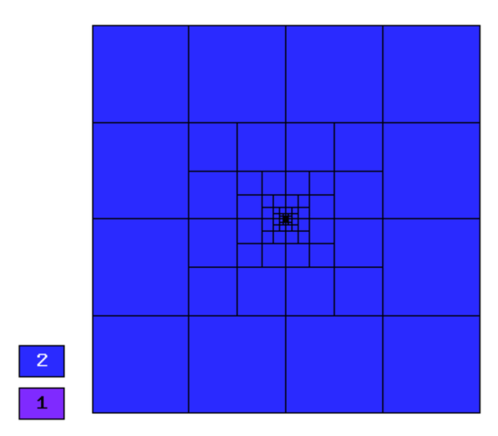
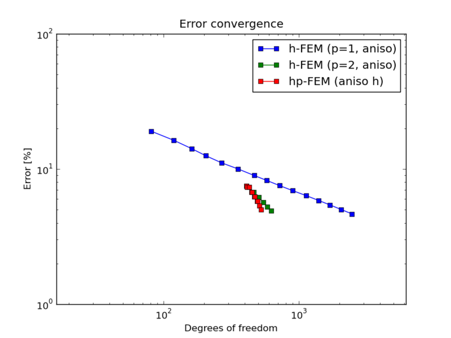
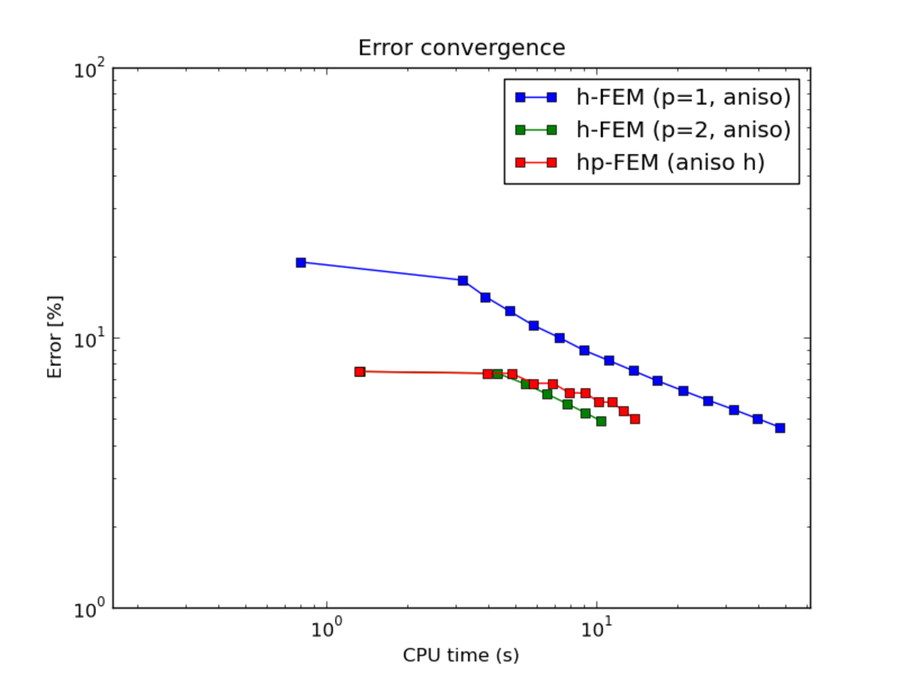

NIST-11 (Intersecting Interfaces)
---------------------------------

**Git reference:** Benchmark `11-kellogg <http://git.hpfem.org/hermes.git/tree/HEAD:/hermes2d/benchmarks-nist/11-kellogg>`_.

The solution to this problem has a discontinuous derivative along the interfaces, and an infinite 
derivative at the origin that posses a challenge to adaptive algorithms. 
 

Model problem
~~~~~~~~~~~~~

Equation solved:

.. math::

       -\nabla \cdot (a(x,y) \nabla u) = 0,

Parameter $a$ is piecewise constant, $a(x,y) = R$ in the first and third quadrants, and $a(x,y) = 1$ 
in the remaining two quadrants. 

Domain of interest: $(-1, 1)^2$.

Boundary conditions: Dirichlet, given by exact solution. 

Exact solution
~~~~~~~~~~~~~~

Quite complicated, see the source code.

Sample solution
~~~~~~~~~~~~~~~

Comparison of h-FEM (p=1), h-FEM (p=2) and hp-FEM with anisotropic refinements
~~~~~~~~~~~~~~~~~~~~~~~~~~~~~~~~~~~~~~~~~~~~~~~~~~~~~~~~~~~~~~~~~~~~~~~~~~~~~~

Final mesh (h-FEM, p=1, anisotropic refinements):

.. image:: nist-11/mesh_h1_aniso.png
   :align: center
   :width: 450
   :alt: Final mesh.

Final mesh (h-FEM, p=2, anisotropic refinements):

Final mesh (hp-FEM, h-anisotropic refinements):

.. image:: nist-11/mesh_hp_anisoh.png
   :align: center
   :width: 450
   :alt: Final mesh.

DOF convergence graphs:

CPU convergence graphs:

