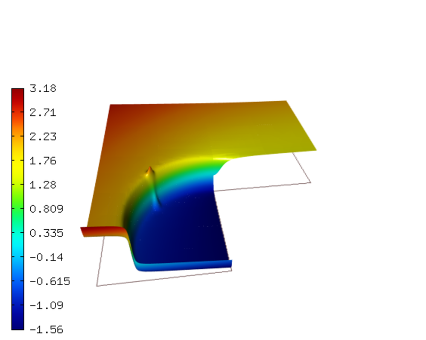
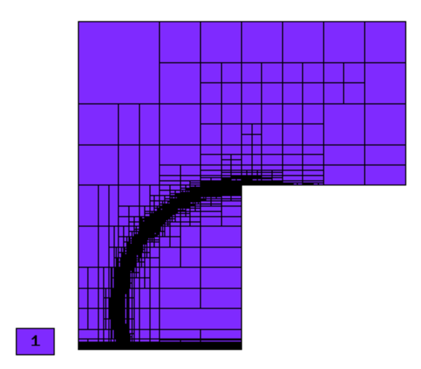
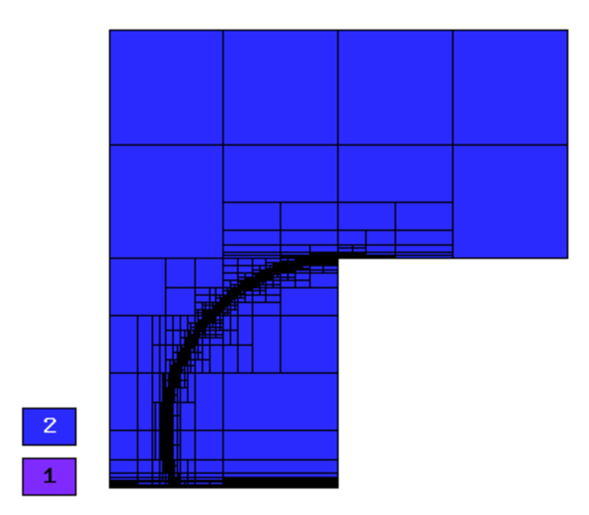
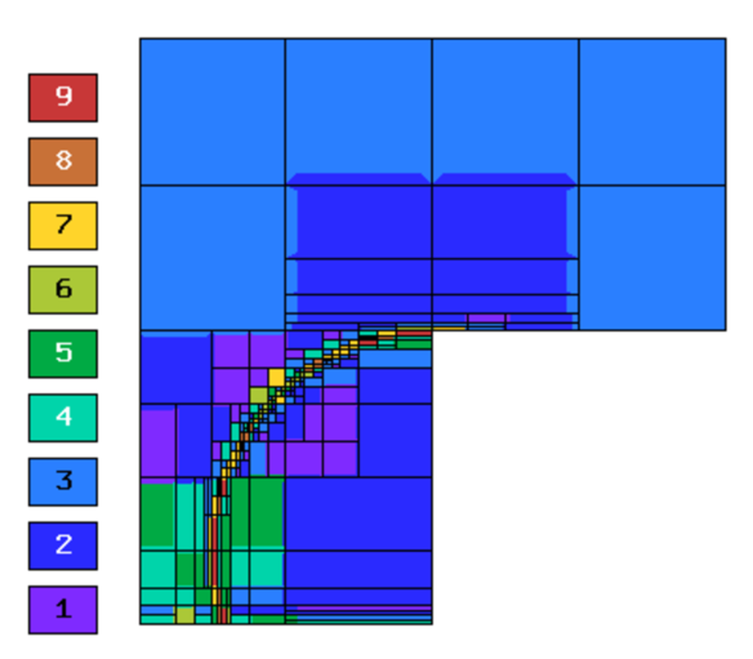
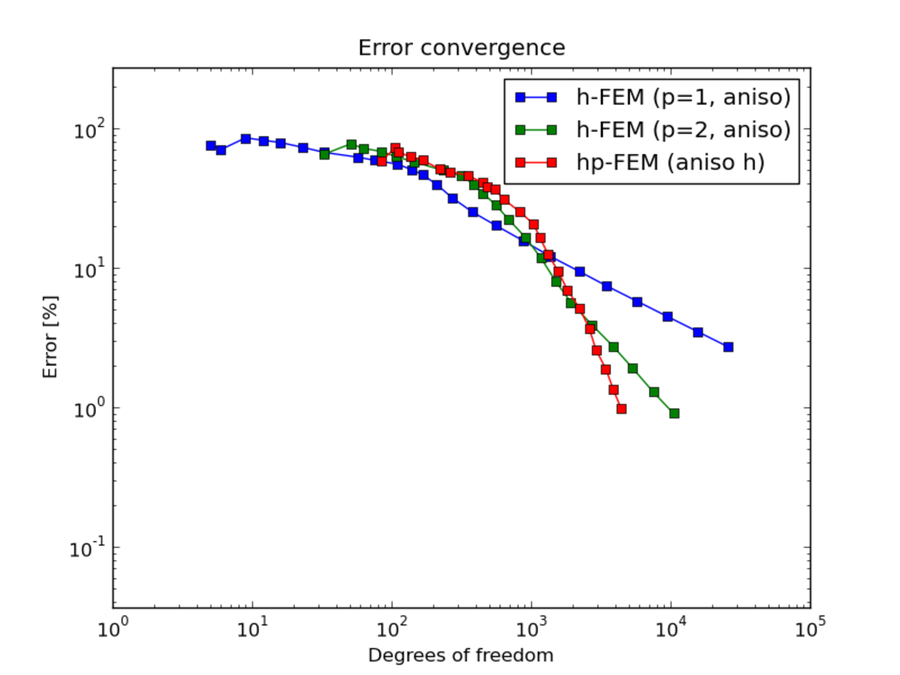
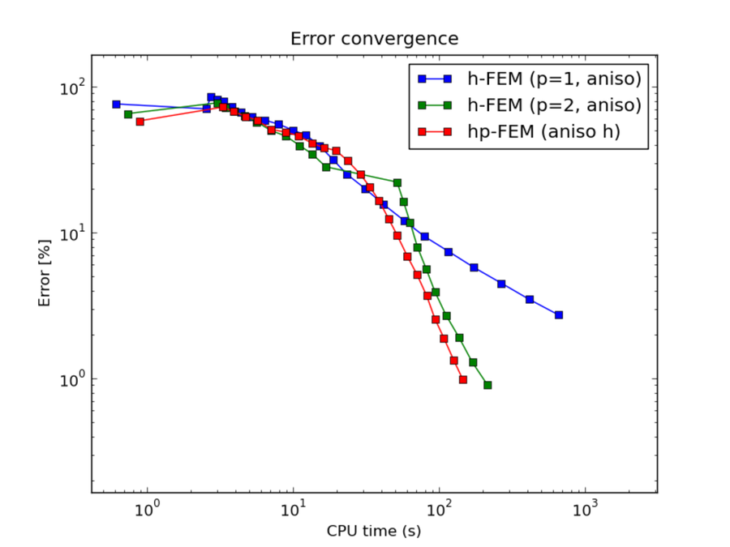
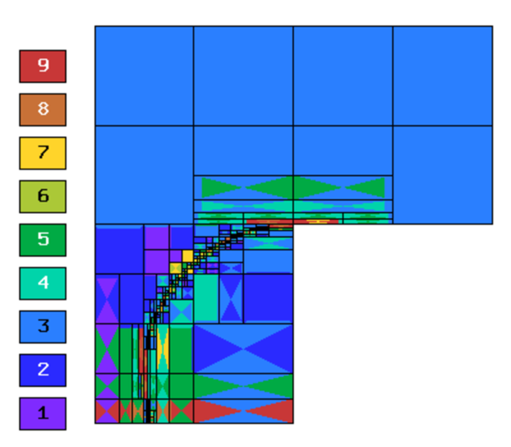
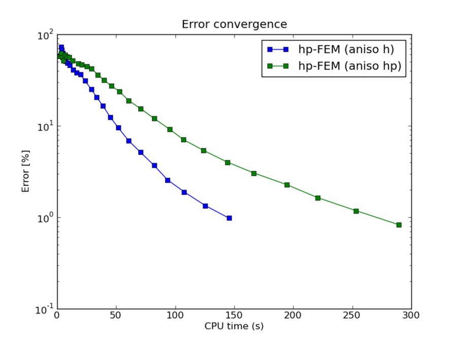

NIST-12 (Multiple Difficulties)
-------------------------------

**Git reference:** Benchmark `12-multiple-difficulties <http://git.hpfem.org/hermes.git/tree/HEAD:/hermes2d/benchmarks-nist/12-multiple-difficulties>`_.

This problem combines four difficulties of different strengths into the same problem by combining 
some of the features of the other test problems (reentrant corner, sharp peak, etc).

Model problem
~~~~~~~~~~~~~

Equation solved: Poisson equation

.. math::
    :label: NIST 12

       -\Delta u - f = 0.

Domain of interest: L-shaped domain $(-1,1) \times (-1,1)$ \\ $(0,1) \times (-1,0)$.

Boundary conditions: Dirichlet, given by exact solution.

Right-hand side
~~~~~~~~~~~~~~~

Quite complicated, see the source code.

Exact solution
~~~~~~~~~~~~~~

.. math::

    u(x,y) =  r^{\alpha_{C} }\sin(\alpha_{C} \theta)
              + e^{-\alpha_{P} ((x - x_{P})^{2} + (y - y_{P})^{2})}
              + tan^{-1}(\alpha_{W} (r_{W} - r_{0}))  
              + e^{-(1 - y) / \epsilon}.

where $\alpha_C = \pi / \omega_C$, $r = \sqrt{x^2+y^2}$ and $\theta = tan^{-1}(y/x)$.  Here $\omega_C$ determines
the angle of the re-entrant corner. \

$(x_{P}, y_{P})$ is the location of the peak, $\alpha$ determines the strength of the peak, \

and $r_{W} = \sqrt{(x - x_{W})^{2} + (y - y_{W})^{2}}$. Here $(x_{W}, y_{W})$ is the center of the circular wave front.
$r_{0}$ is the distance from the wave front to the center of the circle, and $\alpha_W$ gives the steepness of the wave front. \

Last but not least, $\epsilon$ determines the strength of the boundary layer; the boundary layer was placed at $y = -1$.

Sample solution
~~~~~~~~~~~~~~~

Solution for $\omega_C = 3 \pi /2$,  $(x_{W}, y_{W}) = (0, -3/4)$,  $r_{0} = 3/4$, 
$\alpha_{W} = 200$,  $(x_{P}, y_{P}) = (\sqrt{5} / 4, -1/4)$,  $\epsilon = 1/100$:

Comparison of h-FEM (p=1), h-FEM (p=2) and hp-FEM with anisotropic refinements
~~~~~~~~~~~~~~~~~~~~~~~~~~~~~~~~~~~~~~~~~~~~~~~~~~~~~~~~~~~~~~~~~~~~~~~~~~~~~~

Final mesh (h-FEM, p=1, anisotropic refinements):

Final mesh (h-FEM, p=2, anisotropic refinements):

Final mesh (hp-FEM, h-anisotropic refinements):

DOF convergence graphs:

CPU convergence graphs:

hp-FEM with h-aniso and hp-aniso refinements
~~~~~~~~~~~~~~~~~~~~~~~~~~~~~~~~~~~~~~~~~~~~~~~~~

Final mesh (hp-FEM, h-anisotropic refinements):

Final mesh (hp-FEM, hp-anisotropic refinements):

DOF convergence graphs:

.. image:: nist-12/conv_dof_hp.png
   :align: center
   :width: 600
   :height: 400
   :alt: DOF convergence graph.

CPU convergence graphs:

