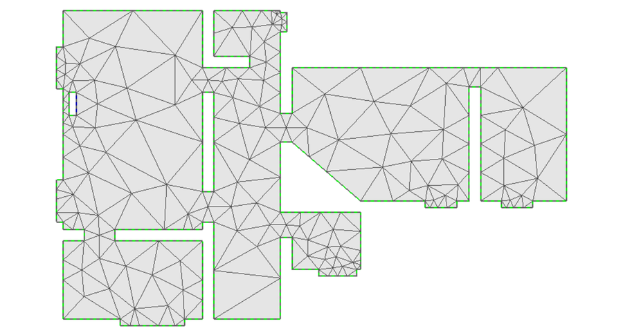
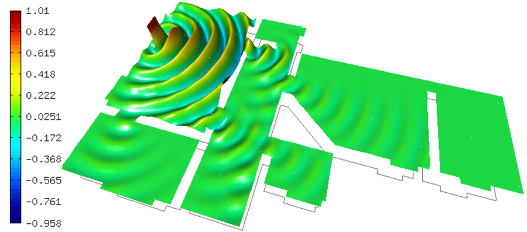
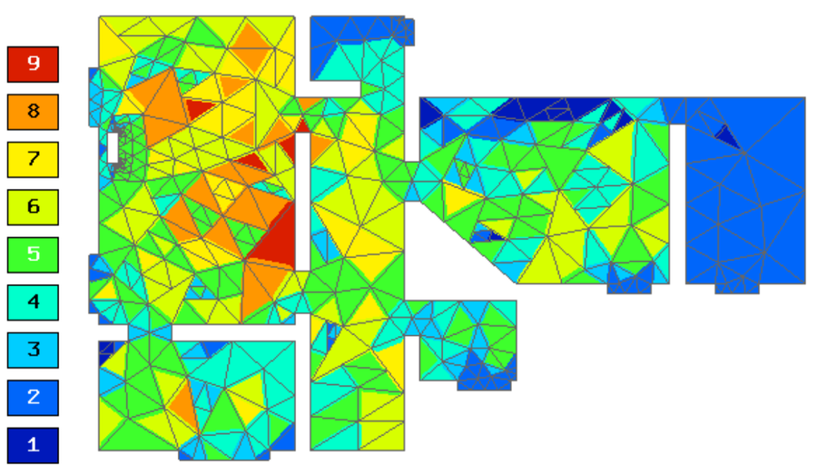

Apartment
---------

**Git reference:** Example `apartment <http://git.hpfem.org/hermes.git/tree/HEAD:/hermes2d/examples/acoustics/horn-apartment>`_.

Model problem
~~~~~~~~~~~~~

This example solves adaptively the pressure field in an apartment, that is 
caused by a harmonic local acoustics source. The geometry and initial 
mesh are shown below.

Equation solved: 

.. math::
    -\nabla \left(\frac{1}{\rho} \nabla p\right) - \frac{1}{\rho}\left(\frac{\omega}{c}\right)^2 p = 0.

Boundary conditions are Dirichlet (prescribed pressure) on one edge. The rest of the 
boundary are wall with a Newton condition (matched boundary).

.. math::
    \frac{1}{\rho} \frac{\partial p}{\partial n} = \frac{j \omega p}{\rho c}

Here $p$ is pressure,
$\rho$ density of air, $\omega = 2 \pi f$ angular frequency, and $c$ speed of sound. See
the main.cpp file for concrete values.

Weak forms
~~~~~~~~~~

::

    class CustomWeakFormAcoustics : public WeakForm
    {
    public:
      CustomWeakFormAcoustics(std::string bdy_newton, double rho, double sound_speed, double omega) : WeakForm(1) 
      {
	scalar ii =  cplx(0.0, 1.0);

	// Jacobian.
	add_matrix_form(new WeakFormsH1::DefaultJacobianDiffusion(0, 0, HERMES_ANY, new HermesFunction(1.0/rho), HERMES_SYM));
	add_matrix_form(new WeakFormsH1::DefaultMatrixFormVol(0, 0, HERMES_ANY, new HermesFunction(-sqr(omega) / rho / sqr(sound_speed)), HERMES_SYM));
	add_matrix_form_surf(new WeakFormsH1::DefaultMatrixFormSurf(0, 0, bdy_newton, new HermesFunction(-ii * omega / rho / sound_speed)));

	// Residual.
	add_vector_form(new WeakFormsH1::DefaultResidualDiffusion(0, HERMES_ANY, new HermesFunction(1.0/rho)));
	add_vector_form(new WeakFormsH1::DefaultResidualVol(0, HERMES_ANY, new HermesFunction(-sqr(omega) / rho / sqr(sound_speed))));
	add_vector_form_surf(new WeakFormsH1::DefaultResidualSurf(0, bdy_newton, new HermesFunction(-ii * omega / rho / sound_speed)));
      };
    };

Sample results
~~~~~~~~~~~~~~

Pressure distribution:

Final mesh:

