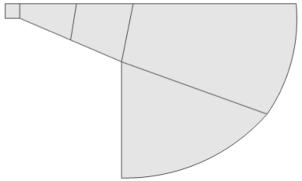
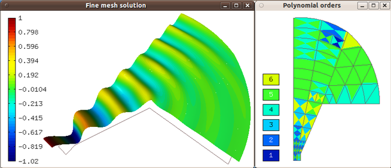

Axisymmetric Horn
-----------------

**Git reference:** Example `horn-axisym <http://git.hpfem.org/hermes.git/tree/HEAD:/hermes2d/examples/acoustics/horn-axisym>`_.

Problem description
~~~~~~~~~~~~~~~~~~~

This example solves adaptively the pressure field in a 3D axisymmetric model 
of a harmonic acoustic horn. The geometry and initial mesh are shown below.

Equation solved: 

.. math::
    -\nabla \left(\frac{1}{\rho} \nabla p\right) - \frac{1}{\rho}\left(\frac{\omega}{c}\right)^2 p = 0.

Boundary conditions are Dirichlet (prescribed pressure) on the bottom edge, zero Neumann (symmetry)
on the left edge, Newton (matched boundary) 

.. math::
    \frac{1}{\rho} \frac{\partial p}{\partial n} = \frac{j \omega p}{\rho c}

on the outlet arc and zero Neumann (wall) on the rest of the boundary. Here $p$ is pressure,
$\rho$ density of air, $\omega = 2 \pi f$ angular frequency, and $c$ speed of sound. See
the main.cpp file for concrete values.

Sample results
~~~~~~~~~~~~~~

