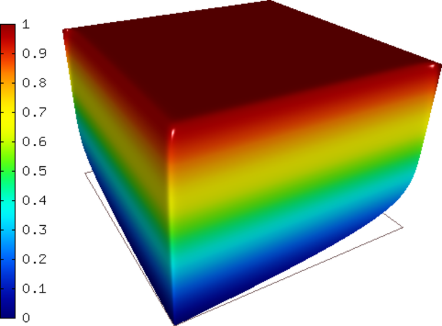
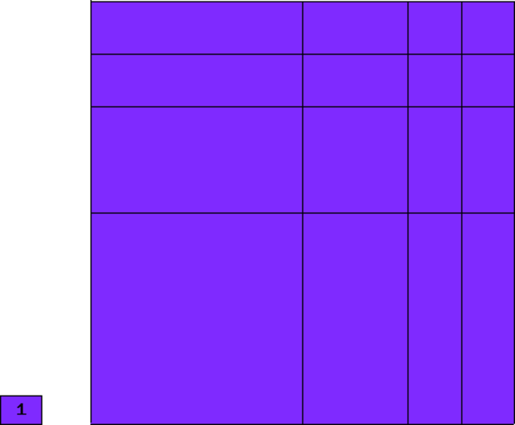
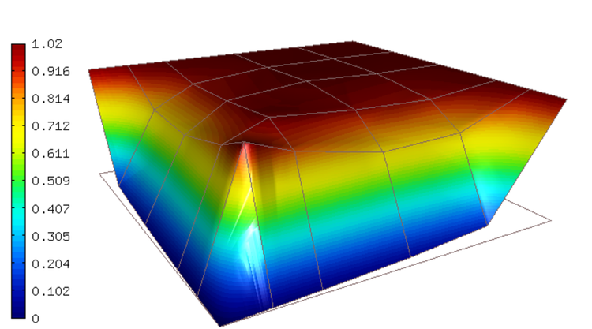
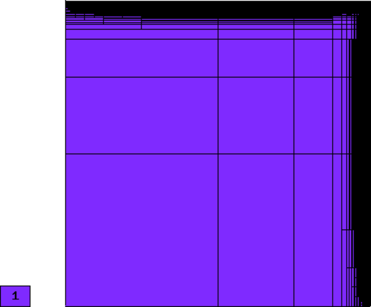
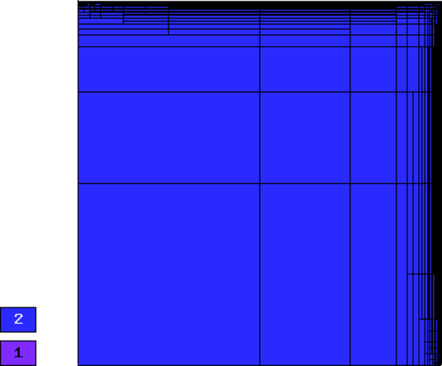
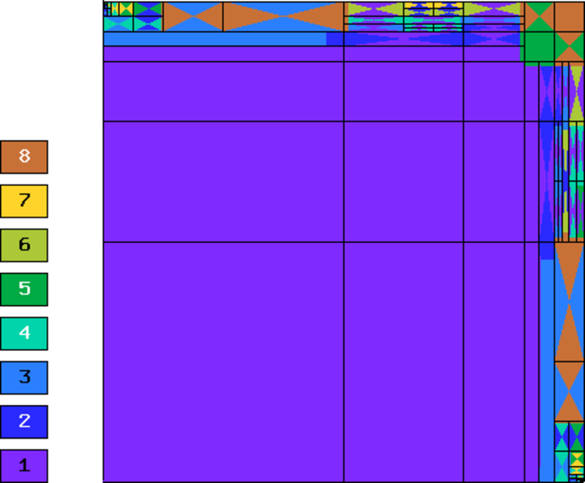
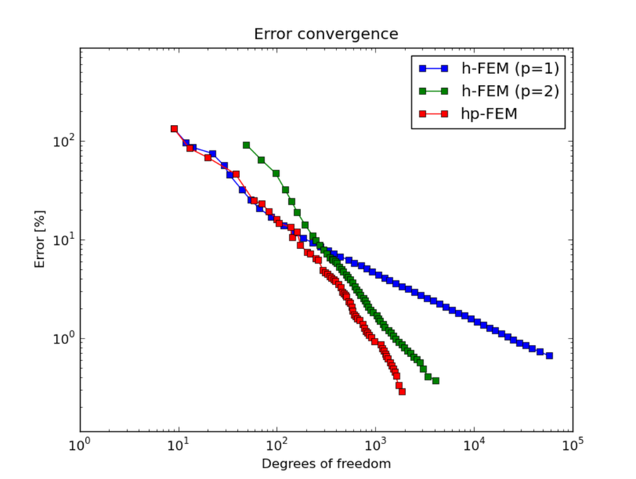

Linear Advection-Diffusion
--------------------------

**Git reference:** Example `linear-advection-diffusion 
<http://git.hpfem.org/hermes.git/tree/HEAD:/hermes2d/examples/advection-diffusion-reaction/linear-advection-diffusion>`_.

Problem description
~~~~~~~~~~~~~~~~~~~

This example solves the equation 

.. math::

    \nabla \cdot (-\epsilon \nabla u + \bfb u) = 0

in the domain $\Omega = (0,1)^2$ where $\epsilon > 0$ is the diffusivity and $\bfb = (b_1, b_2)^T$
a constant advection velocity. We assume that $b_1 > 0$ and $b_2 > 0$. The boundary 
conditions are Dirichlet. 

With a small $\epsilon$, this is a singularly 
perturbed problem whose solution is close to 1 in most of the domain and forms 
a thin boundary layer along the top 
and right edges of $\Omega$. 

Solution for $\epsilon = 0.01$. Note - view selected to show the boundary layer:

Initial mesh for automatic adaptivity: 

This mesh is not fine enough in the boundary layer region to 
prevent the solution from oscillating:

.. image:: example-linear-advection-diffusion/sol_init.png
   :align: center
   :height: 400
   :alt: Solution.

Here we use the same view as for the solution above. 
As you can see, this approximation is not very close to the final solution. The oscillations 
can be suppressed by applying the multiscale stabilization (STABILIZATION_ON = true):

Automatic adaptivity can sometimes
take care of them as well, as we will see below. Standard stabilization techniques 
include SUPG, GLS and others. For this example, we implemented the so-called *variational 
multiscale stabilization* that can be used on an optional basis.
We have also implemented a shock-capturing term for the reader to experiment with.

Sample results
~~~~~~~~~~~~~~

The stabilization and shock capturing are **turned off for this computation**.

Let us compare adaptive $h$-FEM with linear and quadratic elements and the $hp$-FEM.

Final mesh for $h$-FEM with linear elements: 57495 DOF, error = 0.66 \%

Final mesh for $h$-FEM with quadratic elements: 4083 DOF, error = 0.37 \%

Final mesh for $hp$-FEM: 1854 DOF, error = 0.28 \%

Convergence graphs of adaptive h-FEM with linear elements, h-FEM with quadratic elements
and hp-FEM are shown below.

