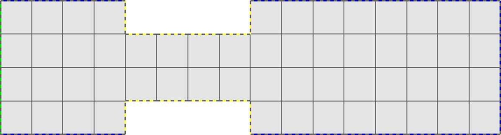
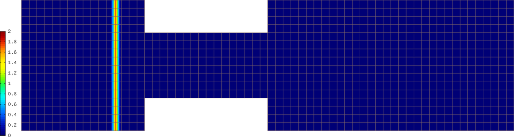
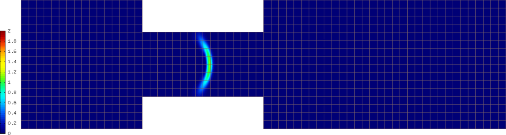
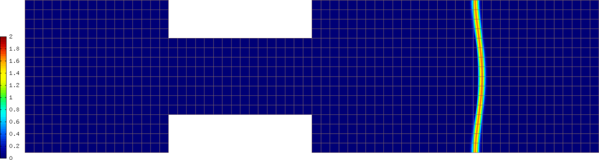

Laminar Flame
-------------

**Git reference:** Example `laminar-flame 
<http://git.hpfem.org/hermes.git/tree/HEAD:/hermes2d/tutorial/P03-timedep/laminar-flame>`_.

Problem description
~~~~~~~~~~~~~~~~~~~

We will employ the Newton's method to solve a nonlinear system of two parabolic equations 
describing a very simple flame propagation model (laminar flame, no fluid mechanics involved).
The computational domain shown below contains in the middle a narrow portion (cooling rods) 
whose purpose is to slow down the chemical reaction:

The equations for the temperature $T$ and species concentration $Y$ have the form

.. math::

    \frac{\partial T}{\partial t} - \Delta T = \omega(T, Y),\\
    \frac{\partial Y}{\partial t} - \frac{1}{Le}\Delta Y = -\omega(T, Y).

Boundary conditions are Dirichlet $T = 1$ and $Y = 0$ on the inlet, 
Newton $\partial T/\partial n = - \kappa T$ on the cooling rods, 
and Neumann $\partial T/\partial n = 0$, $\partial Y/\partial n = 0$ elsewhere.
The objective of the computation is to obtain the *reaction rate* defined
by the Arrhenius law,

.. math::

    \omega(T, Y) = \frac{\beta^2}{2{\rm Le}} Y e^{\frac{\beta(T - 1)}{1 + \alpha(T-1)}}.

Here $\alpha$ is the gas expansion coefficient in a flow with nonconstant density,
$\beta$ the non-dimensional activation energy, and  
$\rm Le$ the Lewis number (ratio of diffusivity of heat and diffusivity 
of mass). Both $\theta$, $0 \le \theta \le 1$ and 
$Y$, $0 \le Y \le 1$ are dimensionless and so is the time $t$. 

Second-order BDF formula for time integration
~~~~~~~~~~~~~~~~~~~~~~~~~~~~~~~~~~~~~~~~~~~~~

Time integration is performed using a second-order implicit BDF formula

.. math::

    T^{n+1} = -\frac{1}{2} T_1^{n+1} + \frac{3}{2} T_2^{n+1},\\
    Y^{n+1} = -\frac{1}{2} Y_1^{n+1} + \frac{3}{2} Y_2^{n+1},

that is obtained using a combination of the following two first-order methods:

.. math::

    \frac{T_1^{n+1} - T^{n}}{\tau} = \Delta T_1^{n+1} + \omega(T_1^{n+1}, Y_1^{n+1}),\\
    \frac{Y_1^{n+1} - Y^{n}}{\tau} = \frac{1}{\rm Le} \ \Delta Y_1^{n+1} - \omega(\theta_1^{n+1}, Y_1^{n+1}),

and 

.. math::

    \frac{T_2^{n+1} - T^{n}}{\tau} = \frac{2}{3}\left(\Delta T_2^{n+1} + \omega(T_2^{n+1}, Y_2^{n+1})\right) +                                            \frac{1}{3}\left(\Delta T_2^{n} + \omega(T_2^{n}, Y_2^{n})\right),\\
    \frac{Y_2^{n+1} - Y^{n}}{\tau} = \frac{2}{3}\left(\frac{1}{\rm Le}\ \Delta Y_2^{n+1} - \omega(T_2^{n+1}, Y_2^{n+1})\right) +
                                        \frac{1}{3}\left(\frac{1}{\rm Le}\ \Delta Y_2^{n} - \omega(T_2^{n}, Y_2^{n})\right).
   
Problem parameters are chosen as

::

    // Problem constants
    const double Le    = 1.0;
    const double alpha = 0.8;
    const double beta  = 10.0;
    const double kappa = 0.1;
    const double x1 = 9.0;

Initial conditions
~~~~~~~~~~~~~~~~~~

It is worth mentioning that the initial conditions for $T$ and $Y$,

::

    // Initial conditions.
    scalar temp_ic(double x, double y, scalar& dx, scalar& dy)
      { return (x <= x1) ? 1.0 : exp(x1 - x); }

    scalar conc_ic(double x, double y, scalar& dx, scalar& dy)
      { return (x <= x1) ? 0.0 : 1.0 - exp(Le*(x1 - x)); }

are defined as exact functions::

    // Set initial conditions.
    t_prev_time_1.set_exact(&mesh, temp_ic); c_prev_time_1.set_exact(&mesh, conc_ic);
    t_prev_time_2.set_exact(&mesh, temp_ic); c_prev_time_2.set_exact(&mesh, conc_ic);
    t_prev_newton.set_exact(&mesh, temp_ic);  c_prev_newton.set_exact(&mesh, conc_ic);

Here the pairs of solutions (t_prev_time_1, y_prev_time_1) and (t_prev_time_2, y_prev_time_2)
correspond to the two first-order time-stepping methods described above. and 
(t_prev_newton, y_prev_newton) are used to store the previous step approximation
in the Newton's method. 

Using Filters
~~~~~~~~~~~~~

The reaction rate $\omega$ and its derivatives are handled
via Filters::

    // Filters for the reaction rate omega and its derivatives.
    DXDYFilter omega(omega_fn, Tuple<MeshFunction*>(&t_prev_newton, &c_prev_newton));
    DXDYFilter omega_dt(omega_dt_fn, Tuple<MeshFunction*>(&t_prev_newton, &c_prev_newton));
    DXDYFilter omega_dc(omega_dc_fn, Tuple<MeshFunction*>(&t_prev_newton, &c_prev_newton));

Details on the functions omega_fn, omega_dt_fn, omega_dy_fn and the weak 
forms can be found in the file `forms.cpp 
<http://git.hpfem.org/hermes.git/blob/HEAD:/hermes2d/tutorial/P03-timedep/laminar-flame/forms.cpp>`_

Reinitialization of Filters
~~~~~~~~~~~~~~~~~~~~~~~~~~~

Notice the reinitialization of the Filters at the end of the Newton's loop.
This is necessary as the functions defining the Filter have changed::

    // Set current solutions to the latest Newton iterate 
    // and reinitialize filters of these solutions.
    Solution::vector_to_solutions(coeff_vec, Tuple<Space *>(&tspace, &cspace), 
                                  Tuple<Solution *>(&t_prev_newton, &c_prev_newton));
    omega.reinit();
    omega_dt.reinit();
    omega_dc.reinit();

Visualization of a Filter
~~~~~~~~~~~~~~~~~~~~~~~~~

Also notice the visualization of a Filter::

    // Visualization.
    DXDYFilter omega_view(omega_fn, Tuple<MeshFunction*>(&t_prev_newton, &c_prev_newton));
    rview.set_min_max_range(0.0,2.0);
    char title[100];
    sprintf(title, "Reaction rate, t = %g", current_time);
    rview.set_title(title);
    rview.show(&omega_view);

Sample results
~~~~~~~~~~~~~~

A few snapshots of the reaction rate $\omega$ at various times are shown below:

.. image:: laminar-flame/sol3.png
   :align: center
   :width: 800
   :alt: solution

