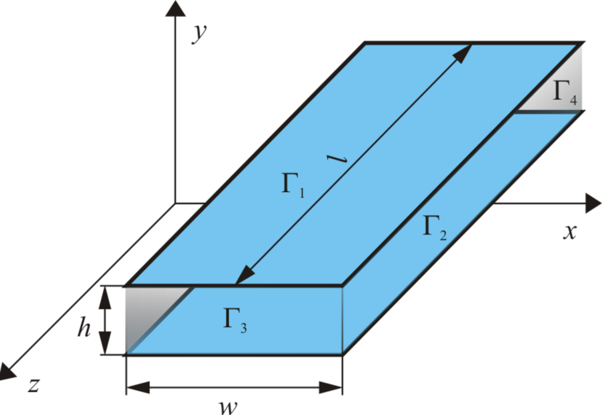
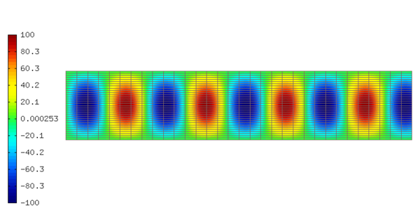

Waveguide
---------

By David Panek, University of West Bohemia, Czech Republic.

**Git reference:** Example `waveguide <http://git.hpfem.org/hermes.git/tree/HEAD:/hermes2d/examples/helmholtz/waveguide>`_.

Mathematical description of waveguides
~~~~~~~~~~~~~~~~~~~~~~~~~~~~~~~~~~~~~~

Mathematical description of waveguides is given by the Maxwell's equations  

.. math::
	:label: 1. Maxwell's equation
		
		\nabla \times {\pmb{H}} &= {\pmb{J}} +
		\frac{\partial {\pmb{D}}}{\partial t}, 

.. math::
	:label: 2. Maxwell's equation	
		
		\nabla \times {\pmb{E}} &= 
		- \frac{\partial {\pmb{B}}}{\partial t},
	
.. math::
	:label: 3. Maxwell's equation		
		
		\nabla \cdot {\pmb{D}} &= \rho, 
		
.. math::
	:label: 4. Maxwell's equation		
		
		\nabla \cdot {\pmb{B}} &= 0	

where

.. math::
	:label: Material properties
	
		{\pmb{B}} = \mu {\pmb{H}}, \ 
		{\pmb{J}} = \sigma {\pmb{E}}, \
		{\pmb{D}} = \varepsilon {\pmb{E}}.
		
Here  :math:`\varepsilon` means permittivity, :math:`\mu` permeability and :math:`\sigma` stands for electric conductivity. For waveguides analysis, material properties are often considered constant and isotropic. After substituting material properties :eq:`Material properties` into equations :eq:`1. Maxwell's equation` and :eq:`2. Maxwell's equation`,  we get

.. math::
	:label: 1.a Maxwell's equation	

		 \nabla \times \frac{1}{\mu} {\pmb{B}} &= \sigma {\pmb{E}} +
		\varepsilon \frac{\partial {\pmb{E}}}{\partial t}, 

.. math::
	:label: 2.a Maxwell's equation	

		 \nabla \times {\pmb{E}} &= 
		- \frac{\partial {\pmb{B}}}{\partial t}. 

If the vector operator :math:`\mathrm{curl}` is applied on the equation :eq:`2.a Maxwell's equation`, it is possible to substitute :math:`\nabla \times \pmb{E}` from the equation :eq:`1.a Maxwell's equation` and get the wave equation for the electric field in the form

.. math::
	:label: Wave equation
	
		\nabla \times \nabla \times \pmb{E} =
		- \mu \sigma \frac{\partial {\pmb{E}}}{\partial t} 
		- \mu \varepsilon \frac{\partial^2 {\pmb{E}}}{\partial t^2}. 

In a medium with zero charge density :math:`\rho` it is useful to apply the vector identity 

.. math::
	:label: 1. vector identity
	
		\nabla \times \nabla \times \pmb{E} = \nabla \nabla \cdot \pmb{E} - \Delta \pmb{E}.

Since :math:`\nabla \cdot \pmb{E} = 0`), the wave equation :eq:`Wave equation` can be 
simplified to

.. math::
	:label: a. Wave equation
	
		\Delta \pmb{E} - \mu \sigma \frac{\partial {\pmb{E}}}{\partial t} - \mu \varepsilon \frac{\partial^2 {\pmb{E}}}{\partial t^2} = \mathbf{0}.
	
For many technical problems it is sufficient to know the solution in the frequency domain. After applying the Fourier transform, equation :eq:`a. Wave equation` becomes 

.. math::
	:label: Helmholtz equation

	\Delta \overline{\pmb{E}} - \mathrm{j} \mu \sigma \omega \overline{\pmb{E}} + \omega^2 \mu \varepsilon \overline{{\pmb{E}}} = \mathbf{0},

	
which is the Helmholtz equation.

Parallel plate waveguide is the simplest type of guide that supports TM (transversal magnetic) and TE (transversal electric) modes. This kind of guide allows also TEM (transversal electric and magnetic) mode.

	
Mathematical model - TE modes
~~~~~~~~~~~~~~~~~~~~~~~~~~~~~

Suppose that the electromagnetic wave is propagating in the direction :math:`z`, then the component of the vector :math:`\pmb{E}` in the direction of the propagation is equal to zero

.. math::
	:label: a. TE mode

	\overline{E_z} = 0,

thus it is possible to solve the electric field in the parallel plate waveguide as a two-dimensional 
Helmholtz problem

.. math::
    :label: a. Helmholtz equation

       \Delta \overline{\pmb{E}} - \mathrm{j} \mu \sigma \omega \overline{\pmb{E}} + \omega^2 \mu \varepsilon \overline{{\pmb{E}}} = \mathbf{0}.

The conducting plates (boundary :math:`\Gamma_1, \Gamma_2`) are usually supposed to be *perfectly conductive*, 
which can be modeled using the perfect conductor boundary condition

.. math::
	:label: Perfect conductor

	\pmb{n} \times \overline{\pmb{E}} = 0.

For the geometry in the above figure the expression :eq:`Perfect conductor` is reduced 
to a zero Dirichlet boundary condition

.. math::
		:label: Reduced Perfect conductor

		\overline{E_x} = 0.

For the boundaries :math:`\Gamma_3, \Gamma_4`, the following types of boundary conditions
can be used:

Electric field (Dirichlet boundary condition)
"""""""""""""""""""""""""""""""""""""""""""""

	.. math::
		:label: Electric field

			\overline{\pmb{E}}(\Gamma) = \overline{E_0} = \mathrm{const}.

Note that for TE modes (and for the geometry shown above), a natural boundary condition is described by the expression

	.. math::
		:label: TE Electric field

		\overline{E}_x(y) = \overline{E_0} \cos\left(\frac{y \cdot n \pi}{h} \right),

where :math:`n` stands for a mode.

Impedance matching (Newton boundary condition)
""""""""""""""""""""""""""""""""""""""""""""""

For harmonic TE mode waves the following relation holds:

	.. math::
		:label: Impedance definition

		\overline{\pmb{E}} = Z_0 (\overline{H_y} \pmb{i} - \overline{H_x} \pmb{j}) = Z_0 \cdot \pmb{n} \times \overline{\pmb{H}},

where :math:`Z_0` is *the wave impedance*. At the same time the second Maxwell equation

	.. math::
		:label: Harmonic Maxwell equation

		\nabla\times \overline{{\pmb{E}}} = -j \omega \mu \overline{\pmb{H}}
	
must be satisfied. From quations :eq:`Impedance definition` and :eq:`Harmonic Maxwell equation` it is possible to derive impedance matching boundary condition in the form

	.. math::
		:label: Impedance matching

		\pmb{n} \times \nabla \times \overline{\pmb{E}} =  \frac{j \omega \mu }{Z_0} \overline{\pmb{E}} =  j \beta \overline{\pmb{E}}.

For a given geometry the equation :eq:`Impedance matching` can be reduced to the Newton boundary condition in the form

	..  math::
		:label: Newton boundary condition

		\frac{\partial \overline{E_x}}{\partial y} = j \beta \overline{E_x}.

Material parameters
~~~~~~~~~~~~~~~~~~~

::

	const double epsr = 1.0;                    // Relative permittivity
	const double eps0 = 8.85418782e-12;         // Permittivity of vacuum F/m
	const double mur = 1.0;                     // Relative permeablity
	const double mu0 = 4*M_PI*1e-7;             // Permeability of vacuum H/m
	const double frequency = 3e9;               // Frequency MHz
	const double omega = 2*M_PI * frequency;    // Angular velocity
	const double sigma = 0;                     // Conductivity Ohm/m

Boundary conditions
~~~~~~~~~~~~~~~~~~~

There are three possible types of boundary conditions:

	* Zero Dirichlet boundary conditions.
	* Nonzero Dirichlet boundary conditions.
	* Newton boundary conditions.

Sample results
~~~~~~~~~~~~~~

.. image:: waveguide/real_part.png
   :scale: 80 %   
   :align: center 	
   :alt: Parallel plate waveguide geometry

