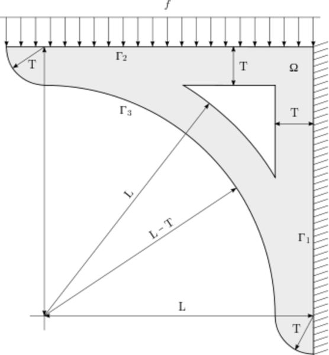
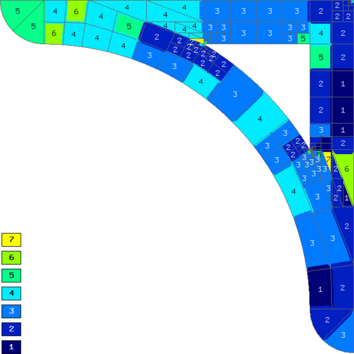
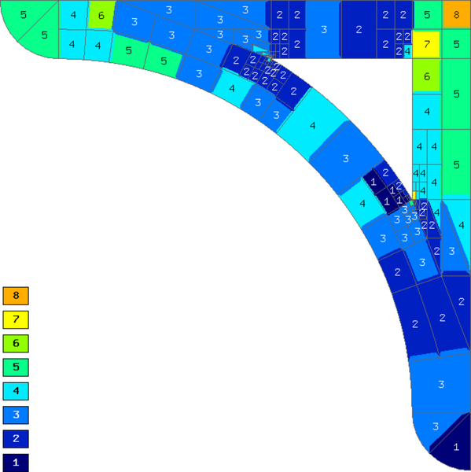
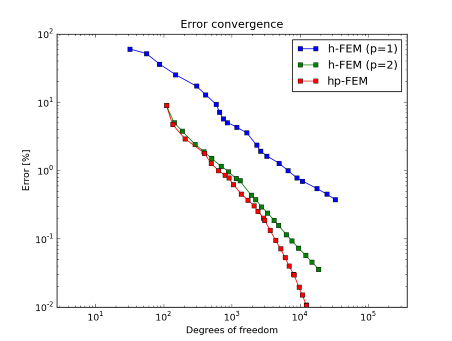
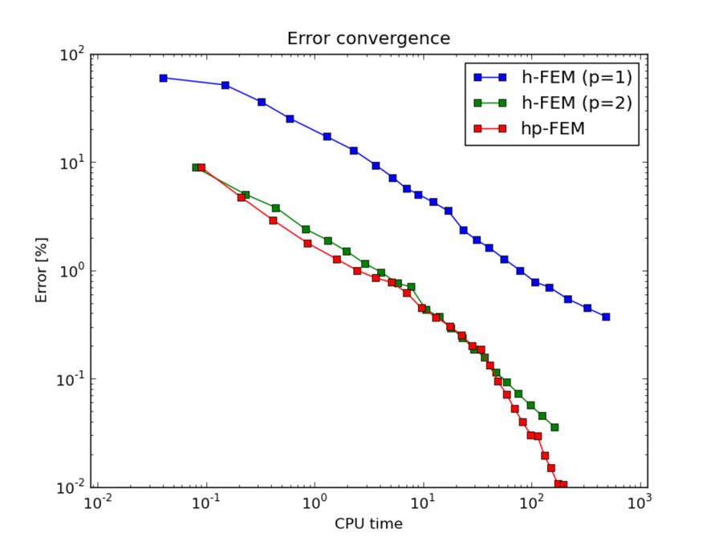
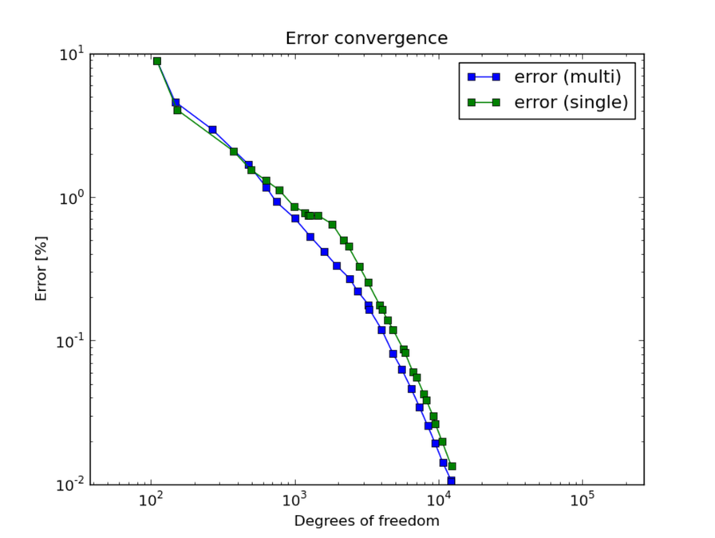
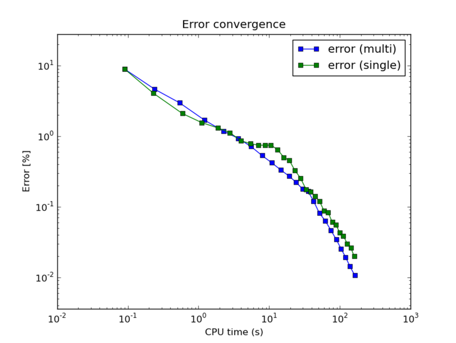

Bracket
-------

**Git reference:** Example `bracket <http://git.hpfem.org/hermes.git/tree/HEAD:/hermes2d/examples/linear-elasticity/bracket>`_.

This example employs adaptive multimesh hp-FEM to solve equations of linear elasticity. 

Problem description
~~~~~~~~~~~~~~~~~~~

Our domain is a bracket loaded on its top edge and fixed to the wall:

.. math::
    :nowrap:

    \begin{eqnarray*}   \bfu \!&=&\! 0 \ \ \ \ \ \rm{on}\ \Gamma_1  \\   \dd{u_2}{n} \!&=&\! f \ \ \ \ \ \rm{on}\ \Gamma_2 \\   \dd{u_1}{n} = \dd{u_2}{n} \!&=&\! 0 \ \ \ \ \ \rm{elsewhere.} \end{eqnarray*}

The dimensions are L = 0.7 m, T = 0.1 m and the force $f = 10^3$ N.

Sample results
~~~~~~~~~~~~~~

The following figures show the two meshes and their polynomial
degrees after several adaptive steps: 

Note that the meshes are slightly different, not only in
polynomial degrees, but also in element refinements. 

Convergence comparison
~~~~~~~~~~~~~~~~~~~~~~

Convergence graphs of adaptive h-FEM with linear elements, h-FEM with quadratic elements
and hp-FEM are shown below.

The following graph shows convergence in terms of CPU time. 

Comparison of the multimesh and single-mesh hp-FEM: 

