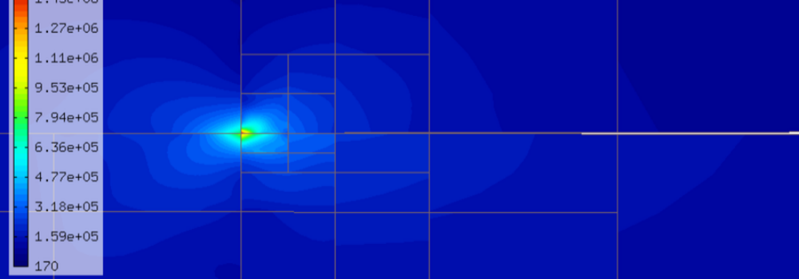
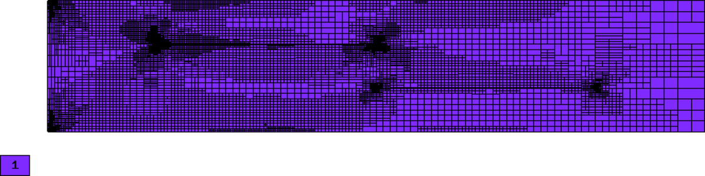
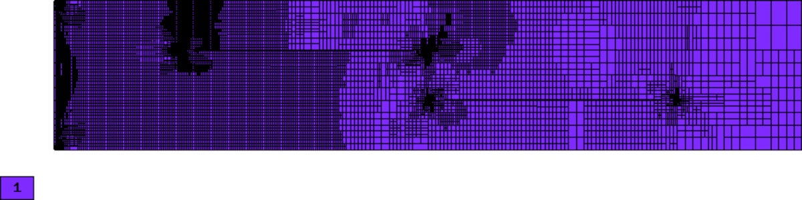
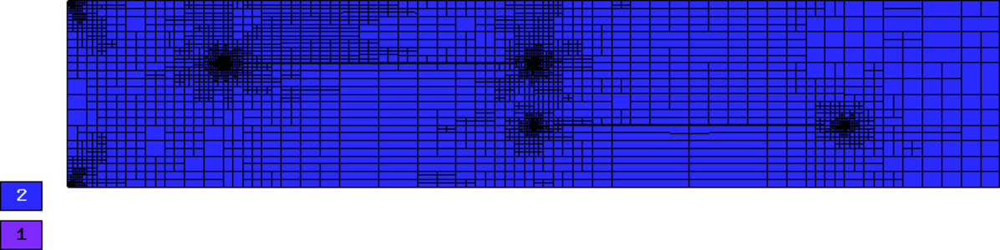
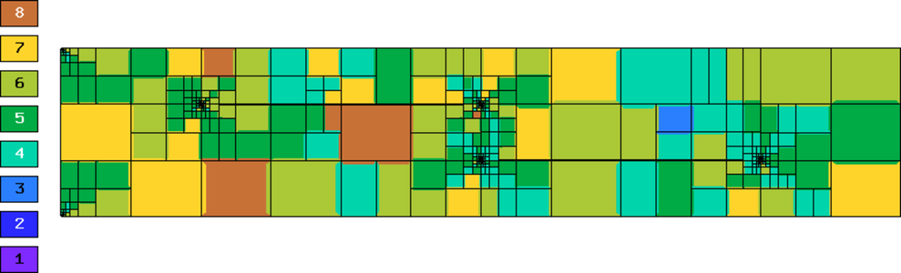
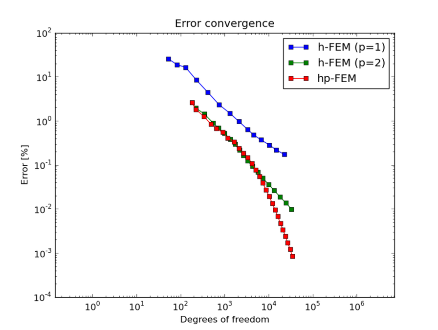
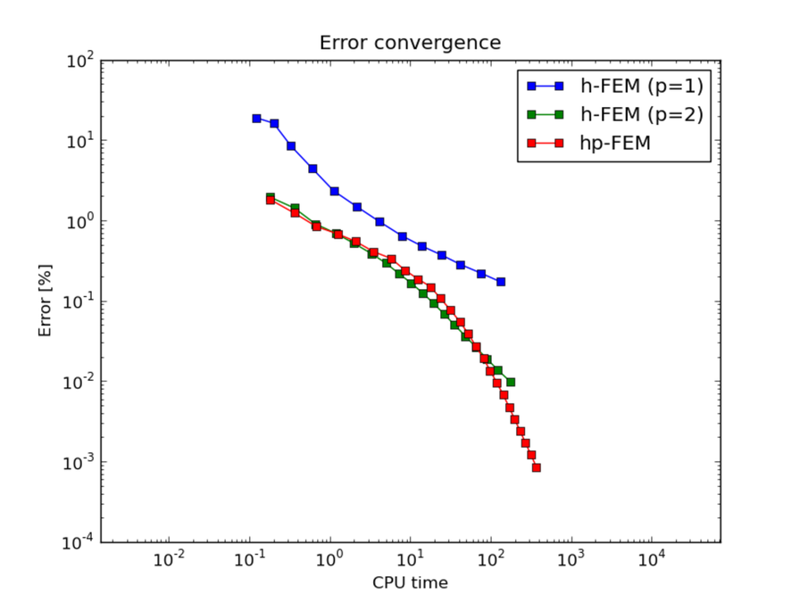
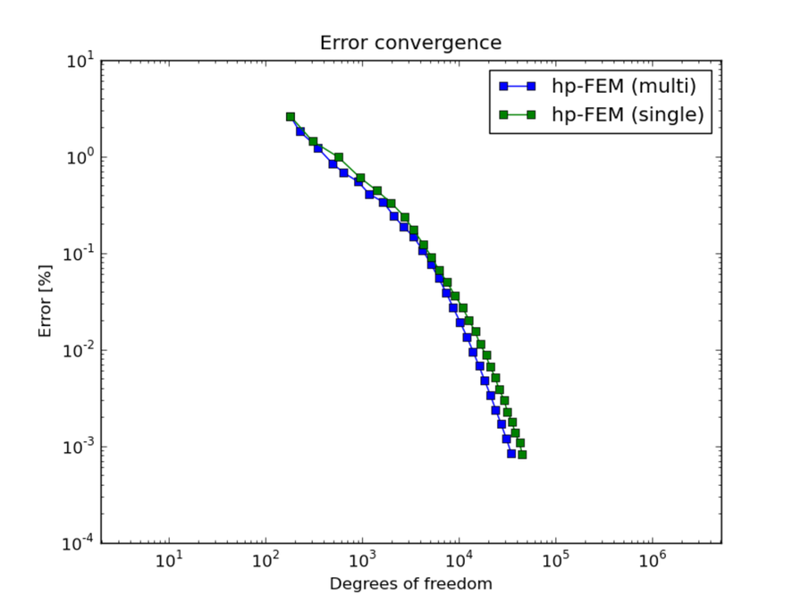

Crack
-----

**Git reference:** Example `crack <http://git.hpfem.org/hermes.git/tree/HEAD:/hermes2d/examples/linear-elasticity/crack>`_.

This example employs adaptive multimesh hp-FEM to solve
equations of linear elasticity that we already saw in the tutorial example
`P01-linear/08-system <http://git.hpfem.org/hermes.git/tree/HEAD:/hermes2d/tutorial/P01-linear/08-system>`_.

Problem description
~~~~~~~~~~~~~~~~~~~

The computational domain is a $1.5 \times 0.3$ m rectangle containing two horizontal 
cracks, as shown in the following figure:

The cracks have a flat diamond-like shape and their width along with some other parameters 
can be changed in the mesh file `crack.mesh 
<http://git.hpfem.org/hermes.git/blob/HEAD:/hermes2d/examples/linear-elasticity/elasticity-crack/crack.mesh>`_:

::

    a = 0.25   # horizontal size of an eleemnt
    b = 0.1    # vertical size of an element
    w = 0.001  # width of the cracks

Solved are equations of linear elasticity with the following boundary conditions: 
$u_1 = u_2 = 0$ on the left edge, zero external force on the rest of the boundary.
The elastic body is loaded with its own weight.

Sample results
~~~~~~~~~~~~~~

Detail of singularity in Von Mises stress at the left end of the left crack:

Convergence comparisons
~~~~~~~~~~~~~~~~~~~~~~~

Final meshes for $u_1$ and $u_2$ (h-FEM with linear elements):

Final meshes for $u_1$ and $u_2$ (h-FEM with quadratic elements):

Final meshes for $u_1$ and $u_2$ (hp-FEM):

.. image:: example-crack/mesh-x-hp.png
   :align: center
   :width: 800
   :alt: Solution.

DOF convergence graphs:

CPU time convergence graphs:

Next let us compare the multimesh hp-FEM with the standard (single-mesh) hp-FEM:

The same comparison in terms of CPU time:

.. image:: example-crack/conv_cpu_compar.png
   :align: center
   :width: 600
   :height: 400
   :alt: CPU convergence graph.

