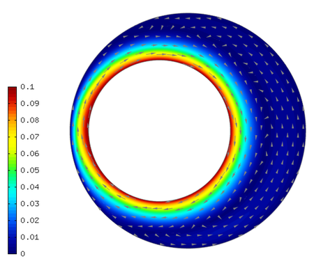
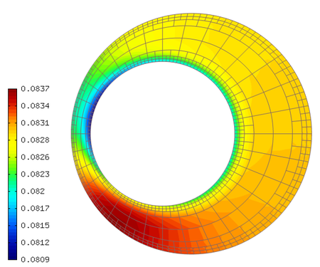

Bearing
-------

**Git reference:** Example `bearing <http://git.hpfem.org/hermes.git/tree/HEAD:/hermes2d/examples/navier-stokes/bearing>`_.

Problem description
~~~~~~~~~~~~~~~~~~~

Description coming soon.

Sample results
~~~~~~~~~~~~~~

Velocity, time t = 700 s:

Pressure, time t = 700 s:

