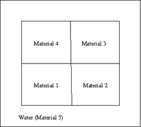
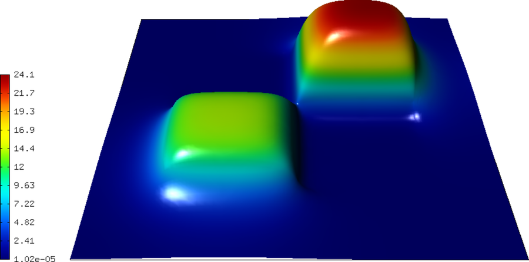
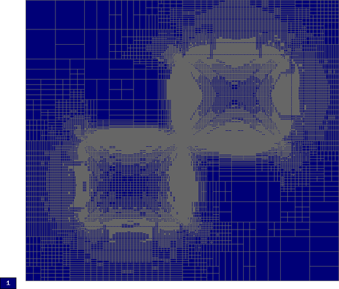
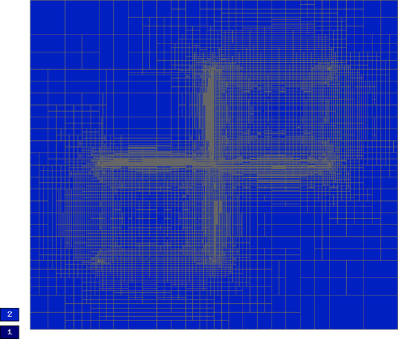
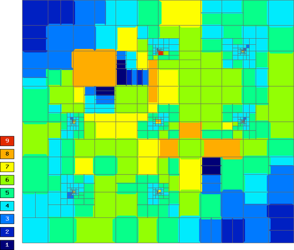
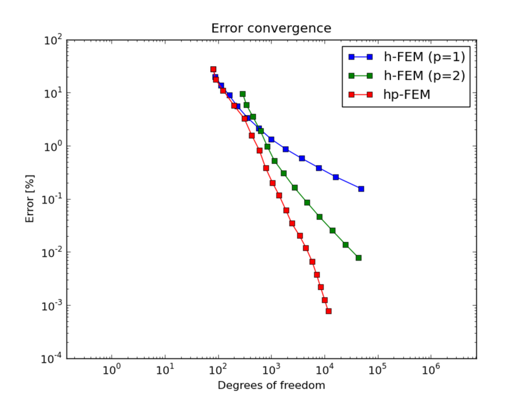
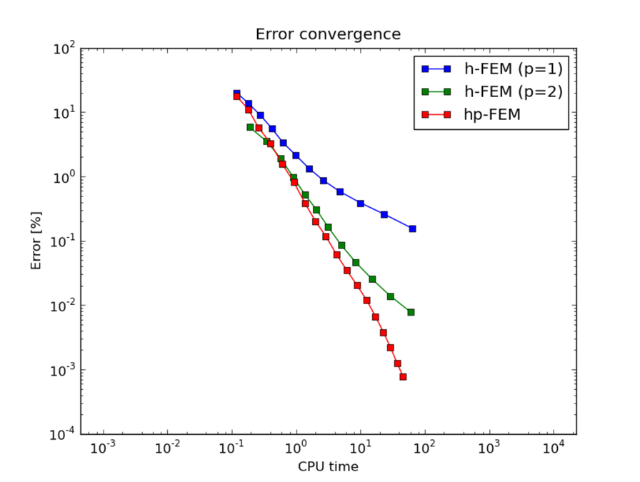

Saphir
------

**Git reference:** Example `saphir <http://git.hpfem.org/hermes.git/tree/HEAD:/hermes2d/examples/neutronics/saphir>`_.

Problem description
~~~~~~~~~~~~~~~~~~~

This is a standard nuclear engineering benchmark (IAEA number EIR-2) describing 
an external-force-driven configuration without fissile materials present, using one-group 
neutron diffusion approximation

.. math::
    :label: saphir

       -\nabla \cdot (D(x,y) \nabla \Phi) + \Sigma_a(x,y) \Phi - Q_{ext}(x,y) = 0.

The domain of interest is a 96 x 86 cm rectangle consisting of five regions:

The unknown is the neutron flux $\Phi(x, y)$. The values of the diffusion coefficient 
$D(x, y)$, absorption cross-section $\Sigma_a(x, y)$ and the source term $Q_{ext}(x,y)$
are constant in the subdomains. The source $Q_{ext} = 1$ in areas 1 and 3 and zero 
elsewhere. Boundary conditions for the flux $\Phi$ are zero everywhere. 

This example uses multiple weak forms that are associated with different material 
markers.

Sample results
~~~~~~~~~~~~~~

Solution:

Final mesh (h-FEM with linear elements):

Final mesh (h-FEM with quadratic elements):

Final mesh (hp-FEM):

DOF convergence graphs:

CPU time convergence graphs:

