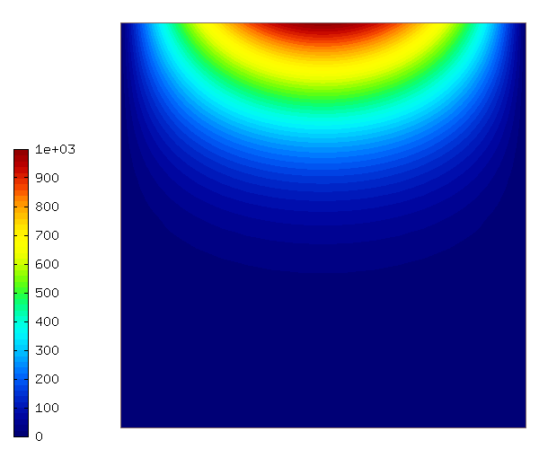
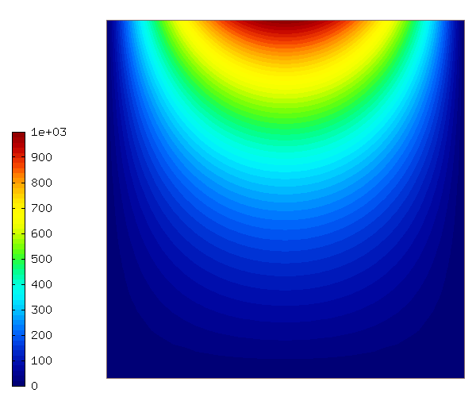

Basic-ie-newton
---------------

**Git reference:** Example `basic-ie-newton <http://git.hpfem.org/hermes.git/tree/HEAD:/hermes2d/examples/richards/basic-ie-newton>`_.

Model problem
~~~~~~~~~~~~~

This example solves a simple version of the time-dependent
Richard's equation using the backward Euler method in time 
combined with the Newton's method in each time step. It describes
infiltration into an initially dry soil. The example has a exact 
solution that is given in terms of a Fourier series (see a paper 
by Tracy). The exact solution is not used here.

We assume the time-dependent Richard's equation

.. math::
    :label: richards-basic-ie-newton

       C(h) \frac{\partial h}{\partial t} - \nabla \cdot (K(h) \nabla h) - K'(h) \frac{\partial h}{\partial z}= 0

where $C$ and $K$ are given functions of the unknown pressure head $h$, $\bm{x}=(x,z)$ are spatial coordinates, and $t$ is time. 

equipped with a Dirichlet, given by the initial condition.

.. math::

     x*(100. - x)/2.5 * y/100 - 1000. + H\underline{\ }OFFSET

The pressure head 'h' is between -1000 and 0. For convenience, we
increase it by an offset H_OFFSET = 1000. In this way we can start
from a zero coefficient vector.

Weak formulation
~~~~~~~~~~~~~~~~

The corresponding weak formulation reads

.. math::

     \int_{\Omega} C(h) \frac{\partial h}{\partial t} v d\bm{x} + \int_{\Omega} K(h) \nabla h \cdot \nabla v d\bm{x} - \int_{\Omega} K'(h) \frac{\partial h}{\partial z} v d\bm{x} = 0.

Defining weak forms
~~~~~~~~~~~~~~~~~~~

The weak formulation is a combination of custom Jacobian and Residual weak forms::

    CustomWeakFormRichardsIE::CustomWeakFormRichardsIE(double time_step, Solution* h_time_prev) : WeakForm(1)
    {
      // Jacobian volumetric part.
      CustomJacobianFormVol* jac_form_vol = new CustomJacobianFormVol(0, 0, time_step);
      jac_form_vol->ext.push_back(h_time_prev);
      add_matrix_form(jac_form_vol);

      // Residual - volumetric.
      CustomResidualFormVol* res_form_vol = new CustomResidualFormVol(0, time_step);
      res_form_vol->ext.push_back(h_time_prev);
      add_vector_form(res_form_vol);
    }

Sample results
~~~~~~~~~~~~~~

Solution at t = 0.01 s:

Solution at t = 0.03 s:

