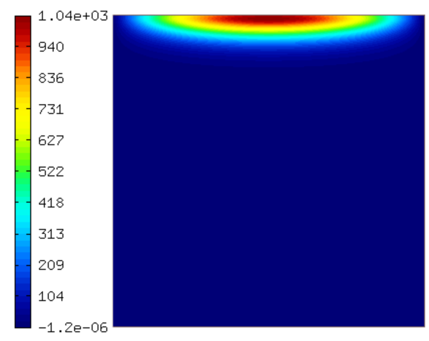
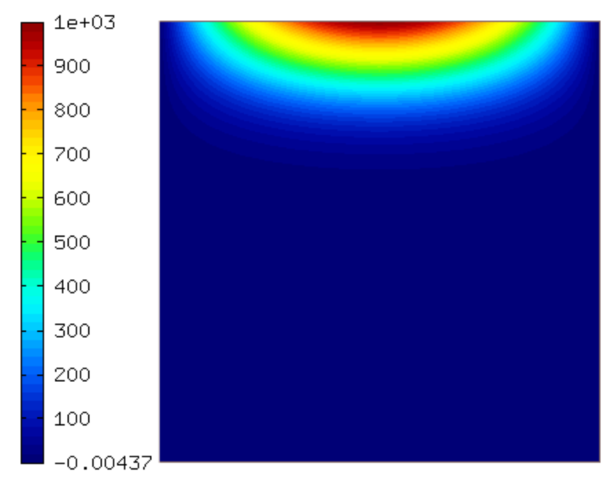
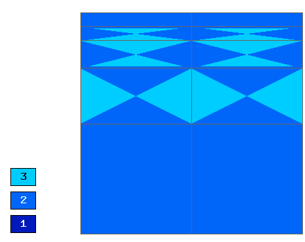

Basic-rk-newton-adapt
---------------------

**Git reference:** Example `basic-rk-newton-adapt <http://git.hpfem.org/hermes.git/tree/HEAD:/hermes2d/examples/richards/basic-rk-newton-adapt>`_.

Model problem
~~~~~~~~~~~~~

This example uses adaptivity with dynamical meshes to solve
the Tracy problem with arbitrary Runge-Kutta methods in time. 

We assume the time-dependent Richard's equation

.. math::
    :label: richards-basic-ie-newton

       C(h) \frac{\partial h}{\partial t} - \nabla \cdot (K(h) \nabla h) - K'(h) \frac{\partial h}{\partial z}= 0

where $C$ and $K$ are given functions of the unknown pressure head $h$, $\bm{x}=(x,z)$ are spatial coordinates, and $t$ is time. 

equipped with a Dirichlet, given by the initial condition.

.. math::

     x*(100. - x)/2.5 * y/100 - 1000. + H\underline{\ }OFFSET

The pressure head 'h' is between -1000 and 0. For convenience, we
increase it by an offset H_OFFSET = 1000. In this way we can start
from a zero coefficient vector.

Weak formulation
~~~~~~~~~~~~~~~~

The corresponding weak formulation reads

.. math::

     \int_{\Omega} \frac{\partial h}{\partial t} v d\bm{x} = - \int_{\Omega} K(h) \nabla h \cdot \nabla \frac{v}{C(h)} d\bm{x} + \int_{\Omega} K'(h) \frac{\partial h}{\partial z} \frac{v}{C(h)} d\bm{x}.

Defining weak forms
~~~~~~~~~~~~~~~~~~~

The weak formulation is a combination of custom Jacobian and Residual weak forms::

    CustomWeakFormRichardsRK::CustomWeakFormRichardsRK() : WeakForm(1)
    {
      // Jacobian volumetric part.
      CustomJacobianFormVol* jac_form_vol = new CustomJacobianFormVol(0, 0);
      add_matrix_form(jac_form_vol);

      // Residual - volumetric.
      CustomResidualFormVol* res_form_vol = new CustomResidualFormVol(0);
      add_vector_form(res_form_vol);
    }

Sample results
~~~~~~~~~~~~~~

Solution and mesh at t = 0.0005 s:

.. image:: basic-rk-newton-adapt/mesh-0-0005s.png
   :align: center
   :scale: 40%
   :alt: sample result

Solution and mesh at t = 0.0015 s:

