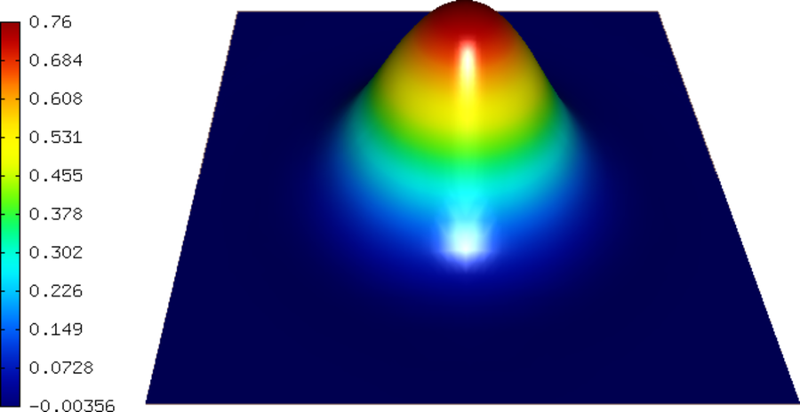
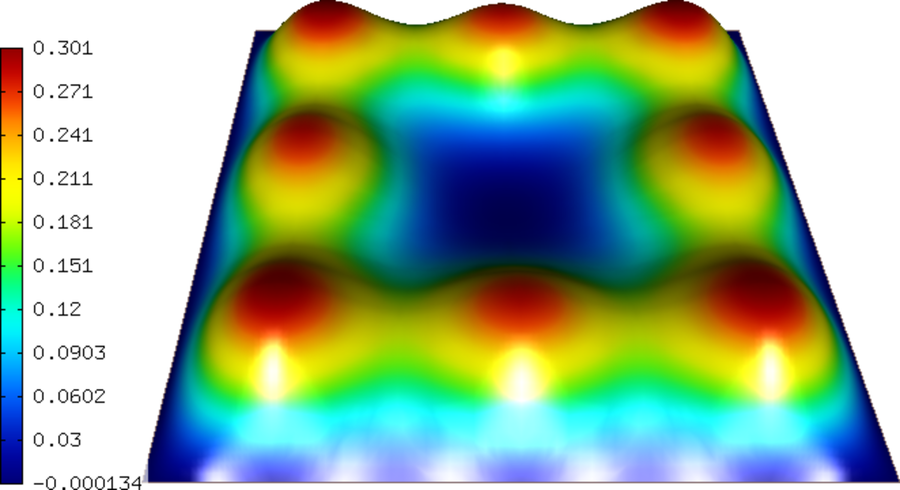
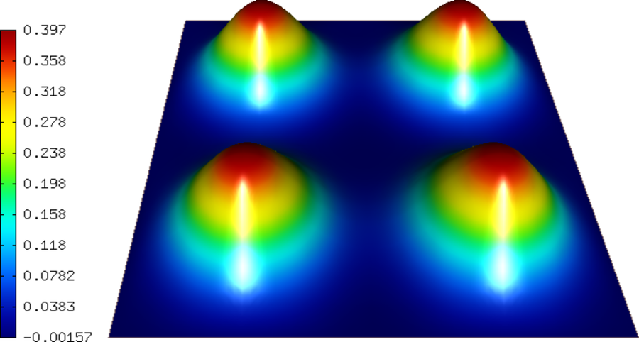

Gross-Pitaevski Equation
------------------------

**Git reference:** Example `gross-pitaevski 
<http://git.hpfem.org/hermes.git/tree/HEAD:/hermes2d/examples/schroedinger/gross-pitaevski>`_.

In this example we use the Newton's method to solve the nonlinear complex-valued 
time-dependent Gross-Pitaevski equation. This equation describes the ground state of 
a quantum system of identical bosons using the Hartree–Fock approximation and the 
pseudopotential interaction model. For time-discretization one can use either
the first-order implicit Euler method or the second-order Crank-Nicolson
method. 

Problem description
~~~~~~~~~~~~~~~~~~~

The computational domain is the square $(-1,1)^2$ and boundary conditions are zero Dirichlet. The equation has the form 

.. math::

    i\hbar \frac{\partial \psi}{\partial t} = -\frac{\hbar^2}{2m} \Delta \psi + g \psi |\psi|^2 + \frac{m}{2} \omega^2 (x^2 + y^2) \psi

where $\psi(x,y)$ is the unknown solution (wave function), $i$ the complex unit, 
$\hbar$ the Planck constant, $m$ the mass of the boson, 
$g$ the coupling constant (proportional to the scattering length of two interacting bosons) and 
$\omega$ the frequency.

Sample results
~~~~~~~~~~~~~~

Snapshot 1:

Snapshot 2:

Snapshot 3:

