Hollow Conductor
----------------

**Git reference:** Example `hollow conductor <http://git.hpfem.org/hermes.git/tree/HEAD:/hermes2d/examples/thermoelasticity/hollow-conductor>`_.

Problem description
~~~~~~~~~~~~~~~~~~~

The example deals with a massive hollow conductor is heated by induction and 
cooled by water running inside. We will model this problem using linear thermoelasticity 
equations, where the x-displacement, y-displacement, and the temperature will be approximated 
on individual meshes equipped with mutually independent adaptivity mechanisms. 

The computational domain is shown in the following figure and the details of the geometry can be found 
in the corresponding 
`mesh file <http://git.hpfem.org/hermes.git/blob/HEAD:/hermes2d/examples/thermoelasticity/hollow-conductor/domain.mesh>`_.
It is worth mentioning how the circular arcs are defined via NURBS:

::

    curves =
    {
      { 11, 19, 90 },
      { 10, 15, 90 },
      { 16, 6, 90 },
      { 12, 7, 90 }
    }

The triplet on each line consists of two boundary vertex indices and 
the angle of the circular arc.

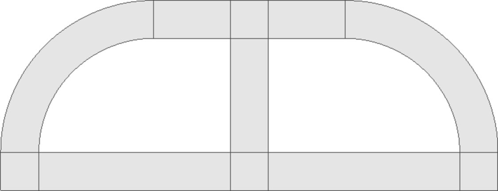

For the equations of linear thermoelasticity and the boundary conditions we refer to the 
paper *P. Solin, J. Cerveny, L. Dubcova, D. Andrs: Monolithic Discretization 
of Linear Thermoelasticity Problems via Adaptive Multimesh hp-FEM*,  
`doi.org/10.1016/j.cam.2009.08.092 <http://dx.doi.org/10.1016/j.cam.2009.08.092>`_.

As usual, the multimesh discretization is initialized by creating the master mesh
via copying the xmesh into ymesh and tmesh.

Sample results
~~~~~~~~~~~~~~

Solution (Von Mises stress):

.. image:: img-hollow-conductor/mises.png
   :align: center
   :width: 790
   :alt: Solution.

Solution (temperature):

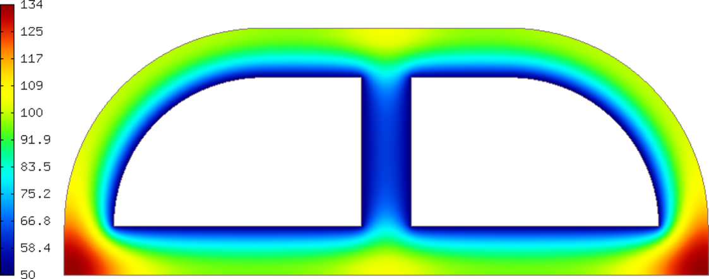

Final meshes for $u_1$, $u_2$ and $T$ (h-FEM with linear elements):

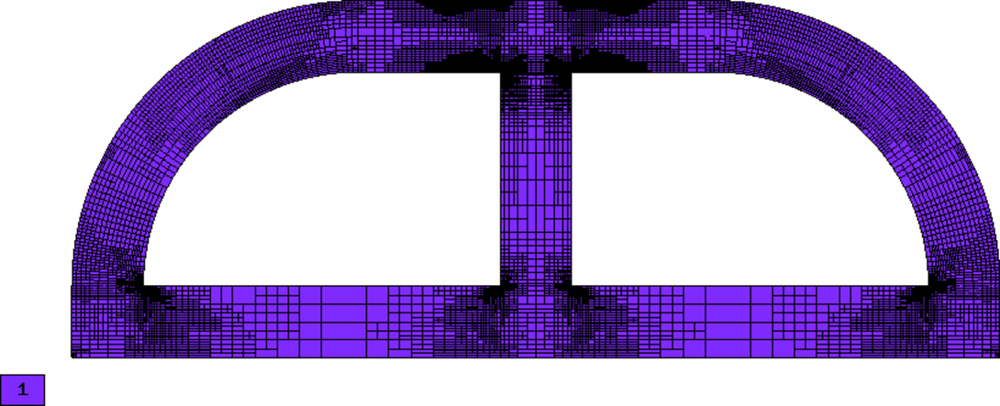

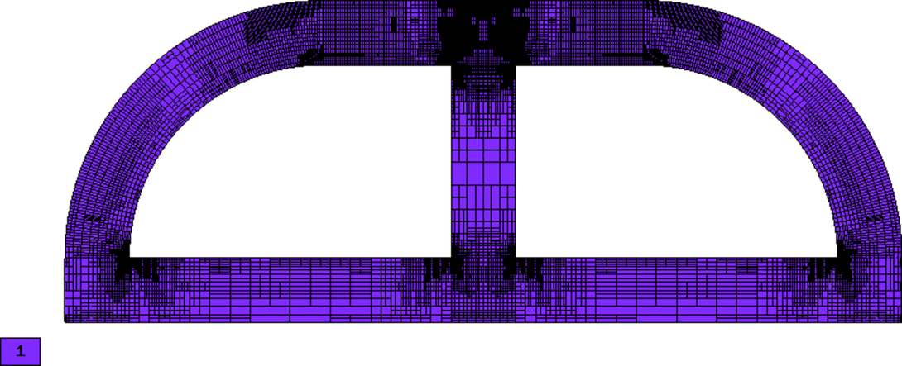

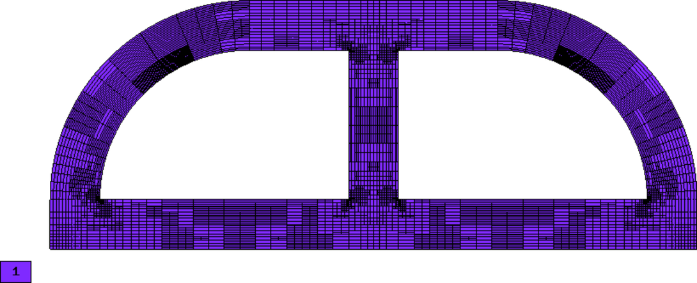

Final meshes for $u_1$, $u_2$ and $T$ (h-FEM with quadratic elements):

.. image:: img-hollow-conductor/x-mesh-h2.png
   :align: center
   :width: 760
   :alt: Solution.

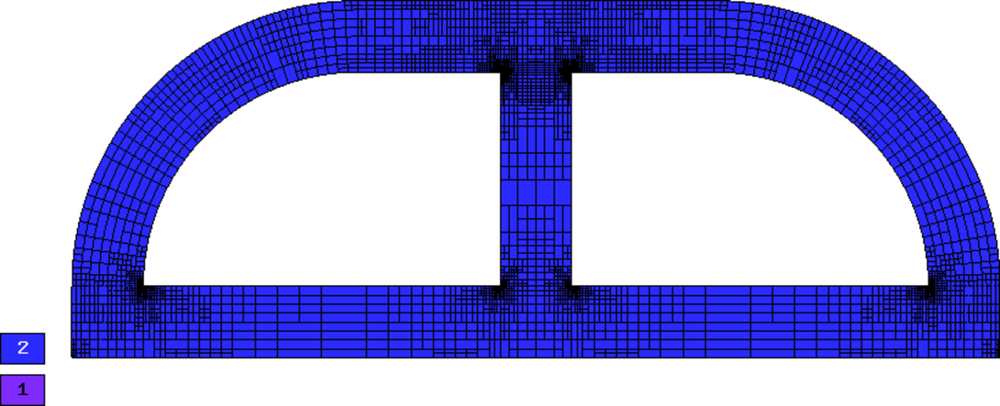

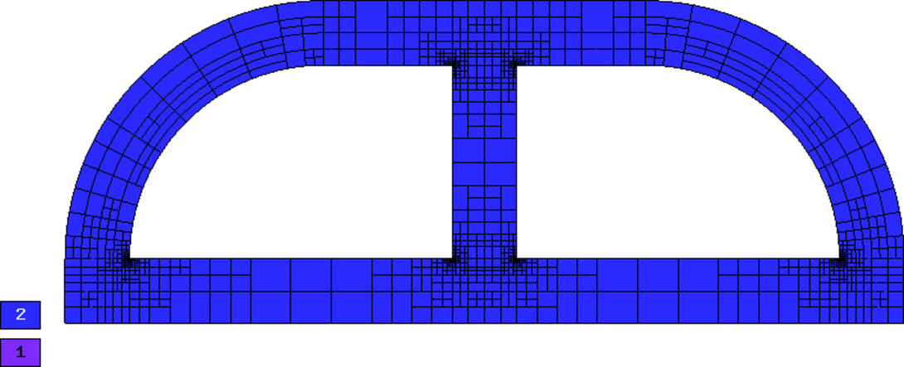

Final meshes for $u_1$, $u_2$ and $T$ (h-FEM with quadratic elements):

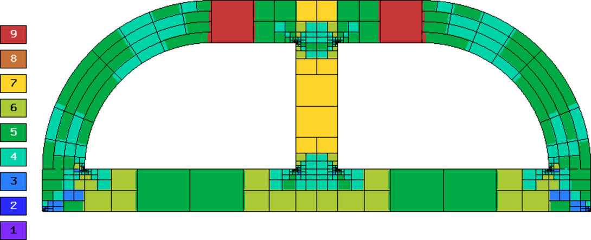

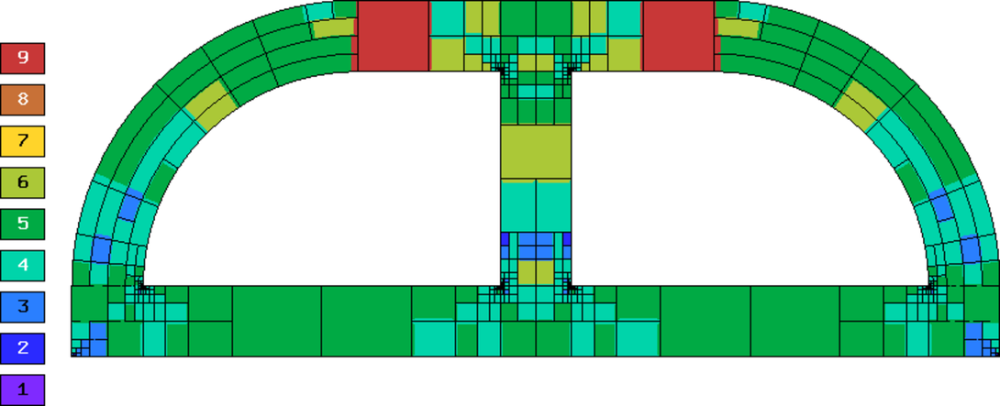

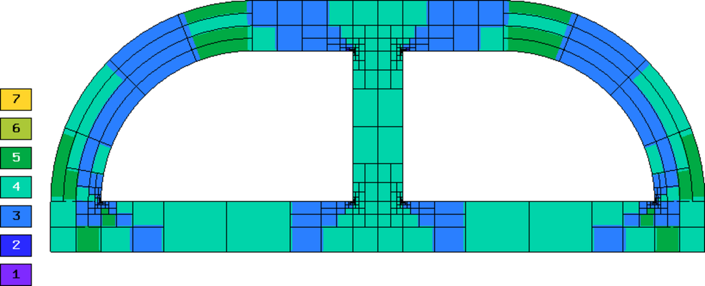

DOF convergence graphs:

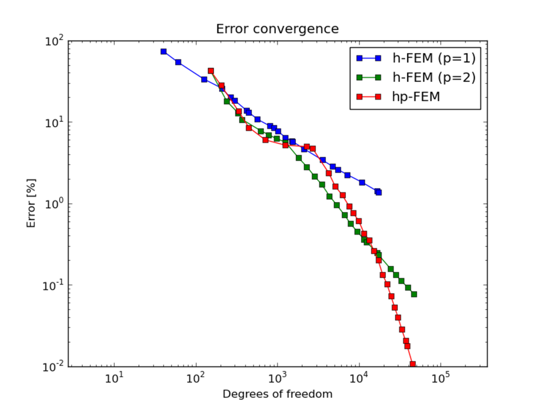

CPU time convergence graphs:

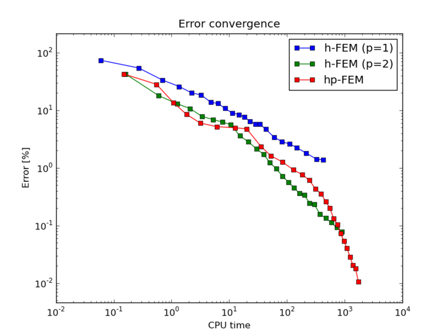

Next let us compare multimesh h-FEM with linear elements with the standard (single-mesh)
h-FEM:

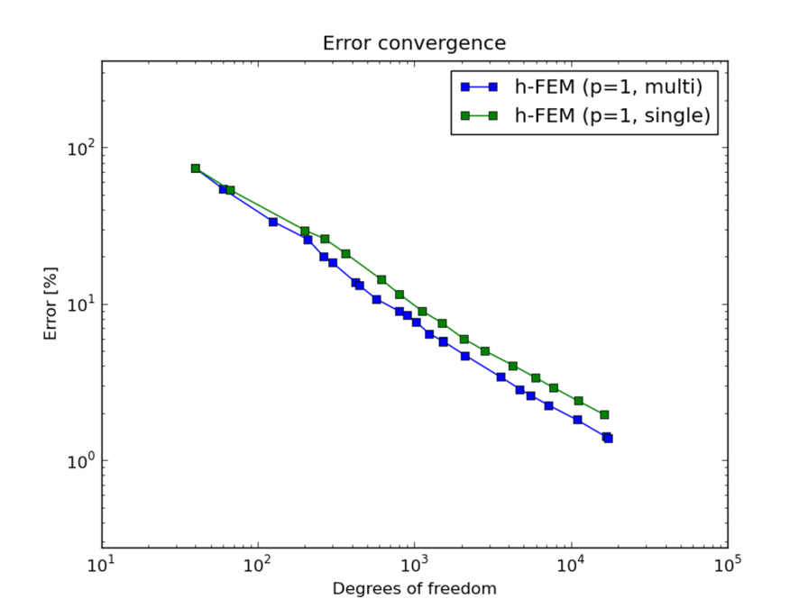

