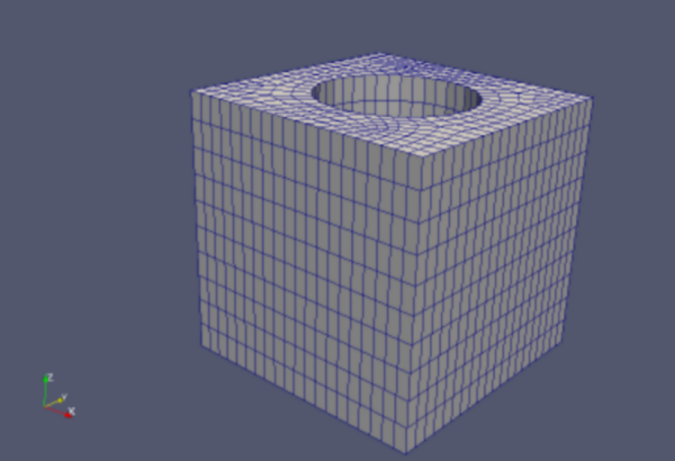
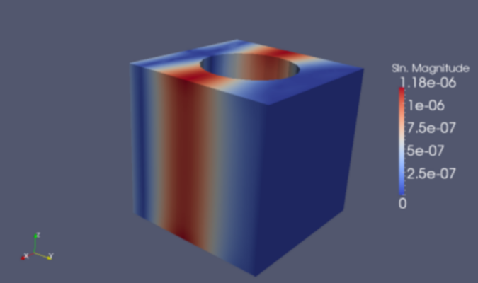

Elasticity-cubit-hex
=====================

**Git reference:** Example `elasticity-cubit-hex <http://git.hpfem.org/hermes.git/tree/HEAD:/hermes3d/examples/elasticity-cubit-hex>`_.

This example deals with equations of linear elasticity inside a unit cube domain. Elastostatics studies 
linear elastic deformations under the conditions of equilibrium where all forces acting on the elastic 
body sum to zero, and  displacements are not a function of time. 

.. index::
   single: mesh; fixed
   single: problem; elliptic, linear, symmetric

The governing equations have the form:

.. math::
   :label: elastostatics

   \sigma_{ij,j} + F_i = 0 \hbox{ in }\Omega, \\ \nonumber
   \epsilon_{ij} = \frac{1}{2}(u_{j,i} + u_{i,j}), \\
   \sigma_{ij} = C_{ijkl} \, \epsilon_{kl}.

Here the subscript $\cdot_{,j}$ indicates $\partial{\cdot}/\partial x_j$, where $\sigma_{ij}$ is the 
stress tensor, $\epsilon_{ij}$ is the strain rate tensor, $u_i$ is the displacement, and
$C_{ijkl}$ is the forth-order stiffness tensor. By Einstein summation convention, 
the $3^{rd}$ equation of :eq:`elastostatics` represents the following: 

.. math::
   :label: elasto-sum

   C_{ijkl}, \epsilon_{kl} = \sum_{k,l=1}^3 C_{ijkl}, \epsilon_{kl},

where $1 \le i, j, k, l \le 3$.

The domain of interest is a cube (of unit dimensions) with a hole at its center equipped with 
zero Dirichlet boundary conditions: $u_1 = u_2 = u_3 = 0$ on all four boundary faces (${\Gamma}_u$) 
except the left-most vertical one (${\Gamma}_F$), where an external force $F$ is applied.  

::

        // Boundary condition types. 
        BCType bc_types_x(int marker)
        {
        return (marker == bdy_fixed) ? BC_ESSENTIAL : BC_NATURAL;
        }

        BCType bc_types_y(int marker)
        {
        return (marker == bdy_fixed) ? BC_ESSENTIAL : BC_NATURAL;
        }

        BCType bc_types_z(int marker)
        {
        return (marker == bdy_fixed) ? BC_ESSENTIAL : BC_NATURAL;
        }

The stiffness tensor $C_{ijkl}$ is constant and symmetric:

.. math::
   :label: elasto-stress

   \sigma_{ij} = \lambda \delta_{ij} \epsilon_{kk} + 2\mu\epsilon_{ij}, \\ \nonumber
   \lambda = \frac{E\nu}{(1+\nu)(1-2\nu)}, \\
   \mu = \frac{E}{2(1+\nu)}. 

Here $\lambda$ and $\mu$ are the Lame constants, $E$ is Young's modulus, and $\nu$ is Poisson's ratio. 
In our example, $E = 200 \times 10^9$ Gpa and $\nu = 0.3.$ 

Substituting :eq:`elasto-stress` back into :eq:`elastostatics`, we obtain:
 
.. math::
   :label: elasto-navier

   \mu u_{i,jj}  + (\mu + \lambda)u_{j,ij} + F_i = 0, \\ \nonumber
   \hbox{ or }, \\                                      
   \mu \Delta{u} + (\mu + \lambda) \mathsf{grad}, \mathsf{div} u  + F = 0.

The corresponding weak formulation is as follows:

.. math::
   :label: elasto-statics-form

   \int_{\Omega} (\lambda + 2\mu) u_{i}, v_{i} + \mu u_{j}, v_{j} + \mu u_{k}, v_{k} \quad 
   +\quad \int_{\Omega} \lambda u_{i},  v_{j} + \mu u_{j}, v_{i} \quad
   +\quad \int_{\Omega} \lambda u_{i},  v_{k} + \mu u_{k}, v_{i}
   = 0, \\ \nonumber
   \int_{\Omega} \mu u_{i}, v_{i} + (\lambda + 2\mu) u_{j}, v_{j} + \mu u_{k}, v_{k} \quad
   +\quad \int_{\Omega} \lambda u_{j},  v_{k} + \mu u_{k}, v_{j}
   = 0, \\
   \int_{\Omega} \mu u_{i}, v_{i} + \mu u_{j}, v_{j} + (\lambda + 2\mu) u_{k} \, v_{k} 
   = \int_{\Gamma_F} F_i v. \nonumber

The following is the code for the weak forms:

.. sourcecode::
    .

    // Integrals
    template<typename Real, typename Scalar>
    Scalar int_a_dx_b_dy_c_dz(double a, double b, double c, int n, double *wt, Func<Real>
                              *u, Func<Real> *v, Geom<Real> *e) 
    {
    Scalar Integral = 0.0;
    for (int i = 0; i < n; i++)
    Integral += wt[i] * (a * u->dx[i] * v->dx[i] + b * u->dy[i] * v->dy[i] + c * u->dz[i] * v->dz[i]);
    return Integral;
    }

    template<typename Real, typename Scalar>
    Scalar int_a_dudx_dvdy_b_dudy_dvdx(double a, double b, int n, double *wt, Func<Real> *u, Func<Real> *v, Geom<Real> *e) 
    {
    Scalar Integral = 0.0;
    for (int i = 0; i < n; i++)
    Integral += wt[i] * (a * u->dx[i] * v->dy[i] + b * u->dy[i] * v->dx[i]);
    return Integral;
    }

    template<typename Real, typename Scalar>
    Scalar int_a_dudx_dvdz_b_dudz_dvdx(double a, double b, int n, double *wt, Func<Real> *u, Func<Real> *v, Geom<Real> *e) 
    {
    Scalar Integral = 0.0;
    for (int i = 0; i < n; i++)
    Integral += wt[i] * (a * u->dx[i] * v->dz[i] + b * u->dz[i] * v->dx[i]);
    return Integral;
    }

    template<typename Real, typename Scalar>
    Scalar int_a_dudy_dvdz_b_dudz_dvdy(double a, double b, int n, double *wt, Func<Real> *u, Func<Real> *v, Geom<Real> *e) 
    {
    Scalar Integral = 0.0;
    for (int i = 0; i < n; i++)
    Integral += wt[i] * (a * u->dy[i] * v->dz[i] + b * u->dz[i] * v->dy[i]);
    return Integral;
    }

    // 1. equation
    template<typename Real, typename Scalar>
    Scalar bilinear_form_0_0(int n, double *wt, Func<Scalar> *u_ext[], Func<Real> *u, Func<Real> *v, Geom<Real> *e, ExtData<Scalar> *data) 
    {
    return int_a_dx_b_dy_c_dz<Real, Scalar>(lambda + 2*mu, mu, mu, n, wt, u, v, e);
    }

    template<typename Real, typename Scalar>
    Scalar bilinear_form_0_1(int n, double *wt, Func<Scalar> *u_ext[], Func<Real> *u, Func<Real> *v, Geom<Real> *e, ExtData<Scalar> *data) 
    {
    return int_a_dudx_dvdy_b_dudy_dvdx<Real, Scalar>(lambda, mu, n, wt, v, u, e);
    }

    template<typename Real, typename Scalar>
    Scalar bilinear_form_0_2(int n, double *wt, Func<Scalar> *u_ext[], Func<Real> *u, Func<Real> *v, Geom<Real> *e, ExtData<Scalar> *data) 
    {
    return int_a_dudx_dvdz_b_dudz_dvdx<Real, Scalar>(lambda, mu, n, wt, v, u, e);
    }

    template<typename Real, typename Scalar>
    Scalar surf_linear_form_x(int n, double *wt, Func<Scalar> *u_ext[], Func<Real> *v, Geom<Real> *e, ExtData<Scalar> *data) 
    {
    Scalar res = 0.0;
    for (int i = 0; i < n; i++)
    res += wt[i] * (f_x * v->val[i]);
    return res;
    }

    // 2. equation
    template<typename Real, typename Scalar>
    Scalar bilinear_form_1_1(int n, double *wt, Func<Scalar> *u_ext[], Func<Real> *u, Func<Real> *v, Geom<Real> *e, ExtData<Scalar> *data) 
    {
    return int_a_dx_b_dy_c_dz<Real, Scalar>(mu, lambda + 2*mu, mu, n, wt, u, v, e);
    }

    template<typename Real, typename Scalar>
    Scalar bilinear_form_1_2(int n, double *wt, Func<Scalar> *u_ext[], Func<Real> *u, Func<Real> *v, Geom<Real> *e, ExtData<Scalar> *data) 
    {
    return int_a_dudy_dvdz_b_dudz_dvdy<Real, Scalar>(lambda, mu, n, wt, v, u, e);
    }

    template<typename Real, typename Scalar>
    Scalar surf_linear_form_y(int n, double *wt, Func<Scalar> *u_ext[], Func<Real> *v, Geom<Real> *e, ExtData<Scalar> *data) 
    {
    Scalar res = 0.0;
    for (int i = 0; i < n; i++)
    res += wt[i] * (f_y * v->val[i]);
    return res;
    }

    // 3. equation
    template<typename Real, typename Scalar>
    Scalar bilinear_form_2_2(int n, double *wt, Func<Scalar> *u_ext[], Func<Real> *u, Func<Real> *v, Geom<Real> *e, ExtData<Scalar> *data) 
    {
    return int_a_dx_b_dy_c_dz<Real, Scalar>(mu, mu, lambda + 2*mu, n, wt, u, v, e);
    }

    template<typename Real, typename Scalar>
    Scalar surf_linear_form_z(int n, double *wt, Func<Scalar> *u_ext[], Func<Real> *v, Geom<Real> *e, ExtData<Scalar> *data) 
    {
    Scalar res = 0.0;
    for (int i = 0; i < n; i++)
    res += wt[i] * (f_z * v->val[i]);
    return res;
    }

.. latexcode::
    .

    // Integrals
    template<typename Real, typename Scalar>
    Scalar int_a_dx_b_dy_c_dz(double a, double b, double c, int n, double *wt, Func<Real>
                              *u, Func<Real> *v, Geom<Real> *e) 
    {
    Scalar Integral = 0.0;
    for (int i = 0; i < n; i++)
    Integral += wt[i] * (a * u->dx[i] * v->dx[i] + b * u->dy[i] * v->dy[i] + c
                * u->dz[i] * v->dz[i]);
    return Integral;
    }

    template<typename Real, typename Scalar>
    Scalar int_a_dudx_dvdy_b_dudy_dvdx(double a, double b, int n, double *wt, Func<Real> *u,
                                       Func<Real> *v, Geom<Real> *e) 
    {
    Scalar Integral = 0.0;
    for (int i = 0; i < n; i++)
    Integral += wt[i] * (a * u->dx[i] * v->dy[i] + b * u->dy[i] * v->dx[i]);
    return Integral;
    }

    template<typename Real, typename Scalar>
    Scalar int_a_dudx_dvdz_b_dudz_dvdx(double a, double b, int n, double *wt, Func<Real> *u,
                                       Func<Real> *v, Geom<Real> *e) 
    {
    Scalar Integral = 0.0;
    for (int i = 0; i < n; i++)
    Integral += wt[i] * (a * u->dx[i] * v->dz[i] + b * u->dz[i] * v->dx[i]);
    return Integral;
    }

    template<typename Real, typename Scalar>
    Scalar int_a_dudy_dvdz_b_dudz_dvdy(double a, double b, int n, double *wt, Func<Real> *u,
                                       Func<Real> *v, Geom<Real> *e) 
    {
    Scalar Integral = 0.0;
    for (int i = 0; i < n; i++)
    Integral += wt[i] * (a * u->dy[i] * v->dz[i] + b * u->dz[i] * v->dy[i]);
    return Integral;
    }

    // 1. equation
    template<typename Real, typename Scalar>
    Scalar bilinear_form_0_0(int n, double *wt, Func<Scalar> *u_ext[], Func<Real> *u, 
                             Func<Real> *v, Geom<Real> *e, ExtData<Scalar> *data) 
    {
    return int_a_dx_b_dy_c_dz<Real, Scalar>(lambda + 2*mu, mu, mu, n, wt, u, v, e);
    }

    template<typename Real, typename Scalar>
    Scalar bilinear_form_0_1(int n, double *wt, Func<Scalar> *u_ext[], Func<Real> *u, 
                             Func<Real> *v, Geom<Real> *e, ExtData<Scalar> *data) 
    {
    return int_a_dudx_dvdy_b_dudy_dvdx<Real, Scalar>(lambda, mu, n, wt, v, u, e);
    }

    template<typename Real, typename Scalar>
    Scalar bilinear_form_0_2(int n, double *wt, Func<Scalar> *u_ext[], Func<Real> *u, 
                             Func<Real> *v, Geom<Real> *e, ExtData<Scalar> *data) 
    {
    return int_a_dudx_dvdz_b_dudz_dvdx<Real, Scalar>(lambda, mu, n, wt, v, u, e);
    }

    template<typename Real, typename Scalar>
    Scalar surf_linear_form_x(int n, double *wt, Func<Scalar> *u_ext[], Func<Real> *v,
                              Geom<Real> *e, ExtData<Scalar> *data) 
    {
    Scalar res = 0.0;
    for (int i = 0; i < n; i++)
    res += wt[i] * (f_x * v->val[i]);
    return res;
    }

    // 2. equation
    template<typename Real, typename Scalar>
    Scalar bilinear_form_1_1(int n, double *wt, Func<Scalar> *u_ext[], Func<Real> *u,
                             Func<Real> *v, Geom<Real> *e, ExtData<Scalar> *data) 
    {
    return int_a_dx_b_dy_c_dz<Real, Scalar>(mu, lambda + 2*mu, mu, n, wt, u, v, e);
    }

    template<typename Real, typename Scalar>
    Scalar bilinear_form_1_2(int n, double *wt, Func<Scalar> *u_ext[], Func<Real> *u,
                             Func<Real> *v, Geom<Real> *e, ExtData<Scalar> *data) 
    {
    return int_a_dudy_dvdz_b_dudz_dvdy<Real, Scalar>(lambda, mu, n, wt, v, u, e);
    }

    template<typename Real, typename Scalar>
    Scalar surf_linear_form_y(int n, double *wt, Func<Scalar> *u_ext[], Func<Real> *v,
                              Geom<Real> *e, ExtData<Scalar> *data) 
    {
    Scalar res = 0.0;
    for (int i = 0; i < n; i++)
    res += wt[i] * (f_y * v->val[i]);
    return res;
    }

    // 3. equation
    template<typename Real, typename Scalar>
    Scalar bilinear_form_2_2(int n, double *wt, Func<Scalar> *u_ext[], Func<Real> *u,
                             Func<Real> *v, Geom<Real> *e, ExtData<Scalar> *data) 
    {
    return int_a_dx_b_dy_c_dz<Real, Scalar>(mu, mu, lambda + 2*mu, n, wt, u, v, e);
    }

    template<typename Real, typename Scalar>
    Scalar surf_linear_form_z(int n, double *wt, Func<Scalar> *u_ext[], Func<Real> *v, 
                              Geom<Real> *e, ExtData<Scalar> *data) 
    {
    Scalar res = 0.0;
    for (int i = 0; i < n; i++)
    res += wt[i] * (f_z * v->val[i]);
    return res;
    }

Solution graph:

