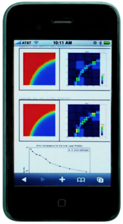

Interactive Web Accessibility
-----------------------------

* **Interactive web usage**. Anyone can use Hermes (and do many other types of symbolic and numerical computations) in any web browser, using the `Networked Computing Laboratory (NCLab) <http://nclab.com/>`_. 

See the `NCLab's home page <http://femhub.com/?page_id=813>`_ for more information. 

Other Resources
~~~~~~~~~~~~~~~

An overview of books, journal articles, conference proceedings papers and talks about Hermes and adaptive *hp*-FEM can be found in the `publications section <http://hpfem.org/publications/>`_ and/or on `Pavel Solin's home page <http://hpfem.org/~pavel/>`_.
